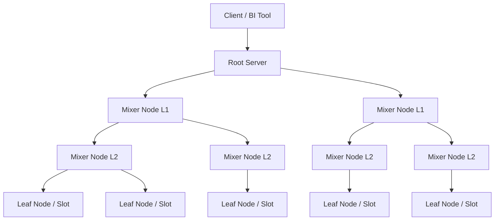

Sự chậm trễ và tính chất Batch của Hadoop MapReduce đã thúc đẩy Google tìm kiếm một giải pháp thay thế phục vụ việc truy vấn dữ liệu ở tốc độ "Interactive" (vài giây cho PetaBytes). Giải pháp đó chính là hệ thống **Dremel**, được mô tả qua một bài báo khoa học vào năm 2010. Công nghệ này chính là lõi (Engine) đứng đằng sau **Google BigQuery**, và là nền tảng cho sự bùng nổ của các MPP Data Warehouses hiện đại (Snowflake, Redshift, ClickHouse).

## 1. Bản chất của MPP (Massively Parallel Processing)

MPP áp dụng kiến trúc **Shared-nothing** (Không chia sẻ tài nguyên). Trong đó, mỗi Node tham gia vào hệ thống sở hữu độc quyền CPU, RAM và Disk. Chúng giao tiếp nội bộ qua mạng băng thông lớn. 

*   **Sự đánh đổi (Trade-off):** MPP hi sinh tính Consistency (trong mô hình ACID của cơ sở dữ liệu OLTP truyền thống) và năng lực xử lý giao dịch ghi siêu nhỏ (row-level inserts), đổi lấy khả năng xử lý truy vấn phân tích khổng lồ (OLAP) thông qua mô hình chia-để-trị (Divide and Conquer). Dữ liệu được coi là *Append-only* hoặc *Bulk load*.

## 2. Kiến trúc Cây thực thi (Execution Tree) của Dremel

Dremel không dựa trên MapReduce hai tầng cứng nhắc, mà sử dụng cơ chế định tuyến hình cây đa tầng (Multi-level Execution Tree) kết hợp với mô hình Scatter-Gather.

1.  **Root Server:** Tiếp nhận SQL Query từ người dùng, đọc metadata, compile ra Execution Plan. Định tuyến truy vấn (Scatter) xuống các Mixer bên dưới và Gom kết quả (Gather) để trả về client.
2.  **Mixer Nodes (Intermediate Servers):** Hoạt động như mạng phân phối. Chúng nhận Query một phần, đẩy xuống Leaf. Khi có dữ liệu trả ngược lên, Mixer đóng vai trò là Aggregator (Ví dụ: Partial Sum, Partial Count) để giảm băng thông chuyển tải (Network transfer) trước khi tới Root. Cấu trúc In-Memory Streaming này loại bỏ hoàn toàn hiện tượng Disk I/O Write của MapReduce trung gian.
3.  **Leaf Nodes (Slots):** Là các đơn vị Compute nằm dưới cùng. Mỗi Leaf trực tiếp đọc một cục (chunk) dữ liệu từ Disk, filter, project, và tính toán logic tầng thấp nhất.

## 3. Khởi nguồn Columnar Storage & Dữ liệu lồng nhau

Yếu tố giúp Dremel quét hàng tỷ dòng trong giây lát là sự kết hợp giữa MPP và định dạng lưu trữ cột (Columnar Storage). Trong các bài toán phân tích, truy vấn thường chỉ yêu cầu quét 3-5 cột trên tổng số 100 cột. Columnar format tối ưu hóa I/O bằng cơ chế **Projection Pushdown** (chỉ đọc các block của cột được yêu cầu).

Tuy nhiên, Big Data thường tồn tại dưới dạng JSON lồng nhau (Nested/Repeated records) như Protocol Buffers. Dremel đã phát minh ra cách "kéo phẳng" (Flaten) các Node dạng cây này thành định dạng cột phẳng thông qua hai metadata flags cực kỳ quan trọng:

*   **Repetition Level (RL):** Giá trị này chỉ định tại Node nhánh nào (tree level) trong record, mảng danh sách bắt đầu lặp lại.
*   **Definition Level (DL):** Để tiết kiệm dung lượng khi field mang giá trị `NULL` hoặc `Optional`, DL cho biết có bao nhiêu Node trên đường dẫn path từ Root đến field này thực sự tồn tại. Dữ liệu NULL sẽ không tốn byte lưu trữ nào.

> Định dạng Columnar của Dremel sau này đã truyền cảm hứng trực tiếp cho Apache Foundation tạo ra **Apache Parquet**, chuẩn lưu trữ Big Data thống trị thế giới hiện nay.

## 4. Dremel Tiến Hóa thành BigQuery (Google Cloud Era)

Trong BigQuery, kiến trúc Dremel đã được tái thiết kế triệt để nhằm tối ưu mô hình **Serverless Data Warehouse**:

1.  **Phân tách Storage và Compute (Separation of Storage & Compute):** 
    Khác với MPP nguyên thủy cài đặt chung Storage và Compute trên một Rack vật lý (Hardware lock-in), BigQuery tách rời chúng:
    *   **Tầng Storage:** Dữ liệu nằm trên **Colossus** (hệ thống lưu trữ bền vững phân tán thế hệ kế tiếp của GFS), lưu dưới dạng Capacitor format.
    *   **Tầng Compute:** Hàng vạn Compute Slot là các container được quản lý bởi **Borg** (tiền thân của Kubernetes). Borg có thể spin-up hàng vạn micro-services để làm Leaf Node trong vài nano giây khi có truy vấn lớn ập đến.
2.  **Jupiter Network:** Để khắc phục độ trễ I/O khi Compute và Storage cách xa nhau vật lý, Google kết nối chúng qua hệ thống mạng quang học Jupiter với băng thông lõi lên đến 1 Petabit/giây, đảm bảo Compute Node có thể đọc Storage phân tán mượt mà như đọc ổ đĩa Local NVMe.
3.  **In-Memory Shuffle Service:** Các tác vụ JOIN lớn, thay vì ghi đĩa tạm, sẽ được đưa vào một Cluster bộ nhớ RAM khổng lồ phân tán chuyên dụng (Shuffle tier), giúp giải quyết các rủi ro Node OOM.

---

## 5. Rủi ro Hệ thống (Troubleshooting in Dremel/MPP)

*   **Distributed JOIN Bottlenecks:** Dremel ưu tiên mạnh mẽ Broadcast Hash Join. Khi cả hai bảng đều siêu lớn và không lọt được vào RAM, Dremel sẽ hash-shuffle. Nếu xảy ra Data Skew nghiêm trọng, một Leaf node sẽ phải xử lý vượt quá giới hạn RAM của Container (Slot) gây ra OOM Error: `Resources exceeded during query execution`.
*   **Concurrency Limits:** Vì MPP đẩy tính song song nội bộ (Intra-query parallelism) lên tối đa (huy động 5,000 slots cho 1 query), nó bị giới hạn mạnh về khả năng chịu tải song song bên ngoài (Inter-query concurrency). BigQuery thường giới hạn mức Concurrency mặc định chỉ khoảng 100 queries đồng thời, do đó không bao giờ được dùng BigQuery làm Backend cho các ứng dụng Real-time Web (OLTP).

---

## Nguồn Tham Khảo

*   [Dremel: Interactive Analysis of Web-Scale Datasets (Google Whitepaper, VLDB 2010)](https://research.google/pubs/pub36632/)
*   [A Look at Dremel (Google Cloud Blog)](https://cloud.google.com/blog/products/data-analytics/a-look-at-dremel)
*   [BigQuery Under the Hood - Architecture (Google Cloud Official Docs)](https://cloud.google.com/bigquery/docs/architecture)
*   [Dremel made simple with Parquet (Twitter Engineering Blog)](https://blog.twitter.com/engineering/en_us/a/2013/dremel-made-simple-with-parquet.html)
