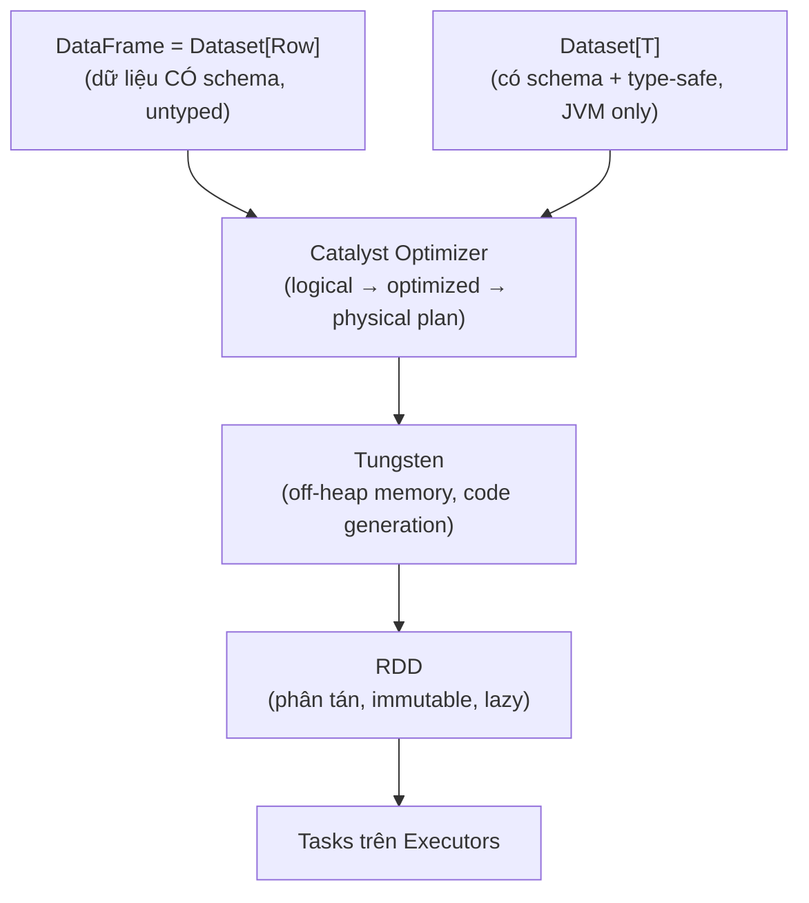

Câu hỏi "RDD khác DataFrame thế nào?" xuất hiện trong hầu hết vòng phỏng vấn Spark, và đa số ứng viên trả lời sai theo cùng một kiểu: liệt kê ba API như ba lựa chọn ngang hàng. Cách hiểu đúng hơn: đây là **ba tầng trừu tượng chồng lên nhau** — DataFrame và Dataset được biên dịch xuống RDD, và giá trị của tầng trên nằm ở những gì engine biết thêm về dữ liệu của bạn để tự tối ưu.

Nên đọc cùng: [Apache Spark](/concepts/4-compute-engines-batch/apache-spark/), [Spark Catalyst Optimizer](/concepts/4-compute-engines-batch/spark-catalyst-optimizer/), [Spark Tungsten Engine](/concepts/4-compute-engines-batch/spark-tungsten-engine/).

---

## 1. Ba tầng trừu tượng



### RDD (Resilient Distributed Dataset)
Tầng thấp nhất và là nền của mọi thứ: một tập **bất biến (immutable)** các object JVM/Python, **chia thành partition** rải trên cụm, kèm **lineage** (chuỗi phép biến đổi) để tính lại partition bị mất khi node chết — chữ "Resilient" nằm ở đó, không phải ở replication.

Đặc điểm quyết định: với RDD, Spark **không biết gì về cấu trúc bên trong** object của bạn. `rdd.map(lambda x: x.price * 1.1)` là một hàm mờ đục — engine chỉ biết chạy nó, không thể tối ưu, không thể bỏ cột thừa, và với PySpark còn phải serialize dữ liệu qua lại giữa JVM và Python worker (chậm gấp nhiều lần).

### DataFrame
Tập dữ liệu **có schema** — engine biết từng cột tên gì, kiểu gì. Từ đó hai cỗ máy tối ưu vào cuộc:
- **[Catalyst](/concepts/4-compute-engines-batch/spark-catalyst-optimizer/):** phân tích biểu thức của bạn (vì `col("price") * 1.1` là cây biểu thức, không phải hàm mờ đục) và tự tối ưu: đẩy filter xuống trước join, cắt cột không dùng ngay từ lúc đọc Parquet, chọn chiến lược join.
- **[Tungsten](/concepts/4-compute-engines-batch/spark-tungsten-engine/):** lưu dữ liệu dạng binary off-heap thay vì object JVM (né GC), sinh code Java trực tiếp cho biểu thức (whole-stage codegen).

Hệ quả thực dụng cho PySpark: code DataFrame chạy **gần như ngang tốc độ Scala**, vì mọi tính toán diễn ra trong JVM theo plan đã dịch — Python chỉ mô tả plan. Đây là lý do "dùng DataFrame API, tránh RDD trong PySpark" là quy tắc số một về hiệu năng.

### Dataset
Chỉ tồn tại trên JVM (Scala/Java): `Dataset[T]` = DataFrame + **type-safety lúc biên dịch**. Gõ sai tên field, compiler báo ngay thay vì nổ `AnalysisException` lúc runtime. Trong Scala, `DataFrame` chỉ là alias của `Dataset[Row]`. Cái giá: mỗi lần dùng lambda với case class (`ds.map(x => ...)`), Spark phải deserialize từ Tungsten binary về object — mất một phần lợi ích codegen. Python không có Dataset vì Python không có compile-time typing.

## 2. Bảng so sánh nhanh

| | RDD | DataFrame | Dataset |
|---|---|---|---|
| Schema | Không | Có | Có |
| Tối ưu Catalyst/Tungsten | Không | Có | Có (một phần với lambda) |
| Type-safe compile-time | Có (Scala) | Không (lỗi lúc runtime) | Có |
| Ngôn ngữ | Scala, Java, Python | Tất cả | Chỉ Scala/Java |
| Hiệu năng PySpark | Kém (serialize Py↔JVM) | Tốt | — |
| Khi nào dùng | Dữ liệu phi cấu trúc, thuật toán low-level, kiểm soát partition thủ công | **Mặc định cho mọi việc** | Codebase Scala cần type-safety |

## 3. Transformation và Action cơ bản trên DataFrame

Mọi thao tác chia hai loại — hiểu ranh giới này là hiểu **lazy evaluation**: transformation chỉ *xây plan*, action mới *chạy plan*.

```python
from pyspark.sql import functions as F

df = spark.read.parquet("s3a://lake/silver/orders/")        # chưa đọc gì cả!

# --- TRANSFORMATIONS (lazy - chỉ dựng plan) ---
result = (df
    .filter(F.col("order_date") >= "2026-01-01")             # narrow
    .withColumn("revenue", F.col("qty") * F.col("unit_price"))
    .select("customer_id", "order_date", "revenue")
    .groupBy("customer_id")                                   # wide → shuffle
    .agg(F.sum("revenue").alias("total_revenue"),
         F.countDistinct("order_date").alias("active_days"))
    .orderBy(F.desc("total_revenue")))                        # wide → shuffle

# --- ACTIONS (kích hoạt thực thi thật) ---
result.show(20)                    # in 20 dòng
top = result.limit(100).collect()  # kéo về driver - CHỈ với dữ liệu nhỏ!
result.write.mode("overwrite").parquet("s3a://lake/gold/customer_revenue/")
result.count()
```

Hai bẫy kinh điển: (1) gọi `collect()` trên dữ liệu lớn → Driver OOM — muốn xem thử dùng `show()`/`take(n)`; (2) gọi nhiều action trên cùng một chuỗi transformation đắt tiền → plan chạy lại từ đầu mỗi lần, trừ khi bạn [persist](/concepts/4-compute-engines-batch/spark-persist-storage-levels/).

Phân loại narrow/wide của từng transformation — yếu tố quyết định số [stage và shuffle](/concepts/4-compute-engines-batch/spark-jobs-stages-tasks/) — được phân tích riêng trong bài [Shuffle](/concepts/4-compute-engines-batch/shuffle/): narrow (`filter`, `select`, `withColumn`, `map`) xử lý trong từng partition độc lập; wide (`groupBy`, `join`, `distinct`, `orderBy`, `repartition`) buộc dữ liệu di chuyển qua mạng.

## 4. Khi nào buộc phải rơi xuống RDD?

Hiếm, nhưng có thật:

- Dữ liệu **phi cấu trúc thật sự** (parse định dạng binary lạ, log đa dòng không tách được bằng regex một dòng).
- Cần **kiểm soát partition thủ công** kiểu `mapPartitions` với logic khởi tạo đắt tiền (mở connection tới DB một lần cho cả partition thay vì từng dòng).
- Thuật toán đồ thị/ML tự cài đặt cần `zipPartitions`, custom partitioner.

```python
# Mẫu mapPartitions: 1 connection / partition thay vì 1 connection / dòng
def enrich_partition(rows):
    conn = create_expensive_connection()      # chạy 1 lần cho cả partition
    for row in rows:
        yield lookup_and_merge(conn, row)
    conn.close()

enriched = df.rdd.mapPartitions(enrich_partition).toDF(schema)
```

Ngay cả khi đó, mẫu chuẩn là "xuống RDD ngắn nhất có thể rồi quay lại DataFrame" (`.rdd ... .toDF()`) để phần còn lại của pipeline vẫn hưởng Catalyst.

## Liên kết trong site

[Spark SQL](/concepts/4-compute-engines-batch/spark-sql/) · [Spark Execution Model](/concepts/4-compute-engines-batch/spark-execution-model/) · [Spark Joins](/concepts/4-compute-engines-batch/spark-joins/) · [Spark Partition](/concepts/4-compute-engines-batch/spark-partition/) · Bản đồ học toàn bộ Spark: [Spark Mastery](/concepts/4-compute-engines-batch/spark-mastery/).

## Nguồn Tham Khảo

- [RDD Programming Guide](https://spark.apache.org/docs/latest/rdd-programming-guide.html) - Apache Spark.
- [Spark SQL, DataFrames and Datasets Guide](https://spark.apache.org/docs/latest/sql-programming-guide.html) - Apache Spark.
- [A Tale of Three Apache Spark APIs: RDDs vs DataFrames and Datasets](https://www.databricks.com/blog/2016/07/14/a-tale-of-three-apache-spark-apis-rdds-dataframes-and-datasets.html) - Databricks.
- [Deep Dive into Spark SQL's Catalyst Optimizer](https://www.databricks.com/blog/2015/04/13/deep-dive-into-spark-sqls-catalyst-optimizer.html) - Databricks.
- [Resilient Distributed Datasets: A Fault-Tolerant Abstraction for In-Memory Cluster Computing](https://www.usenix.org/system/files/conference/nsdi12/nsdi12-final138.pdf) - Zaharia et al., NSDI 2012.
