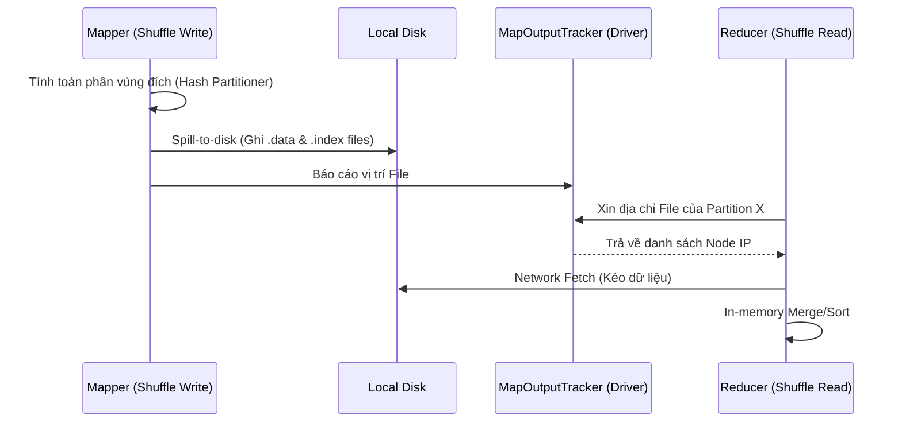

Khi vận hành các hệ thống Big Data hàng TB/PB, bạn sẽ sớm nhận ra rằng tính toán (CPU) hiếm khi là nút thắt cổ chai. Kẻ thù thực sự luôn là **Disk I/O** và **Network Bandwidth**. Trong Apache Spark, cơ chế kích hoạt sự bùng nổ của cả hai nút thắt này được gọi là **Shuffle**. 

Hầu hết các lỗi `OOMKilled` (Out Of Memory), `FetchFailedException`, hay `ExecutorLostFailure` đều bắt nguồn trực tiếp từ một quá trình Shuffle không được tối ưu.

## 1. Kiến trúc Vật lý của Spark Shuffle (Physical Execution)

Khác với các phép biến đổi hẹp (Narrow Transformations) như `.map()` hay `.filter()` hoạt động hoàn toàn trên RAM (In-memory) trong cùng một Partition, các phép toán rộng (Wide Transformations) như `.groupByKey()`, `.join()` yêu cầu dữ liệu phải được phân phối lại qua mạng.

Spark chia quá trình Shuffle thành hai giai đoạn vật lý rạch ròi: **Shuffle Write** (Map side) và **Shuffle Read** (Reduce side), với `MapOutputTracker` làm cầu nối điều phối.



### 1.1. Shuffle Write (Giai đoạn Map)
Tại Map side, Spark phải phân loại dữ liệu xem mỗi record sẽ đi về Reduce task nào. Để tránh tràn RAM ngay lập tức, dữ liệu được ghi vào bộ đệm (Shuffle RAM Buffer, mặc định `32KB`). Khi buffer đầy, dữ liệu bị **Spill-to-disk** (tràn xuống đĩa cứng cục bộ của Executor) thành các tệp tin `*.data` (chứa dữ liệu) và `*.index` (đánh dấu vị trí byte-offset của từng partition).
- **Trade-off:** Tốn thời gian Serialize/Deserialize (CPU) và tạo ra lượng khổng lồ Disk I/O. Nếu dùng ổ cứng HDD thay vì NVMe SSD, quá trình này sẽ làm treo hệ thống.

### 1.2. Shuffle Read (Giai đoạn Reduce)
Tại Reduce side, các task sẽ gọi RPC đến `MapOutputTracker` (nằm trên Driver) để lấy tọa độ dữ liệu. Sau đó, chúng mở các kết nối TCP để kéo (Fetch) dữ liệu qua mạng từ các Map Executor.
- **Rủi ro vận hành (Operational Risk):** Nếu một Reduce task kéo quá nhiều dữ liệu về cùng lúc (do Data Skew), buffer bộ nhớ của nó (`spark.reducer.maxSizeInFlight` - mặc định `48MB`) sẽ quá tải. Tệ hơn, nếu một Map Executor bị ngỏm giữa chừng, Reducer sẽ văng lỗi `FetchFailedException`, buộc Spark phải tính toán lại (re-compute) toàn bộ Stage trước đó.

## 2. Rủi ro Vận hành: Điểm mù của Developer

### 2.1. Nút thắt cổ chai OOM với `groupByKey`
Một sai lầm kinh điển của các Junior Engineer là sử dụng `groupByKey()` thay vì `reduceByKey()`.

**Tại sao `groupByKey` làm sập hệ thống?**
`groupByKey` đẩy **toàn bộ dữ liệu thô** qua mạng sang Reduce side trước khi thực hiện tổng hợp. Nếu một Key có 1 tỷ records, Reducer chứa Key đó sẽ kéo 1 tỷ records vào RAM, dẫn đến `JVM OOMKilled`.

**Code Thực chiến: Hãy dùng `reduceByKey`**
`reduceByKey` thực hiện *Pre-aggregation* (Map-side Combine). Nó gom dữ liệu cục bộ ngay trên Mapper trước, sau đó chỉ gửi kết quả qua mạng.

```python
# ❌ TRÁNH DÙNG: Gây ra Full Network Shuffle và OOM
rdd.map(lambda x: (x, 1)) \
   .groupByKey() \
   .mapValues(sum) 

# ✅ NÊN DÙNG: Pre-aggregation giảm 90% Network I/O
rdd.map(lambda x: (x, 1)) \
   .reduceByKey(lambda a, b: a + b)
```

### 2.2. Cartesian Explosion trong JOIN
Thực hiện `.join()` mà không có điều kiện (Cross Join) hoặc điều kiện Join sinh ra dữ liệu m-n (Many-to-Many). Ví dụ bảng A có 1,000 dòng trùng key, bảng B có 1,000 dòng trùng key. Spark sẽ tạo ra 1,000 * 1,000 = 1,000,000 dòng tại ranh giới Shuffle, gây tràn đĩa cứng (No space left on device) ngay lập tức.

## 3. Khắc phục Data Skew với kỹ thuật Salting

**Data Skew** xảy ra khi dữ liệu phân bố không đồng đều theo Hash Key. Một Reduce Task phải gồng gánh 80% tải của toàn hệ thống (Straggler Task), trong khi các task khác đã xong và ngồi chơi. 

**Giải pháp cốt lõi:** Kỹ thuật Salting. Thêm một số ngẫu nhiên (Salt) vào khóa (Key) bị nghiêng để "phân mảnh" nó ra nhiều Reducer khác nhau, tính toán một phần (Partial Aggregate), sau đó gộp lại.

```python
import random
from pyspark.sql.functions import col, lit, concat_ws, explode, array

num_salts = 10  # Phân mảnh key thành 10 phần

# Bước 1: Thêm Salt ngẫu nhiên vào bảng Fact (Bảng lớn bị lệch)
fact_df_salted = fact_df.withColumn(
    "salted_key", 
    concat_ws("_", col("skewed_key"), lit(random.randint(0, num_salts - 1)))
)

# Bước 2: Nhân bản (Explode) bảng Dimension (Bảng nhỏ)
dim_df_exploded = dim_df.withColumn(
    "salt", explode(array([lit(i) for i in range(num_salts)]))
).withColumn(
    "salted_key", concat_ws("_", col("skewed_key"), col("salt"))
)

# Bước 3: Join trên salted_key (Dữ liệu bị lệch đã được phân phối đều)
result = fact_df_salted.join(dim_df_exploded, "salted_key") \
                       .drop("salted_key", "salt")
```
*Lưu ý: Kỹ thuật Salting đánh đổi việc tăng (nhân bản) dữ liệu trên bảng Dimension để đổi lấy phân phối I/O đồng đều trên toàn Cluster.*

## 4. Tối ưu Chi phí (FinOps) với Shuffle Tuning

Nếu bạn chạy Spark trên Cloud (AWS EMR, Databricks), Shuffle tồi tệ đồng nghĩa với đốt tiền tốn kém:
1. **Tinh chỉnh `spark.sql.shuffle.partitions`:** Mặc định là 200. Quy tắc vàng (Rule of Thumb) là đặt giá trị này sao cho mỗi partition có dung lượng khoảng `100MB - 200MB`. Nếu có 1TB dữ liệu sau filter, hãy set tham số này thành `10000`. 
2. **Loại bỏ Shuffle với Broadcast Join:** Luôn sử dụng `broadcast(small_df)` khi Join bảng nhỏ (< 2GB, tùy vào RAM của Executor). Thay vì Shuffle, bảng nhỏ được serialize và đẩy thẳng vào RAM của mọi Executor, tiết kiệm 100% Shuffle Network.
3. **Cấu hình Off-Heap Memory:** Với các dữ liệu dạng Struct nặng nề, bộ nhớ Heap của JVM dễ bị đầy và kích hoạt Garbage Collection (GC Pause) liên tục khi giải mã Shuffle. Hãy bật `spark.memory.offHeap.enabled=true` để Spark sử dụng bộ nhớ ngoài (Direct Memory) thông qua Project Tungsten.

## Nguồn Tham Khảo (References)
- [Apache Spark Architecture Explained - Databricks](https://www.databricks.com/blog/2025/06/10/apache-spark-architecture-explained-how-the-unified-analytics-engine-actually-works.html)
- [Project Tungsten: Bringing Apache Spark Closer to Bare Metal - Databricks](https://www.databricks.com/blog/2015/04/28/project-tungsten-bringing-apache-spark-closer-to-bare-metal.html)
- Martin Kleppmann, *Designing Data-Intensive Applications*, Chapter 10: Batch Processing.
