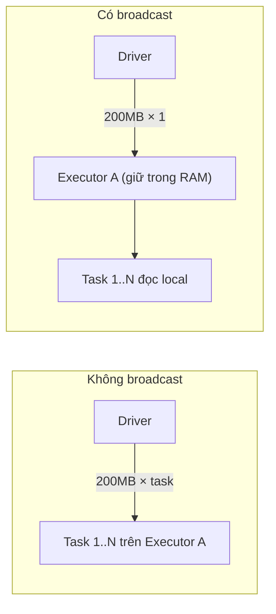

Broadcast variables và serialization thường bị học như hai chủ đề rời rạc, nhưng chúng chung một gốc rễ: **mọi byte đi qua mạng trong Spark đều phải được serialize**, và người thiết kế job giỏi là người giảm thiểu số byte đó. Broadcast giảm *số lần gửi*; serializer tốt giảm *kích thước mỗi lần gửi*; định dạng file cột giảm *lượng phải đọc ngay từ đầu*.

Nên đọc trước: [Shuffle](/concepts/4-compute-engines-batch/shuffle/) và [Spark Joins](/concepts/4-compute-engines-batch/spark-joins/).

---

## 1. Broadcast Variables: gửi một lần cho mỗi executor

Mặc định, mọi biến bạn tham chiếu trong closure (hàm lambda) được **serialize kèm theo TỪNG task**. Một lookup dict 200 MB dùng trong job 2.000 task nghĩa là gửi 200 MB × 2.000 lần qua mạng. Broadcast variable sửa điều đó: gửi **một lần cho mỗi executor**, giữ read-only trong bộ nhớ, mọi task trên executor đó dùng chung.

```python
# ❌ Tệ: rates được gửi kèm từng task
rates = load_fx_rates()          # dict 200 MB
df.rdd.map(lambda r: r.amount * rates[r.currency])

# ✅ Tốt: gửi 1 lần / executor
b_rates = spark.sparkContext.broadcast(load_fx_rates())
df.rdd.map(lambda r: r.amount * b_rates.value[r.currency])
b_rates.unpersist()              # giải phóng khi xong
```



Spark phân phối broadcast theo giao thức kiểu BitTorrent — các executor chia sẻ mảnh cho nhau thay vì tất cả kéo từ driver, nên không nghẽn tại driver.

**Broadcast join** là ứng dụng quan trọng nhất của cơ chế này ở tầng DataFrame: thay vì shuffle cả hai bảng để join, Spark gửi nguyên bảng nhỏ đến mọi executor và join tại chỗ — loại bỏ hoàn toàn shuffle của bảng lớn. Tự động khi bảng nhỏ dưới `spark.sql.autoBroadcastJoinThreshold` (mặc định 10 MB), hoặc ép bằng `F.broadcast(dim_df)`. Hai rủi ro: broadcast bảng "tưởng nhỏ" nhưng phình theo thời gian → Driver/Executor OOM; và thống kê kích thước sai khiến Spark tự broadcast nhầm bảng lớn — phân tích sâu trong [Spark Joins](/concepts/4-compute-engines-batch/spark-joins/).

## 2. Accumulators: biến đếm một chiều

Ngược hướng với broadcast: task **ghi vào**, chỉ driver **đọc được**. Dùng cho đếm chẩn đoán (số dòng lỗi, số record bị bỏ):

```python
bad_rows = spark.sparkContext.accumulator(0)

def parse(row):
    try:
        return transform(row)
    except ValueError:
        bad_rows.add(1)
        return None

out = df.rdd.map(parse).filter(lambda x: x is not None)
out.count()
print(f"Số dòng hỏng: {bad_rows.value}")   # chỉ đọc SAU một action
```

Cảnh báo quan trọng từ tài liệu chính thức: accumulator cập nhật trong **transformation** có thể bị **đếm trùng** khi task retry hoặc stage tính lại — chỉ trong **action** (`foreach`) Spark mới đảm bảo mỗi task cập nhật đúng một lần. Đừng dùng accumulator cho số liệu nghiệp vụ; chỉ dùng để chẩn đoán.

## 3. Kryo vs Java Serialization

Khi shuffle, cache dạng `_SER`, hay gửi closure, object phải thành bytes. Spark có hai serializer:

| | Java (mặc định cho closure) | Kryo |
|---|---|---|
| Tốc độ | Chậm | Nhanh hơn đáng kể (tài liệu Spark: có thể ~10×) |
| Kích thước | To (kèm metadata class) | Gọn |
| Tương thích | Mọi class `Serializable` | Hầu hết; class lạ nên đăng ký trước |

```properties
spark.serializer=org.apache.spark.serializer.KryoSerializer
spark.kryo.registrationRequired=false
# Đăng ký class dùng nhiều để né ghi cả tên class vào từng record:
spark.kryo.classesToRegister=com.myco.Order,com.myco.Customer
```

Lưu ý ranh giới hay bị hiểu nhầm: **DataFrame API không cần Kryo cho dữ liệu** — Tungsten đã lưu dữ liệu dạng binary riêng (`UnsafeRow`), hiệu quả hơn cả Kryo. Kryo chỉ còn tác dụng với RDD API, closure, và một số cấu trúc nội bộ. Nên bật Kryo khi codebase còn nhiều RDD; codebase thuần DataFrame hưởng lợi ít.

## 4. Tương tác với các định dạng serialize trên đĩa

Serialization còn một mặt nữa: **định dạng file**. Spark đọc/ghi native mọi định dạng phổ biến, nhưng chúng không ngang hàng nhau:

| Định dạng | Kiểu | Schema | Splittable | Điểm mạnh trong pipeline Spark |
|---|---|---|---|---|
| Parquet | Cột | Tự mô tả | Có | **Mặc định cho analytics**: column pruning + predicate pushdown → đọc ít hơn hàng chục lần. Xem [Parquet Internals](/concepts/3-storage-engines-formats/parquet-internals/) |
| ORC | Cột | Tự mô tả | Có | Tương đương Parquet, mạnh trong hệ Hive |
| Avro | Dòng | Tự mô tả + schema evolution tốt | Có | Trao đổi dữ liệu giữa hệ thống, landing zone, Kafka |
| JSON | Text | Suy diễn (đắt) | Có (từng dòng) | Nguồn thô; suy diễn schema phải quét dữ liệu — nên khai báo schema tay |
| CSV | Text | Suy diễn (đắt) | Có | Trao đổi với người/hệ cũ; kiểu dữ liệu mơ hồ |

```python
df = spark.read.schema(my_schema).json("s3a://raw/events/")   # tránh inferSchema quét 2 lần
df.write.partitionBy("dt").parquet("s3a://silver/events/")     # cột + partition
```

Quy tắc pipeline chuẩn: **đọc gì cũng được, nhưng sau lớp Bronze hãy chuẩn hóa về định dạng cột** — mọi tối ưu quan trọng của Spark SQL (pruning, pushdown, thống kê cho join strategy) đều giả định định dạng cột phía dưới.

## Liên kết trong site

[Shuffle](/concepts/4-compute-engines-batch/shuffle/) · [Spark Joins](/concepts/4-compute-engines-batch/spark-joins/) · [File Formats Deep Dive](/concepts/3-storage-engines-formats/file-formats-deep-dive/) · [Compression Algorithms](/concepts/3-storage-engines-formats/compression-algorithms/) · Bản đồ học: [Spark Mastery](/concepts/4-compute-engines-batch/spark-mastery/).

## Nguồn Tham Khảo

- [RDD Programming Guide: Broadcast Variables & Accumulators](https://spark.apache.org/docs/latest/rdd-programming-guide.html#shared-variables) - Apache Spark.
- [Tuning Spark: Data Serialization](https://spark.apache.org/docs/latest/tuning.html#data-serialization) - Apache Spark.
- [Spark SQL Performance Tuning: Join Strategy Hints](https://spark.apache.org/docs/latest/sql-performance-tuning.html) - Apache Spark.
- [Parquet Files](https://spark.apache.org/docs/latest/sql-data-sources-parquet.html) - Apache Spark.
- [Avro Data Source Guide](https://spark.apache.org/docs/latest/sql-data-sources-avro.html) - Apache Spark.
