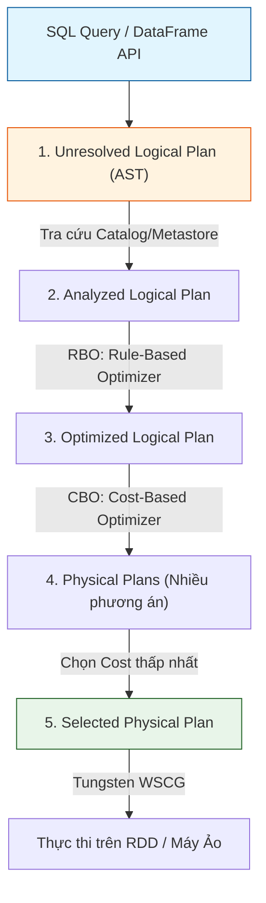

Một trong những sai lầm lớn nhất của các kỹ sư mới làm quen với hệ sinh thái Apache Spark là mang theo tư duy "thao tác từng dòng" của Hadoop MapReduce hay các vòng lặp for-loop truyền thống. Với sự ra đời của API DataFrame/Dataset và Spark SQL, Spark đã chuyển đổi hoàn toàn sang mô hình **Khai báo (Declarative)**. 

Thay vì phải code chi tiết cách join 2 bảng, bạn chỉ cần bảo Spark "cái cần lấy" (qua SQL hoặc DataFrame API). Việc "Làm thế nào để lấy dữ liệu nhanh nhất, tốn ít RAM và Disk I/O nhất" là trọng trách của **Catalyst Optimizer**.

Catalyst không chỉ là một trình lên lịch (Scheduler). Dưới góc độ khoa học máy tính, nó là một **Trình biên dịch (Compiler)** thực thụ được viết bằng Scala, khai thác triệt để sức mạnh của Functional Programming (Pattern Matching, Immutable Trees) để áp dụng hàng trăm quy tắc tối ưu hóa (Optimization Rules) lên truy vấn của bạn.

---

## 1. Vòng Đời 4 Bước Phân Giải Truy Vấn (Query Execution Phases)

Cho dù bạn tương tác với Spark thông qua Python (PySpark), Scala, R hay SQL thuần túy, tất cả các API này đều hội tụ về một luồng biên dịch duy nhất bên trong Catalyst. Dưới đây là vòng đời 4 giai đoạn cốt lõi:



### Giai đoạn 1: Phân tích Cú pháp (Unresolved Logical Plan)
Khi bạn thực thi một câu lệnh như `spark.sql("SELECT name FROM users WHERE age > 18")`, Catalyst sử dụng thư viện **ANTLR 4** để parse chuỗi string thành một Cây cú pháp trừu tượng (Abstract Syntax Tree - AST).
Spark gọi đây là **Unresolved Logical Plan** (Kế hoạch chưa phân giải), bởi vì ở bước này, Spark hoàn toàn "mù tịt" về việc bảng `users` có tồn tại hay không, hoặc cột `name` có nằm trong bảng đó không. Nó chỉ đơn thuần là kiểm tra ngữ pháp SQL có đúng hay không.

### Giai đoạn 2: Phân giải Định danh (Analyzed Logical Plan)
Catalyst sẽ mang cây AST chưa phân giải đi tra cứu (lookup) thông qua **Session Catalog** (hoặc Hive Metastore).
- Ánh xạ tên bảng `users` tới đường dẫn lưu trữ vật lý (ví dụ: `s3a://data-lake/users/`).
- Xác thực Schema và kiểu dữ liệu (Data Type). Nếu cột `age` là kiểu String nhưng bạn lại đi so sánh `> 18` (kiểu Int), Catalyst sẽ ném ra lỗi `AnalysisException` ngay tại bước này.
Kết quả trả về là một **Analyzed Logical Plan** hợp lệ.

### Giai đoạn 3: Tối Ưu Hóa Logic (Optimized Logical Plan - RBO)
Đây là "trái tim" của Catalyst, nơi nó sử dụng **Rule-Based Optimizer [RBO]** để áp dụng hàng loạt quy tắc Heuristic nhằm viết lại cây logic sao cho hiệu quả hơn. Các quy tắc kinh điển bao gồm:

- **Predicate Pushdown (Đẩy bộ lọc xuống):** Thay vì đọc toàn bộ file 100GB lên RAM rồi mới lọc `age > 18`, Catalyst đẩy điều kiện này thẳng xuống tầng Storage (nếu Storage format là Parquet/ORC hoặc database hỗ trợ). Quá trình Scan sẽ chỉ đọc và trả về những block dữ liệu thỏa mãn điều kiện, cắt giảm 99% Disk I/O.
- **Column Pruning (Tỉa cột):** Tự động phát hiện truy vấn chỉ dùng 2 cột `name` và `age` trên tổng số 100 cột của bảng. Catalyst sẽ yêu cầu File Reader (như Parquet) chỉ đọc đúng 2 cột đó, bỏ qua toàn bộ dữ liệu của 98 cột còn lại, tiết kiệm khổng lồ băng thông Memory và Network.
- **Constant Folding (Gấp hằng số):** Nếu có phép toán `SELECT 1000 + 2000`, Catalyst sẽ tính sẵn ra `3000` ngay tại Compile time thay vì bắt CPU phải cộng lại hàng tỷ lần tại Runtime.

### Giai đoạn 4: Lên Kế Hoạch Vật Lý (Physical Planning - CBO)
Từ Optimized Logical Plan duy nhất, Catalyst sẽ sinh ra rất nhiều kịch bản thực thi vật lý (Physical Plans).
Ví dụ, để thực hiện lệnh JOIN 2 bảng, Spark có thể dùng `SortMergeJoin`, `BroadcastHashJoin`, hay `ShuffleHashJoin`. Phương án nào là tốt nhất?

Đó là lúc **Cost-Based Optimizer (CBO)** vào cuộc. CBO sẽ thu thập Table Statistics (kích thước file, số lượng bản ghi, min/max) để ước lượng chi phí (Cost) về CPU và I/O cho mỗi Plan. Kế hoạch nào có điểm Cost thấp nhất sẽ được chọn làm **Selected Physical Plan**.

Kế hoạch này sau đó sẽ được ném cho **Project Tungsten** để tiến hành *Whole-Stage Code Generation* (WSCG) biên dịch thành mã Java Bytecode tối ưu chạy trên từng Executor.

---

## 2. Dynamic Partition Pruning (DPP) - Vũ Khí Tối Thượng Cho Star Schema

Được ra mắt từ Spark 3.0, **DPP (Tỉa phân vùng động)** là một trong những tính năng mạnh mẽ nhất của Catalyst, chuyên trị các bài toán Data Warehousing truyền thống (Mô hình Star Schema).

Hãy xét một truy vấn kinh điển: JOIN bảng Sự kiện (Fact) siêu khổng lồ được phân vùng (partitioned) theo ngày với một bảng Chiều (Dimension) rất nhỏ.

```sql
-- Lấy tổng doanh thu của các cửa hàng ở khu vực APAC
SELECT f.revenue 
FROM fact_sales f 
JOIN dim_store d ON f.store_id = d.id 
WHERE d.region = 'APAC';
```

**Vấn đề của Spark < 3.0:**
Catalyst áp dụng Predicate Pushdown để đẩy `d.region = 'APAC'` xuống bảng `dim_store`. Tuy nhiên, đối với bảng `fact_sales`, nó không hề có cột `region`. Do đó, Catalyst buộc phải **Full Table Scan** toàn bộ bảng Fact (hàng Petabyte dữ liệu) lên bộ nhớ, rồi mới tiến hành Hash Join với bảng Dim, gây ra tình trạng bùng nổ I/O và sập hệ thống (OOM).

**Giải pháp của DPP:**
Ngay tại thời điểm biên dịch, Catalyst chèn một Subquery ẩn (hidden subquery) vào luồng thực thi. 
1. Subquery này chạy trước, quét bảng `dim_store` để tìm ra tất cả các `store_id` thuộc 'APAC' (Ví dụ danh sách trả về là `[12, 15, 99]`].
2. Nó mang danh sách nhỏ gọn này (được cấu trúc thành Broadcast Array) đẩy ngược lại (Push back) làm bộ lọc cho File Scanner của bảng `fact_sales`.
3. Nhờ đó, Spark chỉ Scan đúng các thư mục Partition chứa `store_id` nằm trong danh sách trên. Lượng I/O giảm từ Petabytes xuống còn Megabytes trong chớp mắt.

---

## 3. Cost-Based Optimizer (CBO) và Cấu hình Thực chiến

Để CBO hoạt động hiệu quả, nó "cần ăn" Statistics (Thống kê). Nếu bảng không có thống kê, CBO sẽ bị mù và đưa ra các quyết định thảm họa (Ví dụ: Broadcast một bảng nặng 20GB làm sập toàn bộ Executor).

### Lệnh thu thập Statistics (SQL)
Bạn phải chủ động chạy lệnh `ANALYZE TABLE` trong Pipeline ETL của mình để "nuôi" CBO:

```sql
-- Thu thập kích thước bảng và số dòng (Table-level)
ANALYZE TABLE silver_sales COMPUTE STATISTICS;

-- Thu thập phân phối dữ liệu chi tiết của từng cột (Column-level)
-- Giúp CBO biết được độ lệch dữ liệu (Data Skew) để chia Join hợp lý
ANALYZE TABLE silver_sales COMPUTE STATISTICS FOR COLUMNS store_id, product_id;
```

### Cấu hình Spark Properties
Kích hoạt các tính năng tối ưu nâng cao trong file `spark-defaults.conf` hoặc cấu hình Terraform/Helm:

```yaml
# Kích hoạt CBO (Mặc định thường bị tắt ở các bản cũ, nên bật)
spark.sql.cbo.enabled: "true"

# Bật Join Reorder để CBO tự sắp xếp thứ tự JOIN các bảng sao cho tối ưu
spark.sql.cbo.joinReorder.enabled: "true"

# Kích hoạt Adaptive Query Execution (AQE) 
# AQE cho phép Catalyst sửa đổi Physical Plan NGAY LÚC RUNTIME nếu nhận thấy CBO đoán sai
spark.sql.adaptive.enabled: "true"

# Kích hoạt Dynamic Partition Pruning
spark.sql.optimizer.dynamicPartitionPruning.enabled: "true"
```

---

## 4. Operational Troubleshooting: Gỡ Lỗi Truy Vấn Bằng `EXPLAIN`

Một Data Engineer đẳng cấp không bao giờ phó mặc hoàn toàn cho Catalyst. Khi Job chạy chậm (Latency Spike), bạn phải biết cách đọc "bản chụp X-Quang" của Catalyst: Lệnh `EXPLAIN`.

```python
from pyspark.sql import SparkSession

spark = SparkSession.builder.appName("CatalystDebug").getOrCreate()

df_sales = spark.read.parquet("s3a://data/sales/")
df_filtered = df_sales.filter("revenue > 1000")

# In ra toàn bộ 4 giai đoạn của Catalyst
df_filtered.explain(mode="extended")
```

**Cách đọc Physical Plan [Đọc từ DƯỚI lên TRÊN]:**

1. **Leaf Nodes (Các node lá dưới cùng):** Tìm kiếm node `FileScan parquet`. Hãy để ý phần `PushedFilters`. 
   - Nếu bạn viết filter mà `PushedFilters` rỗng `[]`, có nghĩa là quy tắc Predicate Pushdown đã bị hỏng. 
   - **Nguyên nhân phổ biến:** Bạn đang sử dụng Python UDF (User Defined Function] trong hàm `filter()`. Catalyst không thể chui vào code Python để hiểu logic nên nó vô hiệu hóa Pushdown. Bắt buộc phải Scan full table.
   - **Cách fix:** Thay UDF bằng các hàm Spark SQL Native (`pyspark.sql.functions`).

2. **Internal Nodes (Các node trung gian):** Tìm kiếm node `Exchange`. Node này đánh dấu một thao tác **Shuffle** (dữ liệu bay qua mạng lưới giữa các Worker).
   - Shuffle là thao tác đắt đỏ nhất trong Spark. Nếu thấy quá nhiều `Exchange` rác, bạn cần kiểm tra lại logic Join hoặc Window Functions của mình.

3. **Join Nodes:** Catalyst đã chọn thuật toán Join nào? 
   - `BroadcastHashJoin`: Chúc mừng, truy vấn sẽ chạy rất nhanh (Không có Shuffle).
   - `SortMergeJoin`: Chuẩn bị tinh thần cho một đợt Shuffle khổng lồ và tràn đĩa (Spill-to-disk). Nếu có Data Skew (lệch dữ liệu), một vài Task sẽ chạy mãi không xong. Bật AQE ngay lập tức để Catalyst tự xử lý.

---

## 5. Đánh đổi Hệ thống (Systemic Trade-offs)

- **Rule-based vs Cost-based:** RBO chạy cực nhanh (vài mili-giây) nhưng rất ngây thơ, nó luôn đẩy Filter xuống mà không quan tâm Filter đó có lọc được nhiều dữ liệu hay không. CBO thông minh hơn rất nhiều nhờ toán học thống kê, nhưng bù lại thời gian lên kế hoạch (Planning Time) lâu hơn và đòi hỏi bạn phải tốn Compute để chạy `ANALYZE TABLE` liên tục.
- **Planning Time Overhead:** Với các truy vấn có > 100 JOINs (rất hiếm nhưng có thật trong các mô hình Data Vault phức tạp), việc vét cạn (Exhaustive Search) của CBO Join Reorder có thể làm Driver treo hàng phút chỉ để tính toán Physical Plan trước khi thực sự chạy Job.
- **Python/Scala UDFs:** Là kẻ thù số 1 của Catalyst. Bất kỳ đoạn logic nào bị đóng gói trong UDF, Catalyst coi đó là một "Hộp đen" [Blackbox]. Nó không thể Pushdown, không thể Reorder, không thể Pruning. Tuyệt đối sử dụng Spark SQL Functions bất cứ khi nào có thể.

---

## Nguồn Tham Khảo (References)

- [Deep Dive into Spark SQL's Catalyst Optimizer - Databricks Blog][https://www.databricks.com/blog/2015/04/13/deep-dive-into-spark-sqls-catalyst-optimizer.html]
- [Spark SQL: Relational Data Processing in Spark (SIGMOD 2015 - MIT & Stanford]][https://people.csail.mit.edu/matei/papers/2015/sigmod_spark_sql.pdf]
- [Cost Based Optimizer in Apache Spark 2.2 - Databricks](https://www.databricks.com/blog/2017/08/31/cost-based-optimizer-in-apache-spark-2-2.html]
- Cuốn sách: *Spark: The Definitive Guide* (O'Reilly).
