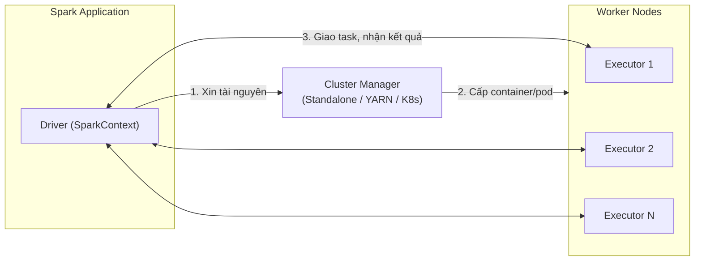
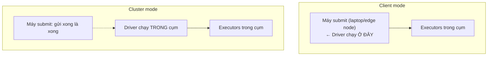

Một hiểu lầm phổ biến: "cài Spark" nghĩa là cài một hệ thống trọn gói. Thực tế, Spark chỉ là **engine tính toán** — nó không tự quản lý CPU/RAM của cụm máy. Việc cấp phát tài nguyên được giao cho một **Cluster Manager** bên ngoài, và Spark được thiết kế để cắm vào nhiều loại manager khác nhau. Hiểu tầng này là điều kiện để trả lời các câu hỏi vận hành: job của tôi đang xin tài nguyên từ đâu, vì sao executor không lên đủ, và driver đang chạy ở máy nào?

Nên đọc trước: [Spark Execution Model](/concepts/4-compute-engines-batch/spark-execution-model/) và [Apache Spark](/concepts/4-compute-engines-batch/apache-spark/).

---

## 1. Kiến trúc chung: Driver, Cluster Manager, Executor

Bất kể chạy trên manager nào, một Spark application luôn gồm ba vai:



1. **Driver** chạy `SparkContext`, dịch code thành DAG, chia stage/task và điều phối.
2. **Cluster Manager** nhận yêu cầu "cho tôi N executor, mỗi cái X core Y GB" và quyết định đặt chúng ở đâu.
3. **Executor** là các JVM process chạy task và giữ dữ liệu cache.

Điểm mấu chốt: Spark chỉ nói chuyện với Cluster Manager lúc **xin/trả tài nguyên**. Sau khi executor đã lên, giao tiếp task là chuyện riêng giữa Driver và Executor. Vì vậy đổi cluster manager không đổi cách bạn viết code — chỉ đổi cách vận hành.

---

## 2. So sánh ba lựa chọn chính

| Tiêu chí | Standalone | YARN | Kubernetes |
|---|---|---|---|
| Bản chất | Manager tích hợp sẵn của Spark | Resource manager của hệ sinh thái Hadoop | Container orchestrator tổng quát |
| Cài đặt | Dễ nhất — chỉ cần Spark | Cần cụm Hadoop | Cần cụm K8s |
| Multi-tenancy | Yếu (FIFO/Fair đơn giản) | Mạnh: queue, capacity scheduler, preemption | Mạnh: namespace, resource quota |
| Isolation | JVM process | Container YARN | Container + image riêng từng app |
| Dynamic allocation | Có | Có (cần External Shuffle Service) | Có (từ Spark 3.x, dùng shuffle tracking) |
| Phù hợp | Lab, PoC, cụm nhỏ chuyên dụng | Hạ tầng Hadoop/on-prem sẵn có | Cloud-native, đa dạng workload |
| Xu hướng | Ổn định, ít phát triển | Giảm dần theo Hadoop | Tăng mạnh, hướng mặc định mới |

(Mesos từng là lựa chọn thứ tư nhưng đã bị deprecated từ Spark 3.2 — gặp trong tài liệu cũ thì biết để bỏ qua.)

**Standalone** — Spark tự kèm một manager tối giản: một Master process + các Worker process. Ưu điểm là dựng cụm trong vài phút; nhược điểm là chia sẻ tài nguyên thô sơ: mặc định một app chiếm toàn bộ core khả dụng (`spark.cores.max` phải đặt tay), không có khái niệm queue hay ưu tiên giữa các team. Phù hợp cụm nhỏ một mục đích — như dự án [Data Lakehouse với Spark](/projects/e2e/spark-data-lakehouse/) và [EcomLake](/projects/e2e/ecomlake/) trong site này.

**YARN** — chuẩn mực một thập kỷ của on-prem. Spark chạy như một YARN application: Driver nằm trong ApplicationMaster (cluster mode), executor nằm trong các YARN container. Sức mạnh nằm ở **scheduler trưởng thành**: capacity queue cho từng phòng ban, preemption khi queue ưu tiên cao thiếu tài nguyên, và cùng một cụm phục vụ được cả Hive, Flink, MapReduce. Cái giá: vận hành cả một hệ Hadoop chỉ để lấy scheduler.

**Kubernetes** — Spark 3.1+ hỗ trợ chính thức mức production. Mỗi executor là một pod, image đóng gói đúng phiên bản dependency của từng job (chấm dứt "dependency hell" khi hai team cần hai bản thư viện xung đột). Điểm cần lưu ý nhất khi chuyển từ YARN: K8s không có External Shuffle Service chuẩn, nên dynamic allocation dựa vào `spark.dynamicAllocation.shuffleTracking.enabled=true` — executor giữ shuffle data sẽ không bị thu hồi, khiến scale-down chậm hơn kỳ vọng.

---

## 3. Client mode vs Cluster mode: Driver chạy ở đâu?

Câu hỏi phỏng vấn kinh điển. Deploy mode quyết định **vị trí của Driver**, không liên quan executor:



- **Client mode:** Driver chạy ngay trên máy submit. Bắt buộc cho `spark-shell`, notebook (Jupyter/Zeppelin) vì cần tương tác. Rủi ro: đóng laptop, rớt mạng, hay máy edge quá tải → job chết; mọi `collect()` kéo dữ liệu về máy submit.
- **Cluster mode:** Driver được cluster manager đặt vào trong cụm. Máy submit thoát ngay sau khi gửi. Đây là lựa chọn mặc định cho **mọi job production** chạy theo lịch (Airflow `SparkSubmitOperator` nên dùng mode này) — job sống chết không phụ thuộc máy submit.

```bash
spark-submit \
  --master yarn \                      # hoặc spark://host:7077, k8s://https://...
  --deploy-mode cluster \
  --num-executors 10 \
  --executor-cores 4 --executor-memory 8g \
  --conf spark.dynamicAllocation.enabled=true \
  app.py
```

## 4. Dynamic Allocation: xin tài nguyên co giãn

Cấu hình tĩnh (`--num-executors 10`) lãng phí khi job có giai đoạn nhàn rỗi. Dynamic allocation cho Spark tự xin thêm executor khi task xếp hàng dài và trả bớt khi idle:

```properties
spark.dynamicAllocation.enabled=true
spark.dynamicAllocation.minExecutors=2
spark.dynamicAllocation.maxExecutors=50
spark.dynamicAllocation.executorIdleTimeout=60s
# YARN: cần external shuffle service để executor chết không mất shuffle data
spark.shuffle.service.enabled=true
```

Trade-off: co giãn tốt cho cụm dùng chung nhiều team, nhưng thời gian chờ executor mới lên (cold start trên K8s có thể 10-30 giây/pod) làm job ngắn chạy chậm hơn cấu hình tĩnh. Job SLA chặt, chạy lặp lại đều đặn → cân nhắc giữ tĩnh.

## 5. Chọn thế nào trong thực tế

- Đang có cụm Hadoop on-prem → **YARN**, đừng tạo thêm hạ tầng mới chỉ để "hiện đại".
- Hạ tầng cloud-native, đã vận hành K8s → **Spark on K8s**, hưởng chung hệ CI/CD, monitoring, autoscaling.
- Học tập, PoC, cụm chuyên dụng nhỏ → **Standalone**, đơn giản là sức mạnh.
- Không muốn vận hành gì cả → managed service (Databricks, EMR, Dataproc) — bên dưới vẫn là các mô hình trên, kiến thức này giúp bạn đọc hiểu hóa đơn và sự cố của họ.

## Liên kết trong site

[Spark Execution Model](/concepts/4-compute-engines-batch/spark-execution-model/) · [Spark Jobs, Stages, Tasks](/concepts/4-compute-engines-batch/spark-jobs-stages-tasks/) · [Troubleshooting Spark OOM](/concepts/4-compute-engines-batch/troubleshooting-spark-oom/) · [Airflow Celery vs K8s Executor](/concepts/7-dataops-orchestration-quality/airflow-celery-vs-k8s-executor/) — bài toán chọn executor tương tự ở tầng orchestration.

## Nguồn Tham Khảo

- [Cluster Mode Overview](https://spark.apache.org/docs/latest/cluster-overview.html) - Apache Spark.
- [Running Spark on YARN](https://spark.apache.org/docs/latest/running-on-yarn.html) - Apache Spark.
- [Running Spark on Kubernetes](https://spark.apache.org/docs/latest/running-on-kubernetes.html) - Apache Spark.
- [Spark Standalone Mode](https://spark.apache.org/docs/latest/spark-standalone.html) - Apache Spark.
- [Job Scheduling & Dynamic Resource Allocation](https://spark.apache.org/docs/latest/job-scheduling.html) - Apache Spark.
