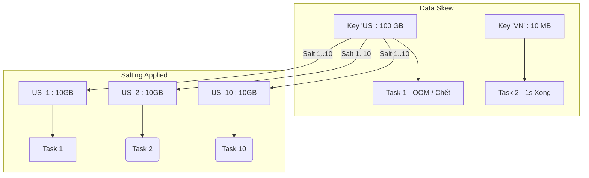

Data Skew (Dữ liệu bị lệch) là "kẻ thù số 1" của mọi kỹ sư Data Engineer khi vận hành các hệ thống phân tán. Nó phá vỡ nguyên lý Data Parallelism (xử lý song song dữ liệu) của Apache Spark, biến một cụm Cluster sở hữu hàng nghìn Cores trở nên vô dụng khi toàn bộ tải trọng bị dồn vào một luồng tính toán duy nhất. 

Bài viết này mổ xẻ cơ chế vật lý dẫn đến Data Skew, các hậu quả thảm khốc (OOMKilled, Spill-to-disk), kỹ thuật xử lý thủ công (Salting) bằng mã nguồn, và sự can thiệp kiến trúc tự động từ Adaptive Query Execution (AQE).

---

## 1. Bản chất Vật lý của Data Skew

Spark phân bổ khối lượng công việc bằng cách "cắt" dữ liệu thành các khối vật lý gọi là Partitions. Ở các Stage có Wide Dependency (như `JOIN`, `GROUP BY`, `ORDER BY`), Spark sử dụng thuật toán Hash Partitioning (mặc định) để định tuyến dữ liệu qua mạng (Network Shuffle):

```text
Partition_ID = hash(Join_Key) % num_partitions
```

Sự cố bùng nổ khi phân phối dữ liệu trong thực tế hiếm khi đồng đều (Quy luật 80/20 hoặc hiệu ứng Pareto). Ví dụ: Một hệ thống e-commerce toàn cầu lưu log giao dịch, trong đó khóa `country_code = 'US'` chiếm tới 90% lượng bản ghi, trong khi hàng trăm quốc gia khác chỉ chiếm 10%. 

Khi thực hiện lệnh `JOIN` dựa trên `country_code`, thuật toán Hash sẽ đẩy toàn bộ 90% khối lượng dữ liệu khổng lồ (có thể lên tới hàng chục GB) vào **MỘT Task duy nhất** thuộc **MỘT Executor duy nhất**.

---

## 2. Rủi ro Vận hành và Dấu hiệu Nhận biết (Operational Risks)

Hậu quả của Data Skew trên tầng vận hành vật lý (Infrastructure) là cực kỳ tàn khốc:

1. **Hiệu ứng Task Straggler**: Trong Spark UI, bạn sẽ thấy 199 Tasks hoàn thành trong vài giây, nhưng Task số 200 (chứa key 'US') lại chạy miệt mài hàng giờ đồng hồ. Vì các Stage trong Spark bị khóa lẫn nhau (Blocking barrier), toàn bộ Cluster sẽ phải "đóng băng" chờ Task này xong. Tổn thất chi phí (FinOps) là khổng lồ do hàng trăm Cores khác bị nhàn rỗi (Idle).
2. **JVM OOMKilled**: Nếu Partition khổng lồ kia vượt quá dung lượng Execution Memory của Executor, JVM sẽ văng lỗi `java.lang.OutOfMemoryError` và bị Container Manager (YARN/Kubernetes) tiêu diệt với Exit Code 137.
3. **Disk Spill (I/O Bound)**: Nếu Spark cấu hình off-heap và disk tốt, nó sẽ cố gắng không sập mà đẩy dữ liệu dư thừa xuống đĩa (Spill-to-disk). Đĩa cứng vật lý (Disk I/O) có băng thông cực kỳ thấp so với RAM. Tốc độ thực thi sẽ sụt giảm hàng trăm lần, dẫn tới hiện tượng Job bị "Treo" vĩnh viễn (Infinite hanging).

---

## 3. Kỹ thuật Salting (Rắc muối) Kinh Điển

Để phá vỡ thế độc quyền của một Partition khổng lồ, giới kỹ sư giải quyết bằng kỹ thuật **Salting**.

### 3.1. Ý tưởng Kiến trúc
- **Fact Table (Bảng Lớn):** Thêm một hậu tố ngẫu nhiên (Salt) vào khóa (Key) để "chặt" cục dữ liệu khổng lồ đó ra thành $N$ mảnh [Partitions] nhỏ hơn.
- **Dimension Table (Bảng Nhỏ):** Nhân bản (Replicate/Explode) các dòng của bảng nhỏ lên $N$ lần để đảm bảo thao tác JOIN vẫn khớp hoàn toàn với các Key đã rắc muối bên Fact Table.



### 3.2. Code Thực chiến (PySpark)

Dưới đây là một implementation chuẩn mực của Salting bằng PySpark để giải quyết Join Skew:

```python
from pyspark.sql.functions import col, rand, lit, explode, sequence
from pyspark.sql.types import IntegerType

# Bảng giao dịch 10 Tỷ dòng (Bị Skewed cực nặng ở key 'US')
fact_df = spark.table("bronze.fact_orders")
# Bảng danh mục 1 Triệu dòng (Bảng nhỏ cần JOIN)
dim_df = spark.table("bronze.dim_country")

# BƯỚC 1: Chọn N (Salt Bins). Tùy thuộc cấu hình RAM, N càng lớn chia càng nhỏ.
SALT_BINS = 10 

# BƯỚC 2: Rắc muối (Salting) Fact Table.
# Key 'US' sẽ bị biến thành phân phối đều ngẫu nhiên: 'US_0', 'US_1', ..., 'US_9'
salted_fact_df = fact_df.withColumn(
    "salt", (rand() * SALT_BINS).cast(IntegerType())
).withColumn(
    "salted_join_key", col("country_code") + lit("_") + col("salt").cast("string")
)

# BƯỚC 3: Nhân bản Dimension Table. (Cảnh báo Trade-off: Data Amplification)
# 1 dòng 'US' giờ phình thành 10 dòng: 'US_0', 'US_1', ..., 'US_9'
replicated_dim_df = dim_df.withColumn(
    "salt_array", sequence(lit(0), lit(SALT_BINS - 1))
).withColumn(
    "salt", explode(col("salt_array"))
).withColumn(
    "salted_join_key", col("country_code") + lit("_") + col("salt").cast("string")
)

# BƯỚC 4: Thực thi JOIN trên Key đã Salt
# Lúc này khối lượng 100GB bản ghi 'US' đã được chia đều cho 10 Tasks khác nhau
result_df = salted_fact_df.join(
    replicated_dim_df,
    "salted_join_key",
    "inner"
).drop("salt", "salted_join_key", "salt_array")
```

### 3.3. Đánh đổi Hệ thống [Systemic Trade-offs]
- **Lợi ích:** Triệt tiêu Task Straggler, giải quyết triệt để OOMKilled, duy trì Throughput cao cho Cluster.
- **Cái giá phải trả (The Trade-off):** 
  - **Data Amplification:** Bảng Dimension bị phình to (nhân bản) gấp N lần. Nếu bảng Dimension vốn dĩ đã lớn, điều này sẽ tạo ra một thảm họa Shuffle khác.
  - **Manual Tuning Overhead:** Việc phải chọn tay hệ số `SALT_BINS` là một cơn ác mộng vận hành. Nếu Data Volume tăng lên theo năm tháng, code cũ với `SALT_BINS = 10` sẽ không còn chịu nổi và lại gặp OOM.

---

## 4. Kỷ nguyên Tự động: Adaptive Query Execution (AQE)

Nhận thấy sự khốn khổ của lập trình viên, từ Apache Spark 3.0, tính năng AQE ra mắt, đưa kỹ thuật Salting thủ công vào bảo tàng. AQE can thiệp sâu vào Kế hoạch thực thi (Execution Plan) ở **thời gian chạy (Runtime)** thay vì tĩnh (Compile-time) như Catalyst truyền thống.


*(Hình 1: Cơ chế tách Partition động của AQE để tự động hóa Salting. Nguồn: Databricks Blog)*

### 4.1. AQE xử lý Skew Join dưới tầng vật lý như thế nào?
1. Spark chạy xong Stage phía trước (Map Stage / Shuffle Write) và thu thập **Runtime Statistics** (số liệu byte size chính xác của từng partition trước khi Shuffle Read).
2. Nếu AQE nhận diện một Partition có kích thước lớn bất thường (vượt xa mức Median của toàn bộ các phân vùng), nó đánh dấu đó là một Skewed Partition.
3. Spark **tự động áp dụng logic Salting ở tầng vật lý**: Chẻ đôi (hoặc chẻ nhiều mảnh) Skewed Partition của bảng A thành các Sub-partitions, đồng thời tự động nhân bản (duplicate) Partition tương ứng ở bảng B bên trong bộ nhớ mà không cần viết một dòng code `explode()` nào.

### 4.2. Cấu hình Vận hành AQE (FinOps Configuration)

Để kích hoạt đúng cách AQE trên Production (khi submit job trên YARN hoặc EMR Terraform), bạn cần thiết lập cấu hình:

```yaml
# Ví dụ Cấu hình spark-defaults.conf (HOẶC trên AWS EMR Terraform properties)
spark.sql.adaptive.enabled: "true"
spark.sql.adaptive.skewJoin.enabled: "true"

# Fine-tuning 1: Một partition bị coi là "Skew" nếu nó to gấp mấy lần kích thước trung bình?
# Mặc định là 5. Nếu hệ thống nhạy cảm với RAM, hãy giảm xuống 3.
spark.sql.adaptive.skewJoin.skewedPartitionFactor: "5"

# Fine-tuning 2: Ngưỡng tối thiểu. Partition phải lớn hơn bao nhiêu byte mới tính là Skew?
# Mặc định là 256MB. Điều này tránh overhead tự động chia nhỏ những dữ liệu chỉ có vài MB (noise).
spark.sql.adaptive.skewJoin.skewedPartitionThresholdInBytes: "256m"
```

Với AQE, toàn bộ mã PySpark của bạn trở về dạng nguyên thủy nhất:
```python
df1.join(df2, "country_code")
```
Sự tách bạch giữa Business Logic [Nghiệp vụ] và Physical Optimization (Tối ưu hạ tầng vật lý) chính là đỉnh cao của thiết kế hệ thống dữ liệu hiện đại, giúp tiết giảm hàng ngàn giờ Maintainance (Bảo trì) và Technical Debt (Nợ kỹ thuật).

---

## 5. Nguồn Tham Khảo
- [Adaptive Query Execution: Speeding Up Spark SQL at Runtime (Databricks Blog)](https://www.databricks.com/blog/2020/05/29/adaptive-query-execution-speeding-up-spark-sql-at-runtime.html)
- [Best practices for successfully managing memory for Apache Spark applications on Amazon EMR (AWS Blog)](https://aws.amazon.com/blogs/big-data/best-practices-for-successfully-managing-memory-for-apache-spark-applications-on-amazon-emr/)
- Thiết kế Hệ thống Dữ liệu Chuyên sâu (*Designing Data-Intensive Applications* - Martin Kleppmann, Chapter 10: Batch Processing).
