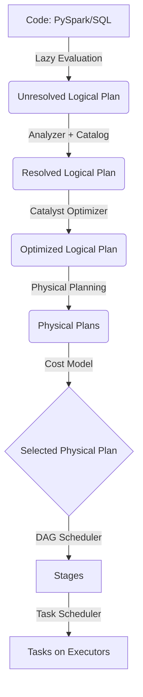

Mô hình thực thi (Execution Model) của Apache Spark là nền tảng cốt lõi quyết định khả năng mở rộng (scalability) và khả năng chịu lỗi (fault-tolerance) của hệ thống xử lý dữ liệu. Để vận hành một hệ thống Big Data ở quy mô Petabyte, kỹ sư dữ liệu không chỉ cần viết code đúng logic mà còn phải thấu hiểu cách code được phân rã, lập lịch và chạy trên hàng ngàn container vật lý.

Bài viết này sẽ mổ xẻ kiến trúc thực thi của Spark dưới lăng kính System Design, tập trung vào kiến trúc phân tán, rủi ro vận hành (OOMKilled, Spill-to-disk) và các chiến lược cấp phát tài nguyên thực chiến.

## 1. Kiến trúc Thực thi Vật lý (Physical Execution Architecture)

Kiến trúc Spark tuân theo mô hình **Master-Worker**, trong đó các tiến trình chạy trên các Java Virtual Machines (JVM) độc lập.


*Hình 1: Cấu trúc Spark Cluster (Nguồn: Apache Spark Official Documentation)*

### 1.1. Driver Node (The Brain)
Driver là tiến trình trung tâm (thường là máy chứa hàm `main()`), chịu trách nhiệm vòng đời của Spark Application thông qua đối tượng `SparkSession`.
- **Catalyst Optimizer & DAG Scheduler**: Chuyển đổi mã nguồn (SQL/DataFrame) thành Kế hoạch thực thi logic (Logical Plan), tối ưu hóa, và biến nó thành Kế hoạch thực thi vật lý (Physical Execution Plan) dưới dạng đồ thị có hướng không tuần hoàn (DAG).
- **Task Scheduling**: Phân rã DAG thành các Task nhỏ và phân phối xuống các Executor.
- **State Management**: Giữ metadata về phân vùng dữ liệu (Partitions) và theo dõi trạng thái thành công/thất bại của từng Task.

*Trade-off*: Driver là điểm Single Point of Failure (SPOF) ở cấp độ Application. Mặc dù Cluster Manager có thể tự động khởi động lại Driver nếu bị crash, toàn bộ progress của các job đang chạy trong session đó sẽ bị mất.

### 1.2. Cluster Manager (The Negotiator)
Spark không trực tiếp quản lý máy chủ vật lý. Nó ủy quyền việc cấp phát tài nguyên cho **Cluster Manager** (YARN, Mesos, hoặc phổ biến nhất hiện nay là Kubernetes).
Khi Driver yêu cầu tài nguyên, Cluster Manager sẽ đánh giá dung lượng hiện tại (Capacity) của cụm và cấp phát các container để chạy Executor. Việc sử dụng K8s mang lại khả năng *Fine-grained Resource Allocation*, giúp tối ưu chi phí (FinOps) thông qua Autoscaling.

### 1.3. Executor Nodes (The Muscles)
Executors là các tiến trình Worker hoạt động song song. Chúng có 2 nhiệm vụ chính:
- **Thực thi Task**: Mỗi Executor sở hữu một Thread Pool. Mỗi Thread (được ánh xạ từ thông số `spark.executor.cores`) có thể xử lý một Task tại một thời điểm trên một vùng nhớ dữ liệu (Partition).
- **Lưu trữ In-Memory (Block Manager)**: Chịu trách nhiệm cache dữ liệu (RAM/Disk) phục vụ các tác vụ lặp (Iterative algorithms) hoặc broadcast variables.

## 2. Vòng đời Xử lý Dữ liệu (Data Processing Lifecycle)

Spark tuân thủ nguyên tắc **Lazy Evaluation** (Thực thi trễ). Khi gọi các Transformation (`map`, `filter`, `join`), Spark không thực thi ngay mà chỉ nối thêm vào Logical Plan. Chỉ khi một Action (`collect`, `write`, `count`) được gọi, luồng thực thi vật lý mới được kích hoạt.



Cơ chế này cho phép Catalyst Optimizer thực hiện các phép tối ưu hóa toàn cục cực kỳ mạnh mẽ như **Predicate Pushdown** (đẩy điều kiện `WHERE` xuống tận Storage layer như Parquet/Iceberg để giảm I/O) hoặc **Column Pruning** (chỉ đọc các cột cần thiết).

## 3. Rủi ro Vận hành (Operational Risks)

Thiết kế hệ thống phân tán của Spark đi kèm với những rủi ro chết người nếu không nắm vững bản chất vật lý.

### 3.1. Hệ lụy từ việc thu thập dữ liệu (Driver OOM)
Lỗi kinh điển nhất là chạy lệnh `df.collect()` hoặc `df.toPandas()` trên một Dataset hàng chục GB.
- **Sự cố**: Lệnh `collect()` buộc toàn bộ Executor gửi dữ liệu cục bộ của chúng qua mạng (Network I/O) về dồn tại JVM Heap của Driver.
- **Hậu quả**: Tràn bộ nhớ (`java.lang.OutOfMemoryError: Java heap space`), tiến trình Driver bị hệ điều hành (OOM Killer) kết liễu, làm sập toàn bộ Spark Application.
- **Khắc phục**: Tuyệt đối không dùng `collect()` trên production với dữ liệu lớn. Hãy dùng `df.write` để ghi thẳng dữ liệu từ Executor xuống Distributed Storage (S3/HDFS).

### 3.2. Network Shuffle & Spill-to-Disk
Các phép toán mang tính **Wide Dependency** (`join`, `groupBy`, `window`) yêu cầu các bản ghi có cùng khóa (Key) phải nằm trên cùng một Partition. Để làm được điều này, Spark phải kích hoạt quá trình **Shuffle** – quá trình tốn kém nhất mọi thời đại.

1. **Shuffle Write**: Các Executor ở Stage trước phải băm (hash) dữ liệu và ghi kết quả tạm xuống đĩa (Local Disk).
2. **Network Transfer**: Executor ở Stage sau kéo (pull) dữ liệu tương ứng của nó qua mạng.
3. **Spill-to-Disk**: Nếu RAM của Executor ở Stage sau không đủ để chứa khối lượng dữ liệu Shuffle Read, JVM không báo lỗi OOM ngay lập tức mà cố gắng ghi phần dư tràn xuống đĩa cứng (Spill-to-disk). Quá trình này gây ra I/O Bound khổng lồ, khiến tốc độ xử lý giảm từ hàng chục đến hàng trăm lần.

*Real-world Incident: Cartesian Explosion.* Khi `JOIN` hai bảng lớn không có điều kiện (Cross Join) hoặc điều kiện join quá lỏng, số lượng bản ghi bùng nổ theo cấp số nhân (Cartesian product), dẫn đến Shuffle Read phình to, Spill-to-disk liên tục và Disk Full trên Worker Nodes.

## 4. Tối ưu Hệ thống và Chi phí (System Optimization & FinOps)

Một hệ thống Data Platform tốt không chỉ xử lý nhanh mà còn phải tiết kiệm. Dưới đây là cấu hình tham khảo (Terraform/Spark-submit) cho việc cấp phát tài nguyên theo nguyên lý **Right-sizing**.

```bash
# KHÔNG NÊN: Cấp 1 Executor bự chảng với 32 cores (Fat Executor)
# Lý do: Gây ra HDFS I/O contention (nghẽn cổ chai mạng) và Garbage Collection (GC) pauses kéo dài.

# KHÔNG NÊN: Cấp 32 Executors, mỗi cái 1 core (Thin Executor)
# Lý do: Không tận dụng được lợi thế Broadcast Variables trên cùng một JVM (phải copy 32 lần).

# CẤU HÌNH STAFF ENGINEER ĐỀ XUẤT (Goldilocks Rule):
spark-submit \
  --master yarn \
  --deploy-mode cluster \
  --num-executors 10 \
  --executor-cores 5 \
  --executor-memory 18G \
  --conf spark.yarn.executor.memoryOverhead=2G \
  --conf spark.memory.fraction=0.6 \
  --conf spark.sql.shuffle.partitions=200 \
  --class com.company.pipeline.Main \
  pipeline.jar
```

**Tại sao lại là 5 cores?**
Thực nghiệm của cộng đồng (Cloudera, Databricks) chỉ ra rằng **5 cores / Executor** là con số tối ưu (Sweet spot) để cân bằng giữa Throughput của Thread Pool và HDFS throughput, đồng thời giữ JVM Heap ở mức vừa phải để thuật toán Garbage Collector hoạt động mượt mà (< 64GB).

**Memory Overhead**: 
Khi triển khai trên Kubernetes (hoặc YARN), Container có thể bị OOMKilled dù JVM Heap chưa đầy. Lý do là Spark dùng một phần RAM ngoài Heap (Off-heap memory) cho các thư viện C++ (ví dụ NIO) và PySpark workers. Cần cấu hình `spark.yarn.executor.memoryOverhead` (hoặc `spark.kubernetes.memoryOverheadFactor`) tối thiểu 10% - 15% tổng bộ nhớ.

## 5. Nguồn Tham Khảo
- [Apache Spark: A Unified Engine for Big Data Processing (CACM 2016)](https://cacm.acm.org/magazines/2016/11/209116-apache-spark/fulltext)
- [Tuning Spark - Official Documentation](https://spark.apache.org/docs/latest/tuning.html)
- [How Does Spark Execute A Query? - Databricks Architecture](https://databricks.com/session_na21/how-does-spark-execute-a-query)
- Thiết kế Hệ thống Dữ liệu Chuyên sâu (Designing Data-Intensive Applications - Martin Kleppmann)
