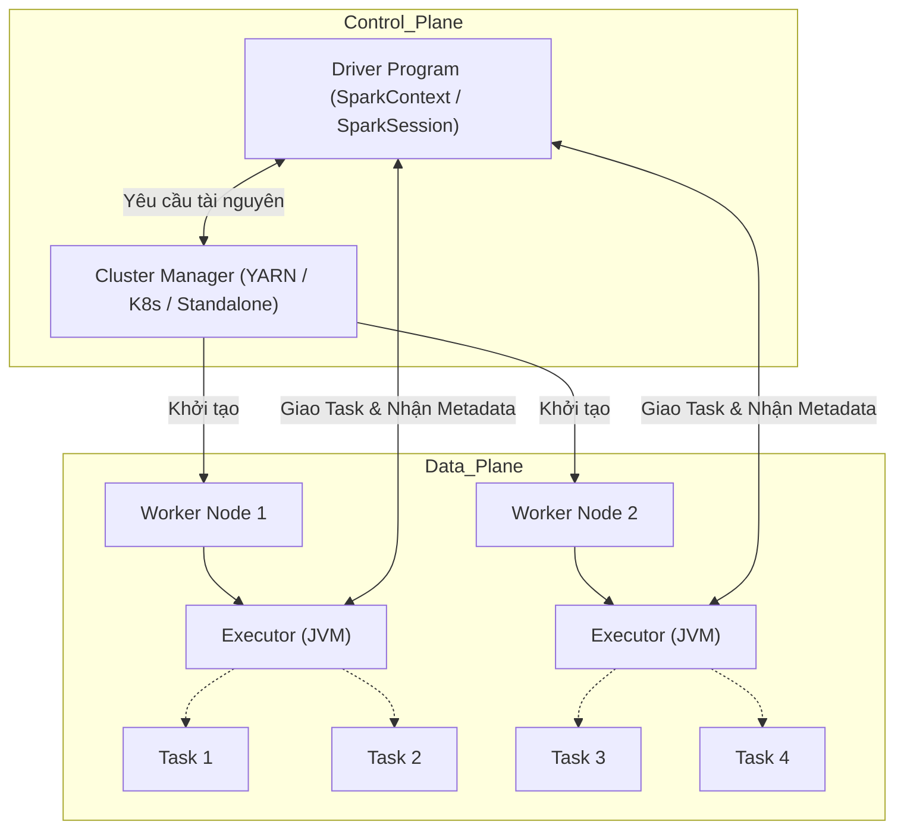

Để vận hành một hệ thống Big Data ở quy mô Petabyte, việc chỉ biết viết code PySpark hoặc Spark SQL là hoàn toàn không đủ. Kỹ sư dữ liệu (Data Engineer) cần phải thấu hiểu cách một dòng lệnh được phân rã, lập lịch và chạy song song trên hàng ngàn container vật lý. Mô hình thực thi (Execution Model) của Apache Spark chính là bộ não quyết định khả năng mở rộng (Scalability) và giới hạn chịu đựng (Fault-tolerance) của toàn bộ hệ thống.

Bài viết này sẽ mổ xẻ kiến trúc thực thi của Spark dưới lăng kính System Design, tập trung vào kiến trúc phân tán, rủi ro vận hành (OOMKilled, Spill-to-disk) và các chiến lược cấp phát tài nguyên thực chiến nhằm tối ưu hóa chi phí (FinOps).

## 1. Kiến trúc Vật lý: Master - Worker (Physical Architecture)

Kiến trúc cốt lõi của Spark tuân theo mô hình **Master-Worker**, trong đó các tiến trình chạy trên các Java Virtual Machine (JVM) hoàn toàn độc lập.



### 1.1. Driver Node (The Brain)
Driver là tiến trình trung tâm (thường là máy chủ chạy hàm `main()`), nơi chứa đối tượng `SparkSession`.
- **Nhiệm vụ:** Duy trì thông tin vòng đời của toàn bộ Application. Chuyển đổi mã nguồn thành Kế hoạch thực thi vật lý (Physical Execution Plan) thông qua *Catalyst Optimizer* và *DAG Scheduler*.
- **Systemic Trade-off:** Driver là điểm Single Point of Failure (SPOF). Nếu JVM của Driver bị tràn bộ nhớ (OOM) hoặc sập, toàn bộ các Executor đang chạy phân tán cũng sẽ bị mồ côi và bị hủy bỏ (Killed). 

### 1.2. Cluster Manager (The Negotiator)
Spark không trực tiếp quản lý máy chủ vật lý. Nó ủy quyền việc cấp phát CPU và RAM cho **Cluster Manager** (như YARN, Apache Mesos, hoặc phổ biến nhất hiện nay là Kubernetes).
Sử dụng K8s mang lại khả năng *Fine-grained Resource Allocation*, cho phép cấp phát Pod theo đúng nhu cầu tính toán, giúp tối ưu chi phí hạ tầng cực kỳ hiệu quả.

### 1.3. Executor Nodes (The Muscles)
Executors là các tiến trình Worker hoạt động song song. Chúng có 2 nhiệm vụ chính:
- **Thực thi Task:** Mỗi Executor duy trì một Thread Pool. Mỗi Thread (được cấu hình bằng `spark.executor.cores`) có thể xử lý một Task tại một thời điểm trên một phân vùng dữ liệu (Partition).
- **Lưu trữ (Block Manager):** Cache dữ liệu trên RAM hoặc Disk để phục vụ các thuật toán lặp (Iterative algorithms) hoặc phát sóng (Broadcast variables).

## 2. Giải phẫu Vòng đời Xử lý (The Anatomy of Execution Lifecycle)

Spark tuân thủ nguyên tắc **Lazy Evaluation** (Thực thi trễ). Khi gọi các Transformation (như `map`, `filter`, `join`), Spark chỉ ghi lại chuỗi thao tác này thành một Đồ thị Hướng Không Tuần hoàn (DAG - Directed Acyclic Graph). Chỉ khi một Action (`collect`, `write.parquet`, `count`) được gọi, luồng thực thi vật lý mới thực sự bùng thực thi.

Dưới nắp capo (Under the hood), Kế hoạch thực thi được phân rã theo hệ thống phân cấp khắt khe:
**Application $\rightarrow$ Job $\rightarrow$ Stage $\rightarrow$ Task**

- **Job:** Mỗi khi một Action được gọi, một Job mới được sinh ra.
- **Stage:** Là tập hợp các Task có thể chạy song song mà không cần trao đổi dữ liệu qua mạng. Một Stage bị ngắt (phải chuyển sang Stage mới) khi gặp một thao tác **Wide Dependency** (yêu cầu xáo trộn dữ liệu qua mạng - Shuffle), ví dụ như `JOIN`, `GROUP BY`, `DISTINCT`.
- **Task:** Là đơn vị thực thi nhỏ nhất. `1 Task = 1 Partition = 1 Core`. Kích thước và số lượng Task hoàn toàn quyết định bởi cách bạn cấu hình Partitions.

## 3. Rủi ro Vận hành và Đánh đổi (Systemic Trade-offs)

### 3.1. Fat Executors vs Thin Executors
Khi cấu hình Cluster, Kỹ sư dữ liệu luôn phải đau đầu chọn kích thước Executor:
- **Fat Executors (Vd: 32 Cores, 128GB RAM/Executor):**
  - *Lợi ích:* Broadcast biến lớn hiệu quả vì 32 Tasks có thể chia sẻ chung 1 bản sao In-memory.
  - *Rủi ro:* Tràn rác (Garbage Collection - GC). Thuật toán GC của Java khi dọn dẹp 128GB RAM có thể mất hàng chục giây (Stop-The-World Pause), khiến Node bị đánh dấu là Dead. Nghẽn cổ chai HDFS I/O do quá nhiều luồng (32 luồng) cùng ghi vào ổ đĩa.
- **Thin Executors (Vd: 1 Core, 2GB RAM/Executor):**
  - *Lợi ích:* Gần như không có GC Pause.
  - *Rủi ro:* Không tận dụng được In-memory Broadcast (phải copy biến ra hàng ngàn bản cho hàng ngàn JVM). Không thể xử lý các Block dữ liệu lớn (dễ OOM).

### 3.2. Hệ lụy từ `collect()` (Driver OOM)
Lỗi kinh điển nhất của Junior Engineer là chạy lệnh `df.collect()` hoặc `df.toPandas()` trên một Dataset hàng chục Gigabytes.
Lệnh này ra lệnh cho toàn bộ Executor gửi luồng dữ liệu cục bộ của chúng qua mạng (Network I/O) dồn về **một JVM Heap duy nhất** của Driver. Nếu Driver chỉ có 4GB RAM, hệ điều hành (OOM Killer) sẽ ngay lập tức "bắn bỏ" tiến trình này.
*Khắc phục:* Luôn dùng `df.write` để các Executor tự ghi trực tiếp xuống Distributed Storage (S3/GCS) song song.

## 4. Mã nguồn Thực chiến: Tối ưu Cấp phát Tài nguyên (Right-sizing)

Thực nghiệm từ Databricks và Cloudera chỉ ra một "Con số vàng" (Goldilocks Rule): **5 Cores cho mỗi Executor** là sự cân bằng hoàn hảo giữa Throughput của Thread Pool và HDFS I/O Contention, đồng thời giữ JVM Heap < 64GB để tránh GC Pauses kéo dài.

Dưới đây là một cấu hình Terraform chuẩn Enterprise cho cụm Databricks, áp dụng nguyên tắc tối ưu tài nguyên và quản lý Off-heap Memory (tránh bị Kubernetes OOMKilled):

```hcl
resource "databricks_cluster" "optimized_batch_cluster" {
  cluster_name            = "Staff_Engineer_ETL_Engine"
  spark_version           = "13.3.x-scala2.12"
  node_type_id            = "r5d.2xlarge" # 8 vCores, 64GB RAM
  
  autotuning {
    min_workers = 2
    max_workers = 20
  }
  
  spark_conf = {
    # 1. Cấu hình "Con số vàng" 5 Cores mỗi Executor
    "spark.executor.cores" = "5",
    
    # 2. Cấp phát Memory cho Executor (Tính toán dựa trên Node 64GB)
    # Giữ lại RAM cho OS, Hadoop Daemons. Cấp 32GB cho Spark Executor Heap
    "spark.executor.memory" = "32g",
    
    # 3. Memory Overhead (Off-heap) cho thư viện C++ (Parquet, NIO, PySpark)
    # Thường là 10% - 15% của executor_memory
    "spark.executor.memoryOverhead" = "4g",
    
    # 4. Tối ưu Storage / Execution Fraction
    "spark.memory.fraction" = "0.7",
    
    # 5. Bật AQE để xử lý Dynamic Stages
    "spark.sql.adaptive.enabled" = "true"
  }
}
```

**Memory Overhead là gì?** Khi triển khai trên K8s, Container có thể bị OOMKilled dù JVM Heap vẫn còn trống. Nguyên nhân do Spark sử dụng bộ nhớ ngoài Heap [Off-heap] cho các operations liên quan đến mạng (NIO), giải nén Parquet bằng C++, hoặc chạy tiến trình Python (PySpark). Nếu tổng (JVM Heap + Off-heap) vượt quá Limit của Pod K8s, tiến trình sẽ bị hệ điều hành tiêu diệt.

## 5. Nguồn Tham Khảo (References)
- [Apache Spark Official Documentation: Tuning Spark](https://spark.apache.org/docs/latest/tuning.html)
- [Databricks: How Does Spark Execute A Query?](https://databricks.com/session_na21/how-does-spark-execute-a-query)
- [AWS Big Data Blog: Best practices for successfully managing memory for Apache Spark applications on Amazon EMR](https://aws.amazon.com/blogs/big-data/best-practices-for-successfully-managing-memory-for-apache-spark-applications-on-amazon-emr/)
- Kleppmann, M. (2017). *Designing Data-Intensive Applications*. O'Reilly Media.
