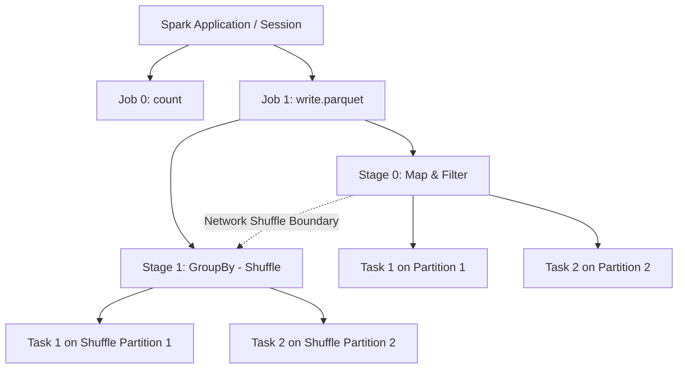

Một hệ thống phân tán không bao giờ chạy code một cách nguyên khối (monolithic) từ trên xuống dưới. Để có thể phân tán tính toán lên hàng nghìn lõi CPU (Cores), Spark sử dụng DAGScheduler để "chặt" luồng dữ liệu của bạn thành các mảnh nhỏ hơn. 

Cấu trúc phân cấp cốt lõi bao gồm: **Application -> Job -> Stage -> Task**. Việc thấu hiểu ranh giới của các cấp độ này không chỉ là lý thuyết suông, mà là kỹ năng sinh tồn (survival skill) để một Data Engineer có thể đọc vị Spark UI, chẩn đoán điểm nghẽn cổ chai (bottlenecks) và cấu hình FinOps chuẩn xác.

## 1. Kiến trúc Phân cấp Thực thi (DAG Hierarchy)



Toàn bộ quá trình chia tách này được quản lý bởi Driver thông qua hai công cụ: **DAGScheduler** (chia Job thành Stages) và **TaskScheduler** (gửi Task xuống Executor).

## 2. Mổ xẻ Chi tiết Từng Cấp độ (Deep Dive into the Tiers)

### 2.1. Application & Jobs
Một **Application** là toàn bộ vòng đời của `SparkSession`. Bên trong Application, số lượng **Job** được sinh ra tỷ lệ thuận chính xác với số lượng **Action** (`.count()`, `.write()`, `.collect()`) mà mã nguồn gọi.
- Mỗi lần gọi Action, Catalyst Optimizer đẩy kế hoạch thực thi xuống DAGScheduler để tạo ra một Job mới.
- *Trade-off*: Gọi Action vô tội vạ (như `df.count()` để in log kiểm tra trong vòng lặp) sẽ liên tục ép Spark đánh giá lại (re-evaluate) toàn bộ lineage, đốt cháy tài nguyên Compute (Compute Cost). Muốn tái sử dụng dữ liệu, bắt buộc phải dùng lệnh `.cache()` trước khi gọi nhiều Actions.

### 2.2. Stages và Ranh giới Shuffle
Bên trong một Job, các chuỗi lệnh không chạy độc lập mà bị giới hạn bởi sự phụ thuộc dữ liệu (Data Dependency).
- **Narrow Dependency**: Các hàm `map`, `filter`, `select` chỉ hoạt động trong phạm vi cục bộ của 1 Partition. DAGScheduler sẽ gộp tất cả chúng lại thành một **Stage** duy nhất (Pipelining) để chạy một mạch trên RAM, không cần chạm vào ổ đĩa.
- **Wide Dependency**: Các hàm `groupBy`, `join`, `orderBy` buộc dữ liệu phải giao thoa (Shuffle) qua mạng. Mỗi lần có Shuffle, Spark "kẻ một đường ranh giới": Kết thúc Stage cũ, bắt đầu Stage mới.

**Quy tắc vật lý**: Các Tasks trong cùng một Stage có thể chạy hoàn toàn song song không cản trở nhau. Nhưng Stage sau bắt buộc phải đợi (Block) cho đến khi TẤT CẢ các Tasks của Stage trước hoàn tất việc ghi dữ liệu ra đĩa (Shuffle Write).

### 2.3. Tasks (The Fundamental Unit of Work)
**Task** là đơn vị xử lý nhỏ nhất, chịu trách nhiệm thực thi khối mã của một Stage lên MỘT CHUNK dữ liệu cụ thể (gọi là Partition).
- **Số lượng Task = Số lượng Partition**.
- Mỗi Task tiêu thụ đúng 1 luồng CPU (Core) của Executor. Nếu bạn cấu hình `spark.sql.shuffle.partitions = 2000`, sẽ có đúng 2000 Tasks được sinh ra ở giai đoạn Shuffle.

## 3. Rủi ro Vận hành và Đánh đổi (Systemic Trade-offs & Troubleshooting)

Khi hiểu rõ sự phân rã này, kỹ sư sẽ nhận thấy những hệ lụy vật lý chết người sau:

### 3.1. Phân mảnh Dữ liệu (Tiny Partitions / Fragmentation)
Nếu đọc từ một bucket S3 chứa 100,000 file nhỏ (kích thước vài KB/file), Spark mặc định sẽ tạo ra 100,000 Partitions cho Stage đầu tiên, tương đương 100,000 Tasks.
- **Hệ lụy (Incident)**: Thời gian Driver mất để lập lịch (Scheduling Overhead) và giao tiếp với Executor còn lâu hơn thời gian CPU thực sự xử lý dữ liệu. Hệ thống lãng phí CPU, IOPS đè nặng lên S3 API gây lỗi `SlowDown` hoặc `503 Service Unavailable`.
- **Khắc phục**: 
  - Ở mức độ Storage: Dùng Z-Ordering / OPTIMIZE để nén file (Compaction).
  - Ở mức độ Code: Dùng hàm `coalesce()` để ép gộp partitions mà không kích hoạt Shuffle.

```python
# Tốt: Ép gộp 100,000 partitions thành 1000 partitions cục bộ (Narrow Dependency)
# Giảm thiểu Scheduling Overhead
optimized_df = df.coalesce(1000)

# Tồi: Dùng repartition gây ra Network Shuffle cực lớn (Wide Dependency)
# Đừng dùng repartition trừ khi muốn cân bằng lại Data Skew
bad_df = df.repartition(1000) 
```

### 3.2. Hiệu ứng Straggler Task (Nút Thắt Data Skew)
Bên trong một Stage có 200 Tasks, 199 Tasks hoàn thành trong 5 giây, nhưng Task thứ 200 nhận được một Partition khổng lồ (chứa 90% dữ liệu) và phải chạy ròng rã 2 tiếng đồng hồ.
- **Hệ lụy**: Do đặc tính Blocking giữa các Stages, Stage tiếp theo không thể bắt đầu. 99% cụm Cluster sẽ rơi vào trạng thái nhàn rỗi (Idle), tiền thuê Cloud vẫn bị trừ, trong khi Job kẹt cứng tại 1 Task duy nhất.
- **Khắc phục**: Hiện tượng này chính là Data Skew. Yêu cầu áp dụng cấu hình Adaptive Query Execution (AQE) hoặc kỹ thuật Salting (sẽ trình bày chi tiết ở bài sau).

### 3.3. JVM OOMKilled ở Cấp độ Task
Lỗi `Container killed by YARN for exceeding memory limits` không phải lỗi của toàn cụm, mà thường do một Task cụ thể nuốt quá nhiều RAM. 
- Nguyên nhân: Kích thước Partition cho Task đó lớn hơn (ví dụ 10GB) không gian trống của Executor Heap (ví dụ cấu hình 8GB).
- Xử lý vật lý: Điều chỉnh cấu hình `spark.sql.shuffle.partitions` TĂNG LÊN (ví dụ từ mặc định 200 lên 1000). Việc này đồng nghĩa với việc băm dữ liệu ra thành nhiều Partition nhỏ hơn, mỗi Task sẽ chỉ nhận 1 tải lượng dữ liệu bé hơn, vừa vặn chui lọt vào giới hạn RAM của JVM.

## 4. Nguồn Tham Khảo
- [Apache Spark Core Concepts - Official Documentation](https://spark.apache.org/docs/latest/cluster-overview.html)
- Thiết kế Hệ thống Dữ liệu Chuyên sâu (Designing Data-Intensive Applications - Martin Kleppmann)
- [Uber Engineering: Troubleshooting Spark OOM and Memory Management](https://www.uber.com/en-VN/blog/apache-spark-oom/)
- [Databricks Blog: Under the Hood of Spark Execution](https://databricks.com/blog/2015/06/22/understanding-your-spark-application-through-ui.html)
