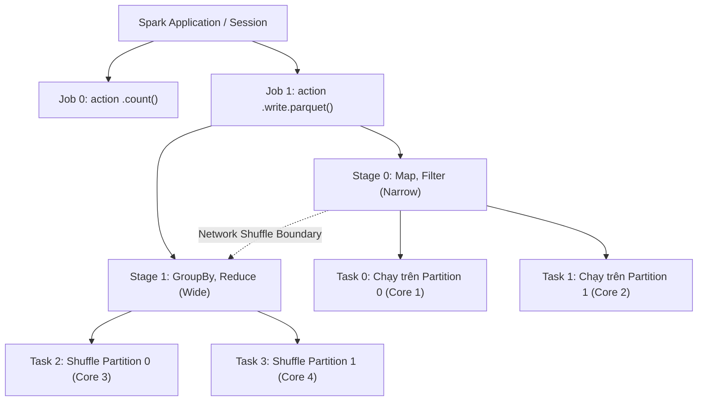

Một hệ thống phân tán không bao giờ chạy code một cách nguyên khối (monolithic) từ trên xuống dưới. Để có thể phân tán tính toán lên hàng nghìn lõi CPU (Cores), Spark sử dụng `DAGScheduler` để "chặt" luồng dữ liệu của bạn thành các mảnh nhỏ hơn. 

Cấu trúc phân cấp cốt lõi bao gồm: **Application -> Job -> Stage -> Task**. Việc thấu hiểu ranh giới của các cấp độ này không chỉ là lý thuyết suông, mà là kỹ năng sinh tồn (survival skill) để một Data Engineer có thể đọc vị Spark UI, chẩn đoán điểm nghẽn cổ chai (bottlenecks) và cấu hình FinOps chuẩn xác.

## 1. Kiến trúc Phân cấp Thực thi (Execution Hierarchy)

Bất kể bạn viết một DataFrame transformation phức tạp tới đâu, tất cả cuối cùng sẽ được Catalyst Optimizer chuyển thành Execution Plan, và sau đó được DAGScheduler băm ra thành đồ thị DAG (Directed Acyclic Graph).



Toàn bộ quá trình chia tách này được quản lý bởi Driver thông qua hai service lõi: 
- **DAGScheduler**: Nhận Logical Plan và bẻ thành các Stages vật lý.
- **TaskScheduler**: Lấy các Tasks từ một Stage và đẩy (dispatch) xuống các Executor thông qua giao thức RPC.

---

## 2. Giải phẫu Chi tiết (Deep Dive Anatomy)

### 2.1. Application & Jobs
Một **Application** bao trọn toàn bộ vòng đời của `SparkSession` từ lúc khởi tạo đến khi `.stop()`. Bên trong Application, một **Job** mới sẽ được tạo ra mỗi khi (và chỉ khi) mã nguồn gọi một **Action** (ví dụ: `.count()`, `.write()`, `.collect()`, `.show()`).

- **Cơ chế hoạt động**: Khi gặp Action, Spark lội ngược dòng DAG (lineage) để tìm mọi Transformation (biến đổi) cần thiết phục vụ cho việc sinh ra kết quả của Action đó.
- **Systemic Trade-off (Đánh đổi hệ thống)**: Gọi Action bừa bãi trong vòng lặp (như liên tục in `.show()` hay `.count()` để debug) sẽ kích hoạt lại toàn bộ đồ thị tính toán từ đầu. Điều này đốt cháy tài nguyên Compute cực độ, gây lãng phí IOPS và đội chi phí vận hành nền tảng Cloud.
- **Code thực chiến**: Nếu bạn cần tái sử dụng một DataFrame đắt đỏ cho nhiều Action khác nhau, hãy chủ động ngắt Lineage bằng thủ thuật caching dữ liệu:

```python
# Tối ưu Compute: Ngắt lineage trước khi thực hiện nhiều Action
valuable_df = spark.read.parquet("s3a://data/sales/").filter("year = 2026")
valuable_df.cache() # Hoặc persist(StorageLevel.MEMORY_AND_DISK) để tránh tràn RAM

# Job 1: Trả phí Compute 1 lần để tính DataFrame và lưu vào Cache
row_count = valuable_df.count()

# Job 2: Đọc trực tiếp từ RAM/Disk Cache, KHÔNG quét lại S3 từ đầu
valuable_df.write.mode("overwrite").parquet("s3a://data/summary/")
```

### 2.2. Stages và Ranh giới Network Shuffle
Bên trong một Job, Spark sẽ nhóm các lệnh lại thành các **Stage** để áp dụng Pipelining. Việc Pipelining giúp dữ liệu chạy một mạch trong RAM qua nhiều phép tính. Ranh giới (Boundary) chia cắt giữa hai Stage xuất hiện khi có sự kiện bắt buộc giao thoa dữ liệu qua mạng - gọi là **Network Shuffle**.

- **Narrow Dependency**: Các hàm `map`, `filter`, `withColumn` chỉ thao tác trên một bản ghi cục bộ. DAGScheduler sẽ gộp tất cả chúng thành một Stage duy nhất, chạy mượt mà trên bộ nhớ RAM của một Worker mà không cần IO mạng.
- **Wide Dependency**: Các hàm `groupBy`, `join`, `orderBy`, `distinct` buộc dữ liệu từ các Node khác nhau phải gửi chéo qua mạng cho nhau. Kết thúc Stage 0, dữ liệu sẽ phải tràn xuống đĩa cứng (Shuffle Write) để đảm bảo Fault Tolerance. Sau đó, Stage 1 mới có thể kéo dữ liệu đó về (Shuffle Read).

**Quy tắc vật lý (Barrier Execution)**: Các Task trong một Stage chạy song song hoàn toàn. Tuy nhiên, Stage N+1 bắt buộc phải chờ (Block) cho đến khi toàn bộ Tasks của Stage N kết thúc. Điều này đẻ ra hiệu ứng "Chờ đợi dây chuyền" nghiêm trọng nếu có một Task chạy chậm.

### 2.3. Tasks (The Atomic Unit of Work)
**Task** là đơn vị xử lý vật lý nhỏ nhất. Một Task thực chất là một luồng (Thread) CPU được giao nhiệm vụ thực thi cùng một khối mã (code block) của Stage lên một **Partition** dữ liệu cụ thể.

- **Định lý cơ bản**: `Số lượng Task = Số lượng Partition của Stage đó`.
- Mỗi Task tiêu thụ đúng 1 luồng CPU ảo (vCore) của Executor. Nếu một Stage có 2000 partitions, sẽ có 2000 Tasks được sinh ra để xử lý song song, bất kể bạn đang cấu hình cấp phát bao nhiêu Executor.

---

## 3. Rủi ro Vận hành và Đánh đổi Hệ thống (Systemic Trade-offs & Troubleshooting)

Khi phân tích qua lăng kính phân cấp Job-Stage-Task, kỹ sư Data Engineer sẽ dễ dàng chẩn đoán các sự cố từ Apache YARN hoặc Kubernetes OOM (Out Of Memory) đến chậm trễ trên Cluster.

### 3.1. Phân mảnh Dữ liệu (Tiny Partitions / Fragmentation)
**Tình huống (Incident)**: Data Engineer cấu hình Spark đọc từ một Data Lake (bucket S3) chứa 100,000 files JSON siêu nhỏ (kích thước vài KB/file).
- **Hệ lụy vật lý**: Spark tuân thủ quy tắc 1 file = 1 block = 1 partition, dẫn tới tạo ra 100,000 Partitions -> sinh ra tương ứng 100,000 Tasks trong Stage đầu tiên. Thời gian (Overhead) để Driver cấp phát và lập lịch (Task Scheduling) qua RPC cho 100,000 tasks này lớn hơn nhiều lần thời gian mà CPU thực sự xử lý payload vài KB. Hệ thống rơi vào trạng thái "Busy waiting", gọi bão API tới S3 và có nguy cơ bị `HTTP 503 SlowDown`.
- **Cách khắc phục thực chiến**: Dùng hàm `coalesce` để gom Task ở cấp độ cục bộ (Narrow Dependency) nhằm giảm tải Scheduling. Tránh dùng `repartition` vì nó sẽ gây Shuffle toàn mạng.

```python
# Tốt: Gom 100,000 partitions thành 1,000 partitions cục bộ mà KHÔNG gây Shuffle
optimized_df = df.coalesce(1000)

# Tồi: Dùng repartition ở đây sẽ sinh thêm Stage mới và xáo trộn 100,000 partitions qua mạng
bad_df = df.repartition(1000) 
```

### 3.2. Hiệu ứng Straggler Task (Nút Thắt Cổ Chai Data Skew)
**Tình huống**: Bên trong 1 Stage có 200 Tasks (tương ứng 200 partitions Shuffle mặc định). Quá trình xử lý cho thấy 199 Tasks chạy xong trong 10 giây. Tuy nhiên, Task cuối cùng (ví dụ: Task xử lý dữ liệu của user khách VIP) nhận phải 95% lượng dữ liệu của toàn tập. Nó phải cặm cụi tính toán suốt 2 tiếng.
- **Hệ lụy vật lý**: Do cơ chế Blocking vật lý tại ranh giới Stage, Stage N+1 không thể bắt đầu. 99% tài nguyên Cluster (Executors) rảnh rỗi nhưng không được giải phóng. Tiền thuê máy chủ EC2 vẫn tính theo giờ, kéo theo lãng phí FinOps khổng lồ.
- **Cách khắc phục bằng Cấu hình**: Nếu sử dụng Spark 3.x, hãy luôn bật tính năng Adaptive Query Execution (AQE) để hệ thống tự động chẻ nhỏ (split) Skewed Partition ngay trong Runtime.

```bash
# Cấu hình spark-submit tối ưu hóa chống Data Skew bằng AQE
spark-submit \
  --class com.example.AnalyticsJob \
  --master yarn \
  --conf "spark.sql.adaptive.enabled=true" \
  --conf "spark.sql.adaptive.skewJoin.enabled=true" \
  --conf "spark.sql.adaptive.coalescePartitions.enabled=true" \
  s3a://data-ops/jars/analytics-job.jar
```

### 3.3. Lỗi JVM OOMKilled ở Cấp độ Task
Lỗi OOM của Driver thường do Developer lỡ tay gõ `.collect()` trên Dataset trăm GB. Nhưng lỗi `Container killed by YARN for exceeding memory limits` ở Executor thì liên quan mật thiết tới cấu trúc Tasks.
- **Nguyên nhân**: Dữ liệu bên trong 1 Partition bành trướng quá lớn, vượt xa cấu hình `spark.executor.memory`. Ví dụ: Cấp 8GB RAM cho Executor, nhưng Partition được đẩy về 1 Task lại to lên tới 15GB. Task Thread sẽ nhồi dữ liệu vào JVM Heap cho đến khi vượt ngưỡng và bị Container Manager (YARN/K8s) bắn hạ không thương tiếc.
- **Xử lý vật lý (Tuning)**: Đừng vội Scale-up RAM máy chủ. Hãy áp dụng tư duy "Chia để trị" - TĂNG số lượng Shuffle Partitions để giảm lượng tải cho mỗi Task.

```python
# Mặc định, spark.sql.shuffle.partitions chỉ là 200. Con số này QUÁ NHỎ cho Big Data.
# Tăng lên 2000 giúp chia dữ liệu cho 2000 Tasks. 
# Mỗi Task sẽ gánh payload bé đi 10 lần, dễ dàng chui lọt qua giới hạn JVM Heap.
spark.conf.set("spark.sql.shuffle.partitions", "2000")
```

Bằng cách hiểu rõ đường đi của dữ liệu qua các Task và Stage, bạn hoàn toàn làm chủ được mức độ Parallelism và làm dịu đi áp lực vật lý đặt lên hạ tầng Cluster của mình.

## 4. Nguồn Tham Khảo
- [Apache Spark Core Concepts - Official Documentation](https://spark.apache.org/docs/latest/cluster-overview.html)
- [Databricks Blog: Understanding your Spark application through UI](https://databricks.com/docs/en/spark/ui)
- Designing Data-Intensive Applications (Martin Kleppmann) - Phân tích về Batch Processing và MapReduce.
- [Uber Engineering: Troubleshooting Spark OOM and Memory Management](https://www.uber.com/en-VN/blog/apache-spark-oom/)
