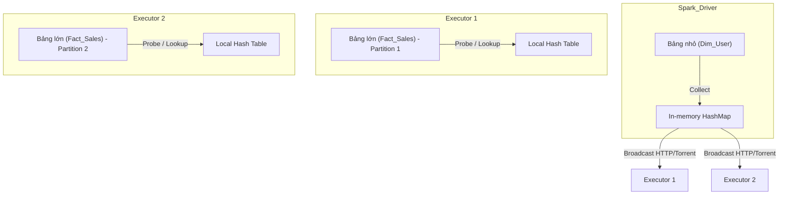

Trong các hệ thống phân tán khổng lồ, phép Join không chỉ đơn thuần là việc ghép nối hai Dataset (như trong SQL truyền thống). Dưới góc nhìn của một Data Engineer, Join là một bài toán nghiệt ngã về sự đánh đổi (Systemic Trade-off) giữa **Network I/O** (xáo trộn dữ liệu qua mạng - Shuffle) và **Memory Overhead** (tiêu thụ RAM tại từng node). 

Việc lựa chọn sai thuật toán Join vật lý (Physical Join Strategy) chính là nguyên nhân hàng đầu gây ra các thảm họa vận hành trên Production: từ lỗi `OutOfMemoryError` (OOMKilled) khiến Job sập ngay lập tức, cho đến hiện tượng Data Skew khiến một Task kẹt lại hàng giờ đồng hồ (Thrashing / Long-tail execution) và đốt sạch ngân sách Cloud Compute của bạn.

## 1. Kiến trúc Thực thi Vật lý (Physical Execution Strategies)

Khi bạn viết một câu lệnh `df1.join(df2)`, Catalyst Optimizer sẽ không chạy nó ngay. Nó trải qua nhiều pha biên dịch từ Logical Plan xuống Physical Plan. Tại pha Physical Plan, Catalyst sẽ chọn 1 trong 3 chiến lược cốt lõi dựa trên kích thước ước tính (Statistics) của dữ liệu.

### 1.1. Broadcast Hash Join (BHJ)

BHJ, thường được gọi là Map-Side Join, là chiến lược "viên đạn bạc" (silver bullet) bởi vì nó loại bỏ hoàn toàn giai đoạn Network Shuffle - thủ phạm gây nghẽn mạng lớn nhất trong cụm.

**Cơ chế hoạt động:**
1. **Collect:** Spark Driver chủ động kéo (collect) toàn bộ dữ liệu của bảng nhỏ về không gian bộ nhớ của nó.
2. **Broadcast:** Driver phát sóng bảng nhỏ này thông qua giao thức tương tự BitTorrent tới bộ nhớ của *tất cả* các Executor trong Cluster.
3. **Hash & Probe:** Tại mỗi Executor, Spark xây dựng một In-memory Hash Table từ bảng nhỏ. Sau đó, nó quét bảng lớn theo cơ chế tuyến tính $O(N)$ để tra cứu khóa (Lookup).



**Systemic Trade-offs:**
- **Gain:** Bỏ qua được giai đoạn Shuffle tốn kém (Zero Shuffle). Thuật toán này miễn nhiễm hoàn toàn với Data Skew ở bảng lớn, vì dữ liệu bảng lớn không hề bị di chuyển.
- **Pain:** Tiêu tốn gấp $N$ lần bộ nhớ RAM (với $N$ là số lượng Executor). Rủi ro OOM trên Driver là rất lớn nếu bảng nhỏ vượt quá dung lượng khả dụng của `spark.driver.memory`. Đặc biệt, Spark có hard-limit ở mức 8GB cho Broadcast block.

**Mã nguồn Thực chiến:**
```python
from pyspark.sql.functions import broadcast

# Tăng ngưỡng tự động chọn BHJ lên 100MB (Mặc định là 10MB)
spark.conf.set("spark.sql.autoBroadcastJoinThreshold", 104857600)

df_fact_sales = spark.read.parquet("s3a://data/sales/")
df_dim_users = spark.read.parquet("s3a://data/users/")

# Ép Catalyst sử dụng Broadcast Join thông qua Hint
df_joined = df_fact_sales.join(broadcast(df_dim_users), on="user_id", how="inner")
```

### 1.2. Sort Merge Join (SMJ)

Nếu BHJ là viên đạn bạc, thì SMJ chính là "trụ cột" (workhorse) gánh vác các truy vấn nối hai bảng khổng lồ (vài Terabyte đến Petabyte) - những dữ liệu không thể nào nhét vừa vào bộ nhớ.

**Cơ chế hoạt động:**
1. **Shuffle Phase:** Xáo trộn toàn bộ dữ liệu của cả 2 bảng qua mạng. Spark dùng thuật toán Hash partitioning đảm bảo các dòng có cùng Join Key của 2 bảng sẽ hội tụ về cùng một Partition trên cùng một Executor.
2. **Sort Phase:** Tại mỗi Executor, Spark tiến hành sắp xếp (External Sort) dữ liệu cục bộ dựa trên Join Key. Nếu dữ liệu lớn hơn RAM, nó sẽ tràn xuống đĩa (Spill-to-disk).
3. **Merge Phase:** Hợp nhất (Merge) 2 Partition đã được sắp xếp. Hai con trỏ chạy tuần tự từ trên xuống dưới, quét 1 lần duy nhất nên bộ nhớ RAM cần thiết ở pha này gần như bằng không.

**Systemic Trade-offs:**
- **Gain:** Khả năng mở rộng (Scalability) vô hạn. Nhờ cơ chế Spill-to-disk ở pha Sort, SMJ không bao giờ bị OOM vì lý do vượt quá kích thước dữ liệu tổng (trừ khi gặp Data Skew).
- **Pain:** Network I/O cực lớn ở pha Shuffle. Đồng thời, quá trình Sort liên tục gây tải nặng lên CPU (CPU Intensive) và Disk I/O.

### 1.3. Shuffle Hash Join (SHJ)

SHJ là sự kết hợp giữa hai thuật toán trên. Nó vẫn Shuffle dữ liệu cả hai bảng như SMJ. Nhưng ở pha xử lý cục bộ, thay vì Sort, nó dựng một Hash Table từ phân vùng của bảng nhỏ hơn.
**Trade-off:** Nhanh hơn SMJ vì bỏ qua được bước Sort đắt đỏ, nhưng rủi ro OOM cao hơn rất nhiều. Nếu thuật toán Hash chia Partition không đều (Skew), một Hash Table cục bộ có thể phình to làm nổ tung JVM của Executor đó. SHJ hiện nay rất hiếm khi được Catalyst ưu tiên.

## 2. Rủi ro Vận hành và Troubleshooting

Trong môi trường Enterprise, các hệ thống sập không phải vì code sai logic, mà vì dữ liệu dị thường.

### 2.1. Cartesian Explosion (Bùng nổ tổ hợp)

Hiện tượng này xảy ra khi bạn Join thiếu khóa, hoặc sử dụng bất đẳng thức (Non-Equi Joins) như `>`, `<`.
Spark không thể dùng Hash cho dấu `>`, do đó nó Fallback về thuật toán thô sơ nhất: `Broadcast Nested Loop Join` ($O(N \times M)$) hoặc `Cartesian Product Join`. Nếu bảng 1 có 1 triệu dòng, bảng 2 có 1 triệu dòng, Spark sẽ phải so sánh 1 ngàn tỷ cặp. Cluster của bạn sẽ treo vĩnh viễn.

**Khắc phục:**
Luôn bật chốt chặn an toàn trong cấu hình của Spark:
```python
# Spark sẽ throw Exception ngay lập tức nếu phát hiện Cross Join vô ý
spark.conf.set("spark.sql.crossJoin.enabled", "false")
```

### 2.2. OOMKilled tại Driver do BHJ

Một kỹ sư cố gắng Broadcast một bảng 5GB. Executor của họ có 16GB RAM, tưởng chừng an toàn. Nhưng Driver chỉ được cấp 4GB RAM. Khi Driver gọi `collect()` để gom bảng 5GB về trước khi phát sóng, Driver nổ tung (OOMKilled), kéo theo sự sụp đổ của toàn bộ Application.

**Khắc phục:** Tuyệt đối không dùng `broadcast()` hint cho các bảng lớn hơn 100MB. Nếu bắt buộc, hãy tăng `spark.driver.memory` lên tương xứng, đồng thời nới lỏng `spark.sql.broadcastTimeout` vì việc truyền 5GB qua mạng mất rất nhiều thời gian.

### 2.3. Data Skew ở Sort Merge Join

Ví dụ: Bạn Join bảng `events` với bảng `users`. Nhưng do lỗi Tracking, 90% dòng `events` có `user_id = "UNKNOWN"`. 
Ở pha Shuffle của SMJ, toàn bộ 90% dữ liệu này (ví dụ 500GB) sẽ bị Hash và dồn vào một Executor duy nhất. Executor này không đủ RAM, kích hoạt Spill-to-disk, chạy vật vã 6 tiếng đồng hồ trong khi 199 Executors còn lại đã xong việc và ngồi chơi.

**Khắc phục:** Dùng cơ chế Salting (Thêm nhiễu) hoặc sử dụng tính năng AQE.

## 3. Kiến trúc Động: Kỷ nguyên AQE (Adaptive Query Execution)

Ra mắt từ Spark 3.0, AQE (Adaptive Query Execution) thay đổi hoàn toàn luật chơi. Thay vì lập một Physical Plan cứng nhắc từ ban đầu, AQE sử dụng Runtime Statistics (thu thập sau khi hoàn thành các Stage Shuffle) để điều chỉnh Plan ngay trên đường chạy.

Đây là 2 tính năng cứu rỗi cuộc đời Data Engineer liên quan tới Join:

1. **Dynamically Switching Join Strategies (Demote to BHJ):** 
   Giả sử bảng `Users` có 10GB (Spark chọn Sort Merge Join). Nhưng query của bạn có câu `WHERE status = 'ACTIVE'`. Sau khi Filter và Shuffle, dữ liệu thực tế chỉ còn 5MB. Ở thời điểm Runtime, AQE nhận ra bảng này giờ đã quá nhỏ, nó lập tức gạch bỏ SMJ và chuyển hướng (Switch) sang Broadcast Hash Join, tiết kiệm hàng giờ chạy máy.

2. **Dynamically Optimizing Skew Joins:** 
   AQE tự động phát hiện một Partition phình to đột biến sau Shuffle. Nó sẽ tự động cắt đôi (Split) partition bị Skew đó ra thành N phần nhỏ, và nhân bản (Replicate) dữ liệu tương ứng ở bảng bên kia để cho N Task cùng xử lý. Không cần code Salting phức tạp nữa.

**Mã nguồn Thực chiến: Bật Giáp AQE trong Databricks / EMR**
```hcl
# Bật AQE và tính năng tối ưu Join (Cấu hình này có thể đưa vào Terraform / spark-defaults.conf)
spark.conf.set("spark.sql.adaptive.enabled", "true")

# Cho phép chuyển SMJ sang BHJ tại Runtime
spark.conf.set("spark.sql.adaptive.localShuffleReader.enabled", "true")

# Kích hoạt chống Skew tự động
spark.conf.set("spark.sql.adaptive.skewJoin.enabled", "true")
# Định nghĩa thế nào là Skew: Lớn gấp 5 lần trung vị VÀ lớn hơn 256MB
spark.conf.set("spark.sql.adaptive.skewJoin.skewedPartitionFactor", "5")
spark.conf.set("spark.sql.adaptive.skewJoin.skewedPartitionThresholdInBytes", "256m")
```

## 4. Nguồn Tham Khảo [References]
- [Databricks: Adaptive Query Execution - Speeding Up Spark SQL at Runtime][https://www.databricks.com/blog/2020/05/29/adaptive-query-execution-speeding-up-spark-sql-at-runtime.html]
- [Databricks Documentation: Optimize Skew Join][https://docs.databricks.com/en/optimizations/skew-join.html]
- Kleppmann, M. (2017). *Designing Data-Intensive Applications*. O'Reilly Media.
- [AWS Big Data Blog: Best practices for memory management in Apache Spark](https://aws.amazon.com/blogs/big-data/optimize-memory-management-in-apache-spark-to-avoid-out-of-memory-issues/]
