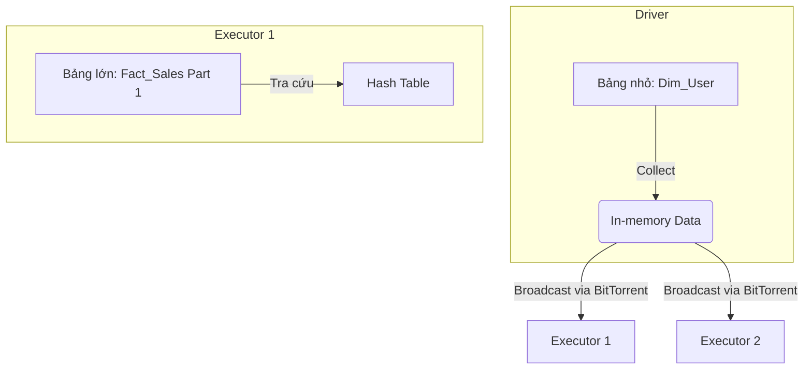

Trong hệ thống xử lý phân tán, phép Join không chỉ là ghép nối hai Dataset; nó là bài toán đánh đổi giữa Network I/O (xáo trộn dữ liệu qua mạng - Shuffle) và Memory Overhead (tiêu thụ RAM tại từng node). Quyết định sai thuật toán Join vật lý (Physical Join) là nguyên nhân hàng đầu gây ra các thảm họa vận hành như `OutOfMemoryError` (OOMKilled) hay Data Skew kéo dài hàng giờ đồng hồ.

## 1. Kiến trúc Thực thi Vật lý (Physical Execution)

Khi Catalyst Optimizer biên dịch Logical Plan thành Physical Plan, nó lựa chọn 1 trong 3 chiến lược cốt lõi dưới đây dựa trên số liệu thống kê (statistics) của DataFrame.

### 1.1. Broadcast Hash Join (BHJ)

BHJ, hay Map-Side Join, là chiến lược "viên đạn bạc" (silver bullet) loại bỏ hoàn toàn Network Shuffle. 

**Cơ chế hoạt động:**
1. Driver kéo toàn bộ dữ liệu của bảng nhỏ về bộ nhớ trung tâm.
2. Driver phát sóng (Broadcast) bảng nhỏ này tới bộ nhớ của *tất cả* các Executor.
3. Mỗi Executor xây dựng một In-memory Hash Table từ bảng nhỏ, sau đó quét bảng lớn theo tuyến tính (O(N)) để tra cứu khóa (Lookup).



**Systemic Trade-offs:**
- **Gain:** Bỏ qua được giai đoạn Shuffle tốn kém (Zero Shuffle), miễn nhiễm với Data Skew.
- **Pain:** Tiêu tốn gấp N lần bộ nhớ RAM (N là số lượng Executor). Rủi ro OOM trên Driver nếu `df.collect()` quá giới hạn `spark.driver.memory`.

**Code Thực chiến:**
```python
# Ép Catalyst dùng Broadcast Join
from pyspark.sql.functions import broadcast

spark.conf.set("spark.sql.autoBroadcastJoinThreshold", 100 * 1024 * 1024) # 100MB

# Driver cần RAM đủ lớn để buffer bảng nhỏ
df_fact.join(broadcast(df_dim), on="user_id", how="inner")
```

### 1.2. Sort Merge Join (SMJ)

SMJ là "trụ cột" (workhorse) cho các truy vấn nối hai bảng khổng lồ (TB/PB scale) không thể nhét vừa vào bộ nhớ.

**Cơ chế hoạt động:**
1. **Shuffle:** Xáo trộn dữ liệu cả 2 bảng qua mạng sao cho các dòng có cùng Join Key hội tụ về cùng một Executor.
2. **Sort:** Sắp xếp External-Sort từng Partition dựa trên Join Key.
3. **Merge:** Hợp nhất (Merge) tuyến tính 2 Partition đã được sắp xếp. Hai con trỏ chạy tuần tự nên bộ nhớ cần thiết cực thấp.

**Systemic Trade-offs:**
- **Gain:** Xử lý lượng dữ liệu vô hạn (vượt quá dung lượng RAM) nhờ cơ chế Spill-to-disk trong pha Sort.
- **Pain:** Network I/O khổng lồ ở pha Shuffle và CPU Intensive ở pha Sort. Dễ gặp cổ chai khi cụm mạng băng thông thấp.

### 1.3. Shuffle Hash Join (SHJ)

SHJ từng là giải pháp thay thế nếu SMJ quá nặng, nhưng nay ít dùng hơn. Nó vẫn Shuffle dữ liệu như SMJ, nhưng thay vì Sort, nó dựng một Hash Table cục bộ từ bảng nhỏ hơn tại mỗi Partition.
- **Rủi ro vận hành:** Nếu Data Skew xảy ra, Hash Table ở một Partition sẽ phình to và nổ JVM OOM.

---

## 2. Rủi ro Vận hành: Sự cố và Khắc phục (Troubleshooting)

### 2.1. Cartesian Explosion (Bùng nổ tổ hợp)
Xảy ra khi bạn thiếu điều kiện Join, hoặc sử dụng bất đẳng thức (Non-Equi Joins) như `>`, `<`.
Spark sẽ Fallback về `Broadcast Nested Loop Join` (O(N*M)) hoặc `Cartesian Product Join`.
**Khắc phục:** Tuyệt đối tránh Cross Join vô ý, bắt buộc phải filter dữ liệu trước hoặc kích hoạt chốt chặn an toàn:
```python
# Spark mặc định chặn Cross Join để tránh treo Cluster
spark.conf.set("spark.sql.crossJoin.enabled", "false")
```

### 2.2. Data Skew & Consumer Lag ở Sort Merge Join
Trong SMJ, nếu một Join Key (ví dụ `user_id = 'NULL'`) chiếm 90% dữ liệu, toàn bộ 90% này đổ về một Core duy nhất gây ra hiện tượng *Long-tail execution* (1 task chạy mãi không xong).
**Khắc phục:** Sử dụng kỹ thuật Salting (Thêm nhiễu) hoặc sử dụng tính năng AQE của Spark 3.

---

## 3. Kiến trúc Động (Adaptive Query Execution - AQE)

Bắt đầu từ Spark 3.0, AQE thay đổi luật chơi bằng cách lập kế hoạch thực thi động tại thời gian chạy (Runtime Optimization), dựa trên Metric thực tế ở cuối mỗi Map Stage.


Các chiến lược AQE hỗ trợ trực tiếp cho Joins:
1. **Dynamically Switching Join Strategies:** Nếu sau khi `Filter`, một bảng từ 200MB giảm còn 8MB, AQE chặn SMJ lại và chuyển sang Broadcast Hash Join ngay trên đường chạy.
2. **Dynamically Optimizing Skew Joins:** AQE phát hiện một Partition phình to đột biến, nó tự động cắt đôi (split) partition đó và nhân bản (replicate) dữ liệu tương ứng bên bảng còn lại để chạy song song nhiều task.

```python
# Kích hoạt giáp bảo vệ AQE cho hệ thống Production
spark.conf.set("spark.sql.adaptive.enabled", "true")
spark.conf.set("spark.sql.adaptive.skewJoin.enabled", "true")
spark.conf.set("spark.sql.adaptive.skewJoin.skewedPartitionFactor", "5")
```

## 4. Nguồn Tham Khảo (References)
- [Databricks: Adaptive Query Execution Speeding Up Spark SQL at Runtime](https://databricks.com/blog/2020/05/29/adaptive-query-execution-speeding-up-spark-sql-at-runtime.html)
- Designing Data-Intensive Applications, Martin Kleppmann (O'Reilly).
- [Uber Engineering: Troubleshooting Spark OOM](https://eng.uber.com/)
