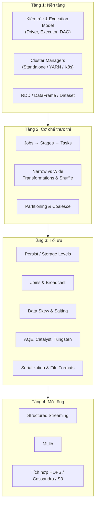

Spark là chủ đề có nhiều bài viết nhất trong site này — nhưng đọc rời rạc thì khó thấy bức tranh chung. Bài này làm **trục kiến thức**: sắp mọi chủ đề thành lộ trình có thứ tự, trả lời gọn từng câu hỏi phỏng vấn kinh điển, và trỏ đến bài phân tích sâu tương ứng. Đọc xong trục này, bạn biết mình còn thiếu mảnh nào.

## 1. Bản đồ tổng thể



## 2. Lộ trình đọc theo thứ tự

| # | Chủ đề | Bài trong site |
|---|---|---|
| 1 | Spark là gì, kiến trúc tổng quan | [Apache Spark](/concepts/4-compute-engines-batch/apache-spark/) |
| 2 | Driver/Executor, lazy evaluation, DAG | [Spark Execution Model](/concepts/4-compute-engines-batch/spark-execution-model/) |
| 3 | Chạy ở đâu: Standalone, YARN, K8s, deploy mode | [Spark Cluster Managers](/concepts/4-compute-engines-batch/spark-cluster-managers/) |
| 4 | Ba tầng API + transformation/action cơ bản | [RDD vs DataFrame vs Dataset](/concepts/4-compute-engines-batch/rdd-dataframe-dataset/) |
| 5 | Job/Stage/Task, đọc Spark UI | [Spark Jobs, Stages, Tasks](/concepts/4-compute-engines-batch/spark-jobs-stages-tasks/) |
| 6 | Shuffle — thao tác đắt nhất | [Shuffle](/concepts/4-compute-engines-batch/shuffle/) |
| 7 | Partition: sizing, repartition vs coalesce | [Spark Partition](/concepts/4-compute-engines-batch/spark-partition/) |
| 8 | Cache/persist và storage levels | [Persist & Storage Levels](/concepts/4-compute-engines-batch/spark-persist-storage-levels/) |
| 9 | Chiến lược join, broadcast join | [Spark Joins](/concepts/4-compute-engines-batch/spark-joins/) |
| 10 | Broadcast variables, accumulators, Kryo, định dạng file | [Broadcast & Serialization](/concepts/4-compute-engines-batch/spark-broadcast-serialization/) |
| 11 | Data skew: nhận diện và chữa | [Data Skew](/concepts/4-compute-engines-batch/data-skew/) + [Salting](/concepts/4-compute-engines-batch/spark-data-skew-salting/) |
| 12 | Bộ ba tối ưu tự động | [Catalyst](/concepts/4-compute-engines-batch/spark-catalyst-optimizer/) + [Tungsten](/concepts/4-compute-engines-batch/spark-tungsten-engine/) + [AQE](/concepts/4-compute-engines-batch/spark-aqe-adaptive-query/) |
| 13 | Sự cố bộ nhớ | [Troubleshooting OOM](/concepts/4-compute-engines-batch/troubleshooting-spark-oom/) + [Spill to Disk](/concepts/4-compute-engines-batch/spark-spill-to-disk/) |
| 14 | SQL trên Spark | [Spark SQL](/concepts/4-compute-engines-batch/spark-sql/) |
| 15 | Streaming | [Streaming Processing](/concepts/5-stream-processing-realtime/streaming-processing/), [Watermark](/concepts/5-stream-processing-realtime/watermark/), [Exactly-once](/concepts/5-stream-processing-realtime/exactly-once-semantics/) |
| 16 | Luyện phỏng vấn tổng hợp | [Spark Optimization Interview](/interview/spark-optimization-interview/) |

## 3. Trả lời nhanh các câu hỏi kinh điển

**Narrow vs wide transformation khác nhau thế nào?** Narrow: mỗi partition đầu ra chỉ cần dữ liệu từ *một* partition đầu vào (`filter`, `map`, `select`, `union`) — chạy nối tiếp trong cùng stage, không tốn mạng. Wide: partition đầu ra cần dữ liệu từ *nhiều* partition đầu vào (`groupBy`, `join`, `distinct`, `orderBy`, `repartition`) — buộc [shuffle](/concepts/4-compute-engines-batch/shuffle/): ghi đĩa, truyền mạng, đọc lại, và tạo ranh giới stage mới. Kỹ năng tối ưu Spark, gói gọn, là nghệ thuật giảm số lượng và kích thước wide transformation.

**Persist dữ liệu thế nào, có những storage level nào?** `cache()`/`persist(level)` giữ kết quả sau action đầu tiên để các action sau khỏi tính lại. Các level: `MEMORY_ONLY`, `MEMORY_AND_DISK` (mặc định DataFrame), `MEMORY_ONLY_SER`, `MEMORY_AND_DISK_SER`, `DISK_ONLY`, biến thể `_2` (replica). Quy tắc: chỉ cache thứ dùng ≥2 lần và đắt để tính lại, cache tại điểm hẹp nhất của pipeline, luôn `unpersist()` — chi tiết và bảng so sánh đầy đủ trong [bài persist](/concepts/4-compute-engines-batch/spark-persist-storage-levels/).

**Xử lý data skew thế nào?** Nhận diện qua Spark UI (max task duration >> median trong cùng stage). Chữa theo thứ tự chi phí: bật [AQE](/concepts/4-compute-engines-batch/spark-aqe-adaptive-query/) (`spark.sql.adaptive.skewJoin.enabled=true` — Spark 3 tự chẻ partition lệch); [broadcast join](/concepts/4-compute-engines-batch/spark-joins/) để né shuffle bảng lớn; tách riêng hot key xử lý riêng; cuối cùng mới đến [salting](/concepts/4-compute-engines-batch/spark-data-skew-salting/) — thêm hậu tố ngẫu nhiên vào key để rải đều, đổi lấy code phức tạp hơn.

**Tối ưu bằng partitioning và coalescing?** `repartition(n)` shuffle toàn bộ để chia đều — dùng khi cần *tăng* song song hoặc partition theo cột; `coalesce(n)` gộp partition *không shuffle* — dùng khi *giảm* số file đầu ra. Đích nhắm: partition ~128 MB, tránh cả nghìn file bé lẫn vài partition khổng lồ. Ghi ra lake thì `partitionBy("dt")` theo cột lọc phổ biến. Chi tiết trong [Spark Partition](/concepts/4-compute-engines-batch/spark-partition/).

**Broadcast variable là gì?** Biến read-only gửi *một lần cho mỗi executor* thay vì kèm theo từng task — nền tảng của broadcast join. Xem [bài broadcast](/concepts/4-compute-engines-batch/spark-broadcast-serialization/).

**Spark tương tác với định dạng serialize nào?** Ở tầng file: Parquet/ORC (cột — mặc định cho analytics nhờ pruning + pushdown), Avro (dòng, schema evolution tốt), JSON/CSV (nguồn thô, nên khai schema tay). Ở tầng runtime: Kryo nhanh gọn hơn Java serializer cho RDD/closure; DataFrame dùng Tungsten binary riêng. Xem [bài serialization](/concepts/4-compute-engines-batch/spark-broadcast-serialization/).

## 4. Spark Structured Streaming trong xử lý realtime

Mô hình của Spark: **stream = bảng không có đáy**, query streaming là query batch chạy lặp trên phần dữ liệu mới (micro-batch, độ trễ ~trăm ms đến giây). Cùng một API DataFrame:

```python
events = (spark.readStream.format("kafka")
    .option("kafka.bootstrap.servers", "broker:9092")
    .option("subscribe", "orders").load())

agg = (events.selectExpr("CAST(value AS STRING) AS json")
    .select(F.from_json("json", schema).alias("e")).select("e.*")
    .withWatermark("event_time", "10 minutes")            # chấp nhận trễ 10 phút
    .groupBy(F.window("event_time", "5 minutes"), "country")
    .agg(F.sum("amount").alias("revenue")))

(agg.writeStream.outputMode("update")
    .option("checkpointLocation", "s3a://chk/orders-agg/") # bắt buộc cho recovery
    .format("delta").start("s3a://gold/revenue_5m/"))
```

Ba khái niệm quyết định độ đúng của kết quả: [event-time vs processing-time](/concepts/5-stream-processing-realtime/event-time-processing-time/), [watermark](/concepts/5-stream-processing-realtime/watermark/) (chờ dữ liệu trễ bao lâu trước khi chốt cửa sổ), và checkpoint để đạt [exactly-once](/concepts/5-stream-processing-realtime/exactly-once-semantics/) với sink hỗ trợ idempotent/transactional. Khi nào chọn Spark Streaming thay vì Flink: team đã dùng Spark, chấp nhận micro-batch, cần tích hợp lakehouse chặt; Flink thắng ở độ trễ thấp thật sự và state phức tạp.

## 5. Spark cho Machine Learning (MLlib)

Giá trị của MLlib không nằm ở thuật toán tân tiến nhất (deep learning thì dùng framework chuyên dụng) mà ở chỗ **train trên dữ liệu không vừa một máy** và **cùng một pipeline chạy từ feature engineering đến scoring**:

```python
from pyspark.ml import Pipeline
from pyspark.ml.feature import StringIndexer, VectorAssembler
from pyspark.ml.classification import GBTClassifier

pipeline = Pipeline(stages=[
    StringIndexer(inputCol="country", outputCol="country_idx"),
    VectorAssembler(inputCols=["amount", "country_idx", "n_orders"], outputCol="features"),
    GBTClassifier(labelCol="churned", featuresCol="features"),
])
model = pipeline.fit(train_df)          # train phân tán
model.write().overwrite().save("s3a://models/churn-gbt/")
scored = model.transform(new_df)        # batch scoring hàng tỷ dòng
```

Điểm kiến trúc đáng nhớ: `Pipeline` serialize **cả bước tiền xử lý lẫn model** thành một artifact — loại bỏ training-serving skew (đúng mẫu dự án [EcomLake](/projects/e2e/ecomlake/) dùng MLflow + SparkML). Dùng `pyspark.ml` (DataFrame-based); `pyspark.mllib` (RDD-based) đã ở chế độ bảo trì. Trong hệ sinh thái rộng hơn, Spark thường giữ vai **feature engineering phân tán + batch scoring**, còn training model phức tạp giao cho GPU framework — cầu nối là [Feature Store](/concepts/1-distributed-systems-architecture/feature-store/) và [MLflow](/projects/e2e/ecomlake/).

## 6. Tích hợp storage ngoài: HDFS, S3, Cassandra

Spark không có storage riêng — đó là **ưu điểm kiến trúc** ([storage-compute decoupling](/concepts/1-distributed-systems-architecture/storage-compute-decoupling/)): cùng một engine đọc được nhiều hệ lưu trữ, mỗi hệ một vai.

**HDFS / S3 / MinIO (file system & object storage):** nguồn và đích mặc định của batch analytics. Với HDFS, Spark còn tận dụng **data locality** — scheduler cố đặt task lên node đang giữ block dữ liệu, giảm đọc qua mạng; với S3/object storage thì locality không tồn tại, đổi lại co giãn và rẻ (lưu ý committer — xem [dự án lakehouse](/projects/e2e/spark-data-lakehouse/)).

**Cassandra (NoSQL):** qua Spark Cassandra Connector, mở ra mẫu kiến trúc "OLTP serving + OLAP analytics trên cùng dữ liệu":

```python
df = (spark.read.format("org.apache.spark.sql.cassandra")
      .options(table="user_events", keyspace="prod").load())
# Connector đẩy filter theo partition key xuống Cassandra (predicate pushdown)
recent = df.filter(F.col("user_id") == "u123")   # → CQL WHERE, không full scan
```

Lợi thế của các tích hợp này trong pipeline: (1) **pushdown** — filter/column pruning được đẩy xuống tầng lưu trữ, Spark chỉ nhận phần cần; (2) **không cần bước copy dữ liệu trung gian** — đọc thẳng, transform, ghi thẳng sang hệ khác (Cassandra → Parquet trên S3 trong một job); (3) mỗi hệ giữ đúng vai — Cassandra phục vụ low-latency lookup, lake phục vụ scan analytics, Spark là cầu nối. Cái giá cần quản: job Spark quét mạnh có thể đè chết cluster Cassandra đang phục vụ production — giới hạn `spark.cassandra.input.readsPerSec` hoặc đọc từ replica/datacenter tách riêng.

## Nguồn Tham Khảo

- [Spark Documentation Overview](https://spark.apache.org/docs/latest/) - Apache Spark.
- [Structured Streaming Programming Guide](https://spark.apache.org/docs/latest/structured-streaming-programming-guide.html) - Apache Spark.
- [MLlib: Main Guide (DataFrame-based API)](https://spark.apache.org/docs/latest/ml-guide.html) - Apache Spark.
- [Spark SQL Data Sources](https://spark.apache.org/docs/latest/sql-data-sources.html) - Apache Spark.
- [Spark Cassandra Connector](https://github.com/datastax/spark-cassandra-connector) - DataStax.
- [Hadoop-AWS: Integration with Amazon Web Services](https://hadoop.apache.org/docs/stable/hadoop-aws/tools/hadoop-aws/index.html) - Apache Hadoop.
