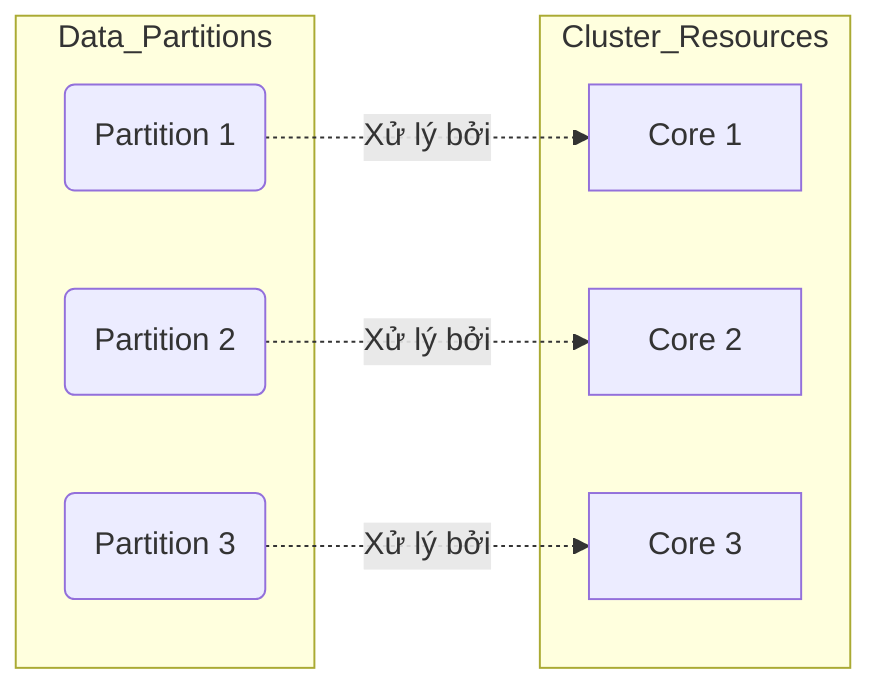

Trong Apache Spark, Data Partition (Phân vùng dữ liệu) không chỉ là sự chia cắt dữ liệu lôgic, mà nó là **đơn vị vật lý của tính song song (Parallelism)**. Một Data Engineer không thể làm chủ Spark nếu không hiểu rõ cách dữ liệu phân bổ vật lý vào RAM của các Executor thông qua Partitions.

## 1. Kiến trúc Thực thi Vật lý: Task và Core

Mối quan hệ cốt lõi định hình kiến trúc xử lý của Spark được tóm gọn qua quy luật:
`1 Partition = 1 Task = 1 CPU Core (tại một thời điểm)`

Nếu bạn chạy một Job có 10.000 Partitions trên một Cluster chỉ có 100 Cores, hệ thống sẽ phải xếp hàng (Scheduler Overhead) và liên tục Context Switch, làm chết ngạt (choke) hiệu năng. Ngược lại, nếu có 100 Cores nhưng chỉ có 2 Partitions, 98 Cores sẽ nhàn rỗi (Under-utilization).



## 2. Input và Shuffle Partitions

### 2.1. Input Partitions (Lúc đọc dữ liệu)
Spark chia dữ liệu ngay từ lúc đọc (Ingestion) phụ thuộc vào hệ thống Storage:
- **HDFS**: 1 Block (128MB) = 1 Partition.
- **S3 / Cloud Storage**: Được kiểm soát bằng `spark.sql.files.maxPartitionBytes` (mặc định 128MB).
- **RDBMS (JDBC)**: Cần cực kỳ cẩn thận. Mặc định là 1 Partition. Phải truyền tham số song song nếu không muốn nổ OOM:
```python
# Đọc JDBC song song với 10 Partitions để chống OOM Driver
df = spark.read.jdbc(
    url=jdbcUrl,
    table="massive_events",
    column="event_id",
    lowerBound=1,
    upperBound=100000000,
    numPartitions=10,
    properties=connectionProperties
)
```

### 2.2. Shuffle Partitions (Lúc tính toán)
Khi thực hiện Wide Transformations (JOIN, GROUP BY), Spark tiến hành Network Shuffle. Dữ liệu mới sinh ra sẽ thuộc về *Shuffle Partitions*.
- Cấu hình tĩnh: `spark.sql.shuffle.partitions` (Mặc định ngu ngốc: 200).
- Hệ lụy: Nếu Join 1TB dữ liệu với 200 partitions, mỗi partition sẽ gánh 5GB, vượt quá RAM Executor gây ra lỗi tràn đĩa (Spill-to-disk) hoặc OOMKilled.

## 3. Rủi ro Vận hành: repartition() vs coalesce()

Mọi Data Engineer đều đối mặt với Trade-off: Gộp/chia dữ liệu thế nào cho đúng trước khi ghi (Write) ra Storage.

- `repartition(n)`: Ép buộc (Force) một Full Network Shuffle. Thuật toán Round-robin phân phối đều data vào `n` bucket. 
  - **Trade-off:** Chống Data Skew hoàn hảo nhưng đánh đổi bằng Network I/O khổng lồ.
- `coalesce(n)`: Chạy thuật toán hợp nhất (Merge) cục bộ trên cùng một Node, loại bỏ Network Shuffle. 
  - **Trade-off:** Cực kỳ nhanh, I/O bằng 0. Nhưng có thể gây ra Data Skew nghiêm trọng do gộp các khối dữ liệu bất cân xứng mà không chia bài lại.

**Code Thực chiến: Xử lý Small File Problem**
```python
# XẤU: Full Shuffle gây chết mạng, làm chậm Job
df.repartition(10).write.parquet("s3a://datalake/bad/")

# TỐT: Gom gọn file ngay tại Executor trước khi flush xuống S3
df.coalesce(10).write.parquet("s3a://datalake/good/")
```

## 4. Kỹ thuật chống Lệch dữ liệu (Data Skew & Salting)

Data Skew là kẻ thù số một của Distributed Computing. Một Partition khổng lồ (vd: khóa khách hàng "Vô danh") sẽ giam giữ cả Cluster.

**Chiến thuật Salting (Thêm nhiễu):**
Gắn thêm một Random ID vào khóa bị lệch để bẻ gãy nó thành các khối nhỏ, phân phối tải ra các Executor khác.

```python
from pyspark.sql.functions import col, rand, lit

# 1. Bảng lớn: Nhân bản khóa lệch thành 10 khóa con (skew_key_0 đến skew_key_9)
fact_df = fact_df.withColumn("salt", (rand() * 10).cast("int"))
fact_df = fact_df.withColumn("salted_join_key", concat(col("join_key"), lit("_"), col("salt")))

# 2. Bảng nhỏ (Dimension): Tạo Cartesian Product nhân 10 lần các dòng
# (Sử dụng explode một array từ 0..9)
```

## 5. AQE: Tự động hoá Partitions (Spark 3+)

Sử dụng AQE, bạn không còn phải đoán mò cấu hình Shuffle Partitions nữa.


1. **Dynamically Coalescing Shuffle Partitions:** Bạn cấu hình khởi tạo thật cao (`spark.sql.shuffle.partitions = 2000`). Nếu dữ liệu thực tế sau Map-stage nhỏ, AQE sẽ dồn 2000 partitions trống này về lại còn 10 partitions cục bộ mà không tốn công Shuffle.
2. **Skew Join Optimization:** Tự động cắt (Split) Partitions lớn, cứu cánh cho OOM.

## 6. Nguồn Tham Khảo (References)
- [Databricks: Adaptive Query Execution](https://databricks.com/blog/2020/05/29/adaptive-query-execution-speeding-up-spark-sql-at-runtime.html)
- [Data Skew and Salting Technique - Databricks Documentation](https://docs.databricks.com/en/optimizations/skew-join.html)
- [Uber Engineering: Handling Data Skew in Spark](https://eng.uber.com/handling-data-skew-in-apache-spark/)
