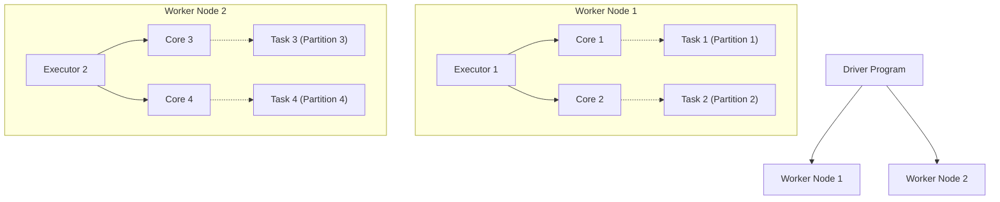

Trong Apache Spark, Data Partition (Phân vùng dữ liệu) không chỉ là sự chia cắt dữ liệu lôgic giống như trong cơ sở dữ liệu quan hệ, mà nó chính là **đơn vị vật lý của tính song song (Atomic Unit of Parallelism)**. Một Data Engineer không thể làm chủ Spark và tối ưu hóa chi phí Compute nếu không hiểu rõ cách dữ liệu phân bổ vật lý vào RAM của các Executor thông qua Partitions. Lỗi OOMKilled hay Spill-to-disk phần lớn đều bắt nguồn từ việc quản lý Partition sai lầm.

## 1. Kiến trúc Thực thi Vật lý (Physical Execution Architecture)

Mối quan hệ cốt lõi định hình toàn bộ kiến trúc xử lý của Spark được tóm gọn qua quy luật bất biến trong quá trình thực thi:
`1 Partition = 1 Task = 1 CPU Core (tại một thời điểm)`

Nếu bạn chạy một Job có 10.000 Partitions trên một Cluster chỉ có 100 Cores, hệ thống sẽ phải phân bổ các Task này vào hàng đợi. Mỗi Core sẽ chạy hết Task này đến Task khác, tạo ra chi phí xáo trộn ngữ cảnh (Context Switch Overhead). Ngược lại, nếu bạn cấp 100 Cores nhưng DataFrame của bạn chỉ có 2 Partitions, 98 Cores sẽ hoàn toàn nhàn rỗi (Under-utilization), làm lãng phí hàng đống tiền Cloud của công ty.



**Systemic Trade-off:** Kích thước lý tưởng cho một Partition nằm trong khoảng `100MB - 200MB`. Nhỏ hơn mức này, Overhead của việc khởi tạo Task (Scheduler Delay) sẽ lớn hơn thời gian thực thi Task. Lớn hơn mức này, dữ liệu sẽ không nhét vừa Execution Memory, dẫn đến Spill-to-disk hoặc OOMKilled.

## 2. Phân loại Partitions: Input vs Shuffle

### 2.1. Input Partitions (Lúc đọc dữ liệu)
Spark chia dữ liệu ngay từ lúc đọc (Ingestion) phụ thuộc vào hệ thống Storage:
- **HDFS / Cloud Storage (S3, GCS, ADLS)**: Kích thước Partition được kiểm soát chặt chẽ bằng tham số `spark.sql.files.maxPartitionBytes` (mặc định 128MB). Spark sẽ gộp các file nhỏ (File packing) hoặc chia các file khổng lồ ra thành các khối 128MB.
- **RDBMS (JDBC)**: Đây là một cái bẫy chết người. Mặc định, Spark đọc JDBC bằng đúng **1 Partition**. Nếu bảng có 1 tỷ dòng, 1 Task duy nhất sẽ cố gắng kéo toàn bộ 1 tỷ dòng đó về, làm sập ngay lập tức Executor.

**Mã nguồn Thực chiến: Đọc JDBC an toàn**
```python
# Đọc JDBC song song với 20 Partitions để chia đều tải
df_massive = spark.read.jdbc(
    url="jdbc:postgresql://production-db:5432/core",
    table="massive_transactions",
    column="transaction_id", # Khóa chia partition (Nên là số nguyên, tăng dần)
    lowerBound=1,
    upperBound=1000000000,
    numPartitions=20,
    properties={"user": "admin", "password": "xxx", "fetchsize": "10000"}
)
```

### 2.2. Shuffle Partitions (Lúc tính toán)
Khi thực hiện Wide Transformations (như `JOIN`, `GROUP BY`, `Window Functions`), Spark phải xáo trộn dữ liệu qua mạng (Network Shuffle). Dữ liệu sau khi xáo trộn sẽ được lưu vào các *Shuffle Partitions*.
- Tham số tĩnh mặc định là `spark.sql.shuffle.partitions = 200`.
- **Hệ lụy:** Nếu bạn xử lý 1TB dữ liệu với 200 partitions, mỗi partition sẽ gánh 5GB. Executor của bạn sẽ gục ngã hoàn toàn. Đối với dữ liệu lớn, hãy mạnh dạn thiết lập con số này lên `2000` hoặc thậm chí `10000`.

## 3. Rủi ro Vận hành: repartition() vs coalesce()

Mọi Data Engineer đều đối mặt với Trade-off: Gộp/chia dữ liệu thế nào cho đúng trước khi ghi (Write) ra Storage để tránh hiện tượng *Small File Problem*.

- `repartition(n)`: Ép buộc (Force) một Full Network Shuffle. Thuật toán Round-robin sẽ phân phối dữ liệu cực kỳ đồng đều vào `n` bucket. 
  - **Trade-off:** Chống Data Skew hoàn hảo, file output có kích thước đều nhau tăm tắp, nhưng đánh đổi bằng Network I/O và Disk I/O khổng lồ.
- `coalesce(n)`: Chạy thuật toán hợp nhất (Merge) cục bộ trên cùng một Node, tuyệt đối không xáo trộn qua mạng. 
  - **Trade-off:** I/O bằng 0, tốc độ chớp nhoáng. Nhưng nó có thể làm chết ngạt các phép toán phía trước nó, hoặc sinh ra các file output to nhỏ bất thường.

**Code Thực chiến: Xử lý Small File Problem**
```python
# TỐT: Gom gọn file ngay tại Executor trước khi flush xuống S3/GCS
# Tránh tạo ra hàng ngàn file 1MB làm chậm quá trình quét của Athena/Presto
df.coalesce(10).write.format("delta").mode("overwrite").save("s3a://datalake/clean_table/")

# CHÚ Ý: Đừng dùng coalesce() trước một phép toán nặng, hãy dùng nó ở cuối Pipeline.
```

## 4. Ác mộng Vận hành: Data Skew (Lệch dữ liệu)

Data Skew là kẻ thù số một của Distributed Computing. Hãy tưởng tượng bạn đang đếm số lượng đơn hàng theo ID cửa hàng. 99% cửa hàng có 1000 đơn. Nhưng cửa hàng "Shopee Mall" có 500 triệu đơn, hoặc tồi tệ hơn, có hàng triệu dòng bị lỗi mang `store_id = null`. Toàn bộ 500 triệu đơn này sẽ băm (Hash) vào **cùng một Partition**, do **cùng một Task** xử lý, trên **một Core duy nhất**.

Kết quả: 199 Tasks xong trong 10 giây. 1 Task kẹt lại 4 tiếng và cuối cùng chết vì OOM.

### Chiến thuật Salting (Thêm nhiễu)
Salting là kỹ thuật Staff Engineer hay dùng để "bẻ gãy" khóa bị lệch bằng cách gắn thêm một hậu tố ngẫu nhiên, ép Spark phải phân phối dữ liệu ra nhiều Partitions. Sau đó, phía bên kia của Join cũng phải nhân bản (Explode) để khớp với các khóa đã thêm nhiễu.

**Mã nguồn Thực chiến: Salting bằng PySpark**
```python
from pyspark.sql.functions import col, rand, lit, concat, explode, array

SALT_BINS = 10

# 1. Bảng lớn (Fact): Thêm nhiễu ngẫu nhiên từ 0 đến 9 vào khóa Join
fact_df = spark.read.table("sales_fact")
fact_df = fact_df.withColumn("salt", (rand() * SALT_BINS).cast("int"))
salted_fact = fact_df.withColumn("join_key_salted", concat(col("store_id"), lit("_"), col("salt")))

# 2. Bảng nhỏ (Dimension): Tạo Cartesian Product nhân 10 lần các dòng
dim_df = spark.read.table("store_dim")
# Tạo mảng [0, 1, ..., 9] và bùng nổ [explode] mỗi cửa hàng thành 10 phiên bản
salt_array = array(*[lit(i] for i in range(SALT_BINS)])
dim_exploded = dim_df.withColumn("salt_array", salt_array) \
                     .withColumn("salt", explode("salt_array"))
salted_dim = dim_exploded.withColumn("join_key_salted", concat(col("store_id"), lit("_"), col("salt")))

# 3. Thực hiện Join an toàn không còn bị Skew
safe_join = salted_fact.join(salted_dim, "join_key_salted", "inner")
```
*Phân tích Trade-off:* Bạn hy sinh thêm bộ nhớ và chu kỳ CPU để nhân bản bảng Dimension gấp 10 lần, đổi lại hệ thống không bao giờ bị Crash vì OOM.

## 5. Tối ưu hóa Hiện đại: Adaptive Query Execution [AQE]

Từ Spark 3.0, Databricks đã biến AQE thành mặc định. AQE thu thập thống kê *tại thời điểm chạy (Runtime)* sau các Stage Shuffle để linh hoạt điều chỉnh Physical Plan, giải quyết triệt để các vấn đề của cấu hình Partition tĩnh.

1. **Dynamically Coalescing Shuffle Partitions:** Giải quyết vấn đề chọn `spark.sql.shuffle.partitions`. Bạn cứ mạnh dạn khai báo nó bằng 2000. Nếu sau khi Filter, dữ liệu còn lại rất ít, AQE sẽ tự động gom 2000 partitions trống thành vài partitions vừa vặn để giảm overhead.
2. **Skew Join Optimization:** AQE tự động phát hiện các Partition lớn bất thường (nhờ tham số `skewedPartitionThresholdInBytes`). Nó sẽ tự động cắt nhỏ Partition đó ra, gánh vác công việc thay cho kỹ thuật Salting thủ công.

**Cấu hình Thực chiến (spark-defaults.conf / YAML):**
```hcl
# Tích hợp vào file cấu hình của Cluster / EMR
spark.sql.adaptive.enabled true
spark.sql.adaptive.coalescePartitions.enabled true
spark.sql.adaptive.coalescePartitions.initialPartitionNum 2000
spark.sql.adaptive.skewJoin.enabled true
spark.sql.adaptive.skewJoin.skewedPartitionFactor 5
spark.sql.adaptive.skewJoin.skewedPartitionThresholdInBytes 256m
```

## 6. Nguồn Tham Khảo (References)
- [Databricks: Adaptive Query Execution: Speeding Up Spark SQL at Runtime][https://www.databricks.com/blog/2020/05/29/adaptive-query-execution-speeding-up-spark-sql-at-runtime.html]
- [AWS Big Data Blog: Best practices for successfully managing memory for Apache Spark applications on Amazon EMR][https://aws.amazon.com/blogs/big-data/best-practices-for-successfully-managing-memory-for-apache-spark-applications-on-amazon-emr/]
- [Databricks Documentation: Optimize Skew Join](https://docs.databricks.com/en/optimizations/skew-join.html]
