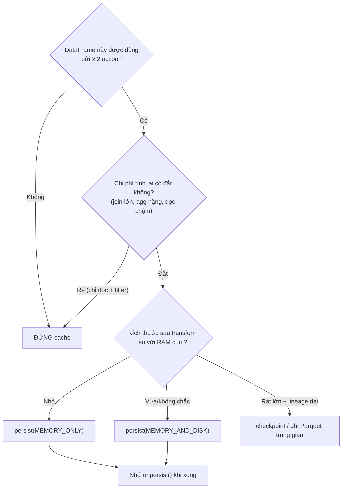

`df.cache()` có lẽ là dòng tuning bị lạm dụng nhất trong các codebase Spark: được rắc khắp nơi như bùa may mắn, trong khi cache sai chỗ gây OOM và *làm chậm* job nhiều hơn là tăng tốc. Để dùng đúng, cần hiểu ba điều: khi nào Spark thực sự tính lại dữ liệu, mỗi storage level đánh đổi gì, và cache khác checkpoint ở đâu.

Nên đọc trước: [RDD vs DataFrame vs Dataset](/concepts/4-compute-engines-batch/rdd-dataframe-dataset/) và [Spark Execution Model](/concepts/4-compute-engines-batch/spark-execution-model/).

---

## 1. Vì sao cần persist: lazy evaluation tính lại từ đầu

Spark là lazy — mỗi **action** chạy lại toàn bộ chuỗi transformation từ nguồn (trừ phần shuffle được tái dùng ngầm). Không có persist:

```python
heavy = (spark.read.parquet("s3a://lake/events/")   # 2 TB
           .filter(...).join(dim, ...).groupBy(...).agg(...))

heavy.count()                 # chạy toàn bộ plan: đọc 2TB, join, agg
heavy.write.parquet(out1)     # CHẠY LẠI toàn bộ plan lần 2!
heavy.filter(...).show()      # ... lần 3
```

Persist bẻ gãy sự lặp lại đó: sau action đầu tiên, kết quả từng partition được giữ lại (RAM/disk) và các action sau đọc từ đó.

```python
from pyspark import StorageLevel
heavy.persist(StorageLevel.MEMORY_AND_DISK)   # đánh dấu - chưa xảy ra gì
heavy.count()                                  # action đầu: tính + LƯU
heavy.write.parquet(out1)                      # đọc từ cache
heavy.unpersist()                              # giải phóng ngay khi xong
```

Ba điểm hay quên: persist là **lazy** (chỉ materialize ở action đầu tiên); `cache()` chỉ là alias của `persist(StorageLevel.MEMORY_AND_DISK)` với DataFrame (với RDD là `MEMORY_ONLY`); và **luôn `unpersist()`** khi dùng xong — cache chiếm chung pool bộ nhớ với execution (unified memory), giữ cache thừa đồng nghĩa cướp RAM của join/sort, gây [spill](/concepts/4-compute-engines-batch/spark-spill-to-disk/).

## 2. Bảng Storage Levels đầy đủ

| Storage Level | Nơi lưu | Dạng | Hết chỗ thì sao? | Khi nào dùng |
|---|---|---|---|---|
| `MEMORY_ONLY` | RAM | Object đã deserialize | Partition không vừa bị **bỏ, tính lại** khi cần | Dataset nhỏ so với RAM, cần nhanh nhất |
| `MEMORY_AND_DISK` | RAM, tràn xuống disk | Object (RAM) / bytes (disk) | Tràn xuống disk local | **Mặc định an toàn** cho DataFrame |
| `MEMORY_ONLY_SER` | RAM | Serialized bytes | Bỏ, tính lại | Tiết kiệm RAM 2-5×, trả giá CPU deserialize (RDD; DataFrame vốn đã ở dạng Tungsten binary) |
| `MEMORY_AND_DISK_SER` | RAM + disk | Serialized bytes | Tràn disk | RDD lớn, RAM chật |
| `DISK_ONLY` | Disk local | Bytes | — | Tính lại đắt hơn đọc disk; RAM cần cho việc khác |
| `*_2` (vd `MEMORY_AND_DISK_2`) | Như trên, nhân đôi | — | — | Replica trên 2 node — hiếm khi đáng, trừ pipeline streaming cần khôi phục nhanh |
| `OFF_HEAP` | Off-heap (Tungsten) | Bytes | — | Cụm cấu hình `spark.memory.offHeap.enabled`; giảm áp lực GC |

Hai quy tắc rút gọn từ tài liệu chính thức: ưu tiên `MEMORY_ONLY` nếu vừa RAM; nếu không, `MEMORY_ONLY_SER` (với RDD) trước khi nghĩ đến disk; **đừng replicate** trừ khi cần recover cực nhanh.

Kiểm tra cache thực tế trong **Spark UI → tab Storage**: thấy "Fraction Cached 37%" nghĩa là 63% partition không vừa bộ nhớ và vẫn đang bị tính lại — cache nửa vời kiểu này thường tệ hơn không cache, vì bạn vừa mất RAM vừa không tránh được recompute.

## 3. Cache vs Checkpoint: cắt lineage hay không?

| | `persist()` | `checkpoint()` |
|---|---|---|
| Lưu ở | RAM/disk **local** của executor | HDFS/S3 (reliable storage) |
| Lineage | **Giữ nguyên** — executor chết thì tính lại từ nguồn | **Cắt đứt** — plan mới bắt đầu từ file checkpoint |
| Sống sót khi app chết | Không | Có |
| Chi phí | Rẻ | Đắt (ghi ra storage phân tán) |

Checkpoint (`spark.sparkContext.setCheckpointDir(...)` + `df.checkpoint()`) dùng khi: lineage quá dài (vòng lặp ML, thuật toán iterative — plan phình to làm driver phân tích chậm dần), hoặc [Structured Streaming](/concepts/5-stream-processing-realtime/streaming-processing/) cần khôi phục state sau khi app restart. Một biến thể nhẹ hơn thường gặp trong pipeline batch: **ghi ra Parquet rồi đọc lại** — bản chất là "checkpoint thủ công" kèm lợi ích kiểm tra được dữ liệu trung gian.

## 4. Quy tắc quyết định



Lỗi thực chiến hay gặp nhất: cache **trước** filter/select thay vì sau — lưu 2 TB để rồi chỉ dùng 50 GB. Luôn cache ở điểm hẹp nhất của pipeline (sau khi đã lọc và cắt cột), ngay trước nhánh rẽ tái sử dụng.

## Liên kết trong site

[Spark Spill to Disk](/concepts/4-compute-engines-batch/spark-spill-to-disk/) · [Troubleshooting Spark OOM](/concepts/4-compute-engines-batch/troubleshooting-spark-oom/) · [Spark Tungsten Engine](/concepts/4-compute-engines-batch/spark-tungsten-engine/) · Bản đồ học: [Spark Mastery](/concepts/4-compute-engines-batch/spark-mastery/).

## Nguồn Tham Khảo

- [RDD Persistence & Which Storage Level to Choose](https://spark.apache.org/docs/latest/rdd-programming-guide.html#rdd-persistence) - Apache Spark.
- [Tuning Spark: Memory Management](https://spark.apache.org/docs/latest/tuning.html#memory-management-overview) - Apache Spark.
- [pyspark.StorageLevel API](https://spark.apache.org/docs/latest/api/python/reference/api/pyspark.StorageLevel.html) - Apache Spark.
- [Structured Streaming: Recovering from Failures with Checkpointing](https://spark.apache.org/docs/latest/structured-streaming-programming-guide.html#recovering-from-failures-with-checkpointing) - Apache Spark.
