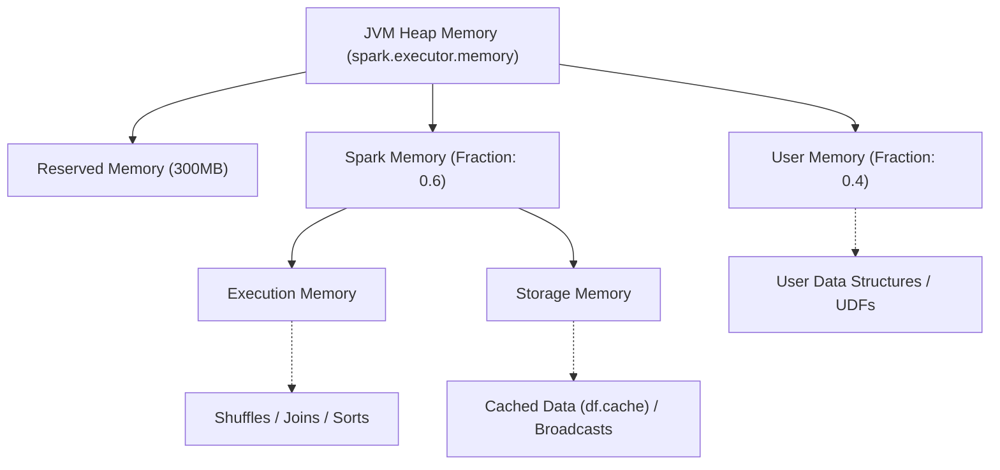

Trong môi trường phân tán thực chiến với khối lượng dữ liệu hàng Terabyte, hệ thống Data Engine của bạn thường không chết vì thiếu năng lực tính toán (CPU), mà sụp đổ vì cạn kiệt bộ nhớ (RAM). Apache Spark được thiết kế để xử lý In-Memory tốc độ cao, nhưng khi khối lượng công việc của một Task (đại diện cho một Data Partition) phình to vượt quá dung lượng khả dụng trong Heap của JVM, Spark sẽ kích hoạt cơ chế phòng vệ cuối cùng để tránh bị Crash: **Spill to Disk**. 

Spill là một "kẻ giết người thầm lặng" (Silent Killer) trong các Data Pipelines. Thay vì bắn ra lỗi `OOMKilled` ngay lập tức để Data Engineer phát hiện và sửa, Job sẽ rơi vào trạng thái "thrashing" (vũng bùn I/O), làm tổng thời gian chạy tăng theo cấp số nhân và đốt cháy ngân sách Cloud Compute của bạn.

## 1. Kiến trúc Thực thi Vật lý (Physical Execution Architecture)

Kể từ Project Tungsten (Spark 1.6+), Apache Spark đã thay đổi hoàn toàn cách quản lý bộ nhớ, chuyển sang sử dụng **Unified Memory Manager**. Nó phá bỏ vách ngăn cứng nhắc giữa không gian dùng để tính toán và không gian dùng để lưu trữ cache.



Bên trong phân vùng `Spark Memory` (mặc định chiếm 60% không gian khả dụng sau khi trừ đi Reserved Memory), hệ thống chia thành hai vùng linh hoạt có thể vay mượn nhau (Eviction/Borrowing):
- **Execution Memory:** Nơi cấp phát Hash Maps, Buffer phục vụ cho các phép toán Sort, Shuffle, Join, và Aggregation.
- **Storage Memory:** Nơi chứa Cached Data và Broadcast Variables. (Mặc định `spark.memory.storageFraction` là 0.5, tức là Storage có "quyền miễn trừ" 50% không gian này không bị Execution đuổi đi).

**Systemic Trade-off:** Khi Execution cạn kiệt RAM và Storage không thể nhường thêm chỗ (vì dữ liệu Cache đang bị ghim - pinned), bộ đệm tính toán không còn cách nào khác ngoài việc xả dữ liệu trung gian (intermediate data) xuống ổ cứng cục bộ (Local Disk) của Worker Node. Quá trình này chính là **Spill-to-disk**.

## 2. Giải phẫu Overhead của Spill (The Anatomy of Spill Overhead)

Nhiều Data Engineer lầm tưởng Spill làm chậm Job chủ yếu do tốc độ Disk I/O của HDD hoặc SSD kém hơn RAM. Tuy nhiên, ở các hệ thống Cloud hiện đại với SSD NVMe, độ trễ Disk I/O chỉ là một phần nhỏ. Rào cản chí mạng thực sự nằm ở **Chi phí CPU (CPU Overhead)**:

1. **Serialization:** Object Java trong RAM phải được "phẳng hoá" (Flattened) thành chuỗi byte nhị phân. Dù sử dụng Kryo Serializer, CPU vẫn phải chạy 100% cho quá trình này.
2. **Compression:** Chuỗi byte tiếp tục được nén (thường bằng thuật toán LZ4 hoặc Snappy) để giảm thiểu kích thước block trước khi ghi.
3. **Disk I/O Write:** Ghi block dữ liệu đã nén xuống Local Disk.
4. **Decompression & Deserialization:** Khi cần tiếp tục quá trình Join hoặc Sort, Spark lại phải tốn ngần ấy công sức của CPU để đọc từ đĩa, giải nén và phục hồi dữ liệu về RAM.

Sự xáo trộn ngữ cảnh (Context Switch) này làm ngạt CPU. Nếu nhìn vào Metrics, bạn sẽ thấy Task có vẻ đang chạy nhưng Disk I/O và CPU Spikes liên tục chạm nóc, trong khi Data Processed gần như dậm chân tại chỗ.

## 3. Rủi ro Vận hành (Operational Risks) và Chẩn đoán lâm sàng

Dấu hiệu cảnh báo cấp độ đỏ trên Spark UI ở tab **Stages** hoặc **Tasks**:
- **Spill (Memory):** Kích thước dữ liệu gốc trên RAM "bị" yêu cầu lưu xuống đĩa. (Ví dụ: 25GB)
- **Spill (Disk):** Kích thước vật lý thực sự ghi vào đĩa sau khi Serialize và Compress. (Ví dụ: 3GB)

> 💡 **Staff Engineer Tip:** Nếu bạn thấy `Spill (Memory) > 5GB` trong một Stage, hệ thống của bạn đang lãng phí hàng ngàn USD tiền Cloud Compute cho các thao tác rác (Garbage Collection & Serialization Overhead).

**Nguyên nhân gốc rễ (Root Causes):**
1. **Data Skew (Dữ liệu bị lệch):** Nếu 199/200 Tasks hoàn thành trong 10 giây, và 1 Task chạy 4 tiếng văng ra Spill 50GB. Đó là Skew. Một Executor phải gánh toàn bộ lượng dữ liệu của một Null Key hoặc Popular Key.
2. **Thiếu mức độ song song (Under-parallelism):** Cố gắng xử lý 100GB dữ liệu với cấu hình mặc định `spark.sql.shuffle.partitions = 200`, mỗi Task sẽ phải ôm 500MB dữ liệu, dễ dàng vượt qua Execution Memory khả dụng của một Core.
3. **Cartesian Explosion:** Thực hiện Join mà thiếu điều kiện on key (`crossJoin`), hoặc điều kiện Join dẫn đến số lượng records bùng nổ theo cấp số nhân (Many-to-Many).

## 4. Tối ưu Hệ thống và Mã nguồn Thực chiến (System Tuning & Mitigation)

Việc mù quáng tăng `spark.executor.memory` là cách giải quyết của Junior Engineer, vừa tốn kém lại có thể gây ra hiện tượng **Long GC Pause** (JVM dọn rác quá lâu khiến Node bị đánh dấu là Dead). Một Data Engineer thực thụ sẽ điều tiết Luồng dữ liệu (Data Flow) và Cấu hình hệ thống.

### 4.1. Khai báo Infrastructure Configuration (Terraform / YAML)

Đảm bảo Worker Nodes của bạn được cấp đủ Ephemeral Storage. Đừng để Spill gây ra lỗi `No space left on device`. Dưới đây là cấu hình Cluster mẫu sử dụng Databricks Terraform provider ưu tiên Memory-Optimized nodes:

```hcl
resource "databricks_cluster" "high_concurrency_cluster" {
  cluster_name            = "Data_Processing_Engine"
  spark_version           = "13.3.x-scala2.12"
  node_type_id            = "r5d.2xlarge" # AWS Memory Optimized with NVMe SSD
  driver_node_type_id     = "r5d.xlarge"
  autotuning {
    min_workers = 2
    max_workers = 10
  }
  
  spark_conf = {
    # Tối ưu Memory Allocation
    "spark.memory.fraction" = "0.7",
    "spark.memory.storageFraction" = "0.2", # Giải phóng 80% RAM cho Execution
    
    # Bật Kryo Serializer tối ưu Memory footprint
    "spark.serializer" = "org.apache.spark.serializer.KryoSerializer",
    "spark.kryoserializer.buffer.max" = "512m",
    
    # Bật AQE - Vũ khí tối thượng chống Skew
    "spark.sql.adaptive.enabled" = "true",
    "spark.sql.adaptive.skewJoin.enabled" = "true"
  }
}
```

### 4.2. Tăng mức độ song song (Concurrency Tuning)

Kiểm soát kích thước partition bằng cách điều chỉnh cấu hình khi khởi tạo `SparkSession`. Mục tiêu là giữ cho mỗi partition sau khi Shuffle nằm trong khoảng từ `100MB - 150MB`.

```python
from pyspark.sql import SparkSession

spark = SparkSession.builder \
    .appName("Spill-Mitigation-App") \
    .config("spark.sql.shuffle.partitions", "2000") \
    .config("spark.sql.files.maxPartitionBytes", "134217728") \
    .getOrCreate()

# Với 100GB Data, chia cho 200 partitions = 500MB/task -> DỄ SPILL
# Nhưng với 2000 partitions = 50MB/task -> Vừa khít L3 Cache và Execution Memory
```

### 4.3. Tối ưu Hashing & Thuật toán Xấp xỉ (Approximate Algorithms)

Các phép toán `GROUP BY` đếm số lượng phân biệt (`COUNT DISTINCT`) sinh ra cấu trúc HashMaps cực lớn trong bộ nhớ.
**Trade-off:** Hãy đánh đổi 1-5% độ chính xác để lấy tốc độ và tiết kiệm hàng chục GB RAM. Thuật toán **HyperLogLog** tích hợp sẵn trong Spark sử dụng chưa tới 1KB RAM cho mỗi state thay vì tạo HashSet chiếm hàng trăm MB.

```python
from pyspark.sql.functions import approx_count_distinct, col

df_events = spark.read.parquet("s3a://data-lake/events/")

# CÁCH LÀM TỒI (Gây Spill to Disk nếu cardinality quá lớn):
# df_events.groupBy("store_id").agg(countDistinct("customer_id"))

# CÁCH LÀM STAFF ENGINEER (Dùng thuật toán xác suất HLL, sai số tối đa 5%):
optimized_df = df_events.groupBy("store_id").agg(
    approx_count_distinct(col("customer_id"), rsd=0.05).alias("approx_unique_customers")
)
optimized_df.write.format("delta").save("s3a://data-warehouse/store_stats/")
```

### 4.4. Xử lý Broadcast Joins

Khi Join một bảng nhỏ với một bảng khổng lồ, thay vì Shuffle toàn bộ dữ liệu của bảng lớn (Shuffle Hash Join / Sort Merge Join), hãy Broadcast bảng nhỏ tới từng Worker Node. Điều này loại bỏ hoàn toàn Shuffle Phase - thủ phạm số một gây ra Spill.

```python
from pyspark.sql.functions import broadcast

df_transactions = spark.read.parquet("s3a://data-lake/massive_transactions/") # 5TB
df_dim_stores = spark.read.parquet("s3a://data-lake/dim_stores/") # 50MB

# Bắt buộc Spark sử dụng Broadcast Join, tránh mọi thao tác Shuffle
df_joined = df_transactions.join(
    broadcast(df_dim_stores),
    "store_id",
    "inner"
)
```

## 5. Nguồn Tham Khảo [References]

1. [Databricks - Project Tungsten: Bringing Apache Spark Closer to Bare Metal][https://www.databricks.com/blog/2015/04/28/project-tungsten-bringing-spark-closer-to-bare-metal.html]
2. [Databricks - Apache Spark as a Compiler: Joining a Billion Rows per Second on a Laptop][https://www.databricks.com/blog/2016/05/23/apache-spark-as-a-compiler-joining-a-billion-rows-per-second-on-a-laptop.html]
3. [Xin Li - Spark Memory Management](https://0x0fff.com/spark-memory-management/]
4. Kleppmann, M. (2017). *Designing Data-Intensive Applications*. O'Reilly Media.
