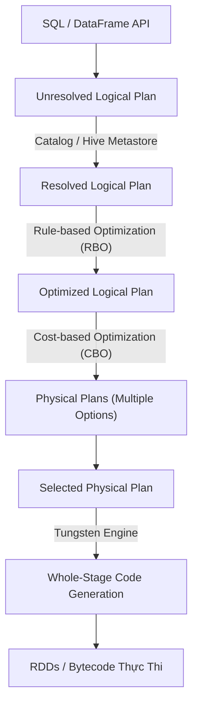

Lập trình viên khi chuyển từ hệ thống xử lý dòng truyền thống (như MapReduce hay RDD cổ điển) sang Spark SQL thường rơi vào cạm bẫy: "nghĩ rằng đây chỉ là một công cụ parse chuỗi SQL để gọi các hàm tương ứng". 

Thực tế hoàn toàn khác. Theo bài công bố từ các kỹ sư Databricks, Spark SQL là một **Distributed SQL Engine** sở hữu cơ chế lập kế hoạch thực thi (Query Planning) và sinh code (Whole-Stage Code Generation) phức tạp. Nó có thể tự động biến những dòng code DataFrame ngây ngô và rời rạc nhất thành những luồng xử lý I/O tối ưu trên hàng ngàn cluster nodes. 

Bài viết này sẽ đi sâu vào kiến trúc bên dưới của Spark SQL, cách **Catalyst Optimizer** nhào nặn Physical Plan, sức mạnh của **Tungsten Engine**, và những rủi ro sập hệ thống (OOM, Cartesian Explosion) trên môi trường production.

## 1. Kiến trúc Thực thi Vật lý (The Physical Execution Engine)

Spark SQL đứng giữa người dùng (thông qua DataFrame/Dataset API hoặc SQL thuần) và lõi thực thi cấp thấp của Spark. Bất kể bạn viết code bằng Python, Scala hay R, tất cả đều được ánh xạ về một **Logical Plan** đồng nhất. Điều này xóa bỏ hoàn toàn overhead của việc gọi chéo ngôn ngữ (trừ khi bạn lạm dụng Python UDF).

### Catalyst Optimizer: Cỗ Máy "Luyện Đan" (The Optimization Engine)

Catalyst Optimizer là trái tim của Spark SQL, được thiết kế dưới dạng một *extensible framework* sử dụng sức mạnh của Functional Programming (pattern matching) trong ngôn ngữ Scala. 

Quy trình "luyện đan" (Query Optimization Pipeline) diễn ra qua 4 bước cực kỳ chặt chẽ:



1. **Analysis (Phân tích & Xác thực):** Chuyển từ *Unresolved* sang *Resolved Logical Plan*. Spark tra cứu Catalog (thường liên kết với Hive Metastore) để đảm bảo các bảng, cột có tồn tại và tương thích kiểu dữ liệu (Data types).
2. **Logical Optimization (RBO - Rule-Based Optimization):** Catalyst áp dụng một tập hợp các quy tắc logic cứng:
   - **Predicate Pushdown (Đẩy điều kiện):** Đẩy các lệnh `WHERE` xuống sát Storage Layer nhất có thể. Nếu bạn query trên định dạng Columnar như Parquet, nó sẽ đẩy cờ filter xuống Parquet Reader để bỏ qua toàn bộ các block không thỏa mãn điều kiện.
   - **Column Pruning (Tỉa cột):** Tự động vứt bỏ các cột không dùng đến để giảm băng thông Network I/O và Disk I/O.
   - **Constant Folding (Gộp hằng số):** Tính toán hằng số ở thời gian biên dịch (ví dụ: `1 + 1` được biên dịch sẵn thành `2`).
3. **Physical Planning (CBO - Cost-Based Optimization):** Catalyst sinh ra hàng chục chiến lược thực thi vật lý. Ví dụ: Khi Join hai bảng, dùng `SortMergeJoin` hay `BroadcastHashJoin`? Dựa vào Statistics (metadata về row count, kích thước file), nó định lượng chi phí (Cost) và chọn ra Plan "rẻ" nhất.
4. **Code Generation (Sinh mã):** Bàn giao cho **Project Tungsten** để chuyển Plan thành Java bytecode (Whole-Stage Code Generation). Quá trình này gộp nhiều thao tác vật lý thành một vòng lặp `for` duy nhất, bỏ qua overhead của việc gọi hàm ảo (virtual function calls) trên JVM, tối ưu hóa CPU L1/L2 Cache và đem hiệu năng tiệm cận ngôn ngữ C/C++ (Bare-metal).

## 2. Adaptive Query Execution (AQE): Khắc Phục Lỗi Tiên Đoán

Điểm yếu chí mạng của Cost-Based Optimization (CBO) trước phiên bản Spark 3.0 là nó phụ thuộc hoàn toàn vào số liệu thống kê tĩnh (Static Statistics). Nếu bảng bị cập nhật liên tục mà Statistics chưa kịp chạy lệnh `ANALYZE TABLE`, CBO sẽ đoán mò sai bét nhè, dẫn đến chọn nhầm thuật toán Join đắt đỏ.

**Adaptive Query Execution (AQE)** xuất hiện để giải quyết bài toán này bằng cách đo lường số liệu thực tế (runtime statistics) ngay trong lúc job đang chạy (giữa các stage) để "bẻ lái" kế hoạch thực thi:

- **Dynamically Coalescing Shuffle Partitions:** Gộp các vách ngăn (partitions) quá nhỏ sau khi Shuffle. Việc này tránh tạo ra hàng vạn Task lắt nhắt gây nghẽn cổ chai hệ thống lập lịch của Driver (Scheduler Overhead).
- **Dynamically Switching Join Strategies:** Nếu sau giai đoạn Filter, một bảng từ 100GB bị rơi rụng xuống còn 5MB. AQE phát hiện điều này khi Stage 1 kết thúc, nó lập tức hủy kế hoạch `SortMergeJoin` đắt đỏ (đòi hỏi Network Shuffle và Disk Spill) để đổi sang thuật toán `BroadcastHashJoin` (gửi thẳng 5MB bộ nhớ lên mọi node).
- **Dynamically Optimizing Skew Joins:** Cứu tinh của Data Engineer. AQE tự động phát hiện một partition phình to đột biến (Data Skew) và tự động "chẻ" (split) nó thành nhiều khối nhỏ rải cho nhiều Task xử lý song song, chống lỗi `OOMKilled`.

## 3. Rủi ro Vận hành (Operational Risks) & Đánh Đổi Hệ Thống

Dù Catalyst Optimizer và AQE có thông minh đến đâu, hệ thống Spark vẫn sẽ gục ngã (Crash) nếu Data Engineer không nắm được ranh giới vật lý của hệ thống phân tán.

### 3.1. Cartesian Explosion (Bùng Nổ Tích Đề Các)
**Tình huống (Incident):** Khi bạn thực hiện `JOIN` hai bảng mà lỡ quên điều kiện `ON`, hoặc điều kiện join chỉ chứa các toán tử bất phương trình (non-equi joins) như `tableA.id > tableB.id`.
- **Hệ lụy vật lý:** Kích thước output tăng theo cấp số nhân: 1 triệu dòng x 1 triệu dòng = 1,000 tỷ dòng trung gian. Spark buộc phải tạo Cartesian Product.
- **Biểu hiện:** CPU tăng vọt lên 100% trong nhiều giờ liền, các Task đơ hoàn toàn, GC Time (Garbage Collection) chiếm 90% và cuối cùng chết vì lỗi JVM OOM (Out Of Memory).
- **Trade-off:** Nhận biết sự nguy hiểm này, Spark cung cấp cấu hình `spark.sql.crossJoin.enabled = false` mặc định. Tuyệt đối không bật lên trừ khi bạn cực kỳ hiểu rõ volume data của mình. Thay vào đó, hãy tìm cách dùng Window Functions hoặc tạo các dummy keys để gộp logic.

### 3.2. Broadcast Memory Pressure (Áp Lực Bộ Nhớ Driver)
**Tình huống:** Khi bạn join một bảng khổng lồ (Fact) với một bảng danh mục (Dimension), Spark chọn `BroadcastHashJoin`. Bảng Dimension sẽ được kéo (collect) về node **Driver**, sau đó Driver nén lại và gửi (Broadcast) cho hàng vạn **Executor**.
- **Hệ lụy vật lý:** Nếu Data Engineer cố tình set tham số `spark.sql.autoBroadcastJoinThreshold` quá cao (ví dụ: 1GB) để ép hệ thống chạy Broadcast. Node Driver (thường chỉ cấu hình 2GB-4GB RAM) sẽ lập tức văng `java.lang.OutOfMemoryError` khi cố nạp 1GB dữ liệu thô thành các Java Objects khổng lồ.
- **Cách khắc phục:** Khống chế ngưỡng broadcast ở mức dưới 50MB (mặc định 10MB là hợp lý). Nếu bảng thực sự nằm ở ranh giới 100MB, hãy chia nhỏ xử lý, hoặc để Spark tự rơi về Shuffle Join mặc định bằng cách thêm hint `/*+ SHUFFLE_HASH(table) */` vào câu lệnh SQL.

### 3.3. Shuffle Spill-to-Disk (Tràn Đĩa Khi Shuffle)
**Tình huống:** Xáo trộn mạng (Network Shuffle) là nguyên nhân số 1 gây thắt cổ chai I/O. Khi vùng Execution Memory (RAM) không đủ sức chứa dữ liệu trung gian của một khối Shuffle, Spark sẽ "Spill" (tràn) dữ liệu xuống đĩa cứng (Disk).
- **Hệ lụy vật lý:** Giữa việc ghi/đọc RAM (vài nanosecond) và đĩa cứng (millisecond), Job chạy chậm đi gấp 10-100 lần. Bạn sẽ thấy chỉ số `Spill (Memory)` và `Spill (Disk)` khổng lồ trên Spark UI.
- **Trade-off:** Đừng mù quáng tăng RAM (Scale-up). Tăng RAM làm JVM phình to, kéo theo thời gian "dọn rác" (GC Pause) lâu hơn. Cách trị tận gốc là Tăng mạnh số lượng phân vùng Shuffle để chia nhỏ gánh nặng dữ liệu cho mỗi Task bằng cách cấu hình `spark.sql.shuffle.partitions`.

## 4. Tối Ưu Hóa Trọng Yếu và Code Thực Chiến (Enterprise Tuning)

> **Luật Thép:** Tuyệt đối KHÔNG viết UDF bằng Python (PySpark UDF) trừ trường hợp bất khả kháng. Python UDF không lọt vào tầm ngắm tối ưu của Catalyst và Tungsten. Nó yêu cầu Serialize/Deserialize dữ liệu liên tục qua ống IPC (Inter-Process Communication) giữa JVM và Python Process, làm tê liệt hiệu năng toàn cụm. Hãy sử dụng hàm native (built-in functions), Spark SQL thuần, hoặc Pandas Vectorized UDF (tối ưu bằng Apache Arrow).

Dưới đây là một cấu hình `SparkSession` chuẩn cấp độ Enterprise, kích hoạt toàn bộ sức mạnh của AQE, Tungsten và tối ưu đọc/ghi Delta Lake:

```python
from pyspark.sql import SparkSession

# Code Thực chiến: Khởi tạo Spark Session với các tham số Hardcore Engineering
spark = SparkSession.builder \
    .appName("Catalyst_ETL_Heavy_Workload") \
    .config("spark.sql.adaptive.enabled", "true") \
    .config("spark.sql.adaptive.coalescePartitions.enabled", "true") \
    .config("spark.sql.adaptive.skewJoin.enabled", "true") \
    .config("spark.sql.shuffle.partitions", "2000") \
    .config("spark.sql.autoBroadcastJoinThreshold", "31457280") \
    .config("spark.sql.cbo.enabled", "true") \
    .config("spark.databricks.delta.optimizeWrite.enabled", "true") \
    .config("spark.databricks.delta.autoCompact.enabled", "true") \
    .getOrCreate()

# Đọc dữ liệu: Catalyst tự động áp dụng Predicate Pushdown và Column Pruning tối đa
# Nó sẽ KHÔNG quét toàn bộ Bucket, mà chỉ quét các file thỏa mãn khoảng thời gian (Partition Pruning)
raw_df = spark.read.format("parquet") \
    .load("s3a://enterprise-data-lake/raw/events/") \
    .select("user_id", "event_type", "amount", "timestamp") \
    .filter("timestamp >= '2026-06-01' AND event_type = 'PURCHASE'")

# View tạm để áp dụng sức mạnh của SQL
raw_df.createOrReplaceTempView("stg_purchases")

# Sử dụng SQL MERGE (SCD Type 2) trên Delta Lake để xử lý Idempotent
# Catalyst sẽ biến chuỗi SQL này thành Execution Plan phân tán hoàn hảo (Physical Plan)
spark.sql("""
    MERGE INTO delta_db.dim_users target
    USING (
        SELECT user_id, sum(amount) as total_spent
        FROM stg_purchases
        GROUP BY user_id
    ) source
    ON target.user_id = source.user_id
    WHEN MATCHED AND target.total_spent != source.total_spent THEN
        UPDATE SET target.total_spent = source.total_spent, target.updated_at = current_timestamp()
    WHEN NOT MATCHED THEN
        INSERT (user_id, total_spent, updated_at) VALUES (source.user_id, source.total_spent, current_timestamp())
""")
```

## 5. Nguồn Tham Khảo [References]

* [Deep Dive into Spark SQL's Catalyst Optimizer - Databricks Blog (2015]][https://databricks.com/blog/2015/04/13/deep-dive-into-spark-sqls-catalyst-optimizer.html]
* [Project Tungsten: Bringing Apache Spark Closer to Bare Metal - Databricks Blog][https://databricks.com/blog/2015/04/28/project-tungsten-bringing-spark-closer-to-bare-metal.html]
* [Adaptive Query Execution in Spark 3.0 - Databricks Blog](https://databricks.com/blog/2020/05/29/adaptive-query-execution-speeding-up-spark-sql-at-runtime.html]
* Thiết kế Hệ thống Dữ liệu Chuyên sâu (Designing Data-Intensive Applications - Martin Kleppmann) - Phân tích lý thuyết về Data Skew, Hash Join & Partitioning.
