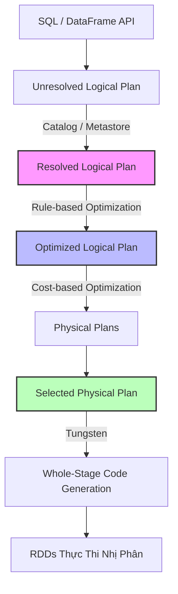

Lập trình viên khi chuyển từ hệ thống xử lý dòng (như MapReduce hay RDD) sang Spark SQL thường rơi vào cạm bẫy "nghĩ rằng đây chỉ là một công cụ parse chuỗi SQL". Thực tế, Spark SQL là một **Distributed SQL Engine** sở hữu cơ chế lập kế hoạch thực thi (Query Planning) và sinh code (Code Generation) phức tạp, giúp nó có thể tự động biến những dòng code DataFrame ngây ngô nhất thành những luồng xử lý I/O tối ưu trên hàng ngàn cluster nodes.

Bài viết này sẽ đi sâu vào kiến trúc bên dưới của Spark SQL, cách Catalyst Optimizer nhào nặn Physical Plan, và những rủi ro sập hệ thống (OOM, Cartesian Explosion) trên production.

---

## 1. Kiến trúc Thực thi Vật lý (Physical Execution)

Spark SQL đứng giữa người dùng (thông qua DataFrame/Dataset API hoặc SQL thuần) và lõi thực thi Spark. Bất kể bạn viết code bằng Python, Scala hay Java, tất cả đều được ánh xạ về một **Logical Plan** đồng nhất, xóa bỏ hoàn toàn overhead của từng ngôn ngữ (trừ khi bạn lạm dụng Python UDF).

### Catalyst Optimizer: Cỗ Máy "Luyện Đan"

Catalyst Optimizer là trái tim của Spark SQL, được thiết kế dưới dạng một extensible framework sử dụng Functional Programming (pattern matching) của Scala. 

Quy trình "luyện đan" (Query Optimization Pipeline) diễn ra qua 4 bước khốc liệt:



1. **Analysis (Xác thực):** Chuyển từ *Unresolved* sang *Resolved Logical Plan*. Spark tra cứu Catalog (Hive Metastore) để đảm bảo bảng, cột tồn tại và tương thích kiểu dữ liệu.
2. **Logical Optimization (RBO - Rule-Based Optimization):** Áp dụng các quy tắc cứng:
   - **Predicate Pushdown:** Đẩy điều kiện `WHERE` xuống sát Storage Layer (chỉ đọc các block Parquet thỏa mãn).
   - **Column Pruning:** Cắt bỏ các cột không dùng đến để giảm băng thông Network/Disk.
   - **Constant Folding:** Tính toán hằng số ở thời gian biên dịch (`1 + 1` thành `2`).
3. **Physical Planning (CBO - Cost-Based Optimization):** Catalyst sinh ra nhiều chiến lược thực thi vật lý. Ví dụ: Dùng `SortMergeJoin` hay `BroadcastHashJoin`? Dựa vào Statistics (metadata về row count, file size), nó chọn Plan có chi phí thấp nhất.
4. **Code Generation:** Bàn giao cho **Tungsten Engine** để chuyển Plan thành Java bytecode (Whole-Stage Code Generation), bỏ qua overhead của việc gọi hàm ảo trên JVM.


---

## 2. Adaptive Query Execution (AQE): Khắc Phục Lỗi Tiên Đoán

Điểm yếu chí mạng của CBO trước bản Spark 3.0 là nó phụ thuộc hoàn toàn vào số liệu thống kê tĩnh. Nếu statistics cũ rích, CBO sẽ dự đoán sai bét nhè. 

**Adaptive Query Execution (AQE)** giải quyết bài toán này bằng cách đo lường số liệu thực tế (runtime statistics) ngay trong lúc job đang chạy (giữa các stage) để "bẻ lái" kế hoạch thực thi:

*   **Dynamically Coalescing Shuffle Partitions:** Gộp các vách ngăn (partitions) quá nhỏ sau khi Shuffle để tránh tạo ra hàng vạn Task nhỏ lẻ (gây nghẽn hệ thống lên lịch - Scheduler Overhead).
*   **Dynamically Switching Join Strategies:** Nếu sau khi lọc, một bảng từ 100GB tụt xuống còn 5MB, AQE sẽ hủy kế hoạch `SortMergeJoin` tốn kém (phải sort và shuffle trên mạng) để chuyển sang `BroadcastHashJoin` (gửi thẳng 5MB lên mọi node).
*   **Dynamically Optimizing Skew Joins:** Phát hiện một partition phình to đột biến (Data Skew) và tự động "chẻ" nó thành nhiều khối nhỏ xử lý song song, chống lỗi `OOMKilled`.

---

## 3. Rủi ro Vận hành (Operational Risks) & Đánh Đổi Hệ Thống

Dù Catalyst và AQE rất thông minh, nhưng hệ thống vẫn sẽ sập nếu người kỹ sư không nắm được các giới hạn của mạng và bộ nhớ vật lý.

### 3.1. Cartesian Explosion (Bùng Nổ Tích Đề Các)
Khi bạn thực hiện `JOIN` mà quên điều kiện `ON`, hoặc điều kiện join chứa các hàm bất phương trình (non-equi joins) như `tableA.id > tableB.id`.
* **Hậu quả:** 1 triệu dòng x 1 triệu dòng = 1 ngàn tỷ dòng lưu vào bộ nhớ.
* **Biểu hiện:** CPU đạt 100% nhiều giờ liền, Task đơ, và chết vì JVM OOM.
* **Trade-off:** Spark cung cấp tham số `spark.sql.crossJoin.enabled = false` mặc định. Tuyệt đối không bật lên trừ khi bạn cực kỳ hiểu rõ data của mình. Thay vào đó, hãy dùng Window Functions hoặc gộp các điều kiện cứng.

### 3.2. Broadcast Memory Pressure (Áp Lực Bộ Nhớ Driver)
Khi bạn join với bảng nhỏ, Spark chọn `BroadcastHashJoin`. Bảng nhỏ sẽ được kéo về **Driver**, sau đó Driver nén lại và gửi cho các **Executor**.
* **Hậu quả:** Nếu bạn set `spark.sql.autoBroadcastJoinThreshold` quá cao (ví dụ 1GB), Driver (thường cấu hình 2GB-4GB RAM) sẽ lập tức văng `java.lang.OutOfMemoryError`.
* **Cách fix:** Khống chế ngưỡng broadcast ở mức dưới 50MB. Nếu bảng thực tế khoảng 100MB, hãy chia nhỏ xử lý hoặc ép dùng Shuffle Join `/*+ SHUFFLE_HASH(table) */`.

### 3.3. Shuffle Spill-to-Disk (Tràn Đĩa Khi Shuffle)
Xáo trộn mạng (Network Shuffle) là nguyên nhân số 1 gây thắt cổ chai. Khi Execution Memory không chứa nổi dữ liệu trung gian của một khối Shuffle, dữ liệu sẽ bị "Spill" (tràn) xuống đĩa cứng (Disk).
* **Hậu quả:** Job chạy chậm đi gấp 10 lần vì I/O đĩa chậm hơn RAM rất nhiều.
* **Trade-off:** Tăng RAM cho Executor không phải lúc nào cũng tối ưu (vì gây áp lực lên Java GC). Cách tốt nhất là tăng mạnh số lượng phân vùng Shuffle để chia nhỏ gánh nặng: `spark.sql.shuffle.partitions`.

---

## 4. Tối Ưu Hóa Trọng Yếu và Code Thực Chiến

Tuyệt đối KHÔNG viết UDF bằng Python trừ trường hợp bất khả kháng. Python UDF yêu cầu serialize/deserialize dữ liệu qua lại giữa JVM và Python Process, làm tê liệt hiệu năng. Hãy sử dụng hàm native (built-in functions) hoặc SQL thuần.

Dưới đây là một cấu hình `SparkSession` chuẩn cấp độ Enterprise, kích hoạt AQE và tối ưu đọc ghi Delta Lake:

```python
from pyspark.sql import SparkSession

# Khởi tạo Spark Session với các tham số Hardcore Engineering
spark = SparkSession.builder \
    .appName("ETL_Pipeline_SCD_Type2") \
    .config("spark.sql.adaptive.enabled", "true") \
    .config("spark.sql.adaptive.coalescePartitions.enabled", "true") \
    .config("spark.sql.adaptive.skewJoin.enabled", "true") \
    .config("spark.sql.shuffle.partitions", "2000") \
    .config("spark.sql.autoBroadcastJoinThreshold", "20971520") \
    .config("spark.databricks.delta.optimizeWrite.enabled", "true") \
    .config("spark.databricks.delta.autoCompact.enabled", "true") \
    .getOrCreate()

# Đọc dữ liệu với Predicate Pushdown và Column Pruning tối đa
raw_df = spark.read.format("parquet") \
    .load("s3a://data-lake/raw/events/") \
    .select("user_id", "event_type", "amount", "timestamp") \
    .filter("timestamp >= '2026-06-01' AND event_type = 'PURCHASE'")

# View tạm để xài SQL
raw_df.createOrReplaceTempView("stg_purchases")

# Sử dụng SQL MERGE (SCD Type 2) trên Delta Lake để xử lý chênh lệch
spark.sql("""
    MERGE INTO delta_db.dim_users target
    USING (
        SELECT user_id, sum(amount) as total_spent
        FROM stg_purchases
        GROUP BY user_id
    ) source
    ON target.user_id = source.user_id
    WHEN MATCHED AND target.total_spent != source.total_spent THEN
        UPDATE SET target.total_spent = source.total_spent, target.updated_at = current_timestamp()
    WHEN NOT MATCHED THEN
        INSERT (user_id, total_spent, updated_at) VALUES (source.user_id, source.total_spent, current_timestamp())
""")
```

---

## 5. Nguồn Tham Khảo (References)

* [Apache Spark: A Unified Engine for Big Data Processing (CACM 2016)](https://cacm.acm.org/magazines/2016/11/209116-apache-spark/fulltext)
* [Deep Dive into Spark SQL's Catalyst Optimizer - Databricks Blog](https://databricks.com/blog/2015/04/13/deep-dive-into-spark-sqls-catalyst-optimizer.html)
* [Adaptive Query Execution in Spark 3.0 - Databricks](https://databricks.com/blog/2020/05/29/adaptive-query-execution-speeding-up-spark-sql-at-runtime.html)
* [Designing Data-Intensive Applications (Martin Kleppmann) - Phân tích Data Skew & Partitioning]
