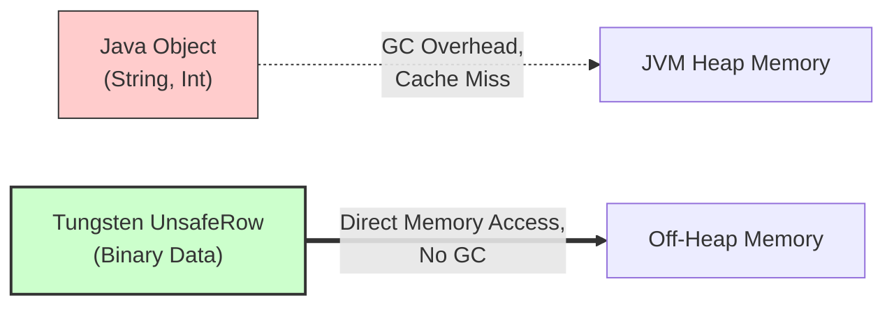

Khi các hệ thống Big Data thời kỳ đầu (Hadoop MapReduce, Spark 1.x) được thiết kế, cộng đồng Data Engineering mặc định rằng **Disk I/O** và **Network I/O** luôn là những nút thắt cổ chai (bottlenecks). Tuy nhiên, với sự trỗi dậy của SSD NVMe, kết nối mạng 100Gbps/400Gbps, và các định dạng lưu trữ dạng cột (Columnar Formats) như Parquet/ORC, bài toán I/O dần được giải quyết.

Databricks nhận ra một sự thật nghiệt ngã: Khi đĩa cứng và mạng không còn là rào cản, lõi thực thi của JVM (Java Virtual Machine) lại trở thành vật cản khổng lồ. 

**Project Tungsten** ra đời từ Spark 1.4 và hoàn thiện trong Spark 2.0+ không phải là một bản vá. Nó là cuộc cách mạng "đập đi xây lại" toàn bộ Engine, giúp mã nguồn Spark tiến sát đến mức "Bare-metal performance" (tốc độ của phần cứng trần) bằng cách quản lý bộ nhớ trực tiếp và sinh mã C++ giả lập trên nền JVM.

---

## 1. Sự Dịch Chuyển Nút Thắt (Bottleneck Shift) và Giới Hạn Của JVM

Sự phình to (Overhead) của Java Object là nỗi kinh hoàng cho bất kỳ hệ thống phân tán nào xử lý hàng tỷ record. Một chuỗi `"abcd"` (4 bytes) trong Java có thể chiếm tới 48 bytes RAM để chứa các header thông tin đối tượng (Object Header, Mark Word). Khi Spark phải xử lý hàng chục tỷ dòng dữ liệu, việc tạo ra hàng chục tỷ Java Objects sẽ lập tức kích hoạt bộ thu gom rác **Garbage Collection (GC)**.

Khi GC chạy, nó kích hoạt sự kiện *Stop-The-World* (STW). Trong một cụm (cluster) với hàng trăm Executors có Heap size 64GB, một đợt STW có thể đóng băng hệ thống trong vài phút, làm sụt giảm throughput (thông lượng) và thậm chí gây ra crash hệ thống do Timeout giữa các Node.

Để phá vỡ giới hạn này, Project Tungsten được xây dựng trên 3 trụ cột thiết kế chính:
1. **Memory Management and Binary Processing**
2. **Cache-aware Computation**
3. **Whole-Stage Code Generation (WSCG)**

---

## 2. Quản Lý Bộ Nhớ và Xử Lý Nhị Phân (Binary Processing)

Thay vì phó mặc bộ nhớ cho trình dọn rác JVM, Tungsten sử dụng API `sun.misc.Unsafe` của Java để cấp phát và thao tác trực tiếp với RAM, cơ chế này giống hệt hàm `malloc` trong C/C++.

### Kiến trúc Memory Layout: Cơ chế UnsafeRow

Dữ liệu không còn là Java Object. Tungsten thiết kế lại hoàn toàn cấu trúc lưu trữ thành **UnsafeRow** – bản chất là những dải byte thô (binary format).
Mỗi vùng nhớ do Tungsten kiểm soát được quản lý bởi một **Page** lớn (tương tự OS Virtual Memory). Một con trỏ 64-bit được dùng để truy xuất:
- `13-bit` đầu định danh Page Number.
- `51-bit` sau định vị Offset (độ dời) của dữ liệu bên trong Page.



Bằng cách loại bỏ Object Header, một row dữ liệu qua Tungsten nhỏ gọn hơn rất nhiều. Hơn thế nữa, vì dữ liệu nằm ở Off-Heap memory [hoặc được nhúng trong một `byte[]` cực lớn trên Heap], JVM GC hoàn toàn "mù" trước lượng dữ liệu này. Chi phí dọn rác giảm xuống gần bằng 0.

### Trade-offs: Cấp Phát Vùng Nhớ Off-Heap
- **Điểm lợi:** Hoàn toàn loại bỏ GC Pause cho Data Payload. Dữ liệu cực kỳ compact [nhỏ gọn]. Tránh được tình trạng OOM (Out-Of-Memory) của JVM do Fragmentation (phân mảnh bộ nhớ).
- **Rủi ro vận hành (Operational Risks):** Việc dùng Off-heap đòi hỏi khai báo chính xác qua cấu hình. Nếu cấp phát Off-heap lớn hơn RAM vật lý khả dụng của Container, hệ điều hành (YARN/K8s) sẽ thẳng tay kích hoạt **OOMKilled** (SIGKILL 9). Không có Exception nào được log lại trong JVM, Executor của bạn chỉ đơn giản là biến mất.

---

## 3. Tính Toán Nhận Thức Cache (Cache-aware Computation)

Tốc độ truy cập bộ nhớ là một thứ bậc khắc nghiệt: L1/L2 Cache của CPU mất ~0.5ns - 3ns, trong khi Main Memory (RAM) tốn ~100ns. 

Trong Java, các object thường liên kết qua các con trỏ (references) trỏ lung tung (scattered) trên Heap. Khi CPU truy xuất tuần tự, hiện tượng **Cache Miss** liên tục xảy ra. CPU buộc phải chờ 100ns để tải dữ liệu từ RAM lên thanh ghi.

Tungsten tổ chức dữ liệu nhị phân thành các mảng liền kề (contiguous memory arrays), giúp tối đa hóa khả năng **Hardware Prefetching** của CPU.

### Thuật Toán Cache-aware Sorting
Một ví dụ kinh điển về sức mạnh của Tungsten là thuật toán Sorting. Khi thực hiện Sort hàng tỷ Rows, việc load toàn bộ Row (vốn to lớn) lên CPU để so sánh là một thảm họa Cache.
Thay vào đó, Tungsten chỉ duy trì một mảng con trỏ 8-byte liền kề:
- **4-byte đầu (Key Prefix):** Chứa tiền tố của khóa dùng để so sánh (VD: 4 ký tự đầu của chuỗi).
- **4-byte sau (Pointer):** Chứa địa chỉ trỏ ngược về Row vật lý nằm dưới RAM.


CPU nạp toàn bộ mảng 8-byte này vào L1 Cache. Quá trình Sort diễn ra cực kỳ mượt mà. Đa số các phép so sánh (nhờ 4-byte Prefix) hoàn tất ngay tại L1 Cache mà không cần phải truy xuất Row gốc dưới RAM. Chỉ khi 2 Prefix giống hệt nhau, Tungsten mới dùng con trỏ để lội xuống RAM lấy dữ liệu đầy đủ.

---

## 4. Whole-Stage Code Generation (WSCG)

Trước Spark 2.0 (và trong hầu hết các database truyền thống), các toán tử (Operators) được liên kết theo mô hình **Volcano Iterator Model**. 

Ví dụ, câu lệnh SQL `SELECT count(*) FROM table WHERE age > 20` có Physical Plan gồm: `Scan -> Filter -> Aggregate`. 
Để lấy 1 record, toán tử `Aggregate` gọi hàm `Filter.next()`, toán tử `Filter` lại gọi `Scan.next()`. Hàng triệu dòng dữ liệu tương đương hàng chục triệu lời gọi hàm ảo (Virtual Function Calls). Các Virtual Calls này vô hiệu hóa các tối ưu của CPU như *Branch Prediction* và *Instruction Pipelining*.

Project Tungsten đập bỏ mô hình Iterator bằng kỹ thuật **Whole-Stage Code Generation**.
Nó gom (fuse) toàn bộ physical plan của một Stage lại, sau đó dùng trình biên dịch **Janino** (một siêu trình biên dịch Java in-memory siêu tốc) để tạo ra **một vòng lặp `for` khổng lồ duy nhất** ở dạng Java bytecode.

Không còn `next()`, không còn Virtual Calls. Dữ liệu khi chui vào L1 Cache sẽ đi qua `Filter` và `Aggregate` ngay trong cùng một chu kỳ của CPU Registers trước khi nhả kết quả cuối cùng. Hiệu năng tính toán tăng từ 2x đến 10x so với cách cũ.

---

## 5. Cấu Hình Thực Chiến (Code & Configurations)

### Cấu hình Off-Heap trong môi trường Production (K8s/YARN)
Để tận dụng tối đa Tungsten (đặc biệt khi Spark thực hiện Cache/Persist hoặc Shuffle lớn), bạn cần cấu hình Off-heap một cách cẩn thận.

```yaml
# spark-defaults.conf hoặc thông qua SparkOperator trên K8s
spark.memory.offHeap.enabled: "true"

# Cấp phát 8GB cho Tungsten Off-heap xử lý dữ liệu
spark.memory.offHeap.size: "8g" 

# Quan trọng: YARN/K8s container size = JVM Heap + Overhead.
# Overhead MẶC ĐỊNH chỉ là 10% Heap (thường quá bé). 
# Khi dùng Off-heap, bạn PHẢI tăng Overhead để bao bọc luôn phần Off-heap này.
spark.executor.memoryOverhead: "10g" 

# Kích hoạt WSCG (Mặc định là true từ Spark 2.0)
spark.sql.codegen.wholeStage: "true"
```

### Kiểm Chứng WSCG Bằng Code
Làm sao để biết Query của bạn có thực sự được Tungsten tối ưu hay đang fallback về Volcano model? Hãy dùng phương thức `.explain()` hoặc hàm debug:

```python
from pyspark.sql import SparkSession

spark = SparkSession.builder.appName("TungstenDemo").getOrCreate()
df = spark.range(1, 1000000)

# Một chuỗi Fused Operations
result = df.filter("id % 2 == 0").groupBy("id").count()

# In ra Physical Plan
result.explain()
```

Nếu trên output (hoặc Spark UI) có dấu sao `*` trước tên Node (VD: `*Filter`, `*HashAggregate`, `*Project`), điều đó chứng tỏ WSCG đã khởi chạy. Để xem chi tiết đoạn mã C++/Java khổng lồ do Tungsten sinh ra:

```python
# Gọi hàm nội bộ để in ra mã Generated Code
result.queryExecution.debug.codegen()
```

---

## 6. Troubleshooting & Rủi Ro Vận Hành

Dù Tungsten mang lại sức mạnh phần cứng cho Spark, bạn vẫn sẽ gặp rắc rối nếu vi phạm các thiết kế hệ thống cơ bản.

### Fallback to JVM Objects (Sự Cố Đánh Mất Lợi Thế Tungsten)
**Nguyên nhân:** Tungsten **CHỈ CÓ TÁC DỤNG** nếu Spark hiểu trọn vẹn Schema của dữ liệu. Nếu bạn sử dụng RDD (Resilient Distributed Dataset) chứa các Class tĩnh/Objects tùy biến trong Java/Scala, hay dùng UDF (User-Defined Functions) viết bằng Python/Java, Spark Engine sẽ bị "mù".
**Hậu quả:** Dữ liệu bắt buộc phải được Deserialize [giải mã] từ dạng UnsafeRow nhị phân sang Object Java/Python để chui qua hàm UDF. Lúc này, Tungsten thoái lui hoàn toàn về kiến trúc cũ, kéo theo chi phí Serialize/Deserialize khổng lồ và đánh thức Garbage Collector.
**Giải pháp:** 
- Tuyệt đối ưu tiên sử dụng DataFrames và Spark SQL Built-in Functions (các hàm có sẵn trong thư viện `pyspark.sql.functions`).
- Nếu bắt buộc phải dùng UDF, hãy cân nhắc sử dụng **Pandas UDF (Vectorized UDF)** khai thác nền tảng Apache Arrow, cho phép truyền dữ liệu nguyên khối (batch) trên bộ nhớ ngoài Heap mà không bị overhead lớn.

### Spilling to Disk (Hiện Tượng Tràn Đĩa Do Sort/Shuffle)
Trong các tác vụ Sort hoặc Hash-based Aggregation khổng lồ, vùng nhớ Off-heap có thể không đủ chứa toàn bộ UnsafeRow.
Thay vì báo lỗi OOM, Tungsten được thiết kế để kích hoạt cơ chế **Spill-to-disk** (ghi tạm xuống ổ cứng cục bộ của Worker).
**Triệu chứng:** Xem trên Spark UI, cột *Spill (Memory)* và *Spill (Disk)* bỗng hiện những con số khổng lồ (hàng trăm GB). Job đang chạy 10 phút bỗng kéo dài lên 2 tiếng. 
**Giải pháp:** 
- Bật AQE (Adaptive Query Execution - `spark.sql.adaptive.enabled=true`) để tự động chia nhỏ Partition bị Skew (lệch dữ liệu).
- Tăng `spark.executor.memory` và `spark.memory.offHeap.size` nếu tài nguyên Cluster còn dồi dào.
- Thay ổ đĩa cục bộ (Local Disk) của Node bằng các ổ SSD NVMe để nếu có xảy ra hiện tượng tràn (Spill) thì IOPS vẫn đủ cân tải.

---

## 7. Nguồn Tham Khảo (References)

* [Project Tungsten: Bringing Apache Spark Closer to Bare Metal - Databricks Engineering Blog][https://www.databricks.com/blog/2015/04/28/project-tungsten-bringing-spark-closer-to-bare-metal.html]
* [Deep Dive into Spark SQL's Catalyst Optimizer - Databricks][https://www.databricks.com/blog/2015/04/13/deep-dive-into-spark-sqls-catalyst-optimizer.html]
* [Apache Spark: A Unified Engine for Big Data Processing (CACM 2016 - Stanford & MIT]](https://cacm.acm.org/magazines/2016/11/209116-apache-spark/fulltext)
* Sách *Spark: The Definitive Guide* (Bill Chambers, Matei Zaharia).
