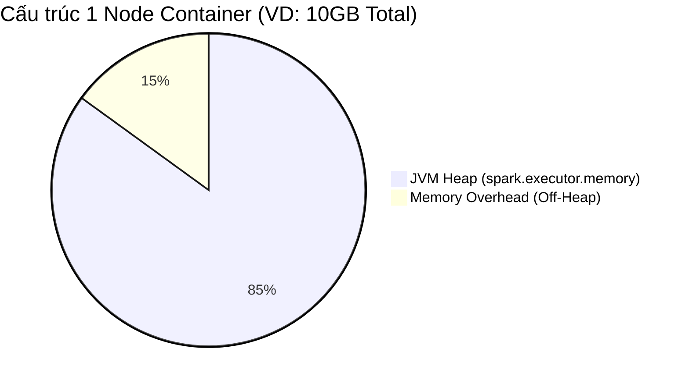

Một Job Spark chạy liên tục 4 tiếng đồng hồ trên 100 node đột ngột văng lỗi **`java.lang.OutOfMemoryError`** hoặc bị YARN thảm sát với thông báo **`Container killed for exceeding memory limits`**. Mọi tài nguyên đổ sông đổ biển. 

Đây không phải là lúc mù quáng ném thêm tiền mua RAM (Vertical Scaling). Để "chữa bệnh" OOM, kỹ sư cần hiểu rõ giới hạn vật lý của **Unified Memory Management** và nhận diện chính xác thành phần nào đang bị "xuất huyết".

---

## 1. Bản Đồ Phân Bổ Bộ Nhớ (Unified Memory Management)

Từ Spark 1.6, Spark thống nhất bộ nhớ của Executor (và Driver). Tổng lượng RAM do Container cấp (bởi YARN hoặc Kubernetes) được chia làm 2 khu vực tử địa:



1. **Memory Overhead (Off-Heap):** Do Hệ điều hành quản lý, không thuộc JVM. Chứa các Network Buffers, C/C++ native libs (Snappy nén), và tiến trình Python (khi dùng PySpark UDF).
2. **JVM Heap:** Vùng chạy lõi Java. Được chia tiếp:
   - **Reserved (300MB):** Dành riêng cho nền tảng Spark.
   - **User Memory (25%):** Chứa Hash Map tùy chỉnh, objects cục bộ.
   - **Spark Memory (75% - `spark.memory.fraction`):** Chia làm 2 vùng *cạnh tranh động*: 
     - *Storage Memory:* Dùng lưu Cache (`df.persist()`) và Broadcast variables.
     - *Execution Memory:* Nơi diễn ra các trận chiến đẫm máu (Shuffle, Join, Sort, Aggregate).


---

## 2. Driver OOM: Nút Thắt Nhạc Trưởng

Driver là node chỉ huy. Nó chỉ quản lý Metadata và lập lịch DAG, hoàn toàn không được thiết kế để chứa Data Payload.

**Triệu chứng:** Lỗi `java.lang.OutOfMemoryError: Java heap space` hiện lên ngay từ những bước build Execution Plan, hoặc khi job vừa kết thúc.

**Nguyên nhân thực chiến:**
1. **Lệnh `collect()` Tự Sát:** Data Engineer ngây thơ gọi `df.collect()`. Hàng trăm GB từ hàng trăm Executor bị nhồi ép đổ ngược về 1 node Driver chỉ có 4GB RAM.
2. **Broadcast Joins Phình To:** Tham số `spark.sql.autoBroadcastJoinThreshold` (mặc định 10MB) bị set quá tay (VD 1GB). Driver phải load 1GB này thành In-memory Collection rồi Serialize ném cho các Executor.
3. **Small Files Problem:** Đọc một Data Lake chứa hàng triệu file parquet 1KB. Driver phải nạp metadata (schema, file paths) của hàng triệu file vào User Memory.

**Kê Đơn Chữa Trị:**
- Tuyệt đối loại bỏ `collect()`, thay bằng `df.write.format("...").save()`.
- Chạy Job gom file (Compaction) định kỳ (như lệnh `OPTIMIZE` trong Delta Lake) trước khi đưa vào luồng đọc chính.

---

## 3. Executor OOM (JVM Heap): Spill-to-Disk và Rác GC

Executor là công nhân khuân vác. Khi gánh nặng của 1 Task vượt quá Execution Memory, dữ liệu tràn xuống đĩa (Spill-to-disk), job lết chậm như rùa. Khi Spill cũng không gánh nổi, OOM xảy ra.

**Triệu chứng:** Task bị fail và retry 4 lần liên tiếp. Trên Spark UI, thanh Garbage Collector (GC Time) đỏ quạch, chiếm hơn 20% thời gian chạy thực.

**Nguyên nhân thực chiến:**
1. **Data Skew (Ám Ảnh Phân Tán Bất Đối Xứng):** Đây là sát thủ số 1, được Uber Engineering nhắc đến như một thử thách cốt lõi. Khi JOIN, key chứa toàn `null` hoặc 1 ID phổ biến bị gom về chung 1 Partition. 99 node khác xử lý 10MB, riêng 1 node xui xẻo xử lý 100GB dữ liệu trung gian.
2. **Kích thước Shuffle Partition Quá Lớn:** Khởi tạo `spark.sql.shuffle.partitions` (Mặc định 200). 1 TB Data chia cho 200 khối = Mỗi khối 5GB nhồi vào 1 Executor.
3. **Cartesian Joins:** Lỗi logic SQL, Join quên điều kiện `ON`.

**Kê Đơn Chữa Trị (Hardcore):**
- **Salting Kỹ Thuật Số (Chống Skew):** Gắn thêm chuỗi ngẫu nhiên (Salt) vào khóa Join bị nghiêng để "lừa" Spark băm chúng rải đều qua nhiều hash buckets khác nhau, xử lý xong gỡ Salt ra.
- **Tăng số lượng Shuffle Partitions:** Tuning con số này sao cho mỗi Task chỉ gánh khoảng **128MB - 200MB**. (1TB data -> set 8000 partitions).
- **AQE:** Bật SkewJoin Tự Động của Spark 3.0: `spark.sql.adaptive.skewJoin.enabled = true`.

---

## 4. Ác Mộng Cấp Độ Hệ Thống: Container Killed by YARN

Khó chịu nhất là loại OOM này: Log trong JVM Heap vẫn vắng vẻ, trống trơn. Nhưng hệ thống (YARN/K8s) lại thẳng tay "rút phích cắm" (OOMKilled).

**Triệu chứng:** `Executor lost, Container killed by YARN for exceeding memory limits. 4.5 GB of 4.0 GB physical memory used. Consider boosting spark.yarn.executor.memoryOverhead.`

**Bản chất:** Lỗi này KHÔNG tràn RAM Java. Nó tràn vùng **Off-Heap / Memory Overhead**. Container Manager đếm tổng RAM thực tế của tiến trình.
- **Python UDF Overhead:** Dùng PySpark mà viết UDF thủ công. Spark đẩy dữ liệu qua IPC Sockets (Pipe) tới một tiến trình con Python. Dữ liệu truyền lớn -> Tiến trình Python ăn RAM phình to -> Vượt hạn mức 15% Overhead -> YARN bắn hạ.
- **Native Buffers (Netty/Arrow):** Dùng Apache Arrow cho Pandas UDF nhưng Batch size đẩy qua quá lớn, tràn bộ đệm mạng.

**Kê Đơn Chữa Trị:**
1. **Thủ Thuật Thô Bạo:** Mở rộng trần Memory Overhead.
```yaml
spark.executor.memoryOverhead: "2048m" 
# Hoặc 15-20% của executor.memory
```
2. **Pandas Vectorized UDF & Batch Limits:**
Thay thế Python UDF bằng `pandas_udf` (vận hành trên Arrow Columnar). Đồng thời, ép Batch size xuống mức an toàn để chống nghẽn Pipe:
```python
spark.conf.set("spark.sql.execution.arrow.maxRecordsPerBatch", "5000")
```
3. **Chuyển Ngữ (Rewrite):** Nếu logic UDF quá nặng và chạy trên hàng tỷ dòng, hãy nhờ DE gốc Java/Scala viết thành Native UDF. Tốc độ sẽ tăng 100x và dập tắt hoàn toàn lỗi Overhead.

---

## 5. Nguồn Tham Khảo (References)

* [Dynamic Executor Core Resizing in Spark - Uber Engineering Blog](https://www.uber.com/en-VN/blog/dynamic-executor-core-resizing-in-spark/)
* [Tuning Spark - Apache Spark Official Documentation](https://spark.apache.org/docs/latest/tuning.html)
* [Adaptive Query Execution in Spark 3.0 - Databricks Blog](https://databricks.com/blog/2020/05/29/adaptive-query-execution-speeding-up-spark-sql-at-runtime.html)
