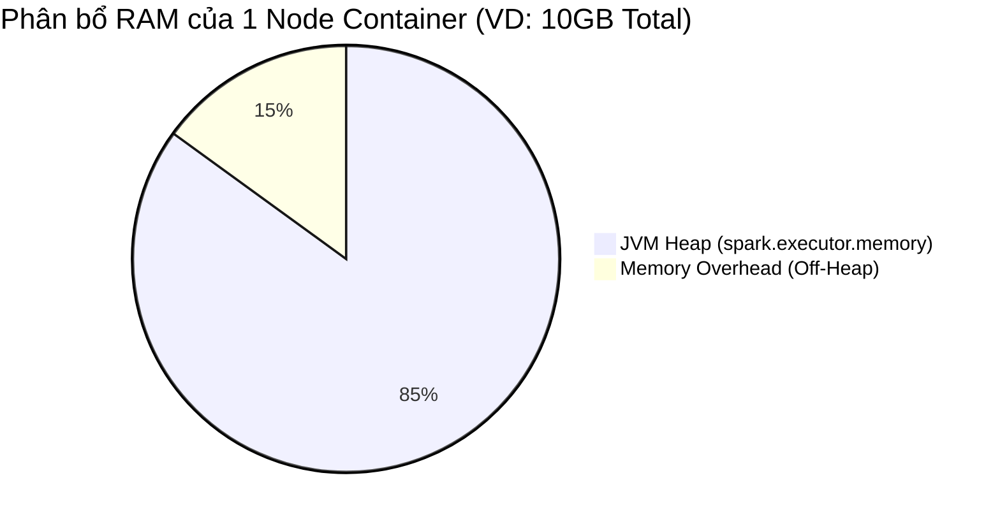

Một Job Spark chạy ổn định suốt 6 tháng, bỗng một ngày đẹp trời lăn đùng ra chết sau 4 tiếng chạy với dòng log **`java.lang.OutOfMemoryError`** hoặc bị YARN thảm sát không thương tiếc với thông báo **`Container killed for exceeding memory limits`**. Mọi tài nguyên tính toán đổ sông đổ biển. 

Đây không phải là lúc mù quáng ném thêm tiền mua RAM (Vertical Scaling). Các kỹ sư của Uber và Databricks đã nhiều lần khẳng định: "Việc nâng RAM chỉ trì hoãn cái chết, chứ không chữa dứt điểm OOM". Để "chữa bệnh" OOM một cách triệt để, kỹ sư cần hiểu rõ giới hạn vật lý của kiến trúc **Unified Memory Management** và nhận diện chính xác thành phần nào đang bị "xuất huyết".

---

## 1. Bản Đồ Phân Bổ Bộ Nhớ (Unified Memory Management)

Từ phiên bản Spark 1.6, Spark thống nhất bộ nhớ của Executor (và Driver). Tổng lượng RAM do Container Manager (như YARN hoặc Kubernetes) cấp phát được chia làm 2 khu vực "tử địa" rõ rệt:



1. **Memory Overhead (Off-Heap):** Do Hệ điều hành quản lý trực tiếp, không thuộc Java Virtual Machine (JVM). Vùng này chứa các Network Buffers, bộ đệm của C/C++ native libs (như Snappy nén data), và đặc biệt là tiến trình con Python (khi dùng PySpark UDF).
2. **JVM Heap:** Vùng chạy lõi của Java. Được chia tiếp thành các phần nhỏ:
   - **Reserved Memory (300MB):** Dành riêng cho nền tảng lõi của Spark hoạt động. Tuyệt đối không được đụng tới.
   - **User Memory (25%):** Chứa dữ liệu của người dùng, Hash Map tùy chỉnh, objects cục bộ được tạo ra trong code.
   - **Spark Memory (75% - được kiểm soát bởi tham số `spark.memory.fraction`):** Khu vực này chia làm 2 vùng *cạnh tranh động (dynamic eviction)*: 
     - *Storage Memory:* Dùng lưu Cache (`df.persist()`) và Broadcast variables. Nếu đầy, nó sẽ đẩy bớt dữ liệu ra đĩa (Evict).
     - *Execution Memory:* Nơi diễn ra các "trận chiến đẫm máu" (Shuffle, Join, Sort, Aggregate). Nếu Execution Memory cần thêm chỗ, nó có quyền "đá" (evict) dữ liệu của Storage Memory ra ngoài.

---

## 2. Driver OOM: Nút Thắt Nhạc Trưởng

Driver là node chỉ huy. Nó chỉ quản lý Metadata và lập lịch DAG, hoàn toàn không được thiết kế để chứa Data Payload (Dữ liệu thô thực tế). 

**Triệu chứng:** Lỗi `java.lang.OutOfMemoryError: Java heap space` hiện lên ngay từ những bước đầu tiên khi build Execution Plan, hoặc khi job vừa chạy xong Stage cuối cùng. Job chết ngay lập tức và ngắt kết nối với Cluster.

**Nguyên nhân thực chiến & Cách khắc phục:**

1. **Lệnh `collect()` Tự Sát:** 
   - **Nguyên nhân:** Data Engineer (hoặc Data Scientist) ngây thơ gọi `df.collect()` hoặc `df.toPandas()` trên một Dataset 50GB. Hàng trăm GB từ hàng ngàn Executor đồng loạt bị nhồi ép đổ ngược về qua mạng tới 1 node Driver chỉ có 4GB RAM.
   - **Khắc phục:** Tuyệt đối loại bỏ `collect()` trong production. Thay bằng `df.write.format("parquet").save("s3://...")`. Nếu cần lấy mẫu kiểm tra (sample), hãy dùng `df.limit(10).show()`.

2. **Broadcast Joins Phình To:** 
   - **Nguyên nhân:** Tham số `spark.sql.autoBroadcastJoinThreshold` (mặc định 10MB) bị Data Engineer ép cấu hình lên 1GB. Driver phải load 1GB này thành In-memory Collection rồi Serialize để ném qua mạng cho 1000 Executors. Quá trình Serialize này tạo ra object rác khổng lồ gây OOM.
   - **Khắc phục:** Không ép Broadcast nếu bảng > 50MB. Sử dụng cấu hình `-XX:+UseG1GC` cho Driver để tối ưu hóa quá trình dọn rác.

3. **Vấn đề Tệp Siêu Nhỏ (Small Files Problem):** 
   - **Nguyên nhân:** Đọc một phân vùng S3 chứa 5 triệu file parquet 1KB. Driver phải nạp toàn bộ cây metadata (schema, file paths) của 5 triệu file này vào User Memory để lên kế hoạch phân chia Task.
   - **Khắc phục:** Phải thiết kế một luồng ETL phụ để dọn dẹp và gom file (Compaction / Z-Ordering) định kỳ (ví dụ như chạy lệnh `OPTIMIZE` trong Delta Lake/Iceberg).

---

## 3. Executor OOM (JVM Heap): Data Skew và Rác GC

Executor là các node "công nhân khuân vác". Khi gánh nặng của 1 Task vượt quá Execution Memory, dữ liệu bị tràn xuống đĩa (Spill-to-disk - Memory Spill và Disk Spill lớn). Khi ổ đĩa cũng không cứu nổi, OOM sẽ xảy ra.

**Triệu chứng:** Trên Spark UI, Task bị báo chữ đỏ `FAILED` và retry 4 lần liên tiếp ở cùng một Stage. Tab Executors báo thanh GC Time (Garbage Collector) đỏ quạch, chiếm hơn 20-50% thời gian chạy thực tế của Task. 

**Nguyên nhân thực chiến & Đánh đổi (Trade-offs):**

1. **Data Skew (Ám Ảnh Phân Tán Bất Đối Xứng):** 
   - Đây là sát thủ số 1 được các kỹ sư hệ thống tại Uber và Databricks nhắc đến. Khi thực hiện `JOIN` hoặc `GROUP BY`, thuật toán Hash có thể gom toàn bộ dữ liệu chứa key `null` hoặc 1 ID cực kỳ phổ biến (ví dụ: `client_id = 'DEFAULT'`) về chung 1 Partition duy nhất. Hậu quả: 99 node khác chỉ phải xử lý 10MB, riêng 1 node xui xẻo gánh tới 100GB dữ liệu trung gian. Nó cố tạo In-memory Hash Table nhưng sụp đổ vì tràn RAM.

2. **Kích thước Shuffle Partition Quá Lớn:** 
   - Cấu hình `spark.sql.shuffle.partitions` mặc định là 200. Nếu Job xử lý 1 TB Data, đem chia cho 200 khối = Mỗi khối 5GB sẽ bị nhồi thẳng vào 1 Task.

**Code Khắc Phục (Hardcore Tuning):**

*Khắc phục bằng Salting (Chống Skew)*: Thêm nhiễu ngẫu nhiên vào khóa Join để băm nhỏ dữ liệu ra các phân vùng khác nhau. Quá trình này đòi hỏi phải nhân bản (explode) bảng dimension, đánh đổi tốn Compute để cứu vãn RAM.
```python
from pyspark.sql.functions import rand, col, concat, lit

# Bảng lớn (Fact) - Thêm nhiễu ngẫu nhiên từ 0 đến 9
fact_skewed = fact_df.withColumn("salt", (rand() * 10).cast("int"))
fact_skewed = fact_skewed.withColumn("join_key_salted", concat(col("skew_key"), lit("_"), col("salt")))

# Bảng nhỏ (Dimension) - Phải nhân bản (Explode) lên 10 lần để khớp với khóa Salt
# Đánh đổi: Bảng nhỏ phình to ra 10 lần, nhưng các Task của bảng lớn sẽ được chia đều
# ... (Code nhân bản dimension) ...

# Thực hiện Join trên khóa đã băm nhỏ
joined_df = fact_skewed.join(dim_exploded, fact_skewed.join_key_salted == dim_exploded.join_key_salted, "inner")
```

*Khắc phục bằng Cấu hình Spark (AQE & GC)*:
```bash
# Cấu hình tối ưu GC (Garbage Collection) và Kích hoạt AQE Skew Join
spark-submit \
  --conf "spark.sql.adaptive.enabled=true" \
  --conf "spark.sql.adaptive.skewJoin.enabled=true" \
  --conf "spark.sql.shuffle.partitions=4000" \ 
  --conf "spark.executor.extraJavaOptions=-XX:+UseG1GC -XX:MaxGCPauseMillis=200" \
  --conf "spark.serializer=org.apache.spark.serializer.KryoSerializer" \
  job.jar
```
*(Lưu ý: Tăng `shuffle.partitions` lên 4000 giúp chia nhỏ 1TB thành các khối 250MB, dễ dàng chui lọt qua giới hạn chật hẹp của JVM Heap mà không làm treo GC).*

---

## 4. Ác Mộng Cấp Độ Hệ Thống: Container Killed by YARN/K8s

Khó chịu và khó debug nhất là loại OOM này: Log trong JVM Heap vẫn vắng vẻ, báo bộ nhớ thừa thãi. Spark UI hiển thị màu xanh bình thường. Nhưng hệ thống quản lý Cluster (YARN hoặc Kubernetes) lại thẳng tay "rút phích cắm" bắn hạ node.

**Triệu chứng trong Logs:** `Executor lost, Container killed by YARN for exceeding memory limits. 4.5 GB of 4.0 GB physical memory used. Consider boosting spark.yarn.executor.memoryOverhead.`

**Bản chất vật lý:** Lỗi này **KHÔNG tràn RAM Java (JVM)**. Nó tràn vùng **Off-Heap / Memory Overhead**. YARN/K8s đứng ở ngoài vòng Java, nó đo tổng lượng RAM vật lý (Physical RAM) mà toàn bộ tiến trình Docker/Container đang sử dụng, và phát hiện nó vượt quá trần cấu hình.

**Nguyên nhân cốt lõi:**
- **Python UDF Overhead (Lỗi IPC):** Khi bạn viết User Defined Functions (UDF) bằng PySpark. Spark (chạy trên Java) phải đẩy (Serialize) hàng triệu dòng dữ liệu qua các Sockets IPC (Inter-Process Communication) tới một tiến trình con Python (`python worker daemon`). Nếu lượng dữ liệu truyền qua ống (Pipe) quá lớn, tiến trình Python ăn RAM phình to, vượt hạn mức 10% Overhead của Spark -> YARN bắn hạ cả cụm.
- **Native Buffers (Netty/Arrow):** Dùng thư viện C/C++ hoặc Apache Arrow cho Pandas UDF nhưng cấu hình Batch size đẩy qua bộ nhớ mạng quá lớn, gây phình buffer.

**Kê Đơn Chữa Trị & Code:**

1. **Thủ Thuật Thô Bạo (Scale-up Overhead):** Mở rộng trần Memory Overhead lên 20-30% thay vì 10% mặc định.
```yaml
# Định dạng cấu hình trong file spark-defaults.conf
spark.executor.memoryOverhead "2048m" 
```

2. **Tối ưu Pandas Vectorized UDF & Ép Batch Limits:**
Thay thế Python UDF chậm chạp bằng `pandas_udf` (vận hành trên định dạng Arrow Columnar). Đồng thời, ép Batch size xuống mức an toàn để chống nghẽn Socket IPC:
```python
# Giới hạn mỗi mẻ dữ liệu đẩy qua Arrow sang Python chỉ 5000 dòng để chống tràn RAM Off-heap
spark.conf.set("spark.sql.execution.arrow.maxRecordsPerBatch", "5000")
```

3. **Chuyển Ngữ [Rewrite / Native UDF]:** Đây là đánh đổi khắc nghiệt nhất. Nếu logic UDF quá nặng và bắt buộc phải chạy trên hàng chục tỷ dòng, hãy dẹp Python đi. Yêu cầu một Data Engineer code cứng Java hoặc Scala viết lại logic đó thành Native UDF (Native Spark Catalyst). Tốc độ sẽ tăng lên 100x và dập tắt hoàn toàn mọi lỗi Overhead rò rỉ bộ nhớ.

## 5. Nguồn Tham Khảo (References)

* [Dynamic Executor Core Resizing in Spark - Uber Engineering Blog][https://www.uber.com/en-VN/blog/dynamic-executor-core-resizing-in-spark/]
* [Tuning Spark - Apache Spark Official Documentation][https://spark.apache.org/docs/latest/tuning.html]
* [Adaptive Query Execution in Spark 3.0 - Databricks Blog](https://databricks.com/blog/2020/05/29/adaptive-query-execution-speeding-up-spark-sql-at-runtime.html]
