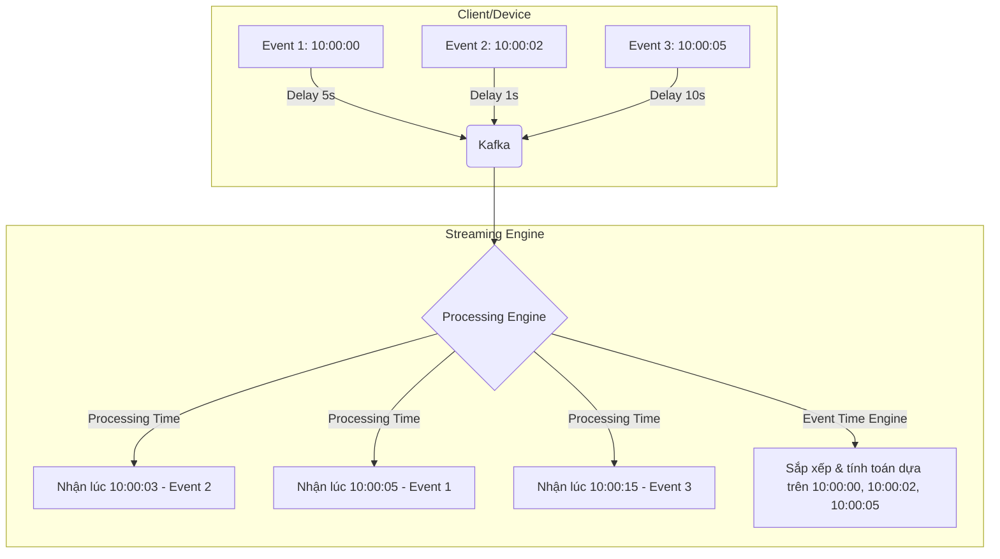

Khi chúng ta chuyển đổi từ mô hình xử lý dữ liệu theo lô (Batch Processing) sang xử lý dữ liệu luồng ([Streaming Processing](/concepts/4-realtime/streaming-processing/streaming-processing/)), có một khái niệm tưởng chừng rất đơn giản nhưng lại trở nên vô cùng phức tạp: **Thời gian**. 

Trong một hệ thống streaming hoạt động liên tục 24/7, việc định nghĩa "khi nào một sự kiện thực sự xảy ra" là chìa khóa để đảm bảo tính đúng đắn của toàn bộ báo cáo phân tích. Nếu không phân biệt rõ ràng giữa **Thời gian sự kiện (Event Time)** và **Thời gian xử lý (Processing Time)**, bạn sẽ rất dễ rơi vào bẫy sai lệch số liệu mà không thể nào tìm ra nguyên nhân.

## Kiến trúc và Sự khác biệt giữa Event Time và Processing Time

Hãy cùng làm rõ hai khái niệm này thông qua một ví dụ đơn giản:

* **Event Time (Thời gian sự kiện)**: Là mốc thời gian (timestamp) được ghi nhận trực tiếp tại thiết bị nguồn (như điện thoại của người dùng, cảm biến IoT) tại đúng thời điểm sự kiện đó thực sự diễn ra. Ví dụ: Khách hàng nhấn nút "Mua hàng" trên ứng dụng di động vào lúc **10:00:00**.
* **Processing Time (Thời gian xử lý)**: Là mốc thời gian hiển thị trên đồng hồ hệ thống của máy chủ xử lý dữ liệu (như cụm Apache Flink hoặc Spark Streaming) tại thời điểm nó thực sự nhận và xử lý bản ghi dữ liệu đó. Ví dụ: Do điện thoại của khách hàng bị mất sóng mạng tạm thời, sự kiện mua hàng lúc 10:00:00 chỉ thực sự được gửi tới máy chủ xử lý vào lúc **10:00:15**. Mốc 10:00:15 chính là Processing Time.

## Tại sao mạng internet làm phức tạp hóa khái niệm thời gian?

Trong một thế giới lý thuyết lý tưởng, mạng internet có tốc độ truyền tải vô hạn và không bao giờ gặp sự cố. Khi đó, Event Time và Processing Time sẽ hoàn toàn trùng khớp nhau. 

Thế nhưng, trong thế giới thực tế, dữ liệu truyền đi qua mạng luôn phải đối mặt với hai vấn đề lớn:
1. **Dữ liệu đến muộn (Late Data)**: Một chiếc điện thoại chui vào tầng hầm mất sóng mạng suốt 1 tiếng. Trong 1 tiếng đó, người dùng vẫn thực hiện các thao tác trên app (các sự kiện vẫn được ghi nhận Event Time đều đặn). Khi người dùng ra khỏi tầng hầm và có sóng mạng trở lại, điện thoại sẽ đồng loạt gửi bù tất cả các sự kiện này lên server.
2. **Sai lệch thứ tự (Out-of-order Data)**: Do các gói tin đi qua các con đường định tuyến mạng khác nhau, sự kiện xảy ra sau có thể đến server trước sự kiện xảy ra trước.

Hãy tưởng tượng bạn đang viết một chương trình tính toán doanh thu từng giờ của doanh nghiệp. Nếu bạn sử dụng Processing Time (đồng hồ của server), các sự kiện mua hàng của ngày hôm qua (do điện thoại mất sóng gửi bù lên hôm nay) sẽ bị tính gộp vào doanh thu của ngày hôm nay. Điều này làm sai lệch hoàn toàn biểu đồ báo cáo tài chính.

## Sự đánh đổi cốt lõi: Độ trễ (Latency) vs Độ chính xác (Accuracy)

Để giải quyết triệt để vấn đề dữ liệu đến muộn, các engine xử lý luồng hiện đại cho phép chúng ta tách rời hoàn toàn kết quả tính toán khỏi thời điểm dữ liệu được xử lý bằng cách cấu hình hệ thống chạy theo **Event Time**:

* **Xử lý theo Processing Time**: Hệ thống chạy cực nhanh, có dữ liệu đổ về là xử lý ngay lập tức (độ trễ bằng 0), không cần tốn bộ nhớ để chờ đợi. Tuy nhiên, kết quả thu được sẽ không mang tính tất định (non-deterministic) – nghĩa là nếu bạn chạy lại luồng dữ liệu đó lần thứ hai, kết quả thu được sẽ khác lần thứ nhất do độ trễ mạng tại mỗi thời điểm là khác nhau.
* **Xử lý theo Event Time**: Hệ thống đảm bảo tính chính xác tuyệt đối và kết quả là tất định (chạy lại 100 lần vẫn ra một kết quả duy nhất). Để làm được điều này, hệ thống phải sử dụng một cơ chế gọi là **Watermark** để ước lượng và "chờ đợi" các dữ liệu đến muộn trước khi chính thức chốt sổ tính toán. Việc chờ đợi này vô tình làm tăng độ trễ của kết quả đầu ra.

## Minh họa luồng dữ liệu đến muộn và bị lệch thứ tự

Dưới đây là sơ đồ minh họa sự khác biệt khi xử lý dữ liệu:


Nếu chạy theo Processing Time, hệ thống sẽ gom nhóm và tính toán các sự kiện theo đúng thứ tự thời gian thực tế nhận được (Event 2 $\rightarrow$ Event 1 $\rightarrow$ Event 3). Chỉ khi chạy theo Event Time, hệ thống mới có khả năng sắp xếp lại dữ liệu về đúng vị trí thời gian gốc của chúng.

## Thực hành: Thiết lập Event Time và Watermark trong PySpark

Dưới đây là đoạn code Python minh họa cách cấu hình trích xuất Event Time từ bản ghi sự kiện, thiết lập Watermark chờ tối đa 5 giây cho dữ liệu đến muộn, và thực hiện gom nhóm (aggregation) theo cửa sổ thời gian ([Windowing](/concepts/4-realtime/streaming-processing/windowing/)) trong PySpark Structured Streaming:
```python
from pyspark.sql import SparkSession
from pyspark.sql.functions import col, window, from_json

spark = SparkSession.builder \
    .appName("EventTimeWatermarkingExample") \
    .getOrCreate()

# Đọc luồng dữ liệu từ Kafka
# Giả sử nhận message payload dạng JSON từ Kafka topic
df_kafka = spark.readStream \
    .format("kafka") \
    .option("kafka.bootstrap.servers", "localhost:9092") \
    .option("subscribe", "user_clicks") \
    .load()

# Giải mã dữ liệu JSON từ trường 'value'
# Định dạng payload: {"ad_id": "ad_123", "click_timestamp": "2026-06-08T10:00:00Z"}
clicks_df = df_kafka.selectExpr("CAST(value AS STRING) as json_payload") \
    .select(from_json(col("json_payload"), "ad_id STRING, click_timestamp TIMESTAMP").alias("data")) \
    .select("data.*")

# Cấu hình Watermark (chờ tối đa 5 giây cho dữ liệu đến muộn)
# và thực hiện đếm số lượt click theo cửa sổ thời gian 1 phút (Tumbling Window)
windowed_counts = clicks_df \
    .withWatermark("click_timestamp", "5 seconds") \
    .groupBy(
        window(col("click_timestamp"), "1 minute"),
        col("ad_id")
    ).count()

# Ghi kết quả ra console ở chế độ Append
query = windowed_counts.writeStream \
    .format("console") \
    .outputMode("append") \
    .start()

query.awaitTermination()
```

---

## Khi nào nên dùng

* **Nên dùng Event Time khi**:
  * Cần tính toán độ chính xác tuyệt đối như báo cáo tài chính, thống kê KPI kinh doanh, phân tích hành vi người dùng.
  * Cần khả năng chạy lại (re-process) dữ liệu lịch sử để sửa lỗi hoặc cập nhật logic mà vẫn giữ nguyên kết quả ban đầu.
  * Dữ liệu từ thiết bị Client có khả năng cao bị trễ mạng hoặc lệch thứ tự.
* **Nên dùng Processing Time khi**:
  * Cần phát hiện bất thường ngay lập tức (Real-time alerting), giám sát CPU/RAM máy chủ, theo dõi lưu lượng mạng tức thì.
  * Muốn tối ưu bộ nhớ RAM và CPU trên cụm xử lý do không cần lưu trữ trạng thái chờ đợi.
  * Độ chính xác tuyệt đối của thời gian không quá quan trọng bằng tốc độ phản hồi.

## Sai lầm thường gặp và Best Practices

### Best Practices
* **Kinh doanh dùng Event Time, Giám sát dùng Processing Time**: Hãy luôn ưu tiên dùng Event Time cho các số liệu báo cáo nghiệp vụ (doanh thu, lượt chuyển đổi khách hàng) để đảm bảo tính chính xác tuyệt đối. Ngược lại, đối với các hệ thống giám sát hạ tầng kỹ thuật (như đo lường CPU/RAM, đo số lượng request lỗi của máy chủ), hãy dùng Processing Time vì bạn cần phát hiện cảnh báo lỗi ngay lập tức mà không muốn chờ đợi dữ liệu đến muộn.
* **Luôn cấu hình Side-Output**: Dù đã thiết lập Watermark chờ đợi, vẫn có những sự kiện đến siêu muộn (ví dụ thiết bị tắt mạng cả tuần). Hãy cấu hình một đường dẫn phụ (Side-Output) để hứng và xử lý riêng lượng dữ liệu siêu muộn này, tránh việc hệ thống âm thầm vứt bỏ chúng làm mất mát dữ liệu.

### Sai lầm thường gặp (Common Pitfalls)
* **Dùng Processing Time cho việc nạp Data Warehouse**: Ghi nhận dữ liệu vào bảng tính toán dựa trên Processing Time sẽ khiến bạn không thể nào chạy lại dữ liệu lịch sử (re-process) khi hệ thống gặp lỗi phần mềm, vì toàn bộ dữ liệu lịch sử khi chạy lại sẽ bị gán mốc thời gian của ngày hôm nay.
* **Bẫy đồng hồ thiết bị nguồn bị lệch (Clock Skew)**: Rất nhiều thiết bị người dùng (điện thoại) bị sai giờ hệ thống do người dùng chỉnh tay hoặc lỗi pin. Điều này dẫn đến Event Time gửi lên bị lệch hàng tháng trời. Hãy thiết lập bộ lọc tại API Gateway để đối chiếu Event Time với thời điểm nhận (Ingestion Time). Nếu độ lệch vượt quá một ngưỡng an toàn (ví dụ: quá 24 tiếng), hãy dùng Ingestion Time làm mốc thời gian thay thế.

---

## Điểm mạnh và điểm yếu

### Event Time
* **Ưu điểm (Pros)**: Chính xác tuyệt đối, kết quả có tính tất định, có khả năng tái lập lại dữ liệu lịch sử khi cần sửa code.
* **Nhược điểm & Đánh đổi (Cons & Trade-offs)**: Hệ thống phải chờ đợi dữ liệu muộn nên kết quả bị trễ, tốn nhiều RAM của server để duy trì trạng thái của các cửa sổ thời gian đang mở.

### Processing Time
* **Ưu điểm (Pros)**: Tốc độ xử lý tức thì, độ trễ bằng 0, tiết kiệm bộ nhớ RAM tối đa vì không cần lưu trạng thái chờ đợi.
* **Nhược điểm & Đánh đổi (Cons & Trade-offs)**: Kết quả không chính xác nếu xảy ra nghẽn mạng, không thể chạy lại dữ liệu cũ để phục hồi số liệu lịch sử.

---

## Trọng tâm ôn luyện phỏng vấn

### 1. Sự khác biệt cốt lõi giữa Event Time và Processing Time là gì?
* **Gợi ý trả lời**: Event Time là mốc thời gian xảy ra sự kiện được ghi nhận trực tiếp từ thiết bị nguồn phát sinh dữ liệu, trong khi Processing Time là thời gian ghi nhận bởi đồng hồ hệ thống của máy chủ xử lý dữ liệu tại thời điểm nó nhận được bản ghi. Processing Time phụ thuộc vào điều kiện mạng vật lý và tải của server nên kết quả tính toán sẽ không mang tính tất định. Event Time khắc phục điều này bằng cách neo chặt tính toán vào mốc thời gian gốc của sự kiện, kết hợp với cơ chế Watermark để quản lý dữ liệu đến muộn, đảm bảo tính đúng đắn tuyệt đối của dữ liệu.

### 2. Ingestion Time là gì và nó đứng ở đâu giữa Event Time và Processing Time?
* **Gợi ý trả lời**: Ingestion Time là mốc thời gian được ghi nhận khi sự kiện đi vào hệ thống trung gian đầu tiên (ví dụ như khi đi vào Kafka Broker). Ingestion Time nằm ở giữa hai khái niệm kia: nó chính xác và ít bị biến động hơn Processing Time vì không phụ thuộc vào hàng đợi hay độ trễ của worker xử lý phía sau, nhưng nó vẫn không phản ánh đúng hoàn toàn thời điểm xảy ra sự kiện nếu đường truyền mạng từ client lên Kafka bị tắc nghẽn. Ingestion Time thường được dùng làm giải pháp thay thế (fallback) khi thiết bị nguồn không thể tạo ra mốc thời gian Event Time đáng tin cậy.

### 3. Điều gì sẽ xảy ra nếu chúng ta dùng Processing Time để chạy lại (re-process) dữ liệu lịch sử của tuần trước?
* **Gợi ý trả lời**: Nếu dùng Processing Time để chạy lại dữ liệu, toàn bộ các sự kiện của tuần trước khi đi qua hệ thống sẽ bị gán mốc thời gian của ngày hôm nay (thời điểm chúng ta đang chạy lại job). Kết quả là dữ liệu tuần trước sẽ bị tính dồn vào các cửa sổ thời gian của ngày hôm nay, làm sai lệch và hỏng hoàn toàn toàn bộ số liệu thống kê. Chỉ có Event Time mới giúp việc chạy lại dữ liệu lịch sử cho ra kết quả chính xác giống hệt như khi chạy thực tế ban đầu.

---

## Xem thêm các khái niệm liên quan
* [Apache Kafka](/concepts/4-realtime/streaming-processing/apache-kafka/)
* [Consumer Groups trong Kafka](/concepts/4-realtime/streaming-processing/consumer-groups/)
* [Exactly-Once Semantics (EOS) - Xử lý chính xác một lần](/concepts/4-realtime/streaming-processing/exactly-once-semantics/)

## Tài liệu tham khảo

1. [Apache Flink Event Time and Watermarks](https://nightlies.apache.org/flink/flink-docs-stable/docs/concepts/time/) - Apache Flink Documentation
2. [Spark Structured Streaming Programming Guide](https://spark.apache.org/docs/latest/structured-streaming-programming-guide.html) - Apache Spark Documentation
3. [Google Cloud Dataflow: Event Time vs Processing Time](https://cloud.google.com/dataflow/docs/concepts/streaming-pipelines) - Google Cloud Docs
4. [AWS MSK Best Practices for Time Tracking](https://docs.aws.amazon.com/msk/latest/developerguide/best-practices.html) - Amazon Web Services
5. [Azure Stream Analytics Time Management](https://learn.microsoft.com/en-us/azure/stream-analytics/stream-analytics-time-handling) - Microsoft Learn
6. [Streaming Systems](https://www.oreilly.com/library/view/streaming-systems/9781491983812/) - Tyler Akidau, Slava Chernyak, and Reuven Lax

## Khái niệm liên quan

* [Watermark](/concepts/4-realtime/streaming-processing/watermark/)
* [Batch Processing](/concepts/3-integration/batch-processing/batch-processing/)
* [Exactly-Once Semantics](/concepts/4-realtime/streaming-processing/exactly-once-semantics/)

---

## English Summary

In stream processing, understanding the concept of time is critical. **Event Time** is the timestamp assigned to an event when it actually occurs at the source device. **Processing Time** is the system clock time of the streaming engine when it processes the event. Due to network latency and disconnections, events often arrive out-of-order or late. Using Processing Time yields low latency but non-deterministic and inaccurate results for business logic. Event Time guarantees correctness and reproducibility by placing events into their correct temporal context, albeit requiring mechanisms like Watermarks to handle late data and increasing state memory usage.