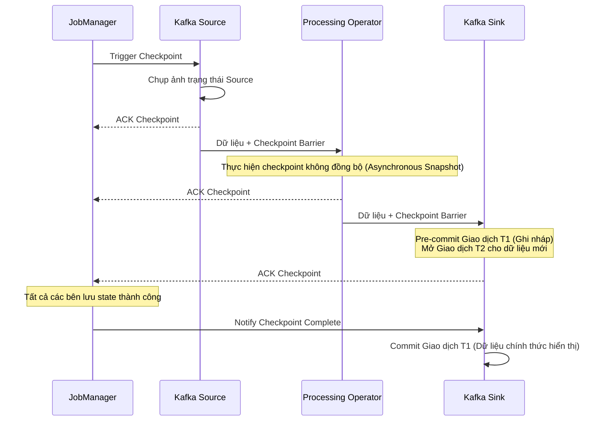

Trong các hệ thống phân tán xử lý dữ liệu lớn, việc đối mặt với sự cố là không thể tránh khỏi: mất kết nối mạng, máy chủ dừng hoạt động đột ngột hoặc lỗi phần mềm xảy ra trong quá trình vận hành. 

Khi sự cố xảy ra, luồng dữ liệu đang truyền tải có thể bị gián đoạn. Để đảm bảo dữ liệu không bị thất thoát hoặc bị xử lý lặp lại gây sai lệch kết quả phân tích, hệ thống cần áp dụng cơ chế **Exactly-Once Semantics (EOS)**.

**Exactly-Once Semantics (EOS) – Ngữ nghĩa xử lý chính xác một lần** là chuẩn đảm bảo cao nhất về độ tin cậy trong các hệ thống xử lý dữ liệu luồng ([Streaming Processing](/concepts/4-realtime/streaming-processing/streaming-processing/)).

## Tác động của lỗi hệ thống đối với tính nhất quán dữ liệu

Xét ví dụ về ứng dụng xử lý giao dịch tài chính hoặc trừ tiền ví điện tử theo thời gian thực với yêu cầu nạp 100 USD vào tài khoản:

* **At-most-once (Tối đa một lần)**: Máy chủ nhận lệnh nạp tiền và bắt đầu xử lý nhưng dừng hoạt động đột ngột trước khi kịp ghi nhận vào cơ sở dữ liệu. Dữ liệu bị thất thoát, tài khoản ngân hàng bị trừ tiền nhưng số dư ví điện tử không được cập nhật.
* **At-least-once (Ít nhất một lần)**: Máy chủ xử lý nạp tiền thành công nhưng gặp sự cố mạng khi gửi phản hồi xác nhận. Thiết bị gửi (client) tự động gửi lại yêu cầu nạp tiền do không nhận được phản hồi. Máy chủ xử lý yêu cầu mới này, dẫn đến việc tài khoản bị cộng tiền hai lần (200 USD thay vì 100 USD) dù khách hàng chỉ thực hiện một giao dịch.

Để giải quyết bài toán này, hệ thống cần hoạt động theo cơ chế **Exactly-Once Semantics**. Hệ thống phải đảm bảo rằng dù lỗi phần cứng hay sự cố mạng xảy ra, mỗi sự kiện đầu vào chỉ tác động đến kết quả đầu ra đúng **một lần duy nhất**.

## Ba cấp độ đảm bảo truyền tin (Delivery Guarantees)

Trong thiết kế hệ thống tin nhắn và xử lý luồng, có 3 cấp độ đảm bảo truyền tin:

1. **At-most-once (Tối đa một lần)**: Tin nhắn được gửi đi mà không có cơ chế gửi lại (retry). Phương thức này có độ trễ thấp và tốn ít tài nguyên nhất nhưng không đảm bảo tính toàn vẹn dữ liệu.
2. **At-least-once (Ít nhất một lần)**: Tin nhắn được gửi đi và hệ thống chờ xác nhận (ACK). Nếu quá thời gian phản hồi mà chưa nhận được ACK, tin nhắn sẽ được gửi lại. Cơ chế này đảm bảo dữ liệu không bị thất thoát nhưng có thể gây ra trùng lặp (duplicate) khi mạng gặp sự cố.
3. **Exactly-once (Chính xác một lần)**: Đảm bảo dữ liệu không bị thất thoát và hệ thống đích chỉ ghi nhận xử lý đúng một lần duy nhất, loại bỏ hoàn toàn trùng lặp.

## Sự phối hợp giữa Source, Processor và Sink trong End-to-End Exactly-Once

Việc kích hoạt cấu hình Exactly-Once trên engine xử lý (như Apache Flink) chỉ đảm bảo tính chính xác cho trạng thái nội bộ (internal state). Để đạt được Exactly-Once toàn diện từ đầu tới cuối (End-to-End Exactly-Once), cả ba thành phần trong đường ống dữ liệu (data pipeline) phải phối hợp chặt chẽ:
1. **Nguồn dữ liệu (Source)**: Phải hỗ trợ phát lại dữ liệu từ vị trí cụ thể (ví dụ: Apache Kafka cho phép đọc lại từ một `offset` xác định).
2. **Bộ xử lý (Processor)**: Có khả năng lưu trạng thái tính toán tại mỗi thời điểm (State Snapshots / Checkpointing) không đồng bộ. Khi gặp sự cố, bộ xử lý khôi phục trạng thái về điểm checkpoint gần nhất và yêu cầu Source phát lại dữ liệu từ offset tương ứng.
3. **Đích đến (Sink)**: Khi dữ liệu được phát lại, Sink phải có cơ chế tránh ghi trùng lặp vào hệ thống đích thông qua hai giải pháp:
   * **Idempotent Sink (Ghi lũy đẳng)**: Thực hiện ghi đè dữ liệu theo Khóa chính (Primary Key). Phép toán ghi đè $x=10$ chạy nhiều lần thì giá trị của $x$ vẫn không thay đổi.
   * **Transactional Sink (Giao dịch hai pha - 2PC)**: Chỉ thực sự hoàn tất (commit) dữ liệu vào hệ thống đích sau khi bộ xử lý hoàn tất quá trình lưu checkpoint thành công.

## Cơ chế hoạt động của Apache Flink và Kafka

Sự kết hợp giữa Apache Flink (Processor) và Apache Kafka (Source & Sink) là mô hình phổ biến để đạt được Exactly-Once nhờ giao thức **Two-Phase Commit (Giao dịch 2 pha - 2PC)**:


1. **Pha 1 - Pre-Commit**: `JobManager` của Flink gửi lệnh kích hoạt checkpoint (`Trigger Checkpoint`) đến `Kafka Source`. `Kafka Source` chèn một dấu mốc đặc biệt gọi là **Checkpoint Barrier** vào luồng dữ liệu. Khi các bộ xử lý nhận được Barrier, chúng chụp ảnh lại trạng thái hiện tại (State) không đồng bộ và ghi lên bộ lưu trữ bền vững (như S3). Trong quá trình này, `Kafka Sink` liên tục ghi dữ liệu vào Kafka thông qua một giao dịch đang mở. Khi nhận được Barrier, `Kafka Sink` thực hiện **Pre-Commit** giao dịch đó (T1) và mở một giao dịch mới (T2) cho dữ liệu tiếp theo. Dữ liệu trong T1 đã được ghi lên Kafka nhưng ở trạng thái chưa commit, nên các Consumer ở chế độ `read_committed` chưa thể đọc được.
2. **Pha 2 - Commit**: Khi `JobManager` nhận được xác nhận (ACK) hoàn thành checkpoint từ tất cả các tác vụ trong luồng, nó sẽ phát thông báo hoàn tất checkpoint (`Notify Checkpoint Complete`). Khi nhận được thông báo này, `Kafka Sink` thực hiện lệnh `COMMIT` cho giao dịch T1 để dữ liệu chính thức hiển thị cho Consumer.

Nếu xảy ra lỗi trước khi hoàn tất Pha 2, Flink sẽ hủy bỏ (abort) các giao dịch chưa được commit, khôi phục trạng thái từ checkpoint thành công gần nhất và xử lý lại dữ liệu từ offset tương ứng.

## Thực hành: Cấu hình Exactly-Once trong Java API

Dưới đây là cách bạn kích hoạt ngữ nghĩa xử lý chính xác một lần trong ứng dụng Java chạy trên Apache Flink kết nối với Kafka:
```java
StreamExecutionEnvironment env = StreamExecutionEnvironment.getExecutionEnvironment();

// Kích hoạt cơ chế lưu ảnh trạng thái (Checkpointing) định kỳ mỗi 10 giây ở chế độ EXACTLY_ONCE
env.enableCheckpointing(10000, CheckpointingMode.EXACTLY_ONCE);

KafkaSource<String> source = KafkaSource.<String>builder()
    .setBootstrapServers("broker:9092")
    .setTopics("input-topic")
    .setGroupId("my-group")
    .setValueOnlyDeserializer(new SimpleStringSchema())
    .build();

DataStream<String> stream = env.fromSource(source, WatermarkStrategy.noWatermarks(), "Kafka Source");

// Thực hiện các logic biến đổi dữ liệu...
DataStream<String> result = stream.map(s -> "Processed: " + s);

KafkaSink<String> sink = KafkaSink.<String>builder()
    .setBootstrapServers("broker:9092")
    .setRecordSerializer(KafkaRecordSerializationSchema.builder()
        .setTopic("output-topic")
        .setValueSerializationSchema(new SimpleStringSchema())
        .build()
    )
    // Kích hoạt chế độ ghi Exactly-Once cho Sink
    .setDeliveryGuarantee(DeliveryGuarantee.EXACTLY_ONCE)
    .setTransactionalIdPrefix("my-txn-id-prefix-")
    .build();

result.sinkTo(sink);
```

*Lưu ý quan trọng:* Ở phía các ứng dụng đọc dữ liệu từ Kafka đầu ra (Consumer), bạn bắt buộc phải cấu hình thuộc tính `isolation.level = read_committed`. Cấu hình này giúp Consumer chỉ đọc những dữ liệu đã được commit chính thức, bỏ qua các dữ liệu nháp của các giao dịch chưa hoàn tất.

## Giải pháp thay thế và các lỗi thường gặp

### Giải pháp thay thế bằng Lũy đẳng (Idempotent Sinks)
Giao thức giao dịch hai pha (2PC) có độ phức tạp cao và ảnh hưởng đến hiệu năng ghi. Nếu hệ thống đích hỗ trợ ghi đè theo Khóa chính (Primary Key) như Redis, Cassandra, Elasticsearch hoặc sử dụng lệnh `INSERT ON CONFLICT UPDATE` trong SQL, lập trình viên có thể tận dụng tính chất **Lũy đẳng ([Idempotency](/concepts/3-integration/etl-elt/idempotency/))**. 

Bằng cách thiết kế khóa chính duy nhất cho mỗi bản ghi, hệ thống chỉ cần hoạt động ở chế độ **At-least-once**. Khi xảy ra sự cố và dữ liệu bị ghi lại, cơ sở dữ liệu đích tự động cập nhật đè lên bản ghi cũ, đảm bảo kết quả cuối cùng tương đương với cơ chế Exactly-Once với hiệu năng tốt hơn.

### Các lỗi thường gặp (Common Mistakes)
* **Thực hiện các cuộc gọi API bên ngoài trực tiếp trong luồng xử lý**: Việc gọi các dịch vụ HTTP REST API bên ngoài trực tiếp trong các toán tử map/flatmap của Flink không được bảo vệ bởi cơ chế checkpoint hay giao dịch 2PC. Nếu luồng xử lý gặp lỗi và phải chạy lại, các cuộc gọi API này sẽ bị thực hiện lặp lại, gây ảnh hưởng đến hệ thống bên ngoài.
* **Bỏ sót cấu hình isolation level ở Consumer**: Nếu ứng dụng downstream đọc từ Kafka không cấu hình thuộc tính `isolation.level = read_committed`, nó sẽ đọc cả các tin nhắn chưa được commit (nháp) thuộc các giao dịch bị hủy, dẫn đến hiện tượng trùng lặp số liệu khi có sự cố xảy ra.

## Điểm mạnh và điểm yếu

### Ưu điểm
* Giảm độ phức tạp khi thiết kế ứng dụng do không cần tự triển khai logic loại bỏ trùng lặp dữ liệu ([deduplication](/concepts/3-integration/etl-elt/deduplication/)) ở tầng ứng dụng.
* Đảm bảo tính đúng đắn tuyệt đối cho các ứng dụng tài chính, hóa đơn, thanh toán.

### Nhược điểm
* **Tăng độ trễ (Latency Penalty)**: Vì dữ liệu tại Sink chỉ được commit sau khi checkpoint hoàn tất (chu kỳ checkpoint thường từ vài giây đến vài phút), dữ liệu đầu ra không hiển thị ngay lập tức cho các ứng dụng đọc ở chế độ `read_committed`.
* **Tiêu hao tài nguyên**: Cơ chế snapshot trạng thái liên tục yêu cầu tài nguyên I/O đĩa và băng thông mạng lớn để lưu trữ trạng thái lên State Backend.

## Khi nào nên dùng

* Các ứng dụng liên quan đến tiền tệ, tài chính, thanh toán trực tuyến, ví điện tử.
* Hệ thống tính toán chỉ số quảng cáo (AdTech) nơi mỗi lượt click chuột đều ảnh hưởng trực tiếp đến hóa đơn tiền mặt của khách hàng.
* Các hệ thống phân tích dữ liệu lớn yêu cầu độ chính xác tuyệt đối của các chỉ số KPI.

Không cần thiết áp dụng cho các hệ thống giám sát log kỹ thuật thông thường (lệch một vài dòng log không ảnh hưởng tới hoạt động kinh doanh) hoặc các hệ thống cảnh báo IoT cần độ trễ dưới giây (sub-second latency).

## Khái niệm liên quan

* State Management
* [Apache Kafka](/concepts/4-realtime/streaming-processing/apache-kafka/)
* Apache Flink

## Trọng tâm ôn luyện phỏng vấn

### 1. Sự khác biệt cốt lõi giữa At-least-once và Exactly-once là gì?
* **Gợi ý trả lời**: At-least-once bảo chứng rằng không có tin nhắn nào bị mất bằng cách gửi lại tin nhắn nếu không nhận được xác nhận (ACK). Tuy nhiên, nếu xảy ra chập chờn mạng, tin nhắn có thể bị ghi nhận nhiều lần gây trùng lặp dữ liệu. Exactly-once nâng cấp hơn bằng cách kết hợp cơ chế lưu trạng thái (State Checkpointing) và giao dịch (Transactions). Dù tin nhắn có bị gửi lại bao nhiêu lần đi chăng nữa, hệ thống đảm bảo tác động của nó lên trạng thái cuối cùng của cơ sở dữ liệu chỉ diễn ra đúng một lần duy nhất, loại bỏ hoàn toàn hiện tượng trùng lặp.

### 2. "End-to-End Exactly-Once" nghĩa là gì và tại sao chỉ cấu hình ở engine xử lý (như Flink) là chưa đủ?
* **Gợi ý trả lời**: "End-to-End Exactly-Once" yêu cầu toàn bộ các mắt xích trong đường ống dữ liệu bao gồm Nguồn (Source) $\rightarrow$ Bộ xử lý (Flink) $\rightarrow$ Đích đến (Sink) phải cùng phối hợp hoạt động. Nếu chúng ta chỉ bật checkpoint trong Flink, Flink chỉ đảm bảo trạng thái tính toán nội bộ của nó là chính xác một lần. Khi Flink ghi dữ liệu ra một database đích không hỗ trợ giao dịch hay ghi đè lũy đẳng, nếu Flink gặp sự cố và chạy lại từ checkpoint cũ, nó sẽ thực hiện ghi lại lượng dữ liệu đó một lần nữa vào database đích, gây ra trùng lặp dữ liệu ở đầu ra. Vì vậy, database đích (Sink) bắt buộc phải hỗ trợ tính lũy đẳng hoặc giao thức giao dịch hai pha (2PC) đồng bộ với Flink.

### 3. Hãy giải thích ngắn gọn cơ chế hoạt động của giao thức Giao dịch hai pha (Two-Phase Commit - 2PC) trong Flink-Kafka.
* **Gợi ý trả lời**: Giao thức 2PC chia quá trình ghi dữ liệu thành hai bước:
  1. **Pha Pre-Commit (Chuẩn bị)**: Trong khi Flink xử lý dữ liệu và tạo checkpoint, Kafka Sink sẽ ghi nháp dữ liệu vào Kafka dưới một mã giao dịch (Transaction ID) tạm thời. Dữ liệu này được lưu nhưng đánh dấu là chưa commit, khiến các consumer thông thường không đọc được.
  2. **Pha Commit (Chốt)**: Sau khi Flink xác nhận đã chụp ảnh trạng thái (State Checkpoint) toàn hệ thống thành công và an toàn lên bộ lưu trữ, JobManager sẽ phát lệnh commit đến Kafka Sink. Sink này lập tức đổi trạng thái của mã giao dịch thành commit, giúp dữ liệu chính thức hiển thị ra ngoài. Nếu có lỗi xảy ra ở pha 1, toàn bộ giao dịch nháp sẽ bị hủy bỏ (abort).

## Xem thêm các khái niệm liên quan
* [Apache Kafka](/concepts/4-realtime/streaming-processing/apache-kafka/)
* [Consumer Groups trong Kafka](/concepts/4-realtime/streaming-processing/consumer-groups/)
* [Thời gian sự kiện và Thời gian xử lý - Event Time vs Processing Time](/concepts/4-realtime/streaming-processing/event-time-processing-time/)

## Tài liệu tham khảo

1. [Apache Flink Fault Tolerance Guarantees](https://nightlies.apache.org/flink/flink-docs-stable/docs/ops/state/checkpoints/) - Apache Flink Documentation
2. [Confluent Kafka Exactly-Once Semantics](https://www.confluent.io/blog/exactly-once-semantics-are-possible-heres-how-apache-kafka-does-it/) - Confluent Blog
3. [AWS MSK Exactly-Once processing guide](https://docs.aws.amazon.com/msk/latest/developerguide/msk-exactly-once.html) - Amazon Web Services
4. [Google Cloud Dataflow: Exactly-Once Pipeline Design](https://cloud.google.com/dataflow/docs/concepts/streaming-pipelines) - Google Cloud Docs
5. [Azure Stream Analytics Delivery Guarantees](https://learn.microsoft.com/en-us/azure/stream-analytics/stream-analytics-introduction) - Microsoft Learn
6. [Designing Data-Intensive Applications](https://www.oreilly.com/library/view/designing-data-intensive-applications/9781491903063/) - Martin Kleppmann
7. [Kafka: The Definitive Guide](https://www.oreilly.com/library/view/kafka-the-definitive/9781492044048/) - Neha Narkhede, Gwen Shapira, and Todd Palino

## English Summary

**Exactly-Once Semantics (EOS)** is the highest message delivery guarantee in distributed streaming systems. It ensures that despite node failures, network partitions, or crashes, every message in the source is processed and affects the final output state exactly one time (no data loss, no duplicates). End-to-End EOS is achieved by combining the processing engine's coordinated state snapshots (like Flink's Checkpointing via the Chandy-Lamport algorithm) with specialized output mechanisms—either an Idempotent Sink (where overwriting the same key yields the same result) or a Transactional Sink employing a Two-Phase Commit (2PC) protocol. While EOS is mandatory for financial and billing applications, it introduces complexity and performance latency trade-offs.