Trong kỷ nguyên dữ liệu thời gian thực (real-time data processing), việc lựa chọn một công cụ xử lý luồng (stream processing engine) phù hợp đóng vai trò quyết định đến hiệu năng, độ trễ và sự ổn định của toàn bộ hệ thống dữ liệu. Hai tên tuổi nổi bật và phổ biến nhất hiện nay là **Apache Spark** (cụ thể là Spark Structured Streaming) và **Apache Flink**. 

Mặc dù cả hai đều là các framework tính toán phân tán mạnh mẽ, chúng được xây dựng trên những triết lý kiến trúc hoàn toàn khác biệt. Bài viết này sẽ đi sâu phân tích, so sánh chi tiết các khía cạnh cốt lõi từ mô hình thực thi (execution paradigm), quản lý trạng thái (state management), khả năng chịu lỗi (fault tolerance), xử lý thời gian sự kiện (event-time processing) cho đến các tiêu chí thực tế giúp kỹ sư dữ liệu đưa ra quyết định lựa chọn công nghệ tối ưu.

---

## Mô hình thực thi cốt lõi (Core Execution Paradigms)

Kiến trúc thực thi là điểm khác biệt căn bản nhất giữa Apache Spark và Apache Flink, trực tiếp ảnh hưởng đến các chỉ số về độ trễ (latency) và thông lượng (throughput).

### Apache Spark: Mô hình vi phân (Micro-batching)

[Spark Structured Streaming](/concepts/4-realtime/streaming-processing/spark-structured-streaming/) tiếp cận việc xử lý luồng bằng cách coi nó như một bảng dữ liệu mở rộng vô tận (unbounded table). Thay vì xử lý từng bản ghi ngay khi chúng đến, Spark gom dữ liệu đầu vào vào các khoảng thời gian kích hoạt (**Trigger Interval**) cụ thể (ví dụ: 1 giây, 5 giây) để tạo thành các lô cực nhỏ (**micro-batches**).

```
[Luồng dữ liệu vào] ---> [Tích lũy dữ liệu] ---> [Micro-batch 1] ---> [Spark Engine (Catalyst)] ---> [Kết quả]
                                             ---> [Micro-batch 2] ---> [Spark Engine (Catalyst)] ---> [Kết quả]
```

*   **Cơ chế hoạt động**: Mỗi micro-batch thực chất là một RDD (Resilient Distributed Dataset) ngắn hạn. Spark lập lịch và thực thi các tác vụ này thông qua Spark SQL Engine, tận dụng tối đa các tối ưu hóa của **Catalyst Optimizer** và **Tungsten execution engine** (như code generation, off-heap memory management).
*   **Độ trễ**: Do phải chờ tích lũy dữ liệu và lập lịch tác vụ (scheduling overhead), độ trễ của mô hình này thường dao động từ vài chục đến vài trăm mili-giây (tens/hundreds of milliseconds).
*   **Continuous Processing Mode**: Để cạnh tranh trực tiếp với Flink về độ trễ, Spark giới thiệu chế độ *Continuous Processing* (xử lý liên tục) từ phiên bản 2.3. Chế độ này khởi chạy các tác vụ chạy dài hạn (long-running tasks) đọc ghi liên tục từ nguồn đến đích để đạt độ trễ dưới 1 mili-giây (sub-millisecond). Tuy nhiên, chế độ này có hạn chế rất lớn: không hỗ trợ các toán tử có trạng thái phức tạp (stateful operations như aggregations, joins) và chỉ đảm bảo phân phát **At-least-Once** (ít nhất một lần).

### Apache Flink: Mô hình xử lý liên tục bản ghi (Continuous, Record-at-a-time Streaming)

Ngược lại với Spark, Apache Flink được thiết kế từ đầu như một công cụ xử lý luồng thực thụ (native stream processing). Đối với Flink, mọi dữ liệu đều là luồng (stream), và xử lý lô (batch processing) chỉ đơn thuần là một trường hợp đặc biệt của xử lý luồng với nguồn dữ liệu bị chặn (bounded stream).

```
[Luồng dữ liệu vào] ---> [Record 1] ---> [Operator] ---> [Record 2] ---> [Operator] ---> [Kết quả liên tục]
```

*   **Cơ chế hoạt động**: Flink chạy các luồng xử lý (pipelines) dưới dạng các luồng công việc dài hạn (long-running tasks/pipelines). Mỗi khi một bản ghi (record) đến nguồn, nó sẽ ngay lập tức được đẩy qua mạng lưới các toán tử (operators) qua bộ đệm mạng (network buffers) mà không cần chờ đợi gom lô.
*   **Độ trễ**: Flink đạt được độ trễ cực thấp ở mức mili-giây hoặc dưới mili-giây (sub-millisecond) một cách tự nhiên mà không cần phải đánh đổi các tính năng xử lý trạng thái phức tạp hay mức độ đảm bảo chính xác.
*   **Thông lượng**: Mặc dù xử lý từng bản ghi, Flink sử dụng cơ chế gom đệm mạng tự thích ứng (adaptive buffering) để tối ưu hóa việc truyền dữ liệu qua mạng, giúp duy trì thông lượng cực kỳ cao tương đương với mô hình micro-batch của Spark.

---

## Quản lý trạng thái và Khả năng chịu lỗi (State Management & Fault Tolerance)

Khi xử lý các bài toán phức tạp như tính tổng doanh thu theo giờ, liên kết các luồng dữ liệu (Stream-Stream Join), hệ thống bắt buộc phải duy trì trạng thái trung gian (**stateful processing**). Cơ chế quản lý và bảo vệ trạng thái này khi xảy ra sự cố (fault tolerance) là thước đo độ tin cậy của cả Spark và Flink.

### Apache Spark: RDD Lineage và Incremental Checkpoints

Spark Structured Streaming lưu giữ trạng thái trong một kho lưu trữ trạng thái (**State Store**) chạy trực tiếp trên bộ nhớ của các Executor.

*   **State Store Providers**: Spark cung cấp hai lựa chọn chính:
    1.  *HDFS-backed State Store (Mặc định)*: Lưu trạng thái trên Java Heap của JVM. Tuy có tốc độ đọc ghi cực nhanh nhưng dễ gặp lỗi tràn bộ nhớ (Out of Memory - OOM) và hiện tượng dừng ứng dụng do bộ thu gom rác (Garbage Collection pauses) khi trạng thái phình to.
    2.  *RocksDB State Store*: Lưu trạng thái off-heap trong cơ sở dữ liệu khóa-giá trị nhúng RocksDB trên ổ đĩa cục bộ của Executor. Cơ chế này giúp Spark quản lý các trạng thái khổng lồ lên đến hàng trăm GB hoặc TB mà không lo sợ GC pauses.
*   **Cơ chế chịu lỗi**: Spark sử dụng sự kết hợp giữa **RDD Lineage** (phả hệ RDD) và nhật ký ghi trước (**Write-Ahead Log - WAL**). Tại mỗi trigger interval, Spark ghi nhận vị trí đọc (offsets) vào WAL trước khi xử lý (Write-Ahead). Sau khi xử lý xong lô, Spark thực hiện chụp ảnh trạng thái lũy tiến (**incremental checkpointing**) từ State Store ghi xuống hệ thống tệp tin phân tán tin cậy (như HDFS, Amazon S3, Google Cloud Storage). Nếu một node gặp sự cố, Spark sẽ đọc lại checkpoint gần nhất và dùng RDD Lineage tái lập lại các tính toán bị mất của micro-batch hiện tại để đảm bảo tính nhất quán [Exactly-Once Semantics](/concepts/4-realtime/streaming-processing/exactly-once-semantics/).

### Apache Flink: Chandy-Lamport và Asynchronous Barrier Snapshotting (ABS)

Khả năng quản lý trạng thái và chịu lỗi là một trong những điểm mạnh vượt trội nhất của Flink, được xây dựng trên biến thể tối ưu của thuật toán **Chandy-Lamport** mang tên **Asynchronous Barrier Snapshotting (ABS)**.

*   **Checkpoint Barriers**: Flink chèn các tin nhắn đặc biệt gọi là *checkpoint barriers* (rào cản điểm kiểm tra) vào luồng dữ liệu tại các nguồn (sources). Các barrier này di chuyển cùng luồng dữ liệu qua các toán tử trung gian.
*   **Cơ chế hoạt động**: Khi một toán tử nhận được một checkpoint barrier từ kênh đầu vào, nó sẽ tạm dừng xử lý trên kênh đó và chờ nhận đủ barrier từ các kênh đầu vào song song khác (quá trình này gọi là **Barrier Alignment**). Sau khi nhận đủ, toán tử sẽ chụp nhanh trạng thái cục bộ của nó (snapshot state) và gửi bất đồng bộ xuống hệ thống lưu trữ phân tán bền vững (StateBackend), trong khi luồng xử lý dữ liệu chính vẫn tiếp tục chạy mà không bị nghẹt (non-blocking).

```
[Source] ---> (Data & Barriers) ---> [Operator A] ---> (Align & Snapshot) ---> [State Backend]
                                 ---> [Operator B] ---> (Align & Snapshot) ---> [State Backend]
```

*   **State Backends**: Flink hỗ trợ:
    1.  *HashMapStateBackend*: Trạng thái được lưu dưới dạng đối tượng Java trên Heap của TaskManager (nhanh nhưng giới hạn bộ nhớ).
    2.  *EmbeddedRocksDBStateBackend*: Trạng thái lưu trong RocksDB cục bộ ngoài Heap. Định kỳ Flink chỉ đồng bộ phần thay đổi (incremental checkpoints) lên hệ thống tệp tin phân tán. Đây là cấu hình bắt buộc cho các ứng dụng có trạng thái quy mô lớn.
*   **Savepoints**: Đây là tính năng độc nhất vô nhị của Flink. Khác với checkpoints (tự động và dùng để hồi phục lỗi), **Savepoint** là một điểm dừng trạng thái được kích hoạt thủ công bởi người dùng. Savepoint lưu toàn bộ trạng thái của ứng dụng dưới dạng một tệp siêu dữ liệu độc lập. Nhà phát triển có thể dùng Savepoint để cập nhật mã nguồn ứng dụng, thay đổi độ song song (scaling up/down), hoặc di chuyển toàn bộ ứng dụng sang một cụm máy chủ khác mà không làm mất trạng thái lịch sử tính toán.

---

## Xử lý thời gian sự kiện (Event-Time), Dữ liệu đến muộn và Watermarking

Trong xử lý luồng thực tế, dữ liệu thường truyền qua mạng không ổn định, dẫn đến hiện tượng dữ liệu đến muộn (late data) hoặc không đúng thứ tự (out-of-order). Để giải quyết bài toán này, các công cụ sử dụng khái niệm [Event-Time và Processing-Time](/concepts/4-realtime/streaming-processing/event-time-processing-time/) kết hợp với [Watermark](/concepts/4-realtime/streaming-processing/watermark/).

### So sánh Watermarking trong Spark vs Flink

*   **Thời gian sự kiện (Event-Time)**: Thời gian thực tế mà sự kiện xảy ra trên thiết bị khách (client/sensor).
*   **Mực nước (Watermark)**: Một dấu mốc thời gian chứng tỏ rằng hệ thống tin rằng không còn bản ghi nào có Event-Time nhỏ hơn giá trị này xuất hiện nữa.

| Tiêu chí so sánh | Apache Spark (Structured Streaming) | Apache Flink |
| :--- | :--- | :--- |
| **Cách khai báo** | Sử dụng API `.withWatermark("eventTime", "10 minutes")`. | Sử dụng `.assignTimestampsAndWatermarks(...)` với các chiến lược sinh watermark. |
| **Tần suất cập nhật** | Cập nhật **tĩnh theo chu kỳ micro-batch**. Driver tính toán watermark toàn cục ở cuối mỗi lô và áp dụng cho lô tiếp theo. | Cập nhật **liên tục và động**. Watermark được truyền trực tiếp dưới dạng các bản ghi đặc biệt xen kẽ trong luồng dữ liệu. |
| **Cơ chế lan truyền** | Đơn giản, dựa trên việc điều phối tập trung từ Spark Driver qua các micro-batch boundaries. | Phức tạp, sử dụng cơ chế **Watermark Alignment** để chọn watermark nhỏ nhất (`min`) từ các phân vùng song song, tránh mất dữ liệu của phân vùng bị chậm. |
| **Xử lý dữ liệu muộn** | Chỉ có chế độ loại bỏ (drop) các bản ghi có Event-Time nhỏ hơn watermark hiện tại khi thực hiện các phép gom nhóm (aggregations). | Đa dạng: loại bỏ trực tiếp, giữ cửa sổ tính toán mở thêm (**Allowed Lateness**), hoặc tách dữ liệu muộn ra luồng riêng (**Side Outputs**). |

### Phân tích sâu về Watermark Alignment của Flink

Khi một toán tử trong Flink nhận dữ liệu từ nhiều phân vùng song song (ví dụ: các partition của [Apache Kafka](/concepts/4-realtime/streaming-processing/apache-kafka/)), các phân vùng này có thể có tốc độ phát sinh sự kiện khác nhau. Nếu một phân vùng bị dừng hoặc chậm trễ đột ngột, watermark của nó sẽ không tiến lên. 

Flink giải quyết bài toán này bằng cách giữ cho watermark của toán tử hội tụ bằng giá trị nhỏ nhất của tất cả các kênh đầu vào. Hơn thế nữa, Flink cung cấp tính năng **Watermark Alignment** giúp tạm dừng việc đọc dữ liệu từ các phân vùng chạy quá nhanh (fast partitions) để chờ các phân vùng bị chậm (slow partitions) đuổi kịp, ngăn ngừa hiện tượng phình to trạng thái bộ nhớ đệm (buffer bloating) không cần thiết ở các toán tử phía sau.

---

## Sơ đồ so sánh luồng xử lý (Visual Process Comparison)

Dưới đây là sơ đồ Mermaid so sánh trực quan luồng xử lý dữ liệu dưới tác động của Event-Time và Watermarking trong hai mô hình: **Micro-batching (Spark)** và **Continuous Streaming (Flink)**.

```mermaid
graph TD
    subgraph SparkFlow ["Mô hình Micro-batching (Apache Spark)"]
        S_Source["1. Data Source (Kafka)"] --> S_Accumulator["2. Tích lũy dữ liệu vào Input Buffer"]
        S_Accumulator -->|Hết Trigger Interval e.g., 10s| S_Batch["3. Đóng gói thành Micro-batch (Lô vi phân)"]
        S_Batch --> S_Engine["4. Spark SQL Engine xử lý RDD"]
        S_Engine <--> S_StateStore["5. Cập nhật State Store (RocksDB/Heap)"]
        S_Engine --> S_WMUpdate["6. Driver tính Watermark toàn cục mới"]
        S_WMUpdate --> S_Sink["7. Ghi ra Sink (Delta Lake)"]
    end

    subgraph FlinkFlow ["Mô hình Continuous Streaming (Apache Flink)"]
        F_Source["1. Data Source (Kafka)"] --> F_Stream["2. Luồng bản ghi liên tục (Record-by-record)"]
        F_Source -->|Định kỳ sinh| F_Barrier["3. Nhúng Checkpoint Barrier & Watermark"]
        F_Stream & F_Barrier --> F_Op["4. Stateful Operator xử lý từng bản ghi"]
        F_Op <--> F_StateBackend["5. Cập nhật State Backend cục bộ (RocksDB)"]
        F_Op -->|Ghi nhận Barrier Alignment| F_Snapshot["6. Backup State Snapshot bất đồng bộ lên DFS"]
        F_Op -->|Cập nhật Watermark động| F_Window["7. Kích hoạt Window hoặc xuất kết quả ngay"]
        F_Window --> F_Sink["8. Ghi liên tục ra Sink (Kafka/Iceberg)"]
    end

    style SparkFlow fill:#f9f9f9,stroke:#e06666,stroke-width:2px;
    style FlinkFlow fill:#f5faff,stroke:#3c8dbc,stroke-width:2px;
    classDef stepStyle fill:#ffffff,stroke:#333,stroke-width:1px;
    class S_Source,S_Accumulator,S_Batch,S_Engine,S_StateStore,S_WMUpdate,S_Sink stepStyle;
    class F_Source,F_Stream,F_Barrier,F_Op,F_StateBackend,F_Snapshot,F_Window,F_Sink stepStyle;
```



---

## Hướng dẫn lựa chọn Kiến trúc (Use-case Selection Guide)

Việc quyết định sử dụng Spark hay Flink không chỉ phụ thuộc vào các thông số kỹ thuật lý thuyết mà còn dựa vào đặc thù bài toán nghiệp vụ, cơ sở hạ tầng hiện có và năng lực của đội ngũ phát triển.

### Bảng so sánh tổng hợp các tiêu chí kỹ thuật

| Đặc tính so sánh | Apache Spark (Structured Streaming) | Apache Flink |
| :--- | :--- | :--- |
| **Mô hình xử lý** | Micro-batching (Mặc định) / Continuous (Hạn chế) | Continuous Streaming (Native) / Bounded Stream |
| **Độ trễ tối thiểu** | ~10ms - 100ms | < 10ms (Sub-millisecond) |
| **Thông lượng tối đa** | Cực kỳ cao (Rất mạnh về gom lô lớn) | Cao đến cực cao (Nếu cấu hình đệm tốt) |
| **Xử lý lô (Batch)** | Là thế mạnh tuyệt đối, dẫn đầu thị trường | Tốt, nhưng hệ sinh thái thư viện kém phong phú hơn |
| **Xử lý trạng thái (State)** | RocksDB State Store, phục hồi dựa trên Checkpoint | RocksDB State Backend, phục hồi dựa trên ABS & Savepoints |
| **Xử lý Event-Time** | Cơ bản, watermark cập nhật tĩnh theo lô | Rất mạnh, watermark cập nhật động, có Side Outputs |
| **Hệ sinh thái tích hợp** | Delta Lake, Spark SQL, MLlib, GraphX, PySpark | Apache Iceberg, Flink SQL, CEP (Complex Event Processing) |
| **Quản trị & Vận hành** | Dễ quản lý, tích hợp sẵn trên Databricks, AWS EMR | Khó vận hành, yêu cầu tinh chỉnh RocksDB và JVM sâu |

### Khi nào nên dùng Apache Spark?

Bạn nên chọn **Apache Spark** nếu dự án của bạn có các đặc điểm sau:
1.  **Kiến trúc Lambda hoặc Unified Batch/Stream**: Doanh nghiệp của bạn cần một nền tảng lập trình đồng nhất (unified programming model) để giải quyết cả bài toán xử lý lô lớn (Batch ETL), truy vấn tương tác (Ad-hoc Query via Spark SQL) và xử lý luồng dữ liệu ở quy mô lớn.
2.  **Độ trễ chấp nhận được ở mức giây**: Ứng dụng của bạn không yêu cầu phản hồi tức thời dưới 100ms. Các bài toán như cập nhật dashboard quản trị mỗi phút, tổng hợp báo cáo doanh thu theo giờ, hay đồng bộ dữ liệu CDC từ Database về Data Lakehouse (Delta Lake/Iceberg) là những kịch bản Spark Structured Streaming hoạt động hoàn hảo.
3.  **Tích hợp Machine Learning**: Bạn cần chạy các thuật toán học máy thời gian thực trên luồng dữ liệu bằng cách sử dụng các thư viện tích hợp sẵn như Spark MLlib.
4.  **Hạ tầng và Kỹ năng sẵn có**: Đội ngũ kỹ sư của bạn đã có nền tảng vững chắc về Spark, PySpark và hệ thống đang chạy sẵn trên các nền tảng đám mây quản trị như Databricks hoặc AWS EMR.

### Khi nào nên dùng Apache Flink?

Bạn nên chọn **Apache Flink** nếu ứng dụng của bạn bắt buộc phải giải quyết các bài toán sau:
1.  **Yêu cầu độ trễ cực thấp (Sub-10ms / Low-latency Alerting)**: Các hệ thống cảnh báo tức thì, phát hiện gian lận giao dịch tài chính (Fraud Detection), chấm điểm tín dụng thời gian thực, hoặc hệ thống định giá động (Dynamic Pricing) trong thương mại điện tử và gọi xe công nghệ.
2.  **Xử lý sự kiện phức tạp (Complex Event Processing - CEP)**: Cần phát hiện các chuỗi hành vi của người dùng hoặc thiết bị theo một trình tự thời gian cụ thể (ví dụ: người dùng thực hiện hành động A, sau đó hành động B xảy ra trong vòng 5 phút mà không có hành động C). Flink cung cấp thư viện Flink CEP chuyên biệt cực kỳ mạnh mẽ cho bài toán này.
3.  **Quản lý trạng thái siêu lớn và Phục hồi không gián đoạn**: Các ứng dụng Stateful [Windowing](/concepts/4-realtime/streaming-processing/windowing/) duy trì trạng thái hàng Terabyte. Khả năng sử dụng **Savepoints** của Flink là cứu cánh cho các hệ thống hoạt động 24/7 cần nâng cấp phiên bản ứng dụng, vá lỗi mã nguồn, hoặc thay đổi quy mô tài nguyên (scaling) mà không được phép làm sai lệch số liệu lịch sử.
4.  **Dữ liệu bị xáo trộn thứ tự nặng**: Hệ thống tiếp nhận dữ liệu từ các thiết bị IoT, cảm biến di động vốn có độ trễ truyền tin không đồng đều. Flink giúp giải quyết triệt để thông qua các cơ chế xử lý Event-Time và Watermark Alignment tiên tiến.

---

## Điểm mạnh (Pros) và Điểm yếu (Cons)

### Apache Spark

#### Điểm mạnh (Pros)
*   **Hệ sinh thái khổng lồ**: Tích hợp hoàn hảo với Spark SQL, Spark MLlib và các định dạng lưu trữ Lakehouse hàng đầu.
*   **Cộng đồng lớn**: Rất dễ tìm kiếm tài liệu, giải pháp xử lý lỗi và tuyển dụng kỹ sư có kỹ năng.
*   **Tối ưu hóa phần cứng vượt trội**: Tungsten execution engine giúp tối ưu hóa bộ nhớ đệm CPU và giảm thiểu chi phí ảo hóa đối tượng Java.
*   **Vận hành đơn giản**: Các công cụ quản trị như Databricks hỗ trợ tự động tối ưu hóa cấu hình và scale tài nguyên cực kỳ tốt.

#### Điểm yếu (Cons)
*   **Không phải xử lý luồng thực thụ**: Bản chất micro-batching giới hạn khả năng ứng dụng trong các bài toán đòi hỏi phản hồi thời gian thực tức thì.
*   **Tốn tài nguyên khi chạy liên tục**: Spark Driver và Executor duy trì tài nguyên tính toán liên tục ngay cả khi không có dữ liệu mới đổ về nguồn (trừ khi dùng trigger `AvailableNow`).
*   **Quản lý trạng thái kém linh hoạt**: Không có cơ chế can thiệp sâu vào trạng thái lịch sử giống như State Processor API của Flink.

### Apache Flink

#### Điểm mạnh (Pros)
*   **Độ trễ tối thiểu**: Xử lý liên tục bản ghi giúp giảm thiểu tối đa thời gian chờ đợi của dữ liệu.
*   **Quản lý trạng thái xuất sắc**: Khả năng chịu lỗi bằng thuật toán ABS giúp hệ thống không bị nghẽn (non-blocking checkpoints) và hỗ trợ savepoint thủ công.
*   **Xử lý Event-Time chuẩn chỉ**: Hỗ trợ đầy đủ các mô hình watermark phức tạp và xử lý linh hoạt dữ liệu đến muộn.
*   **Tiết kiệm tài nguyên mạng**: Cơ chế trao đổi dữ liệu trực tiếp giữa các TaskManager giúp giảm thiểu overhead của mạng.

#### Điểm yếu (Cons)
*   **Độ phức tạp lập trình và vận hành cao**: Yêu cầu kiến thức sâu rộng về quản lý bộ nhớ JVM, tinh chỉnh RocksDB và cơ chế lập lịch của Flink JobManager/TaskManager.
*   **Hệ sinh thái batch yếu hơn**: Mặc dù Flink có API xử lý lô nhưng Spark vẫn là tiêu chuẩn công nghiệp thống trị mảng này.
*   **Khó khăn trong tuyển dụng**: Kỹ sư có kinh nghiệm sâu về Flink khan hiếm và chi phí nhân sự thường cao hơn Spark.

---

## Khi nào nên dùng

Để đưa ra quyết định nhanh chóng, hãy tham khảo lược đồ quyết định dưới đây:

*   **Dùng Spark khi**:
    *   Bạn cần thực hiện các truy vấn phân tích ad-hoc phức tạp trên lượng dữ liệu khổng lồ.
    *   Pipeline của bạn chủ yếu là Batch ETL, chỉ có một phần nhỏ cần xử lý luồng thời gian thực với độ trễ ở mức giây hoặc phút.
    *   Bạn muốn tận dụng tối đa sức mạnh của hạ tầng Databricks hoặc AWS EMR có sẵn.
*   **Dùng Flink khi**:
    *   Ứng dụng của bạn bắt buộc phải có độ trễ dưới 50ms để đáp ứng nghiệp vụ.
    *   Bạn cần triển khai các bài toán Complex Event Processing (CEP) trên luồng dữ liệu thời gian thực.
    *   Ứng dụng của bạn duy trì các cửa sổ trạng thái (stateful windows) cực lớn và cần cơ chế nâng cấp ứng dụng không mất dữ liệu lịch sử (Savepoint).

---

## Trọng tâm ôn luyện phỏng vấn

Dưới đây là một số câu hỏi phỏng vấn nâng cao thường gặp về Spark vs Flink kèm theo câu trả lời gợi ý chi tiết:

### Câu hỏi 1: Sự khác biệt bản chất trong cơ chế chịu lỗi (fault tolerance) giữa Spark Structured Streaming và Apache Flink là gì?
*   **Trả lời**: 
    *   **Spark Structured Streaming** dựa trên **RDD Lineage** và **incremental checkpointing**. Định kỳ sau mỗi micro-batch, Spark lưu lại offset của nguồn vào write-ahead log (WAL) và sao lưu trạng thái cục bộ của State Store lên DFS. Khi xảy ra lỗi, Spark tải lại checkpoint gần nhất và chạy lại (recompute) lineage của micro-batch bị lỗi để phục hồi dữ liệu.
    *   **Apache Flink** sử dụng thuật toán **Asynchronous Barrier Snapshotting (ABS)** (phát triển từ thuật toán **Chandy-Lamport**). Flink tiêm các checkpoint barrier vào luồng dữ liệu. Khi các barrier này đi qua các toán tử, hệ thống sẽ thực hiện chụp ảnh trạng thái (snapshot state) của toán tử đó và lưu xuống DFS một cách bất đồng bộ mà không cần dừng luồng xử lý chính. Khi xảy ra lỗi, Flink chỉ cần khôi phục trạng thái của các toán tử về checkpoint gần nhất và đọc lại từ vị trí nguồn tương ứng với barrier đó.

### Câu hỏi 2: Tại sao mô hình xử lý continuous của Spark (Continuous Processing) lại ít được sử dụng trong thực tế so với Flink?
*   **Trả lời**: Mặc dù Continuous Processing của Spark giúp giảm độ trễ xuống dưới 1ms, nhưng nó gặp phải những giới hạn rất lớn:
    *   Chỉ hỗ trợ các phép biến đổi không trạng thái (**stateless operations**) như map, filter, projection. Nó không hỗ trợ các phép toán stateful như aggregations, windowing, hay joins.
    *   Chỉ đảm bảo mức độ xử lý **At-least-Once** (ít nhất một lần), trong khi hầu hết các ứng dụng tài chính hoặc thanh toán yêu cầu Exactly-Once.
    *   Ngược lại, Flink hỗ trợ xử lý liên tục (continuous streaming) với đầy đủ các toán tử stateful phức tạp và đảm bảo **Exactly-Once** end-to-end nhờ cơ chế hai pha cam kết (two-phase commit) tích hợp sẵn.

### Câu hỏi 3: Hãy giải thích cơ chế Watermark Alignment trong Apache Flink và tại sao nó quan trọng?
*   **Trả lời**: Khi đọc dữ liệu song song từ nhiều phân vùng (partitions) của nguồn như Kafka, các phân vùng này có thể phát sinh dữ liệu với Event-Time lệch nhau (do nghẽn mạng hoặc mất kết nối cục bộ). Nếu không có sự căn chỉnh, phân vùng chạy nhanh sẽ đẩy watermark toàn cục đi trước rất xa, khiến dữ liệu đến sau của phân vùng chạy chậm bị coi là dữ liệu muộn (late data) và bị loại bỏ oan uổng. 
*   **Watermark Alignment** giải quyết vấn đề này bằng cách cho phép Flink theo dõi watermark của từng phân vùng. Nếu sự chênh lệch watermark giữa phân vùng nhanh nhất và chậm nhất vượt quá một ngưỡng cấu hình, Flink sẽ tạm ngưng việc đọc dữ liệu từ phân vùng chạy nhanh, cho phép phân vùng chậm có thời gian xử lý và đuổi kịp, từ đó bảo vệ tính chính xác của dữ liệu Event-Time.

### Câu hỏi 4: RocksDB State Backend/State Store hoạt động như thế nào trong cả hai hệ thống và có những đánh đổi gì về mặt hiệu năng?
*   **Trả lời**:
    *   Trong cả Spark và Flink, **RocksDB** được sử dụng như một kho lưu trữ trạng thái nằm ngoài bộ nhớ Java Heap (off-heap). Trạng thái được ghi dưới dạng nhị phân vào RocksDB đặt ở đĩa cục bộ của các node thực thi, sau đó được đồng bộ hóa bất đồng bộ lên hệ thống tệp tin phân tán (DFS).
    *   **Ưu điểm**: Khả năng lưu trữ trạng thái cực kỳ lớn (TB), không bị giới hạn bởi dung lượng RAM vật lý và loại bỏ hoàn toàn hiện tượng Garbage Collection pauses của JVM.
    *   **Đánh đổi (Hiệu năng)**: Đọc ghi dữ liệu vào RocksDB yêu cầu quá trình tuần tự hóa và giải tuần tự hóa (**serialization/deserialization**) dữ liệu từ đối tượng Java sang mảng byte và ngược lại. Điều này làm giảm tốc độ xử lý thô (CPU throughput) so với việc thao tác trực tiếp trên RAM JVM của Heap-backed State Store.

---

## English Summary

### Paradigms & Architecture
*   **Apache Spark**: Employs a **Micro-batching** paradigm (Structured Streaming) that treats live streams as append-only unbounded tables. It processes data in temporal batches, offering exceptional throughput driven by Catalyst and Tungsten optimizations, but inherits a scheduling latency floor (tens of milliseconds).
*   **Apache Flink**: Built as a **Continuous Streaming** engine. It processes records individually (record-at-a-time) with sub-millisecond latency. Batch processing is treated as a subset of streaming (bounded datasets).

### State Management & Fault Tolerance
*   **Apache Spark**: Relies on **RDD Lineage** and incremental checkpointing. State stores (Heap-backed or RocksDB) are snapshotted to a distributed file system after each micro-batch.
*   **Apache Flink**: Utilizes **Asynchronous Barrier Snapshotting (ABS)** based on the Chandy-Lamport algorithm. Checkpoint barriers flow alongside records, enabling non-blocking, consistent snapshots. It supports **Savepoints**, allowing developers to pause, upgrade, and scale applications without losing state.

### Event-Time & Watermarking
*   **Apache Spark**: Watermarks are computed statically at micro-batch boundaries, meaning late data is only pruned when the next batch triggers.
*   **Apache Flink**: Generates and propagates watermarks dynamically as special records. It supports advanced watermarking features such as **Watermark Alignment** to prevent partition skew, and provides flexible handling of late data via **Allowed Lateness** and **Side Outputs**.

### Use-Case Recommendation
*   Choose **Flink** for sub-50ms latency requirements (e.g., real-time alerting, fraud detection), complex event processing (CEP), and long-lived stateful windows that require seamless application updates.
*   Choose **Spark** for unified batch/stream analytics, large-scale ad-hoc SQL querying, machine learning pipelines, and integrations with data lakehouses where second-scale latency is acceptable.

---

## Xem thêm các khái niệm liên quan
* [Apache Kafka](/concepts/4-realtime/streaming-processing/apache-kafka/)
* [Consumer Groups trong Kafka](/concepts/4-realtime/streaming-processing/consumer-groups/)
* [Thời gian sự kiện và Thời gian xử lý - Event Time vs Processing Time](/concepts/4-realtime/streaming-processing/event-time-processing-time/)

## Tài liệu tham khảo

1.  [Apache Spark Structured Streaming Programming Guide](https://spark.apache.org/docs/latest/structured-streaming-programming-guide.html)
2.  [Apache Flink Documentation: Stateful Stream Processing](https://nightlies.apache.org/flink/flink-docs-stable/docs/concepts/stateful-stream-processing/)
3.  [Databricks: Production Structured Streaming](https://docs.databricks.com/structured-streaming/production.html)
4.  [Confluent: Streaming Systems Paradigm & Flink](https://docs.confluent.io/cloud/current/flink/index.html)
5.  [AWS EMR: Apache Flink Stream Processing](https://docs.aws.amazon.com/emr/latest/ReleaseGuide/emr-flink.html)
6.  [Google Cloud Dataproc: Streaming with Apache Spark](https://cloud.google.com/dataproc/docs/guides/dataproc-spark-streaming)
