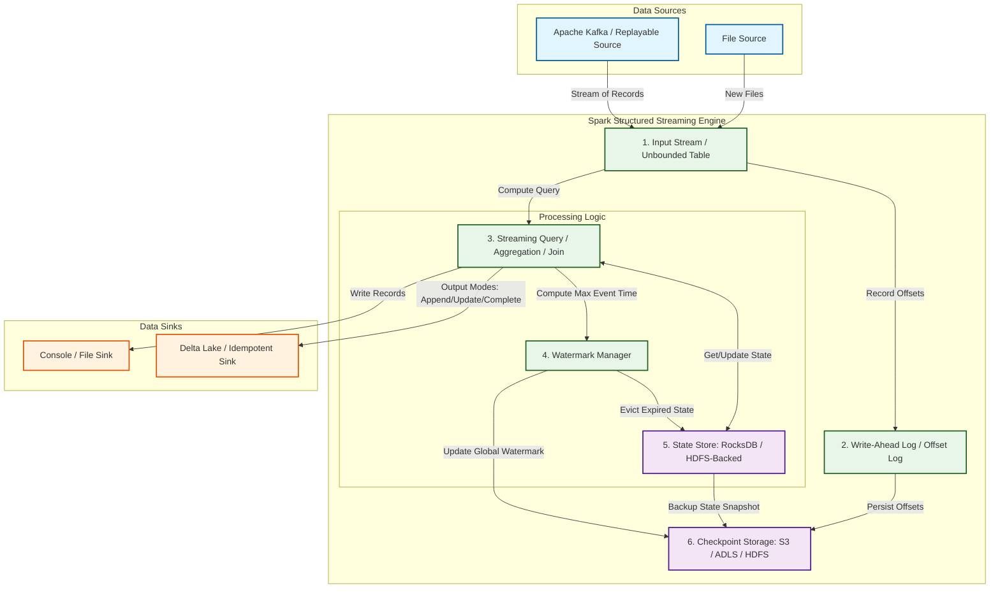

Trong kỷ nguyên dữ liệu lớn (Big Data), việc xử lý và phân tích dữ liệu theo thời gian thực (real-time processing) đã trở thành một yêu cầu thiết yếu đối với các doanh nghiệp. Để đáp ứng nhu cầu này, Apache Spark cung cấp **Spark Structured Streaming** - một công cụ xử lý luồng (stream processing) có cấu trúc mạnh mẽ, tối ưu và dễ sử dụng, được xây dựng trực tiếp trên nền tảng Spark SQL engine.

Khác với mô hình Spark Streaming (DStream) thế hệ cũ dựa trên RDD (Resilient Distributed Datasets) truyền thống, Structured Streaming mang đến mô hình lập trình đồng nhất giữa xử lý lô (batch processing) và xử lý luồng (stream processing), giúp nhà phát triển dễ dàng xây dựng các hệ thống pipelines dữ liệu phức tạp mà không cần thay đổi tư duy lập trình.

---

## 1. Mô hình Truy vấn Lũy tiến (Incremental Query Model)

Ý tưởng cốt lõi của Spark Structured Streaming là coi luồng dữ liệu liên tục như một bảng dữ liệu mở rộng vô hạn (**Unbounded Table**). Mỗi khi có dữ liệu mới (new records) đổ vào hệ thống, Spark sẽ tự động coi đó là các hàng (rows) mới được thêm vào cuối bảng này.



Trong mô hình này, một truy vấn trên nguồn dữ liệu luồng (Streaming Query) sẽ tạo ra một **Result Table** (Bảng kết quả). Tại mỗi khoảng thời gian kích hoạt (Trigger Interval), Spark sẽ kiểm tra dữ liệu mới, chạy một truy vấn lũy tiến (**Incremental Query**) để chỉ xử lý phần dữ liệu mới phát sinh, và cập nhật kết quả vào Result Table.

### Các chế độ đầu ra (Output Modes)

Spark Structured Streaming hỗ trợ 3 chế độ đầu ra chính để ghi dữ liệu từ Result Table ra hệ thống lưu trữ bên ngoài (Sink):

1. **Append Mode**: Chỉ những hàng mới được thêm vào Result Table kể từ lần kích hoạt (trigger) trước mới được ghi ra Sink. Chế độ này phù hợp với các truy vấn không có gom nhóm tính toán (stateless queries) hoặc các truy vấn stateful có sử dụng [Watermark](/concepts/4-realtime/streaming-processing/watermark/) để xác định thời điểm kết quả không bị thay đổi thêm nữa.
2. **Update Mode**: Chỉ những hàng trong Result Table bị thay đổi hoặc cập nhật kể từ lần kích hoạt trước mới được ghi ra Sink. Nếu truy vấn không chứa các toán tử gom nhóm có trạng thái (aggregations), chế độ này hoạt động tương đương với Append Mode.
3. **Complete Mode**: Toàn bộ Result Table sẽ được ghi ra Sink sau mỗi lần kích hoạt. Chế độ này yêu cầu toàn bộ trạng thái tính toán phải được giữ trong bộ nhớ và chỉ khả thi khi số lượng khóa (keys) gom nhóm là hữu hạn và có kích thước nhỏ.

---

## 2. So sánh Trigger: Micro-batch vs Continuous Processing

Spark Structured Streaming cung cấp hai cơ chế thực thi (execution engines) khác nhau tùy thuộc vào yêu cầu về độ trễ (latency) của ứng dụng:

| Đặc tính | Micro-batch Processing (Mặc định) | Continuous Processing (Xử lý liên tục) |
| :--- | :--- | :--- |
| **Độ trễ (Latency)** | Khoảng vài chục đến vài trăm mili-giây (tens of milliseconds). | Dưới 1 mili-giây (sub-millisecond). |
| **Cơ chế hoạt động** | Chia luồng dữ liệu thành các lô nhỏ (micro-batches), xử lý thông qua Spark SQL Engine. | Chạy các tác vụ dài hạn (long-running tasks) liên tục đọc và ghi dữ liệu từ Source sang Sink. |
| **Bảo đảm xử lý** | End-to-end Exactly-Once (Chính xác một lần). | At-least-Once (Ít nhất một lần). |
| **Hỗ trợ tính toán** | Đầy đủ mọi toán tử bao gồm Stateful Aggregations, Windowing, Joins. | Hạn chế, chỉ hỗ trợ các phép biến đổi đơn giản (map-like operations, selections, projections). |

### Các loại cấu hình Trigger trong Micro-batch

* **Mặc định (Unspecified)**: Spark sẽ chạy vi phân (micro-batch) tiếp theo ngay khi vi phân trước đó vừa hoàn thành nhằm giảm độ trễ tối đa.
* **Fixed Interval (Khoảng thời gian cố định)**: Ví dụ `Trigger.ProcessingTime("10 seconds")`. Spark sẽ khởi chạy vi phân theo chu kỳ mỗi 10 giây. Nếu vi phân trước chạy mất 12 giây, vi phân tiếp theo sẽ được khởi chạy ngay lập tức thay vì đợi đủ 10 giây tiếp theo.
* **Trigger.Once()**: Spark sẽ xử lý toàn bộ dữ liệu hiện có trong nguồn một lần duy nhất rồi dừng câu truy vấn. Đây là giải pháp tuyệt vời để tiết kiệm tài nguyên khi chạy các tác vụ ETL định kỳ (cron job) thay vì duy trì cụm máy chủ 24/7.
* **Trigger.AvailableNow()**: Tương tự như `Once()`, nhưng thay vì xử lý tất cả dữ liệu trong một lô lớn duy nhất (dễ gây tràn bộ nhớ OOM), Spark sẽ chia nhỏ dữ liệu hiện có thành nhiều vi phân (micro-batches) liên tiếp và tự động dừng sau khi xử lý xong.

### Cơ chế hoạt động của Continuous Processing

Được giới thiệu từ Spark 2.3, chế độ **Continuous Processing** phá vỡ rào cản độ trễ của mô hình vi phân truyền thống. Thay vì lập lịch cho các tác vụ ngắn hạn lặp đi lặp lại, Spark khởi chạy các tác vụ chạy liên tục đọc dữ liệu từ các phân vùng của nguồn (ví dụ: [Apache Kafka](/concepts/4-realtime/streaming-processing/apache-kafka/)) và ghi trực tiếp ra hệ thống đích.

Cơ chế lưu điểm kiểm tra (checkpointing) trong chế độ này sử dụng thuật toán phối hợp kỷ nguyên (Epoch-based Coordination), tương tự như thuật toán Chandy-Lamport:
1. Spark Driver định kỳ gửi các tin nhắn đánh dấu kỷ nguyên (Epoch markers) vào luồng dữ liệu của các Task nguồn.
2. Khi một Task nhận được Epoch marker, nó sẽ ghi lại vị trí đọc (offsets) hiện tại cho kỷ nguyên đó và gửi báo cáo về Driver.
3. Khi Driver nhận đủ xác nhận từ toàn bộ các Task cho một Epoch cụ thể, nó sẽ ghi nhận Epoch đó đã hoàn thành checkpoint thành công.

---

## 3. Xử lý có trạng thái (Stateful Processing) và Quản lý Checkpoint

Trong xử lý luồng, **Stateful Processing** là các tính toán yêu cầu lưu giữ thông tin lịch sử của luồng dữ liệu (ví dụ: tính tổng doanh thu theo từng khách hàng, đếm số lượt truy cập trong 1 giờ qua, hay kết hợp hai luồng dữ liệu - Stream-Stream Join).

### Checkpointing và Quản lý Vị trí (Offset Management)

Để khôi phục lại trạng thái chính xác sau khi hệ thống gặp sự cố, Spark Structured Streaming bắt buộc phải sử dụng thư mục điểm kiểm tra (**Checkpoint Directory**) trên một hệ thống tệp tin phân tán tin cậy (như HDFS, Amazon S3, Azure Data Lake Storage, hay Google Cloud Storage). Checkpoint Directory chứa các thành phần sau:
* **Offsets Log**: Nhật ký ghi nhận dải vị trí đọc (offset ranges) của nguồn dữ liệu sẽ được xử lý trong từng vi phân cụ thể. Offset log được ghi **trước** khi vi phân bắt đầu thực thi (Write-Ahead Log - WAL).
* **Commits Log**: Nhật ký ghi nhận các vi phân đã xử lý và ghi ra Sink thành công.
* **State Store**: Chứa dữ liệu trạng thái trung gian của các toán tử stateful được phân tán trên các Node thực thi (Executors).
* **Metadata**: Chứa thông tin về cấu trúc (schema) và ID duy nhất của câu truy vấn.

### Các loại kho lưu trữ trạng thái (State Stores)

Trạng thái trung gian của ứng dụng được lưu giữ tại các **State Stores** chạy trên bộ nhớ của các Executor. Spark hỗ trợ hai loại kho lưu trữ trạng thái chính:

1. **HDFS-backed State Store (Mặc định)**:
   * **Cơ chế**: Lưu toàn bộ trạng thái trong bộ nhớ RAM của JVM (JVM heap space) dưới dạng các đối tượng Java. Định kỳ sau mỗi vi phân, Spark sẽ tuần tự hóa (serialize) và ghi đè trạng thái này lên các tệp tin lưu trữ phân tán (như HDFS hoặc S3).
   * **Ưu điểm**: Tốc độ đọc ghi trạng thái cực nhanh do thao tác trực tiếp trên RAM.
   * **Nhược điểm**: Dễ gây ra hiện tượng dừng toàn bộ ứng dụng do bộ thu gom rác của Java (Java Garbage Collection pauses). Khi kích thước trạng thái phình to (vượt quá vài chục GB), ứng dụng rất dễ gặp lỗi tràn bộ nhớ (Out of Memory - OOM).

2. **RocksDB State Store (Khuyến nghị cho production)**:
   * **Cơ chế**: Trạng thái được lưu trữ cục bộ trong một cơ sở dữ liệu khóa-giá trị nhúng RocksDB nằm ngoài bộ nhớ RAM của JVM (Off-heap Memory). RocksDB tự động nén và quản lý bộ nhớ đệm cực kỳ hiệu quả, sau đó đồng bộ hóa các tệp tin thay đổi (SST files) lên hệ thống tệp tin phân tán không đồng bộ.
   * **Ưu điểm**: Khả năng lưu trữ trạng thái khổng lồ (lên tới hàng trăm GB hoặc TB) mà không lo ngại Garbage Collection pauses hay lỗi OOM.
   * **Nhược điểm**: Tốc độ xử lý thô có thể chậm hơn một chút so với lưu trên RAM JVM do phải thực hiện tuần tự hóa dữ liệu khi đọc ghi với RocksDB cục bộ.

Để kích hoạt RocksDB State Store, bạn cần thiết lập cấu hình sau trước khi khởi tạo SparkSession:
```scala
spark.conf.set(
  "spark.sql.streaming.stateStore.providerClass",
  "org.apache.spark.sql.execution.streaming.state.RocksDBStateStoreProvider"
)
```

---

## 4. Cơ chế hoạt động bên trong của Watermark (Watermark Execution Engine Internals)

Trong các bài toán xử lý luồng theo thời gian sự kiện ([Event Time vs Processing Time](/concepts/4-realtime/streaming-processing/event-time-processing-time/)), việc dữ liệu bị đến trễ hoặc lệch thứ tự do mạng kết nối chậm là điều không thể tránh khỏi. Spark Structured Streaming sử dụng cơ chế **Watermark** để định nghĩa khoảng thời gian tối đa hệ thống chấp nhận dữ liệu đến muộn.

### Công thức tính toán Watermark toàn cục (Global Watermark)

Giá trị Watermark tại một thời điểm được tính theo công thức:
$$\text{Watermark} = \text{Max Event Time seen so far} - \text{Allowed Lateness}$$
Trong đó:
* $\text{Max Event Time seen so far}$: Nhãn thời gian sự kiện lớn nhất mà hệ thống ghi nhận được từ đầu vào của luồng dữ liệu.
* $\text{Allowed Lateness}$: Khoảng thời gian trễ cho phép do nhà phát triển cấu hình (ví dụ: `.withWatermark("timestamp", "10 minutes")`).

### Tiến trình cập nhật Watermark qua các Vi phân (Micro-batches)

Watermark trong Spark không hoạt động theo thời gian thực liên tục mà được cập nhật lũy tiến qua từng vi phân theo cơ chế sau:

1. **Giai đoạn Thu thập (Micro-batch $N$)**: Trong khi vi phân $N$ đang chạy, Spark sẽ theo dõi nhãn thời gian lớn nhất ghi nhận được trên **từng phân vùng nguồn** (partition-level max event time).
2. **Giai đoạn Đồng bộ (Cuối Micro-batch $N$)**: Khi kết thúc vi phân $N$, Spark Driver sẽ thu thập các giá trị max event time từ tất cả các Executors và tìm giá trị lớn nhất trên toàn bộ luồng dữ liệu. Spark sau đó tính toán giá trị Watermark mới: $\text{Watermark}_{N} = \text{Max Event Time}_N - \text{Allowed Lateness}$.
3. **Giai đoạn Áp dụng (Micro-batch $N+1$)**: Giá trị $\text{Watermark}_{N}$ mới tính toán sẽ được ghi vào tệp tin Checkpoint metadata. Khi vi phân $N+1$ bắt đầu thực thi, Spark SQL engine sẽ sử dụng giá trị $\text{Watermark}_{N}$ này để thực hiện hai nhiệm vụ cốt lõi:
   * **Loại bỏ dữ liệu muộn (Late Data Filtering)**: Bất kỳ bản ghi mới nào đi vào vi phân $N+1$ có nhãn thời gian nhỏ hơn hoặc bằng $\text{Watermark}_{N}$ sẽ bị loại bỏ ngay lập tức và không tham gia vào các phép tính toán gom nhóm.
   * **Giải phóng bộ nhớ trạng thái (State Eviction)**: Các khóa gom nhóm nằm trong các cửa sổ thời gian (Windows) đã cũ hơn $\text{Watermark}_{N}$ sẽ bị xóa bỏ hoàn toàn khỏi State Store, tránh việc bộ nhớ bị phình to vô hạn.

---

## 5. Cam kết Xử lý Chính xác Một lần (Exactly-Once Guarantees)

Đạt được ngữ nghĩa xử lý chính xác một lần ([Exactly-Once Semantics](/concepts/4-realtime/streaming-processing/exactly-once-semantics/)) từ đầu tới cuối (End-to-End Exactly-Once) đòi hỏi sự phối hợp chặt chẽ giữa 3 thành phần chính trong hệ thống:

```
+------------------+     +-------------------------------+     +--------------------+
| Replayable Source| --> | Spark Structured Streaming WAL| --> | Idempotent/Tx Sink |
+------------------+     +-------------------------------+     +--------------------+
```

### Các điều kiện bắt buộc để đạt được Exactly-Once:

1. **Nguồn dữ liệu có khả năng đọc lại (Replayable Source)**:
   * Nguồn dữ liệu phải cho phép đọc lại một tập hợp dữ liệu cụ thể từ một điểm đánh dấu vị trí xác định. Ví dụ, Apache Kafka cho phép Spark yêu cầu phát lại dữ liệu từ một dải Offset xác định (`fromOffset` đến `toOffset`) bất kỳ lúc nào.
2. **Nhật ký ghi trước (Write-Ahead Log - WAL) và Metadata Checkpointing**:
   * Trước khi Spark thực thi bất kỳ vi phân nào, nó sẽ xác định chính xác dải offsets dữ liệu đầu vào sẽ xử lý trong vi phân đó. Dải offsets này được ghi vào nhật ký trước (WAL) trong thư mục Checkpoint. Nếu Spark Driver bị sập giữa chừng, khi khởi động lại, nó sẽ đọc WAL để biết chính xác vi phân nào đang chạy dở dang và dải offsets tương ứng cần phải xử lý lại.
3. **Kho lưu trữ trạng thái tin cậy (State Store Checkpointing)**:
   * Trạng thái trung gian của các toán tử tính toán phải được chụp ảnh (snapshot) và lưu trữ đồng bộ với tiến trình ghi commit log.
4. **Đầu ra có tính lũy đẳng hoặc hỗ trợ giao dịch (Idempotent or Transactional Sink)**:
   * Khi xảy ra sự cố và hệ thống khởi động lại, một số dữ liệu thuộc vi phân bị lỗi có thể đã được ghi một phần ra Sink ở lần chạy trước. Do đó, việc chạy lại vi phân đó sẽ khiến dữ liệu bị ghi lặp lại.
   * Để giải quyết điều này, Sink phải hỗ trợ **Idempotence** (lũy đẳng - ghi đè dữ liệu trùng khóa mà không làm thay đổi kết quả, ví dụ như ghi vào các hệ thống Key-Value như Cassandra, DynamoDB) hoặc hỗ trợ **Transactions** (giao dịch - Spark chỉ commit dữ liệu ra Sink sau khi toàn bộ vi phân hoàn thành thành công, ví dụ ghi vào Delta Lake hoặc FileStreamSink sử dụng cơ chế đổi tên tệp tin nguyên tử - atomic file renaming).

### Kịch bản tự phục hồi lỗi (Fault Tolerance Scenario)

* **Bước 1**: Vi phân $N$ đang chạy, Spark đã đọc xong dữ liệu từ Kafka offset 100 đến 200 và ghi vào WAL. Một số kết quả tính toán của vi phân $N$ đã được xuất ra Sink, nhưng chưa kịp lưu Checkpoint trạng thái thì Executor hoặc Driver bị mất nguồn điện.
* **Bước 2**: Hệ thống quản lý cụm (Kubernetes hoặc YARN) khởi động lại Spark Application.
* **Bước 3**: Spark đọc thư mục Checkpoint, phát hiện ra vi phân $N$ chưa được xác nhận hoàn thành (thiếu commit log của vi phân $N$).
* **Bước 4**: Spark khôi phục trạng thái lưu trữ trong State Store quay trở về thời điểm kết thúc vi phân $N-1$.
* **Bước 5**: Spark truy vấn WAL, lấy dải offset từ 100 đến 200 của vi phân $N$ và yêu cầu Kafka phát lại đúng dải dữ liệu này.
* **Bước 6**: Spark thực hiện tính toán lại vi phân $N$ với trạng thái đã khôi phục.
* **Bước 7**: Dữ liệu kết quả được ghi ra Sink. Nhờ cơ chế lũy đẳng hoặc giao dịch của Sink, các bản ghi đã được ghi một phần trước đó sẽ bị ghi đè hoặc loại bỏ giao dịch cũ, đảm bảo kết quả cuối cùng hiển thị trên Sink là duy nhất và chính xác như thể hệ thống chưa từng gặp sự cố.

---

## Điểm mạnh (Pros) và Điểm yếu (Cons)

### Điểm mạnh (Pros)
* **Thống nhất mô hình lập trình (Unified API)**: Sử dụng chung cấu trúc DataFrame/Dataset API như lập trình batch. Bạn có thể dễ dàng chuyển đổi một batch query thành streaming query chỉ bằng cách thay đổi `.read` thành `.readStream` và `.write` thành `.writeStream`.
* **Tự động tối ưu hóa (Catalyst Optimizer)**: Thừa hưởng bộ tối ưu hóa truy vấn Catalyst Optimizer và công cụ thực thi mã nguồn Turing-complete (Tungsten execution engine) của Spark SQL, giúp tối ưu hóa hiệu năng tính toán tự động.
* **Tích hợp sâu sắc với hệ sinh thái Lakehouse**: Khả năng kết nối hoàn hảo với Delta Lake, Apache Iceberg, Apache Hudi giúp xây dựng kiến trúc Lakehouse thời gian thực cực kỳ ổn định.
* **Hỗ trợ quản lý trạng thái quy mô lớn**: Nhờ tích hợp RocksDB State Store, việc duy trì hàng triệu trạng thái khóa (stateful keys) trở nên dễ dàng và ổn định.

### Điểm yếu (Cons)
* **Hạn chế của Continuous Processing**: Chế độ xử lý liên tục có độ trễ sub-millisecond còn quá đơn giản, không hỗ trợ các phép tính toán phức tạp (Stateful operations), khiến Spark Structured Streaming trong thực tế vẫn chủ yếu chạy ở chế độ vi phân (Micro-batch).
* **Độ trễ cao hơn các Native Streaming Engines**: So với Apache Flink hoặc Apache Storm (vốn là các công cụ xử lý luồng thực sự trên từng sự kiện đơn lẻ - record-by-record processing), cơ chế vi phân của Spark Structured Streaming có độ trễ cao hơn đáng kể (vài chục ms so với vài ms).
* **Độ phức tạp khi tinh chỉnh cấu hình**: Việc thiết lập kích thước checkpoint, cấu hình RocksDB, quản lý rác JVM đòi hỏi đội ngũ vận hành phải có kiến thức sâu rộng về hệ thống phân tán để tránh các lỗi nghẽn cổ chai (bottlenecks).

---

## Khi nào nên dùng

* **Nên dùng**:
  * Khi doanh nghiệp đã và đang vận hành hệ sinh thái Hadoop, Spark hoặc kiến trúc Lakehouse (Delta Lake / Databricks) và muốn tận dụng lại tài nguyên phần cứng cũng như mã nguồn sẵn có.
  * Các bài toán pipelines dữ liệu luồng cần độ trễ ở mức trung bình (từ 100ms trở lên) như: giám sát hệ thống (monitoring dashboards), đồng bộ hóa cơ sở dữ liệu thời gian thực (Real-time CDC), chuẩn hóa dữ liệu đầu vào (ETL Streaming).
  * Khi cần xử lý các phép kết hợp dữ liệu phức tạp giữa luồng dữ liệu thời gian thực và bảng dữ liệu lịch sử khổng lồ (Stream-Batch Join).

* **Không nên dùng**:
  * Các ứng dụng yêu cầu phản hồi siêu tốc dưới 5 mili-giây (như phát hiện giao dịch gian lận tài chính trực tuyến, hệ thống phân phối quảng cáo thời gian thực, hay các ứng dụng điều khiển thiết bị IoT khẩn cấp). Trong các trường hợp này, Apache Flink là sự lựa chọn tối ưu hơn.
  * Các pipeline xử lý dữ liệu phi cấu trúc phức tạp hoặc các luồng xử lý yêu cầu thay đổi cấu trúc dữ liệu liên tục không cố định.

## Các khái niệm liên quan

* [Dự án AWS: Real-time Ingestion & Analytics](/projects/aws-e2e-project/)
* [So sánh Apache Spark vs Apache Flink](/concepts/4-realtime/streaming-processing/spark-vs-flink-comparison/)
* [Watermark](/concepts/4-realtime/streaming-processing/watermark/)

---

## Trọng tâm ôn luyện phỏng vấn

### 1. Phân biệt sự khác biệt cốt lõi giữa DStream (Spark Streaming cũ) và Structured Streaming?
* **Gợi ý trả lời**: DStream được xây dựng trên nền tảng RDD và xử lý dữ liệu dựa trên thời gian dữ liệu đi vào hệ thống (Processing Time), khiến việc xử lý dữ liệu đến muộn (Late Data) dựa trên thời gian sự kiện (Event Time) cực kỳ phức tạp. Ngược lại, Structured Streaming xây dựng trên Spark SQL engine (DataFrame/Dataset), coi luồng dữ liệu là một bảng vô hạn (Unbounded Table). Nó hỗ trợ xử lý Event Time một cách tự nhiên thông qua cơ chế Watermark và tối ưu hóa truy vấn tốt hơn nhờ Catalyst Optimizer.

### 2. RocksDB State Store hoạt động thế nào và tại sao nó giải quyết được lỗi OOM so với HDFS-backed State Store?
* **Gợi ý trạng**: HDFS-backed State Store lưu toàn bộ trạng thái trong JVM heap dưới dạng đối tượng Java. Khi trạng thái quá lớn, nó chiếm dụng nhiều RAM, dẫn đến việc GC chạy liên tục gây đứng ứng dụng hoặc sập Executor do OOM. RocksDB State Store lưu trạng thái ở vùng nhớ ngoài JVM heap (Off-heap) cục bộ trên đĩa của Executor dưới dạng các tệp nhị phân đã nén. RocksDB chỉ nạp vào RAM những dữ liệu đang được truy cập tích cực. Nhờ đó, nó giúp ứng dụng xử lý được lượng trạng thái khổng lồ lên tới hàng TB mà không lo sợ sập bộ nhớ hay trễ GC.

### 3. Tại sao Spark Structured Streaming cần cả Offsets Log và Commits Log trong thư mục Checkpoint?
* **Gợi ý trả lời**: Spark sử dụng hai loại nhật ký này để đảm bảo tính Exactly-Once khi khôi phục lỗi. Offsets Log ghi nhận dải vị trí dữ liệu nguồn Spark sẽ xử lý trong vi phân hiện tại (WAL). Commits Log ghi nhận các vi phân đã hoàn thành việc ghi dữ liệu ra Sink thành công. Khi hệ thống khởi động lại sau sự cố, Spark so sánh hai nhật ký này. Nếu một vi phân có tên trong Offsets Log nhưng chưa có trong Commits Log, Spark biết vi phân đó bị lỗi giữa chừng và tiến hành xử lý lại đúng dải offset đó từ đầu.

### 4. Điều gì xảy ra nếu dữ liệu có nhãn thời gian (Event Time) nhỏ hơn giá trị Watermark hiện tại đi vào hệ thống?
* **Gợi ý trả lời**: Trong Spark Structured Streaming, bất kỳ dữ liệu nào đến muộn có nhãn thời gian nhỏ hơn hoặc bằng giá trị Watermark toàn cục (Global Watermark) đã được chốt từ vi phân trước sẽ bị coi là quá hạn và bị hệ thống tự động loại bỏ (dropped) ngay lập tức. Dữ liệu này sẽ không được đưa vào tính toán gom nhóm hay cập nhật vào kết quả đầu ra.

### 5. Làm thế nào để đạt được End-to-End Exactly-Once trong một pipeline Spark Structured Streaming?
* **Gợi ý trả lời**: Để đạt Exactly-Once từ đầu tới cuối, cần sự kết hợp của 3 yếu tố:
  1. **Nguồn dữ liệu đọc lại được (Replayable Source)** như Kafka, cho phép phát lại dữ liệu từ offset cụ thể.
  2. **Cơ chế khôi phục của Spark** thông qua việc bật Checkpoint ghi nhận Offsets Log và phục hồi trạng thái trung gian (State Store).
  3. **Đích đến lũy đẳng hoặc hỗ trợ giao dịch (Idempotent/Transactional Sink)** như Delta Lake. Khi Spark xử lý lại một vi phân bị lỗi trước đó, cơ chế lũy đẳng hoặc giao dịch trên Sink sẽ ghi đè hoặc loại bỏ các bản ghi ghi lỗi trước đó, đảm bảo kết quả cuối cùng không bị nhân bản.

---

## Xem thêm các khái niệm liên quan
* [Apache Kafka](/concepts/4-realtime/streaming-processing/apache-kafka/)
* [Consumer Groups trong Kafka](/concepts/4-realtime/streaming-processing/consumer-groups/)
* [Thời gian sự kiện và Thời gian xử lý - Event Time vs Processing Time](/concepts/4-realtime/streaming-processing/event-time-processing-time/)

## Tài liệu tham khảo

1. [Apache Spark Structured Streaming Programming Guide](https://spark.apache.org/docs/latest/structured-streaming-programming-guide.html)
2. [Databricks - Structured Streaming Concepts](https://docs.databricks.com/structured-streaming/index.html)
3. [AWS EMR - Spark Structured Streaming Developer Guide](https://docs.aws.amazon.com/emr/latest/ReleaseGuide/emr-spark-structured-streaming.html)
4. [Azure Databricks - Structured Streaming Production Checklist](https://learn.microsoft.com/en-us/azure/databricks/structured-streaming/production)
5. [Google Cloud Dataproc - Spark Structured Streaming with Kafka](https://cloud.google.com/dataproc/docs/tutorials/spark-structured-streaming)

---

## English Summary

**Spark Structured Streaming** is a scalable and fault-tolerant stream processing engine built on the Spark SQL engine. It allows developers to express streaming computations the same way they would express batch computations on static data. The framework views a data stream as an **Unbounded Table** that is continuously appended to. 

It provides two execution modes: the default **Micro-batch processing** (which achieves high-throughput with latency in tens of milliseconds) and **Continuous processing** (which achieves sub-millisecond latency for simple operations at the expense of exactly-once guarantees). Stateful stream processing (like windowed aggregations and stream-stream joins) relies on metadata logs (Offsets and Commits logs) and state stores (either HDFS-backed JVM Heap or RocksDB Off-heap) to maintain state snapshots. 

Late-arriving data is managed via **Watermarking**, which defines how long the engine should keep state for late data before discarding it. By combining a replayable source (like Kafka), state checkpointing with Write-Ahead Logs, and idempotent or transactional sinks (like Delta Lake), Spark Structured Streaming guarantees end-to-end **Exactly-Once** processing.
