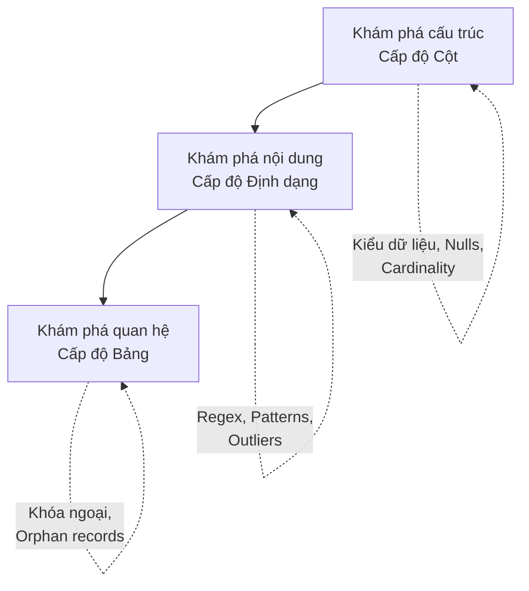

Có bao giờ bạn nhảy vào viết code [ETL](/concepts/3-integration/etl-elt/etl/) ngay khi vừa nhận được một file CSV hay thông tin kết nối CSDL từ đối tác, để rồi vài ngày sau pipeline bị "sập" liên tục vì những lỗi ngớ ngẩn như cột chứa chữ thay vì số, hay độ dài chuỗi vượt quá khai báo? Nếu câu trả lời là có, bạn không cô đơn đâu. Đó là lúc chúng ta cần đến **Data Profiling (Lập hồ sơ dữ liệu)** — bước "chụp X-quang" giúp bạn nhìn thấu hình hài thực sự của dữ liệu trước khi đặt bút viết dòng code đầu tiên.

## Data Profiling thực chất là gì?

Nói một cách đơn giản, **Data Profiling (Lập hồ sơ dữ liệu)** là quá trình khám phá, phân tích thống kê và đánh giá cấu trúc (structure), nội dung (content) cùng chất lượng (quality) của một tập dữ liệu thô. Nếu như các Data Scientist có bước EDA (Exploratory Data Analysis) để tìm kiếm insight phục vụ mô hình, thì Data Engineer dùng Data Profiling như một công cụ kỹ thuật để trả lời những câu hỏi thực dụng hơn:
* Tập dữ liệu này thực sự chứa những gì?
* Có bao nhiêu % dữ liệu trong một cột bị rỗng (NULL)?
* Kiểu dữ liệu thực tế có khớp với định nghĩa trong tài liệu không?
* Các bảng có liên kết chặt chẽ với nhau không hay có nhiều bản ghi "mồ côi"?

Thay vì phán đoán mơ hồ, chúng ta quét qua dữ liệu để trích xuất ra các siêu dữ liệu thống kê mô tả (Descriptive Metadata), từ đó hiểu rõ "đối thủ" mà mình chuẩn bị xử lý.

## Tại sao chúng ta không thể bỏ qua bước này?

Người ta thường nói: *"Giả định là nguồn cơn của mọi rắc rối"* (Assumption is the mother of all mess-ups). 

Hãy tưởng tượng đối tác bàn giao cho bạn một database MySQL và khẳng định chắc nịch rằng: *"Cột `country_code` chỉ chứa mã quốc gia 2 ký tự (như VN, US)"*. Bạn tin tưởng tạo bảng trong [Data Warehouse](/concepts/2-storage/data-warehouse/data-warehouse/) với kiểu dữ liệu `VARCHAR(2)`. Nhưng khi pipeline chạy thực tế, nó "nổ tung" ngay lập tức vì người dùng đã nhập "USA" hoặc "Vietnam".

Nếu có bước Data Profiling ngay từ đầu, bạn sẽ phát hiện ra sự thật này chỉ sau vài giây quét dữ liệu, tránh được những pha "chữa cháy" lúc nửa đêm. Nó giúp chúng ta đối mặt với **hình hài thật sự** của dữ liệu trước khi xây dựng bất kỳ logic biến đổi (Transformation) nào.

## Ba cấp độ "soi" dữ liệu trong Profiling

Thông thường, quá trình lập hồ sơ dữ liệu sẽ đi từ chi tiết đến tổng thể thông qua 3 cấp độ:


1. **Khám phá cấu trúc (Structure Discovery - Cấp độ Cột)**: Chúng ta "soi" từng cột độc lập để thống kê: Kiểu dữ liệu thực tế (Số, Chữ, Ngày tháng), độ dài chuỗi tối đa/tối thiểu, giá trị lớn nhất/nhỏ nhất, tỷ lệ NULL, và số lượng giá trị duy nhất (Cardinality / Distinct count).
2. **Khám phá nội dung (Content Discovery - Cấp độ Định dạng)**: Kiểm tra xem dữ liệu có tuân theo các quy luật định dạng (Patterns) cụ thể không. Ví dụ, số điện thoại có đúng định dạng `(XXX) XXX-XXXX` không, hoặc địa chỉ email có hợp lệ không.
3. **Khám phá quan hệ (Relationship Discovery - Cấp độ Bảng)**: Phân tích mối liên kết giữa các cột và các bảng. Chẳng hạn, liệu cột `user_id` ở bảng giao dịch có khớp hoàn toàn với `id` của bảng người dùng không, hay có nhiều giao dịch "vô chủ" (Orphan records).

## Hiện thực hóa Data Profiling trong thực tế

Bạn có thể thực hiện Data Profiling bằng nhiều cách, từ thủ công bằng SQL đến tự động hóa bằng công cụ:
* **SQL thủ công**: Viết các câu lệnh gom nhóm, đếm giá trị `MAX(LENGTH(col))`, `COUNT(DISTINCT col)` hay `COUNT(*)` để có cái nhìn tổng quan.
* **Công cụ BI**: Tận dụng tính năng Data Prep của Tableau hoặc Power BI để xem trực quan biểu đồ phân phối cột (Histogram).
* **Công cụ chuyên dụng (Python / [Modern Data Stack](/concepts/1-foundations/system-architecture/data-platform-architecture/))**: Sử dụng các thư viện như `ydata-profiling` trong Python hoặc các hệ thống Data Catalog (như Atlan, DataHub) để tự động quét dữ liệu định kỳ.

Dưới đây là một ví dụ đơn giản sử dụng thư viện Python `ydata-profiling` để tạo báo cáo tự động chỉ với 3 dòng code:
```python
import pandas as pd
from ydata_profiling import ProfileReport

# Đọc file dữ liệu thô
df = pd.read_csv("raw_customer_data.csv")

# Phát sinh báo cáo Profiling HTML tự động
profile = ProfileReport(df, title="Customer Data Profiling Report")
profile.to_file("report.html")
```

Báo cáo `report.html` sinh ra sẽ cho bạn biết chính xác:
* Cột `email`: Có 10,000 dòng, nhưng 200 dòng bị rỗng (2%) và có 5 email bị trùng lặp (độ duy nhất không đạt 100%).
* Cột `age`: Phân phối hình chuông nhưng xuất hiện giá trị dị biệt (Outlier) là `999` (có thể là dữ liệu rác hoặc giá trị mặc định của hệ thống cũ).
* Cảnh báo tự động: Cột `is_test_account` có giá trị `False` chiếm tới 99.9%, gợi ý rằng cột này có độ phân tán quá thấp (Low Variance) và ít giá trị phân tích.

## Điểm mạnh (Pros)

* **Phát hiện lỗi sớm (Shift-Left Quality)**: Giúp phát hiện sai lệch cấu trúc, định dạng và mối quan hệ ngay từ nguồn trước khi nạp vào pipeline.
* **Xây dựng Data Catalog chính xác**: Tự động tạo tài liệu siêu dữ liệu (metadata) thực tế thay vì dựa vào các suy đoán hoặc tài liệu cũ.
* **Tối ưu thiết kế lưu trữ**: Cardinality và thông tin phân phối từ profiling giúp lựa chọn khóa phân vùng (Partition Key) và khóa cụm (Cluster Key) tối ưu.
* **Hạn chế (Cons)**:
  * **Rò rỉ dữ liệu nhạy cảm**: Việc quét toàn bộ tập dữ liệu có thể làm lộ thông tin nhạy cảm PII (Email, số điện thoại) nếu không được che giấu (masking).
  * **Chi phí tính toán cao**: Thực hiện profiling trên các bảng dữ liệu khổng lồ (hàng tỷ bản ghi) tốn kém rất nhiều CPU/RAM và chi phí điện toán đám mây.

## Khi nào nên dùng

* **Nên dùng khi**:
  * Khi bắt đầu tích hợp (onboarding) một nguồn dữ liệu mới từ đối tác hoặc bên thứ ba.
  * Khi tiếp quản một hệ thống Data Warehouse cũ (Legacy DW) thiếu tài liệu.
  * Trước khi viết các bộ quy tắc kiểm thử dữ liệu (Data Quality Rules/Tests).
* **Không nên dùng khi**:
  * Không nên chạy trực tiếp trên các cơ sở dữ liệu vận hành (OLTP) đang hoạt động ở giờ cao điểm mà không lấy mẫu dữ liệu (sampling).
  * Không nên nhúng các tác vụ profiling nặng nề trực tiếp vào các pipeline streaming thời gian thực (như Kafka, Flink) vì sẽ làm tăng độ trễ (latency).

## Các khái niệm liên quan

* **[Data Quality](/concepts/5-quality-governance/data-quality/data-quality)**: Chất lượng dữ liệu và các chiều đo lường cốt lõi.
* **[Data Testing](/concepts/5-quality-governance/data-quality/data-testing)**: Thiết lập kiểm thử tự động sau khi hoàn tất profiling.
* **[Anomaly Detection](/concepts/5-quality-governance/data-quality/anomaly-detection)**: Tự động hóa giám sát chất lượng dữ liệu bằng học máy.
* **[Data Quality Dimensions](/concepts/5-quality-governance/data-quality/data-quality-dimensions)**: Các chiều đo lường chất lượng dữ liệu.
* **[Data Reconciliation](/concepts/5-quality-governance/data-quality/data-reconciliation)**: Đối chiếu dữ liệu giữa các nguồn.
* **[Data Catalog](/concepts/5-quality-governance/governance-metadata/data-catalog)**: Quản lý siêu dữ liệu tập trung.

## Trọng tâm ôn luyện phỏng vấn

### Câu 1: Phân biệt sự khác biệt cốt lõi giữa Data Profiling và Data Testing?
* **Gợi ý trả lời**:
  * **Data Profiling** mang tính chất **khám phá (Descriptive)**. Nó trả lời câu hỏi *"Dữ liệu hiện tại đang như thế nào?"* và không phán xét đúng hay sai.
  * **Data Testing** mang tính chất **xác thực (Prescriptive)**. Nó trả lời câu hỏi *"Dữ liệu có đúng như kỳ vọng không?"*. 
  * Về quy trình, chúng ta thường làm Data Profiling trước để tìm ra quy luật của dữ liệu. Sau đó, dựa trên những phát hiện này, chúng ta viết code Data Testing tự động (ví dụ: `Assert Price >= 0`) để chạy kiểm tra định kỳ mỗi ngày.

### Câu 2: Cardinality trong Data Profiling là gì và ảnh hưởng của nó đến hiệu năng Data Warehouse ra sao?
* **Gợi ý trả lời**: Cardinality là số lượng giá trị độc nhất (Distinct values) trong một cột.
  * **High Cardinality** (như cột `Email`) rất khó nén dữ liệu hoặc áp dụng mã hóa từ điển, dẫn đến tốn dung lượng lưu trữ hơn.
  * **Low Cardinality** (như cột `Gender` chỉ có vài giá trị) lại cực kỳ dễ nén. Đây là các ứng cử viên sáng giá để chọn làm Partition Key hoặc Cluster Key trong các kho dữ liệu dạng cột (Columnar DW như Snowflake, BigQuery) nhằm tăng tốc độ truy vấn.
  * Vì vậy, thông tin Cardinality có được từ bước Profiling sẽ trực tiếp định hình cách thiết kế vật lý cho Data Warehouse.

## Xem thêm các khái niệm liên quan
* [Phát hiện bất thường - Anomaly Detection](/concepts/5-quality-governance/data-quality/anomaly-detection/)
* [Các chiều chất lượng dữ liệu - Data Quality Dimensions](/concepts/5-quality-governance/data-quality/data-quality-dimensions/)
* [Chất lượng dữ liệu - Data Quality](/concepts/5-quality-governance/data-quality/data-quality/)

## Tài liệu tham khảo

1. [AWS - AWS Glue DataBrew Profile Jobs](https://docs.aws.amazon.com/databrew/latest/dg/profile-jobs.html)
2. [Google Cloud - Create and Use Data Profile Scans in Dataplex](https://cloud.google.com/dataplex/docs/create-use-data-profile-scans)
3. [Snowflake - Data Profiling using Snowsight](https://docs.snowflake.com/en/user-guide/ui-snowsight-profile)
4. [Databricks - Lakehouse Monitoring and Data Profiling](https://docs.databricks.com/en/lakehouse-monitoring/index.html)
5. [Great Expectations - Profiling Data with Rule-Based Profilers](https://docs.greatexpectations.io/docs/oss/guides/setup/configure_data_contexts)
6. [Apache Spark - DataFrame Describe API](https://spark.apache.org/docs/latest/api/python/reference/pyspark.pandas/api/pyspark.pandas.DataFrame.describe.html)

## English Summary

Data Profiling is the systematic exploratory analysis of a dataset to extract descriptive metadata, such as value distributions, max/min limits, null percentages, pattern conformity, and cardinality. By "x-raying" the raw data source before writing any ETL code, data teams replace unsafe assumptions with factual evidence about the data's true structure and health. It serves as the foundational first step in any data integration project, dictating the necessary data cleansing strategies and informing the automated Data Quality tests that will be built downstream.