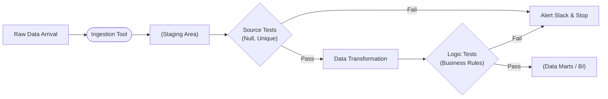

Trong phát triển phần mềm, một khi bạn đã viết Unit Test cho một hàm toán học như `add(1, 2)` và nó trả về kết quả là `3`, bạn có thể kê gối ngủ ngon vì thuật toán đã đúng. Nhưng trong thế giới kỹ thuật dữ liệu ([Data Engineering](/concepts/1-foundations/foundation/data-engineering/)), câu chuyện lại hoàn toàn khác. Hôm nay code [ETL](/concepts/3-integration/etl-elt/etl/) của bạn chạy rất trơn tru, nhưng ngày mai đối tác đột ngột thay đổi cấu trúc API, gửi về một chuỗi ký tự thay vì một con số. Kết quả là pipeline bị "sập" giữa đêm, hoặc tệ hơn là âm thầm ghi nhận dữ liệu sai lệch vào kho dữ liệu.

Đó là lý do chúng ta cần đến **Data Testing (Kiểm thử dữ liệu động)** — những chiếc "cầu dao tự động" giúp bảo vệ hệ thống trước sự biến động khôn lường của dữ liệu thực tế.

## Data Testing thực sự là gì?

Khác với kiểm thử phần mềm truyền thống (Software Testing) vốn tập trung kiểm tra tính đúng đắn của dòng code, **Data Testing** là quá trình lập trình các xác nhận tự động (automated assertions) chạy liên tục bên trong đường ống dữ liệu để xác minh chất lượng của luồng dữ liệu (data payload) thay đổi mỗi ngày.

Chúng ta viết các đoạn mã (bằng SQL hoặc Python) để định nghĩa những quy tắc nghiệp vụ và đặt chúng ở các vị trí chiến lược như những người gác cổng (Gatekeepers). Bất kỳ dòng dữ liệu nào đi qua cũng phải được kiểm tra xem có tuân thủ đúng cấu trúc, định dạng và các logic kinh doanh quy định hay không.

## Tại sao chúng ta cần kiểm thử dữ liệu mỗi ngày?

Có một sự thật phũ phàng trong ngành dữ liệu: *"Lỗi dữ liệu chắc chắn sẽ xảy ra, vấn đề chỉ là khi nào."*

If không thiết lập các bài kiểm thử tự động:
* Dữ liệu hỏng (ví dụ: lỗi tỷ giá khiến doanh thu ngày bị nhân lên 100 lần) sẽ âm thầm chảy qua hệ thống và hiển thị chễm chệ trên trang báo cáo BI của CEO vào sáng hôm sau.
* Khi lãnh đạo phát hiện ra số liệu vô lý, niềm tin của họ vào đội ngũ dữ liệu sẽ giảm sút nghiêm trọng.
* Các kỹ sư dữ liệu sẽ phải mất hàng giờ, thậm chí hàng ngày để truy vết ngược lại đường đi của dữ liệu ([Data Lineage](/concepts/5-quality-governance/governance-metadata/data-lineage/)) nhằm tìm ra nguồn gốc của lỗi.

Data Testing sinh ra để bắt lỗi ngay từ thời điểm nó xuất hiện, cô lập dữ liệu bẩn và phát đi cảnh báo sớm cho đội ngũ kỹ thuật theo nguyên lý "thất bại sớm" (Fail-fast).

## Kim tự tháp kiểm thử dữ liệu (Test Pyramid in Data)

Để bao phủ toàn diện sức khỏe của dữ liệu, chúng ta thường chia các bài kiểm thử thành 4 cấp độ:

1. **Schema Testing (Kiểm thử cấu trúc)**: Đảm bảo cấu trúc bảng không bị thay đổi ngoài ý muốn. Ví dụ: cột `customer_id` có bị đổi kiểu từ số nguyên sang chuỗi không? Bảng có bị thiếu cột nào không?
2. **Generic/Format Testing (Kiểm thử định dạng)**: Kiểm tra các quy tắc định dạng cơ bản như: Cột khóa chính có bị trùng lặp (`unique`) hay bị rỗng (`NOT NULL`) không? Email hay số điện thoại có tuân thủ đúng định dạng quy chuẩn không?
3. **Business Logic Testing (Kiểm thử logic nghiệp vụ)**: Đảm bảo tính nhất quán của dữ liệu theo các quy định kinh doanh. Ví dụ: Một đơn hàng có trạng thái "Đã hủy" thì số tiền thanh toán bắt buộc phải bằng `0`. Tổng số tiền của các dòng chi tiết sản phẩm phải bằng tổng số tiền ghi trên hóa đơn.
4. **Volume/Anomaly Testing (Kiểm thử bất thường)**: Theo dõi độ biến động bất thường của dữ liệu. Ví dụ: Trung bình mỗi ngày hệ thống tải về 10,000 dòng dữ liệu, nhưng hôm nay đột ngột chỉ tải về được 5 dòng. Hệ thống cần phát hiện và cảnh báo ngay.

## Quy trình hoạt động và kiến trúc "cầu dao tự động"

Trong một pipeline dữ liệu hiện đại, kiểm thử dữ liệu được tích hợp như một bước không thể thiếu:


1. **Nạp dữ liệu thô (Ingestion)**: Dữ liệu được đưa vào vùng đệm tạm thời (Staging Area).
2. **Kiểm thử tại cửa ngõ (Source Tests)**: Chạy các bài test cơ bản về schema và tính toàn vẹn. Nếu phát hiện lỗi nghiêm trọng, hệ thống sẽ lập tức ngắt pipeline (Cầu dao tự động - Circuit Breaker) và cảnh báo qua Slack.
3. **Biến đổi dữ liệu (Transformation)**: Chạy các logic làm sạch và kết hợp dữ liệu ([dbt](/concepts/3-integration/transformation-analytics/dbt/), Spark).
4. **Kiểm thử nghiệp vụ (Logic Tests)**: Chạy các phép đối sánh logic phức tạp trên dữ liệu đã biến đổi.
5. **Xuất bản**: Nếu mọi bài test đều vượt qua, dữ liệu mới được đẩy lên các bảng Data Mart phục vụ cho BI Dashboard.

---

## Hiện thực hóa Data Testing bằng Great Expectations

Một trong những thư viện Python nổi tiếng nhất để triển khai kiểm thử dữ liệu là **Great Expectations (GX)**. Thư viện này giúp bạn định nghĩa các bài test dưới dạng những "kỳ vọng" cực kỳ trực quan và dễ hiểu:
```python
import great_expectations as ge

# Nạp dữ liệu vừa xử lý
df = ge.read_csv("daily_sales_2026_06_07.csv")

# Định nghĩa các bài test (Expectations)
# Kỳ vọng 1: Cột order_id phải là duy nhất
df.expect_column_values_to_be_unique("order_id")

# Kỳ vọng 2: Doanh thu không được phép nhỏ hơn 0
df.expect_column_values_to_be_between("revenue", min_value=0, max_value=None)

# Kỳ vọng 3: Danh mục sản phẩm chỉ được nằm trong danh sách quy định
df.expect_column_values_to_be_in_set(
    "category", ["Electronics", "Clothing", "Food"]
)

# Chạy xác thực dữ liệu
results = df.validate()
if not results["success"]:
    raise ValueError("Pipeline bị kẹt vì Dữ liệu không đạt chuẩn!")
```

*(Lưu ý: Trong hệ sinh thái Modern Data Stack sử dụng SQL, công cụ dbt thường được ưu tiên lựa chọn hơn để thực hiện các bài test này).*

---

## Điểm mạnh (Pros)

* **Phát hiện lỗi sớm (Fail-fast)**: Ngăn chặn dữ liệu lỗi lan truyền sâu vào hệ thống kho dữ liệu trước khi người dùng phát hiện.
* **Tự động hóa hoàn toàn**: Giảm thiểu công sức kiểm tra thủ công nhờ tích hợp các assert tự động chạy liên tục.
* **Cơ chế cầu dao bảo vệ (Circuit Breaker)**: Cho phép dừng khẩn cấp pipeline khi có lỗi nghiêm trọng, bảo vệ tính đúng đắn của dữ liệu hạ nguồn.
* **Hạn chế (Cons)**:
  * **Tăng thời gian chạy pipeline**: Việc thực hiện thêm các bước kiểm tra (queries) làm kéo dài thời gian hoàn thành pipeline.
  * **Chi phí điện toán**: Tốn kém tài nguyên CPU/RAM khi quét và chạy các phép toán kiểm thử (như count, distinct) trên lượng dữ liệu khổng lồ.

## Khi nào nên dùng

* **Nên dùng khi**:
  * Khi vận hành các pipeline dữ liệu ETL/ELT có tính phức tạp cao, dữ liệu nguồn liên tục thay đổi.
  * Khi dữ liệu đầu ra được dùng để phục vụ các quyết định kinh doanh quan trọng, báo cáo tài chính hoặc các mô hình ML realtime.
  * Khi làm việc trong các hệ thống Modern Data Stack với các công cụ hỗ trợ kiểm thử mạnh mẽ như dbt hoặc Great Expectations.
* **Không nên dùng khi**:
  * Khi xây dựng các dự án thử nghiệm nhanh (Proof of Concept) trên máy cá nhân với tệp dữ liệu tĩnh.
  * Không nên cấu hình các bài test tĩnh có điều kiện quá khắt khe đối với dữ liệu có tính chất biến động chu kỳ tự nhiên lớn (như lượng đơn hàng giảm vào ngày Tết).

## Các khái niệm liên quan

* **[Data Quality](/concepts/5-quality-governance/data-quality/data-quality)**: Chất lượng dữ liệu và các chỉ số đo lường cơ bản.
* **[Các chiều chất lượng dữ liệu](/concepts/5-quality-governance/data-quality/data-quality-dimensions)**: Các khía cạnh chất lượng dữ liệu được kiểm thử xác thực.
* **[Data Profiling](/concepts/5-quality-governance/data-quality/data-profiling)**: Khảo sát cấu trúc dữ liệu thô trước khi viết code test.
* **[Anomaly Detection](/concepts/5-quality-governance/data-quality/anomaly-detection)**: Sử dụng ML phát hiện lỗi bất thường thay cho các assert tĩnh.
* **[Data Reconciliation](/concepts/5-quality-governance/data-quality/data-reconciliation)**: Đối chiếu dữ liệu giữa nguồn và đích.
* **[Data Observability](/concepts/5-quality-governance/data-quality/observability-sla-slo)**: Giám sát toàn diện sức khỏe dữ liệu với SLA/SLO.

## Trọng tâm ôn luyện phỏng vấn

### Câu 1: Phân biệt Software Testing (Unit Test) và Data Testing?
* **Gợi ý trả lời**: 
  * **Software Unit Test** dùng để đảm bảo logic của code chạy đúng. Trong kiểm thử phần mềm, code thay đổi liên tục nhưng dữ liệu đầu vào (mock data) được cố định trước.
  * **Data Test** dùng để đảm bảo tính toàn vẹn của dữ liệu thực tế. Trong kiểm thử dữ liệu, code logic (SQL/Python) được giữ nguyên không đổi qua thời gian, nhưng dữ liệu đầu vào biến đổi liên tục mỗi ngày.
  * Do đó, Software Test thường chạy trước khi deploy code (giai đoạn CI/CD), còn Data Test phải chạy liên tục trong quá trình vận hành thực tế (runtime) để giám sát luồng dữ liệu sống.

### Câu 2: Ý nghĩa của cơ chế "Circuit Breaker" (Cầu dao tự động) trong Data Pipeline là gì? Bạn thiết lập nó như thế nào?
* **Gợi ý trả lời**: Circuit Breaker là cơ chế tự động ngắt pipeline khi phát hiện lỗi dữ liệu nghiêm trọng nhằm ngăn chặn thiệt hại lan rộng. 
  * Khi thiết lập Data Test, tôi chia các lỗi thành hai mức độ: **Cảnh báo (Warn)** và **Lỗi nghiêm trọng (Error)**. 
  * Nếu một bài test thuộc nhóm Error thất bại (ví dụ: phát hiện lệch doanh thu quá lớn), Circuit Breaker sẽ kích hoạt: Lập tức dừng pipeline, gửi cảnh báo khẩn cấp và không cho phép xuất bản (publish) bảng dữ liệu mới ra ngoài. Nhờ đó, các báo cáo BI vẫn tạm thời hiển thị dữ liệu cũ của ngày hôm qua (chậm cập nhật nhưng đúng số) chứ không hiển thị dữ liệu mới bị hỏng.

## Xem thêm các khái niệm liên quan
* [Phát hiện bất thường - Anomaly Detection](/concepts/5-quality-governance/data-quality/anomaly-detection/)
* [Lập hồ sơ dữ liệu - Data Profiling](/concepts/5-quality-governance/data-quality/data-profiling/)
* [Các chiều chất lượng dữ liệu - Data Quality Dimensions](/concepts/5-quality-governance/data-quality/data-quality-dimensions/)

## Tài liệu tham khảo

1. [AWS - Automating Data Quality Checks in AWS Glue](https://docs.aws.amazon.com/glue/latest/dg/data-quality.html)
2. [Google Cloud - Dataplex Data Quality Scans and Rules](https://cloud.google.com/dataplex/docs/data-quality-scans)
3. [Snowflake - Data Metric Functions for Automated Testing](https://docs.snowflake.com/en/user-guide/data-quality-intro)
4. [Databricks - Lakehouse Monitoring and Testing Suite](https://docs.databricks.com/en/lakehouse-monitoring/index.html)
5. [dbt Labs - Defining Data Quality and Testing in dbt](https://docs.getdbt.com/docs/build/data-tests)
6. [Great Expectations - Python-based Data Assertions Documentation](https://docs.greatexpectations.io/docs/oss/guides/validation/validate_data_overview)

## English Summary

**Data Testing** involves writing automated assertions that execute continuously within a data pipeline to validate the structure, format, and business logic of the incoming data payload. Unlike software testing which verifies static code against fixed inputs, data testing validates dynamic, ever-changing data against fixed code. By acting as a "circuit breaker" or gatekeeper, it prevents anomalous data from reaching end-user dashboards, significantly reducing debugging time and preserving business trust. Popular frameworks for implementing these assertions include dbt (using SQL-based tests) and Great Expectations (using Python).