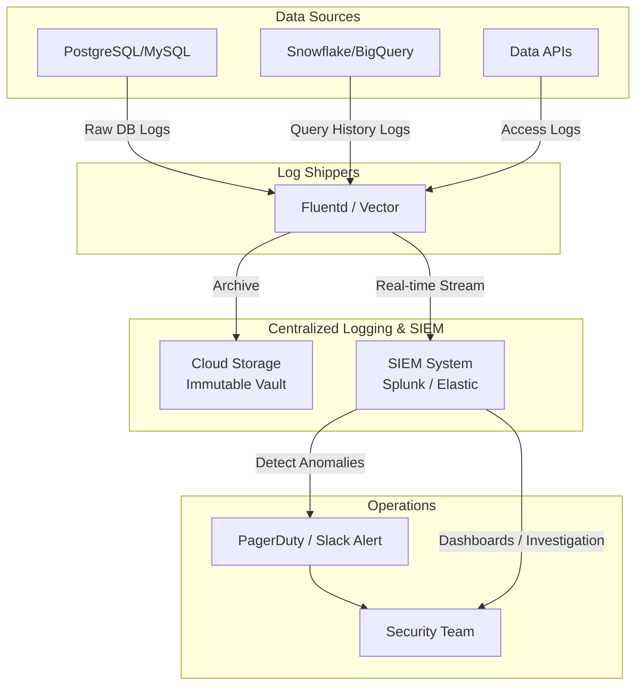

Hãy tưởng tượng bạn là Giám đốc công nghệ (CTO) của một công ty tài chính lớn. Vào một buổi sáng, bạn nhận được cảnh báo rằng thông tin cá nhân của hàng ngàn khách hàng đã bị rò rỉ ra ngoài. Lúc này, làm thế nào để bạn biết ai đã truy cập vào bảng dữ liệu khách hàng nhạy cảm đó? Họ đã chạy câu truy vấn SQL nào? Vào thời gian nào? Và dữ liệu đó được truyền đi đâu?

Để trả lời những câu hỏi này một cách chính xác, bạn cần có **Nhật ký kiểm toán (Audit Logging)**.

Tương tự như chiếc hộp đen trên máy bay ghi lại mọi thông tin chuyến bay để phục vụ việc điều tra sự cố, Audit Logging tự động ghi lại một cách chi tiết, có hệ thống và không thể thay đổi mọi hoạt động, sự kiện và quyền truy cập diễn ra trong hệ thống dữ liệu. Đây là lớp bảo vệ cuối cùng giúp doanh nghiệp truy vết sự cố, phát hiện xâm nhập trái phép và tuân thủ các tiêu chuẩn bảo mật khắt khe như SOC2, GDPR, hay HIPAA.


## Tại sao Audit Logging lại tối quan trọng đối với doanh nghiệp?

Nếu không có một hệ thống Audit Log được thiết lập bài bản, đội ngũ vận hành dữ liệu sẽ gặp phải ba thách thức lớn:

1. **Gặp khó khăn khi tuân thủ pháp lý (Compliance):** Khi doanh nghiệp muốn đạt chứng chỉ SOC2, ISO 27001 hay làm việc với các ngân hàng lớn, các kiểm toán viên luôn yêu cầu: *"Hãy chứng minh rằng bạn có thể theo dõi và biết rõ không có bất kỳ ai lén lút tải trộm dữ liệu khách hàng nhạy cảm vào ban đêm"*. Nhật ký kiểm toán chính là bằng chứng xác thực duy nhất bạn có thể cung cấp.
2. **Khó điều tra khi xảy ra sự cố (Forensics):** Khi hệ thống bị tấn công Ransomware hoặc dữ liệu nội bộ bị lộ, nếu không có log ghi nhận, bạn sẽ hoàn toàn mù mịt, không thể biết điểm đột nhập đầu tiên (Patient Zero) xuất phát từ đâu và những vùng dữ liệu nào đã bị tổn hại.
3. **Mối đe dọa từ nội bộ (Insider Threats):** Một nhân viên sắp nghỉ việc và muốn lấy trộm dữ liệu khách hàng bằng cách chạy lệnh tải xuống hàng triệu bản ghi. Một hệ thống Audit Log nhạy bén sẽ lập tức phát hiện hành vi truy xuất bất thường này và gửi cảnh báo khẩn cấp cho đội bảo mật.

## Trả lời câu hỏi bảo mật theo mô hình 5W1H

Khác với Application Logs (dùng để sửa lỗi ứng dụng) hay Performance Logs (dùng để đo hiệu năng phần cứng), Audit Logs tập trung trả lời các câu hỏi bảo mật cốt lõi:

* **Who (Ai):** Tài khoản người dùng nào, hay Service Account nào đã thực hiện hành động?
* **When (Khi nào):** Thời gian chính xác của sự kiện (bao gồm múi giờ)?
* **Where (Ở đâu):** Địa chỉ IP nguồn, thiết bị, hay ứng dụng nào đã gọi lệnh?
* **What (Cái gì):** Bảng dữ liệu, cột thông tin nhạy cảm (PII) nào đã bị tác động?
* **Why/How (Thế nào):** Câu lệnh SQL cụ thể là gì (`SELECT`, `UPDATE`, `DROP`) và kết quả thực thi thành công hay thất bại?

> [!IMPORTANT]  
> Một nguyên tắc sống còn của hệ thống Audit Log là tính **Bất biến (Immutability)** và **Chỉ thêm mới (Append-only)**. Nghĩa là ngay cả quản trị viên hệ thống (DBA) có toàn quyền tối cao cũng không được phép chỉnh sửa hay xóa bỏ các file log này.

## Cơ chế vận hành của một hệ thống thu thập nhật ký

Quy trình thu thập và phân tích Audit Log chuẩn thường đi qua 4 bước khép kín:

1. **Sinh log (Generation):** Database Engine (như PostgreSQL, [Snowflake](/concepts/2-storage/cloud-data-platform/snowflake/), BigQuery) được bật cấu hình Audit Logging ở cấp hệ thống. Mọi truy vấn gửi tới cơ sở dữ liệu sẽ bị chặn lại để ghi một bản sao chi tiết vào file log nội bộ.
2. **Chuyển tiếp log (Shipping):** Một phần mềm chạy ngầm (Agent như Fluentd, Vector, Datadog Agent) sẽ liên tục đọc các file log vật lý này và đẩy ra ngoài hệ thống nguồn.
3. **Lưu trữ an toàn (Storage):** Log được lưu trữ tại một nơi độc lập, thường là hệ thống SIEM (Security Information and Event Management) như Splunk, Elastic Security, hoặc một [Data Lake](/concepts/2-storage/data-lake-lakehouse/data-lake/) an toàn có hỗ trợ tính năng chống ghi đè (WORM - Write Once, Read Many).
4. **Phân tích và Cảnh báo (Analysis & Alerting):** Hệ thống SIEM liên tục phân tích các luồng log theo thời gian thực. Nếu phát hiện hành vi bất thường (ví dụ: một địa chỉ IP đăng nhập sai mật khẩu 50 lần liên tiếp, sau đó đăng nhập thành công và lập tức truy vấn bảng chứa mã pin thẻ tín dụng), hệ thống sẽ kích hoạt báo động đỏ.

## Sơ đồ luồng xử lý và lưu trữ Audit Log tập trung

Sơ đồ dưới đây mô tả cách log được thu thập từ nhiều nguồn dữ liệu khác nhau, nén và chuyển tiếp về kho lưu trữ bất biến và hệ thống cảnh báo bảo mật:


## Thực hành thực tế: Cấu hình pgAudit bảo vệ dữ liệu y tế trong PostgreSQL

Hãy cùng xem ví dụ cụ thể về cách thiết lập công cụ `pgAudit` để theo dõi các truy cập vào bảng dữ liệu y tế nhạy cảm `patients` trong cơ sở dữ liệu PostgreSQL.

### 1. Bật extension pgAudit trong file cấu hình postgresql.conf

```ini
shared_preload_libraries = 'pgaudit'
# Ghi lại các lệnh đọc (READ), ghi (WRITE), thay đổi cấu trúc (DDL) và phân quyền (ROLE)
pgaudit.log = 'READ, WRITE, DDL, ROLE'  
# Chỉ thực hiện ghi log trên các bảng dữ liệu được chỉ định cụ thể
pgaudit.log_relation = on               
```

### 2. Kích hoạt giám sát trên bảng dữ liệu nhạy cảm
Để tránh việc ghi log tràn lan gây chậm hệ thống, chúng ta chỉ kích hoạt giám sát trên bảng dữ liệu nhạy cảm:
```sql
-- Bước 1: Tạo một vai trò kiểm toán ảo
CREATE ROLE auditor;

-- Bước 2: Gán quyền đọc bảng cho auditor (pgAudit sẽ dựa vào đây để biết cần audit bảng nào)
GRANT SELECT ON public.patients TO auditor;

-- Bước 3: Cấu hình pgAudit chỉ theo dõi các bảng mà vai trò 'auditor' có quyền truy cập
ALTER SYSTEM SET pgaudit.role = 'auditor';
SELECT pg_reload_conf();
```

### 3. Kết quả log thu được
Khi một bác sĩ chạy câu lệnh truy cập thông tin bệnh nhân, file log thu được sẽ có định dạng chi tiết như sau:
```text
2026-06-07 10:15:30 UTC [User: doctor_smith] [IP: 192.168.1.55] LOG: AUDIT: SESSION,1,1,READ,SELECT,TABLE,public.patients,SELECT ssn, diagnosis FROM patients WHERE id = 123;
```

Bản log này chứa đầy đủ thông tin: ai đã truy cập (`doctor_smith`), từ IP nào (`192.168.1.55`), họ đã đọc cái gì (`READ SELECT` trên bảng `patients`) và câu lệnh SQL cụ thể là gì.

## Những nguyên tắc vàng giúp quản lý log thông minh

* **Đẩy log ra ngoài hệ thống nguồn ngay lập tức:** Đừng bao giờ lưu trữ file log trên cùng một máy chủ chạy database. Nếu hacker kiểm soát được máy chủ đó, chúng sẽ xóa sạch file log để xóa dấu vết. Hãy đẩy log ngay lập tức về một [Cloud Storage](/concepts/2-storage/cloud-data-platform/cloud-storage/) bucket được cấu hình chính sách khóa đối tượng (Object Lock) không cho xóa.
* **Chỉ audit các bảng/cột nhạy cảm:** Ghi log cho toàn bộ hàng tỷ câu lệnh `SELECT` của tất cả các bảng tạm sẽ sinh ra một lượng log khổng lồ, gây lãng phí tài nguyên và chi phí lưu trữ. Hãy kết hợp với [Data Catalog](/concepts/5-quality-governance/governance-metadata/data-catalog/) để gắn nhãn dữ liệu nhạy cảm (như PII, thông tin tài chính) và chỉ bật audit cho các tài sản này.
* **Mã hóa các thông tin nhạy cảm trong log:** Trong nhiều trường hợp, mật khẩu hay số thẻ tín dụng có thể vô tình lọt vào log thông qua các câu lệnh dạng `INSERT INTO users VALUES ('user_01', 'MyPassword123')`. Bộ lọc log cần có cơ chế tự động che mờ (masking) các thông tin nhạy cảm này trước khi ghi nhận.
* **Thiết lập chính sách lưu trữ nhiều tầng (Retention Policy):** Lưu trữ log nóng trên hệ thống SIEM khoảng 30 - 90 ngày để phục vụ điều tra sự cố nhanh, sau đó tự động đẩy sang các kho lưu trữ lạnh giá rẻ (như AWS S3 Glacier) và lưu trữ từ 1 đến 7 năm để phục vụ việc kiểm toán định kỳ.

## Những sai lầm kinh điển cần tránh

* **Cố gắng ghi log mọi thứ (Log Everything):** Việc ghi nhận mọi hành động, kể cả các câu truy vấn kiểm tra hệ thống (heartbeat query) hay log của môi trường Dev/Test sẽ làm chậm đáng kể hiệu năng của cơ sở dữ liệu do nghẽn I/O ổ đĩa, đồng thời đẩy chi phí lưu trữ log lên mức cực kỳ cao.
* **DBA quản trị cả hệ thống lưu trữ log:** Điều này vi phạm nguyên tắc "Tách biệt nhiệm vụ" (Segregation of Duties). Những kỹ sư có quyền quản trị database (DBA, Data Engineers) tuyệt đối không được có quyền xóa hay sửa đổi hệ thống lưu trữ log. Quyền quản trị hệ thống log phải thuộc về đội ngũ Bảo mật và Tuân thủ (Security/Compliance Team) độc lập.

## Điểm mạnh và điểm yếu

### Điểm mạnh (Pros)
* Cung cấp bằng chứng pháp lý và là công cụ điều tra đắc lực nhất khi xảy ra sự cố rò rỉ dữ liệu.
* Là điều kiện bắt buộc để doanh nghiệp mở rộng thị trường, ký kết hợp đồng với các khách hàng Enterprise lớn.
* Giúp phát hiện sớm các lỗ hổng phân quyền nội bộ (ví dụ: phát hiện tài khoản của một nhân viên đang có quyền đọc những dữ liệu họ không cần dùng đến).

### Điểm yếu (Cons)
* **Làm giảm hiệu năng hệ thống:** Việc ghi log đồng bộ (Synchronous Logging) bắt buộc database phải đợi ghi log xong mới trả kết quả cho người dùng, làm tăng độ trễ của truy vấn.
* **Chi phí lưu trữ đắt đỏ:** Dữ liệu log phình to rất nhanh theo thời gian. Chi phí sử dụng các nền tảng SIEM như Splunk hay Datadog có thể trở thành một gánh nặng tài chính lớn cho doanh nghiệp nếu không được cấu hình chọn lọc tốt.

## Khi nào nên dùng

* Bắt buộc phải có đối với các hệ thống dữ liệu phục vụ trực tiếp cho hoạt động kinh doanh (Production) có chứa thông tin khách hàng, số dư tài khoản, hồ sơ y tế.
* Các doanh nghiệp hoạt động trong lĩnh vực Fintech, Edutech, Healthcare hoặc các công ty SaaS muốn bán sản phẩm cho các tập đoàn lớn.
* **Khi nào không nên dùng:** Không nên bật audit logging một cách vô tội vạ trên môi trường Dev/Test hoặc ghi log cho toàn bộ bảng tạm có vòng đời ngắn, nhằm tránh lãng phí dung lượng và làm giảm hiệu năng phát triển.

## Các khái niệm liên quan

* [Kiểm soát truy cập - Access Control](/concepts/5-quality-governance/governance-metadata/access-control/)
* [Phân loại dữ liệu - Data Classification](/concepts/5-quality-governance/governance-metadata/data-classification/)
* [Data Observability](/concepts/5-quality-governance/observability-reliability/data-observability/)

## Trọng tâm ôn luyện phỏng vấn

### 1. Tại sao chúng ta không dùng Application Logs (nhật ký của ứng dụng) để thay thế hoàn toàn cho Database Audit Logs?
* **Gợi ý trả lời:** Application Logs chỉ ghi nhận được các thao tác đi qua tầng ứng dụng. Nếu một lập trình viên, một DBA hoặc một kẻ tấn công sử dụng các công cụ kết nối trực tiếp vào database (như DBeaver, DataGrip) hoặc kết nối qua dòng lệnh terminal để truy cập dữ liệu, hệ thống Application Logs sẽ hoàn toàn không hay biết. Chỉ có Audit Logs được cấu hình ngay tại tầng công cụ của Database (Database Engine) mới đảm bảo bắt được 100% mọi truy cập dữ liệu từ bất kỳ nguồn nào.

### 2. Làm thế nào để giải quyết vấn đề sụt giảm hiệu năng khi phải ghi Audit Log cho hàng tỷ truy vấn SELECT mỗi ngày trên các hệ thống Data Warehouse lớn?
* **Gợi ý trả lời:** Để tối ưu hiệu năng, chúng ta áp dụng ba phương án: (1) Chỉ bật ghi log chọn lọc trên các bảng dữ liệu nhạy cảm được gắn thẻ PII/Confidential thay vì ghi log đại trà. (2) Cấu hình cơ chế ghi log bất đồng bộ (Asynchronous Logging) để việc ghi log không làm chặn luồng trả kết quả truy vấn của người dùng. (3) Tận dụng các Cloud [Data Warehouse](/concepts/2-storage/data-warehouse/data-warehouse/) hiện đại (như Snowflake, BigQuery) vì chúng được thiết kế tách biệt hoàn toàn giữa luồng xử lý siêu dữ liệu (Metadata/Cloud Logging) và luồng tính toán dữ liệu, giúp việc ghi log gần như không gây ảnh hưởng đến hiệu năng truy vấn.

### 3. Ý nghĩa của nguyên tắc "Tách biệt nhiệm vụ" (Segregation of Duties) trong thiết kế hệ thống Audit Logging là gì?
* **Gợi ý trả lời:** Nguyên tắc này quy định rằng người có quyền thay đổi dữ liệu hoặc cấu hình hệ thống (như DBA hay Data Engineer) không được phép có quyền kiểm soát hoặc chỉnh sửa các file nhật ký ghi lại hành động của chính họ. Hệ thống log sau khi sinh ra phải được tự động mã hóa và chuyển tiếp sang một môi trường lưu trữ độc lập do đội ngũ Bảo mật quản lý, nhằm ngăn ngừa triệt để hành vi nội bộ lạm quyền xóa log để xóa dấu vết sau khi thực hiện các hành động phá hoại hoặc lấy cắp dữ liệu.

## Xem thêm các khái niệm liên quan
* [Kiểm soát truy cập - Access Control (RBAC & ABAC)](/concepts/5-quality-governance/governance-metadata/access-control/)
* [Danh mục dữ liệu - Data Catalog](/concepts/5-quality-governance/governance-metadata/data-catalog/)
* [Phân loại dữ liệu - Data Classification](/concepts/5-quality-governance/governance-metadata/data-classification/)

## Tài liệu tham khảo

1. [NIST SP 800-92 Log Management Guide](https://csrc.nist.gov/publications/detail/sp/800-92/final) - Hướng dẫn quản lý và lưu giữ log bảo mật của Viện Tiêu chuẩn và Công nghệ Quốc gia Hoa Kỳ.
2. [AWS CloudTrail Documentation](https://docs.aws.amazon.com/awscloudtrail/) - Hướng dẫn cấu hình dịch vụ AWS CloudTrail để audit mọi API request.
3. [Snowflake Access History & Audit Logs](https://docs.snowflake.com/en/user-guide/access-history) - Snowflake Access History giúp theo dõi chi tiết lịch sử truy cập bảng và cột.
4. [Google Cloud Audit Logs Overview](https://cloud.google.com/logging/docs/audit) - Tổng quan về Cloud Audit Logs trong hệ sinh thái Google Cloud.
5. [Microsoft Azure Monitor Activity Log](https://azure.microsoft.com/en-us/services/monitor/) - Theo dõi hoạt động kiểm toán và log bảo mật cấp hạ tầng trên Azure.
6. [Apache Ranger Auditing Guide](https://ranger.apache.org/blogs.html) - Cấu hình ghi nhận và kiểm toán truy cập dữ liệu tập trung qua Apache Ranger.

## English Summary

Audit Logging is the automated, immutable recording of all activities within a database or data system, answering the "Who, What, When, Where, and How" of data access and modifications. It is a critical component of [Data Governance](/concepts/5-quality-governance/governance-metadata/data-governance/) and Security, ensuring compliance with frameworks like SOC2, HIPAA, and GDPR. A robust audit logging architecture must capture DDL/DML changes and sensitive data queries, ship them asynchronously to a centralized, tamper-proof SIEM or storage vault, and maintain strict segregation of duties. While essential for forensic analysis and insider threat detection, audit logging requires careful configuration to avoid severe storage costs and database performance bottlenecks.