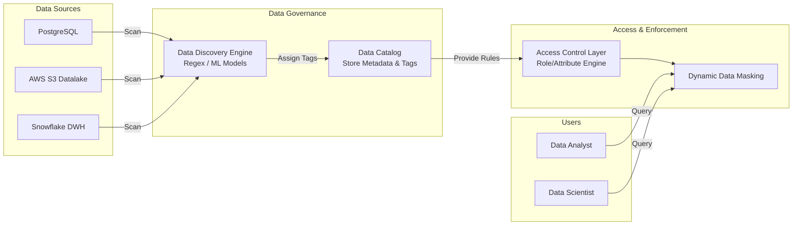

Khi dữ liệu trở thành nguồn tài sản chiến lược của doanh nghiệp, việc bảo vệ nó khỏi các cuộc tấn công bảo mật và rò rỉ thông tin là nhiệm vụ quan trọng hàng đầu. Tuy nhiên, nếu bạn cố gắng bảo vệ mọi byte dữ liệu với cùng một tiêu chuẩn an ninh nghiêm ngặt nhất, bạn sẽ nhanh chóng cạn kiệt ngân sách. **Data Classification (Phân loại dữ liệu)** chính là nghệ thuật gán nhãn và phân cấp thông tin, giúp doanh nghiệp tập trung nguồn lực để bảo vệ những gì thực sự nhạy cảm và giá trị nhất.


## Phân loại dữ liệu (Data Classification): Khiên bảo vệ tài sản thông tin

Về cơ bản, **Phân loại dữ liệu** là quy trình nhận diện, gán nhãn và phân nhóm dữ liệu dựa trên mức độ nhạy cảm, giá trị nghiệp vụ cũng như các yêu cầu tuân thủ pháp luật. 

Hệ thống này giúp gán các siêu dữ liệu `(Metadata/Tags)` cho từng tập dữ liệu trong hệ thống nhằm xác định rõ ràng:
1. Dữ liệu này đang chứa loại thông tin gì?
2. Mức độ nhạy cảm của nó ra sao? (Ví dụ phân chia thành 4 cấp độ: *Public - Công khai*, *Internal - Nội bộ*, *Confidential - Bảo mật*, *Restricted - Tuyệt mật*).
3. Những quy định pháp lý nào đang điều chỉnh (ví dụ: luật bảo vệ dữ liệu cá nhân GDPR, HIPAA trong y tế, hay PCI-DSS trong thanh toán thẻ).

Quy trình phân loại này có thể được thiết lập từ cấp độ vĩ mô như toàn bộ database, bảng dữ liệu, cho tới cấp độ vi mô như từng cột thông tin hoặc từng tệp tin riêng lẻ.

## Tại sao bảo mật cào bằng lại là một sai lầm đắt đỏ?

Khi quy mô dữ liệu chạm ngưỡng hàng Terabytes hay Petabytes, việc áp dụng các cơ chế mã hóa phức tạp `(encryption at rest/in transit)` và kiểm toán gắt gao cho mọi bảng dữ liệu là điều bất khả thi và gây lãng phí tài nguyên tính toán cực kỳ lớn. Phân loại dữ liệu ra đời để giải quyết ba bài toán thực tế sau:

* **Tuân thủ pháp luật (Compliance)**: Các đạo luật bảo vệ quyền riêng tư (như GDPR hay Nghị định 13 tại Việt Nam) yêu cầu doanh nghiệp phải biết chính xác dữ liệu định danh cá nhân `(PII - Personally Identifiable Information)` của khách hàng đang nằm ở đâu để có thể thực hiện quyền được xóa bỏ dữ liệu hoặc mã hóa bảo vệ khi có yêu cầu.
* **Tối ưu hóa chi phí an ninh**: Việc biết rõ bảng nào là thông tin công cộng, bảng nào chứa dữ liệu thẻ tín dụng giúp doanh nghiệp phân bổ ngân sách bảo mật một cách thông minh nhất vào những khu vực trọng yếu.
* **Đánh giá thiệt hại khi xảy ra sự cố (Data Breach)**: Nếu chẳng may hệ thống bị tấn công, việc sở hữu bản đồ phân loại dữ liệu rõ ràng giúp ban lãnh đạo lập tức xác định được mức độ nghiêm trọng của phần dữ liệu bị lộ lọt để đưa ra các biện pháp ứng phó kịp thời.

## Các trụ cột của quy trình phân loại dữ liệu

Một chiến lược Phân loại dữ liệu hiệu quả được xây dựng dựa trên ba trụ cột chính:

* **Khám phá dữ liệu (Data Discovery)**: Quét tự động toàn bộ kho lưu trữ ([Data Warehouse](/concepts/2-storage/data-warehouse/data-warehouse/), [Data Lake](/concepts/2-storage/data-lake-lakehouse/data-lake/)) để nhận diện các mẫu dữ liệu nhạy cảm thông qua các thuật toán so khớp chuỗi (Regex) hoặc Học máy (Machine Learning).
* **Phân cấp bảo mật (Security Tiering)**: Thiết lập các quy chuẩn phân cấp rõ ràng. Mô hình phổ biến nhất thường chia thành 4 lớp: Public (Dữ liệu công cộng), Internal (Dữ liệu nội bộ của nhân viên), Confidential (Dữ liệu tài chính, chiến lược kinh doanh) và Restricted (Dữ liệu tuyệt mật liên quan trực tiếp đến thông tin cá nhân khách hàng PII).
* **Quản lý siêu dữ liệu ([Metadata Management](/concepts/5-quality-governance/governance-metadata/metadata-management/))**: Lưu trữ các nhãn phân loại này tập trung trong các hệ thống Data Catalog để làm cơ sở cho việc phân quyền tự động `(Access Control)` và che giấu dữ liệu `(Data Masking)`.

## Luồng vận hành của hệ thống tự động phân loại và bảo vệ dữ liệu

Sơ đồ dưới đây mô tả hành trình từ lúc dữ liệu thô được quét phân loại, gán nhãn cho đến khi được che giấu động trước khi hiển thị cho người dùng cuối:


1. **Định nghĩa quy tắc**: Đội ngũ bảo mật thiết lập các mẫu nhận diện (ví dụ: định dạng email, số điện thoại, số thẻ ngân hàng).
2. **Quét dữ liệu**: Các công cụ bảo mật quét tự động qua cấu trúc bảng và lấy mẫu dữ liệu để phân tích.
3. **Gán nhãn**: Nếu phát hiện cột dữ liệu chứa cấu trúc giống email (ví dụ: `*@*.*`), hệ thống tự động gán nhãn `PII` và `Restricted`.
4. **Áp dụng chính sách**: Dựa trên nhãn đã gán, hệ thống phân quyền sẽ tự động kích hoạt tính năng ẩn danh dữ liệu `(Dynamic Data Masking)` trước khi trả kết quả truy vấn cho người dùng không có thẩm quyền đặc biệt.

## Thực tế triển khai chính sách ẩn danh dữ liệu (Data Masking) bằng SQL

Hãy xem kịch bản thực tế với bảng dữ liệu khách hàng `customers`:
```sql
CREATE TABLE customers (
    id UUID PRIMARY KEY,
    full_name VARCHAR(100), -- Dữ liệu nhạy cảm PII
    email VARCHAR(100),     -- Dữ liệu nhạy cảm PII
    phone VARCHAR(20),      -- Dữ liệu nhạy cảm PII
    segment VARCHAR(50),    -- Dữ liệu thông thường
    lifetime_value FLOAT    -- Dữ liệu thông thường
);
```

**Bước 1: Gán nhãn trên Data Catalog**
Hệ thống quét và tự động gán nhãn bảo mật:
* Cột `full_name`, `email`, `phone` -> Gán nhãn `PII` và cấp độ `Restricted`.
* Cột `segment`, `lifetime_value` -> Gán nhãn `Business_Metric` và cấp độ `Internal`.

**Bước 2: Thiết lập chính sách che giấu dữ liệu động (Ví dụ trên [Snowflake](/concepts/2-storage/cloud-data-platform/snowflake/) DWH)**

```sql
-- Khởi tạo chính sách ẩn danh thông tin Email
CREATE OR REPLACE MASKING POLICY email_mask AS (val VARCHAR) RETURNS VARCHAR ->
  CASE
    -- Nếu là Data Engineer hoặc Cán bộ Pháp chế thì hiển thị rõ
    WHEN CURRENT_ROLE() IN ('DATA_ENGINEER', 'COMPLIANCE_OFFICER') THEN val
    -- Các vai trò khác chỉ hiển thị ký tự đầu của email kèm dấu hoa thị
    ELSE REGEXP_REPLACE(val, '(.).*@(.*)', '\\1***@\\2')
  END;

-- Áp dụng chính sách che giấu lên cột email của bảng customers
ALTER TABLE customers MODIFY COLUMN email SET MASKING POLICY email_mask;
```

Khi một nhân viên phân tích thông thường chạy câu lệnh `SELECT email FROM customers;`, giá trị trả về sẽ là `j***@gmail.com` thay vì địa chỉ email thật, giúp ngăn ngừa việc lộ lọt thông tin cá nhân vô ý.

## Cẩm nang quản trị phân loại dữ liệu (Best Practices)

* **Ưu tiên tự động hóa**: Dữ liệu trong doanh nghiệp biến động từng giờ. Việc phân loại thủ công bằng sức người chắc chắn sẽ thất bại. Hãy sử dụng các dịch vụ quét tự động như AWS Macie, Google Cloud DLP để liên tục phát hiện dữ liệu nhạy cảm mới phát sinh.
* **Liên kết chặt chẽ với Data Catalog**: Hãy đảm bảo các thẻ phân loại bảo mật hiển thị rõ ràng trên Data Catalog để các nhà phân tích biết trước cột nào chứa dữ liệu nhạy cảm trước khi gửi yêu cầu xin quyền.
* **Áp dụng nguyên tắc quyền hạn tối thiểu (Least Privilege)**: Thiết lập mặc định chặn quyền truy cập vào các dữ liệu phân loại cấp độ `Restricted/PII` đối với tất cả người dùng, chỉ phê duyệt cấp quyền khi có lý do nghiệp vụ thực sự rõ ràng.
* **Quy trình xử lý lỗi nhận diện nhầm**: Các quy tắc Regex tự động đôi khi có thể nhận diện nhầm các ID hệ thống thành số thẻ tín dụng. Hãy xây dựng quy trình cho phép các quản trị viên dữ liệu `(Data Stewards)` ghi đè và điều chỉnh nhãn bằng tay một cách dễ dàng.

## Những sai lầm kinh điển dễ làm rò rỉ thông tin

* **Quét toàn bộ dữ liệu trực tiếp trên Database Production**: Việc chạy các câu lệnh truy vấn quét qua hàng Terabytes dữ liệu vận hành để tìm kiếm PII sẽ làm sập hệ thống. Hãy chỉ thực hiện quét cấu trúc `(schema)` hoặc thực hiện lấy mẫu `(sampling)` một lượng nhỏ dòng dữ liệu (ví dụ 1000 dòng).
* **Thiết lập quá nhiều cấp độ phân loại**: Việc tạo ra hàng chục cấp độ bảo mật rườm rà (PII-1, PII-2, Private-A, Private-B) chỉ làm người dùng bối rối và gây khó khăn cho việc quản trị chính sách phân quyền. Hãy tối giản cấu trúc trong khoảng 3 đến 4 cấp độ bảo mật.
* **Phân loại mang tính chất minh họa**: Rất nhiều doanh nghiệp chỉ dừng lại ở việc dán nhãn bảng dữ liệu trên trang tài liệu Excel hoặc Data Catalog mà không hề cấu hình các rule bảo mật thực tế ở tầng database, khiến việc phân loại không có giá trị bảo vệ thực tế.

## Điểm mạnh và điểm yếu

### Điểm mạnh (Pros)
* Đảm bảo tuân thủ tuyệt đối các quy định pháp luật khắt khe về quyền riêng tư.
* Giảm thiểu tối đa tác hại và trách nhiệm pháp lý khi có sự cố rò rỉ dữ liệu.
* Tối ưu hóa chi phí đầu tư cho hạ tầng an ninh thông tin.

### Điểm yếu (Cons)
* **Làm chậm tiến trình phân tích**: Các nhà phân tích phải vượt qua nhiều quy trình phê duyệt rườm rà để tiếp cận dữ liệu thô phục vụ nghiên cứu.
* **Tốn kém tài nguyên tính toán**: Việc liên tục thực hiện quét phân loại và chạy các hàm ẩn danh động `(Dynamic Masking)` khi truy vấn sẽ tiêu tốn thêm năng lượng CPU của Data Warehouse.

## Khi nào nên dùng

**Cần áp dụng khi:**
* Doanh nghiệp của bạn hoạt động trong các lĩnh vực xử lý trực tiếp nhiều thông tin cá nhân khách hàng, tài chính, hoặc y tế (như Thương mại điện tử B2C, Fintech, Ngân hàng, Bệnh viện).
* Tổ chức chuẩn bị thực hiện các đợt đánh giá chứng chỉ an ninh thông tin quốc tế (như ISO 27001, SOC 2).

**Không nên dùng khi:**
* Hệ thống của bạn chủ yếu xử lý các dữ liệu máy móc phi cá nhân (như log hệ thống server, dữ liệu cảm biến thời tiết, dữ liệu IoT).
* Các startup ở giai đoạn đầu xây dựng sản phẩm thử nghiệm (MVP), cần ưu tiên tốc độ phát triển và phân tích nhanh hơn là các quy trình bảo mật phức tạp.

## Trọng tâm ôn luyện phỏng vấn

### 1. Sự khác biệt cốt lõi giữa Data Classification và Data Cataloging là gì?
* **Mục đích câu hỏi**: Đánh giá sự hiểu biết của ứng viên về bức tranh tổng thể của quản trị dữ liệu ([Data Governance](/concepts/5-quality-governance/governance-metadata/data-governance/)).
* **Gợi ý trả lời**:
  * *Data Cataloging* là quá trình thu thập siêu dữ liệu tổng thể để giúp người dùng dễ dàng tìm kiếm và hiểu ngữ cảnh kinh doanh của bảng (ví dụ: bảng này chứa thông tin gì, phục vụ phòng ban nào, ai sở hữu).
  * *Data Classification* là một phần việc chuyên biệt nằm trong Data Cataloging, tập trung sâu vào khía cạnh đánh giá mức độ nhạy cảm và gán nhãn bảo mật (như PII, Confidential) để làm cơ sở thiết lập các chính sách bảo vệ và tuân thủ pháp luật.

### 2. Làm thế nào để tự động hóa quy trình phát hiện PII trên một Data Lake có dung lượng hàng Petabytes một cách tối ưu chi phí?
* **Mục đích câu hỏi**: Kiểm tra tư duy thiết kế hệ thống dữ liệu lớn và tối ưu hóa tài nguyên của ứng viên.
* **Gợi ý trả lời**:
  * Việc quét trực tiếp hàng Petabytes dữ liệu thô sẽ tốn kém chi phí cực kỳ lớn. Do đó, chúng ta nên kết hợp ba giải pháp sau:
    1. *Quét Metadata trước*: Chỉ quét tên các cột dữ liệu. Nếu cột có tên chứa các từ khóa như `email`, `phone`, `ssn`, hệ thống sẽ lập tức đánh dấu nhạy cảm mà không cần đọc dữ liệu bên trong.
    2. *Quét lấy mẫu (Sampling)*: Thay vì quét toàn bộ file, chúng ta chỉ lấy mẫu ngẫu nhiên 1% dữ liệu mới nạp vào để chạy qua các engine phát hiện PII (như AWS Macie hay Google Cloud DLP).
    3. *Kế thừa phả hệ (Lineage Inheritance)*: Nếu bảng gốc `(Upstream)` đã được xác định chứa PII, các bảng phái sinh `(Downstream)` được tạo ra từ nó sẽ tự động được hệ thống gán nhãn PII mà không cần thực hiện quét lại.

### 3. Hãy phân biệt cơ chế hoạt động của Dynamic Data Masking và Static Data Masking.
* **Mục đích câu hỏi**: Kiểm tra kiến thức thực hành bảo mật cơ sở dữ liệu.
* **Gợi ý trả lời**:
  * *Static Data Masking (SDM)* thực hiện thay đổi vĩnh viễn dữ liệu gốc trên đĩa lưu trữ. Dữ liệu thật sẽ bị xóa bỏ hoàn toàn và thay bằng dữ liệu giả lập. Phương pháp này thường được dùng khi sao chép dữ liệu từ môi trường Production sang môi trường Dev/Test để lập trình viên chạy thử code.
  * *Dynamic Data Masking (DDM)* thực hiện che giấu dữ liệu tức thời ngay trong quá trình trả kết quả truy vấn. Dữ liệu gốc lưu trên ổ đĩa vẫn giữ nguyên vẹn 100%. Việc dữ liệu hiển thị rõ hay bị ẩn đi phụ thuộc hoàn toàn vào quyền hạn `(Role)` của người đang thực hiện câu lệnh truy vấn đó. Phương pháp này thích hợp dùng trực tiếp trên môi trường Production để phân quyền xem dữ liệu giữa các bộ phận.

## Các khái niệm liên quan

* [Access Control (Kiểm soát truy cập)](/concepts/5-quality-governance/governance-metadata/access-control/)
* [Audit Logging (Nhật ký kiểm toán)](/concepts/5-quality-governance/governance-metadata/audit-logging/)
* [Data Catalog](/concepts/5-quality-governance/governance-metadata/data-catalog/)

## Xem thêm các khái niệm liên quan
* [Kiểm soát truy cập - Access Control (RBAC & ABAC)](/concepts/5-quality-governance/governance-metadata/access-control/)
* [Nhật ký kiểm toán - Audit Logging](/concepts/5-quality-governance/governance-metadata/audit-logging/)
* [Danh mục dữ liệu - Data Catalog](/concepts/5-quality-governance/governance-metadata/data-catalog/)

## Tài liệu tham khảo

1. [AWS Macie Data Classification](https://docs.aws.amazon.com/macie/latest/user/data-classification.html) - Quét và phát hiện dữ liệu nhạy cảm PII tự động bằng AWS Macie.
2. [Google Cloud Sensitive Data Protection (DLP)](https://cloud.google.com/sensitive-data-protection/docs/classification) - Dịch vụ phát hiện, phân loại và bảo vệ dữ liệu nhạy cảm trên GCP.
3. [Microsoft Azure Information Protection & Classification](https://azure.microsoft.com/en-us/services/information-protection/) - Giải pháp phân loại, dán nhãn và bảo vệ tài liệu dữ liệu trên Azure.
4. [Snowflake Object Tagging & Classification](https://docs.snowflake.com/en/user-guide/object-tagging) - Tính năng phân loại dữ liệu và gán nhãn đối tượng trong Snowflake.
5. [Apache Ranger Data Classification Policy](https://ranger.apache.org/blogs.html) - Thiết lập chính sách bảo mật dựa trên thẻ tag phân loại dữ liệu với Apache Ranger.
6. [Confluent Cloud Schema Governance](https://docs.confluent.io/cloud/current/stream-governance/schema-governance.html) - Quản lý schema và kiểm soát phân loại dữ liệu trên các stream dữ liệu thời gian thực.

## English Summary

Data Classification is the process of discovering, categorizing, and tagging data based on its sensitivity, business value, and compliance requirements (e.g., GDPR, HIPAA). Its primary goal is to protect Personally Identifiable Information (PII) and optimize security costs by applying appropriate access controls and masking policies (Dynamic Data Masking). The workflow involves automated discovery using regex or ML models, tagging metadata in a Data Catalog, and enforcing security policies down to the column level. While it ensures regulatory compliance and minimizes data breach risks, it adds computational overhead and administrative complexity.