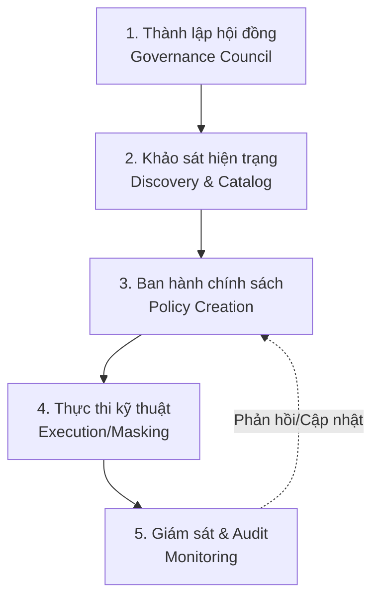

Hãy thử tưởng tượng một quốc gia không có luật pháp, không có hiến pháp và không có cảnh sát giao thông. Mọi người tự do đi lại theo cách mình muốn, tự đặt ra luật lệ riêng cho khu phố của mình. Vương quốc dữ liệu của một doanh nghiệp không có **Quản trị dữ liệu (Data Governance)** cũng sẽ rơi vào cảnh hỗn loạn tương tự. 

Dữ liệu được lưu trữ vô tội vạ, mỗi phòng ban tự định nghĩa các chỉ số kinh doanh theo ý mình, thông tin nhạy cảm của khách hàng bị phơi bày trên những file Excel mà bất kỳ ai cũng có thể mở. Data Governance sinh ra chính là để thiết lập trật tự từ sự hỗn loạn đó.

---

## Quản trị dữ liệu thực chất là gì?

**Data Governance** không phải là một công việc viết code, cấu hình máy chủ hay xây dựng cơ sở hạ tầng kỹ thuật. Đây là một khái niệm nằm ở cấp chiến lược kinh doanh (`Business strategy level`). 

Nếu ví hệ thống dữ liệu như một xã hội thu nhỏ, thì Data Governance chính là cơ quan lập pháp ban hành luật pháp, quy định rõ:
* Ai có quyền truy cập vào dữ liệu bảng lương của nhân viên?
* Khi định nghĩa chỉ số "Khách hàng hoạt động", chúng ta sẽ lấy tiêu chuẩn của phòng Marketing hay phòng Sales làm chuẩn?
* Nếu phát hiện dữ liệu bị sai lệch, cá nhân hay đội ngũ nào sẽ chịu trách nhiệm chính để sửa chữa?
* Dữ liệu thẻ tín dụng phải được mã hóa như thế nào để không vi phạm luật bảo mật quốc tế (như GDPR hay CCPA)?

Trong mối quan hệ này, các kỹ sư dữ liệu (Data Engineers) đóng vai trò là những người *thực thi pháp luật* bằng kỹ thuật, còn Ban Quản trị Dữ liệu (Data Governance Council) mới là người *hoạt động lập pháp* để đưa ra các quy tắc.

---

## Tại sao doanh nghiệp không thể thiếu Data Governance?

Dữ liệu chỉ thực sự là tài sản khi nó được quản lý đúng cách. Nếu bỏ bê, nó sẽ nhanh chóng biến thành một khoản nợ pháp lý và vận hành (Liability):

* **Sự hỗn loạn về mặt định nghĩa (Data Silos)**: Phòng Marketing báo cáo tháng này có 10.000 khách hàng mới, phòng Sales lại khẳng định chỉ có 7.000. Những cuộc họp căng thẳng kéo dài vô tận chỉ để tranh cãi xem số liệu của bên nào mới đúng, đơn giản vì hai bên có định nghĩa "khách hàng mới" khác nhau.
* **Nguy cơ rò rỉ thông tin nhạy cảm**: Thông tin cá nhân (PII) như số CCCD, số điện thoại hay số tài khoản ngân hàng của khách hàng bị lưu trữ thô, không mã hóa. Chỉ cần một sơ suất nhỏ, doanh nghiệp có thể phải đối mặt với những khoản phạt khổng lồ từ cơ quan quản lý và mất đi uy tín thương hiệu tích lũy nhiều năm.
* **Vấn nạn rác dữ liệu**: Các bảng dữ liệu nháp, dữ liệu thử nghiệm từ nhiều năm trước vẫn tồn tại trên cloud, làm hóa đơn lưu trữ tăng chóng mặt mà không mang lại bất kỳ giá trị thực tế nào.

---

## Ba trụ cột vững chắc của Data Governance

Một chiến lược quản trị dữ liệu thành công luôn được xây dựng dựa trên sự kết hợp hài hòa của bộ ba: **Con người**, **Quy trình** và **Công nghệ**.

### 1. Con người (People & Organization)
Mọi quy tắc sẽ vô dụng nếu không có người chịu trách nhiệm thực thi. Chúng ta cần định nghĩa rõ 3 vai trò cốt lõi:
* **Chủ sở hữu dữ liệu (Data Owner)**: Thường là các lãnh đạo bộ phận nghiệp vụ (Business Leaders), chịu trách nhiệm tối cao về chất lượng và độ an toàn của miền dữ liệu đó. Ví dụ: Giám đốc Nhân sự là Data Owner của dữ liệu nhân viên.
* **Quản gia dữ liệu (Data Steward)**: Những người trực tiếp vận hành hàng ngày, đảm bảo dữ liệu được định nghĩa đúng và tuân thủ các chính sách đề ra (thường do các Business Analysts giàu kinh nghiệm đảm nhận).
* **Người bảo hộ dữ liệu (Data Custodian)**: Đội ngũ kỹ thuật (IT, Data Engineers, DBA) chịu trách nhiệm về mặt hạ tầng, lưu trữ và bảo mật vật lý cho dữ liệu.

### 2. Quy trình (Processes & Policies)
Thiết lập các quy trình rõ ràng như: quy trình yêu cầu và phê duyệt quyền truy cập dữ liệu, quy chuẩn đặt tên bảng, quy trình xây dựng từ điển dữ liệu (Data Dictionary) và các chính sách mã hóa bảo mật thông tin.

### 3. Công nghệ (Technology)
Sử dụng các công cụ phần mềm để tự động hóa các quy tắc do con người đặt ra. Các công cụ này bao gồm hệ thống Data Catalog (phân loại dữ liệu), công cụ giám sát chất lượng dữ liệu (Data Quality) và sơ đồ luồng đi của dữ liệu (Data Lineage).

---

## Quy trình triển khai Data Governance trong doanh nghiệp

Việc áp dụng Data Governance là một hành trình dài hạn, thường được bảo trợ bởi các lãnh đạo cấp cao (C-Level) và đi qua các bước sau:


1. **Thành lập Hội đồng quản trị dữ liệu (Governance Council)**: Quy tụ các đại diện cấp cao như CDO, CTO và trưởng các bộ phận kinh doanh để thống nhất tầm nhìn chiến lược.
2. **Khảo sát tài sản dữ liệu (Discovery)**: Sử dụng các công cụ quét dữ liệu tự động để lập bản đồ xem doanh nghiệp đang có những dữ liệu gì và chúng đang nằm ở đâu.
3. **Xây dựng chính sách (Policy Creation)**: Soạn thảo các quy định cụ thể (ví dụ: "Tất cả số điện thoại của khách hàng trên môi trường thử nghiệm bắt buộc phải được che giấu").
4. **Hiện thực hóa bằng kỹ thuật (Execution)**: Đội ngũ [Data Engineering](/concepts/1-foundations/foundation/data-engineering/) tiến hành áp dụng các kỹ thuật như phân quyền truy cập chi tiết (Row/Column-level Security) hay che giấu dữ liệu động (Dynamic Data Masking).
5. **Giám sát và kiểm toán (Monitoring & Audit)**: Liên tục đo lường chất lượng dữ liệu và kiểm tra lịch sử truy cập để phát hiện các hành vi bất thường.

---

## Ví dụ thực tế: Quản lý dữ liệu số định danh cá nhân (CCCD)

Hãy xem cách một tổ chức tài chính áp dụng Data Governance để bảo vệ số CCCD của khách hàng:

* **Chính sách đưa ra (Policy)**: Số CCCD là thông tin cá nhân tối mật (PII Tier 1). Chỉ nhân viên thuộc bộ phận duyệt hồ sơ vay trực tiếp (Loan Officers) mới được xem số đầy đủ. Bộ phận phân tích (Data Analysts) chỉ được xem thông tin độ tuổi và giới tính để làm báo cáo, tuyệt đối không được tiếp cận số CCCD thực tế.
* **Vai trò phân định**:
  * *Data Owner*: Giám đốc Vận hành (COO).
  * *Data Steward*: Trưởng phòng Pháp chế.
* **Thực thi kỹ thuật**: Kỹ sư dữ liệu cấu hình phân quyền truy cập cột (Column-level Security) trên Data Warehouse bằng SQL:
```sql
-- Giả mã logic cấp quyền truy cập theo vai trò
GRANT SELECT (customer_id, age, gender) ON dim_customers TO ROLE data_analyst;
GRANT SELECT (customer_id, age, gender, national_id) ON dim_customers TO ROLE loan_officer;
```

Nhờ vậy, chính sách bảo mật trên giấy tờ đã được chuyển hóa thành các dòng code kỹ thuật nghiêm ngặt bảo vệ doanh nghiệp khỏi nguy cơ rò rỉ dữ liệu.

---

## Điểm mạnh và điểm yếu

### Điểm mạnh (Pros)
* Giảm thiểu tối đa rủi ro pháp lý liên quan đến bảo mật thông tin và danh tiếng của doanh nghiệp.
* Phá bỏ rào cản cô lập dữ liệu (Data Silos), hướng tới một nguồn sự thật duy nhất (Single Source of Truth) thống nhất toàn công ty.
* Rút ngắn thời gian tìm kiếm và hiểu dữ liệu cho các kỹ sư cũng như nhà phân tích mới.

### Điểm yếu (Cons)
* **Làm chậm tốc độ vận hành ban đầu**: Mọi quy trình từ xây dựng pipeline đến phân quyền đều phải tuân thủ nghiêm ngặt các bước kiểm duyệt, không còn chỗ cho các cách làm nhanh nhưng cẩu thả.
* **Chi phí cao**: Việc đầu tư các phần mềm quản trị chuyên dụng (như Collibra, Alation) và duy trì đội ngũ vận hành đòi hỏi nguồn ngân sách không hề nhỏ.

---

## Khi nào nên dùng

### Nên áp dụng khi:
* Doanh nghiệp hoạt động trong các lĩnh vực nhạy cảm, chịu sự giám sát chặt chẽ của pháp luật như Ngân hàng, Y tế, Bảo hiểm.
* Doanh nghiệp đang tăng trưởng nóng (Scale-up) với số lượng nhân sự bùng nổ, việc truyền đạt thông tin bằng miệng không còn hiệu quả.
* Doanh nghiệp đang chuẩn bị cho quá trình lên sàn chứng khoán (IPO), đòi hỏi tính minh bạch tối đa trong báo cáo tài chính.

### Không nên áp dụng khi:
* Doanh nghiệp là một startup siêu nhỏ (dưới 15 người) đang chật vật tìm kiếm chỗ đứng trên thị trường (Product-Market Fit). Việc áp đặt một bộ quy tắc cồng kềnh lúc này sẽ bóp chết sự linh hoạt và tốc độ thử nghiệm của sản phẩm.

## Các khái niệm liên quan

* [Unity Catalog: Quản trị dữ liệu Lakehouse](/concepts/5-quality-governance/governance-metadata/unity-catalog-governance/)
* [Data Lineage](/concepts/5-quality-governance/governance-metadata/data-lineage/)
* [Data Catalog](/concepts/5-quality-governance/governance-metadata/data-catalog/)

---

## Trọng tâm ôn luyện phỏng vấn

### 1. Sự khác biệt lớn nhất giữa Data Governance (Quản trị dữ liệu) và Data Management (Quản lý dữ liệu) là gì?
* **Mục đích của người phỏng vấn**: Đánh giá tầm nhìn vĩ mô của ứng viên về cách vận hành hệ thống dữ liệu doanh nghiệp.
* **Gợi ý trả lời**: Data Governance tập trung vào việc thiết lập chính sách, luật lệ, quy trình và phân định trách nhiệm (Lập pháp). Trong khi đó, Data Management tập trung vào các hành động kỹ thuật thực thi để lưu trữ, xử lý và vận hành dòng chảy dữ liệu theo đúng các quy tắc mà Governance đã đặt ra (Hành pháp). Nói một cách đơn giản: Data Governance vẽ ra bản thiết kế quy định ai được làm gì, còn Data Management là người trực tiếp xây dựng hệ thống theo bản thiết kế đó.

### 2. Kỹ thuật "Data Masking" hoạt động thế nào và tại sao Data Engineer cần hiểu rõ nó?
* **Mục đích của người phỏng vấn**: Đánh giá kiến thức thực tế của ứng viên về bảo mật dữ liệu nhạy cảm (PII).
* **Gợi ý trả lời**: Data Masking là kỹ thuật che giấu thông tin nhạy cảm trước người dùng. Có hai hướng tiếp cận chính:
  * *Static Masking (Mặt nạ tĩnh)*: Thay thế vĩnh viễn dữ liệu nhạy cảm bằng các giá trị giả lập khi sao chép dữ liệu từ môi trường Production sang môi trường Test. Đảm bảo an toàn tuyệt đối nhưng dữ liệu gốc ở môi trường Test không thể khôi phục lại được.
  * *Dynamic Masking (Mặt nạ động)*: Dữ liệu gốc trong kho vẫn được giữ nguyên. Tuy nhiên, khi người dùng thực hiện câu lệnh truy vấn, hệ thống sẽ tự động che mờ thông tin (ví dụ hiển thị `*******1234` thay vì đầy đủ số thẻ) dựa trên vai trò (Role) của người truy vấn. Kỹ sư dữ liệu cần nắm vững kỹ thuật này để thiết lập cấu hình bảo mật phân quyền chi tiết (RBAC) trên các nền tảng [Data Warehouse](/concepts/2-storage/data-warehouse/data-warehouse/) hiện đại.

## Xem thêm các khái niệm liên quan
* [Kiểm soát truy cập - Access Control (RBAC & ABAC)](/concepts/5-quality-governance/governance-metadata/access-control/)
* [Nhật ký kiểm toán - Audit Logging](/concepts/5-quality-governance/governance-metadata/audit-logging/)
* [Danh mục dữ liệu - Data Catalog](/concepts/5-quality-governance/governance-metadata/data-catalog/)

## Tài liệu tham khảo

1. [AWS Data Governance Guide](https://docs.aws.amazon.com/whitepapers/latest/data-governance-on-aws/data-governance-on-aws.html) - Hướng dẫn thiết lập chiến lược và mô hình Quản trị dữ liệu trên AWS.
2. [Google Cloud Data Governance Framework](https://cloud.google.com/architecture/data-governance-principles-delivery) - Các nguyên tắc cốt lõi và khung triển khai Quản trị dữ liệu trên GCP.
3. [Microsoft Azure Purview Governance](https://azure.microsoft.com/en-us/services/purview/) - Tài liệu giải pháp quản trị dữ liệu hợp nhất Azure Purview.
4. [Snowflake Governance & Compliance](https://docs.snowflake.com/en/user-guide/governance-intro) - Giới thiệu các tính năng tuân thủ và bảo mật quản trị trong Snowflake.
5. [Apache Atlas Governance Engine](https://atlas.apache.org/1.0.0/Atlas-Architecture.html) - Tài liệu sử dụng Apache Atlas làm nền tảng quản trị và phân tích nguồn gốc dữ liệu.
6. [Confluent Stream Governance](https://docs.confluent.io/cloud/current/stream-governance/overview.html) - Giải pháp quản trị các dòng stream dữ liệu lớn của Confluent.

## English Summary

**Data Governance** is an overarching business strategy—encompassing people, processes, and technology—that ensures enterprise data is available, usable, secure, and compliant. Unlike the technical execution of Data Management, Governance establishes the "laws" of the data ecosystem: defining [data ownership](/concepts/5-quality-governance/governance-metadata/data-ownership/), establishing access policies for sensitive information (PII/GDPR), and standardizing business glossaries. It aims to eliminate data silos, mitigate catastrophic legal risks, and transform chaotic databases into trustworthy, well-documented assets, shifting the paradigm from a reactive IT mindset to proactive business-driven stewardship.