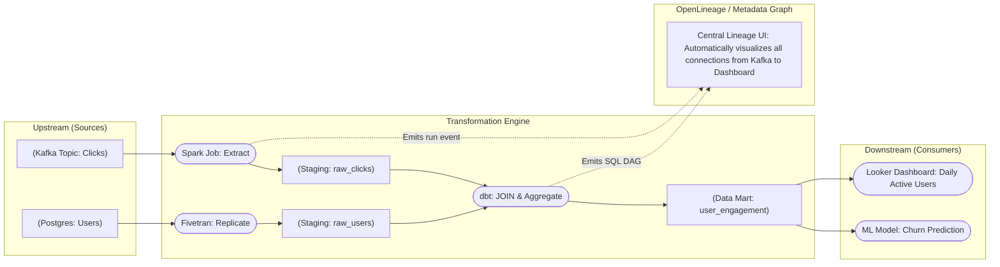

Hãy tưởng tượng bạn bước vào một thư viện khổng lồ với hàng triệu cuốn sách, nhưng không hề có mục lục, không có sơ đồ phân loại và các cuốn sách liên tục được thay đổi nội dung mỗi ngày. Trong một hệ thống dữ liệu lớn của doanh nghiệp, nơi hàng ngàn bảng dữ liệu đan xen, kết nối chéo với nhau qua các luồng xử lý phức tạp, việc không kiểm soát được nguồn gốc và đích đến của dữ liệu là một cơn ác mộng thực sự. 

Đó là lý do chúng ta cần đến **Phả hệ dữ liệu (Data Lineage)** – chiếc "bản đồ kho báu" giúp định vị chính xác đường đi và sự biến đổi của dòng chảy thông tin.

---


## Phả hệ dữ liệu thực chất là gì?

**Data Lineage** là khả năng theo dõi, lập bản đồ và hiển thị trực quan toàn bộ hành trình vòng đời của dữ liệu. Nó giúp chúng ta trả lời các câu hỏi: Dữ liệu bắt nguồn từ hệ thống nguồn nào? Nó đã di chuyển qua những đâu? Trải qua các bước biến đổi (Transformations) như thế nào? Và cuối cùng được hiển thị trên báo cáo hay mô hình học máy nào ở hạ nguồn?

Về mặt kỹ thuật, Data Lineage là một Đồ thị có hướng không chu trình (`Directed Acyclic Graph - DAG`). Trong đó:
* **Các nút (Nodes)**: Đại diện cho các thực thể dữ liệu (như bảng cơ sở dữ liệu nguồn, các cột cụ thể, bảng dữ liệu tổng hợp, hoặc biểu đồ trên dashboard).
* **Các cạnh (Edges)**: Đại diện cho các tác vụ xử lý dữ liệu (như câu lệnh SQL JOIN, đoạn code Python ETL).

Hệ thống Data Lineage thường được triển khai ở hai cấp độ chi tiết:
1. **Cấp độ Bảng (Table-level Lineage)**: Giúp chúng ta có cái nhìn tổng quan rằng Bảng C được tạo ra từ việc kết hợp Bảng A và Bảng B.
2. **Cấp độ Cột (Column-level Lineage)**: Chi tiết hơn rất nhiều. Nó chỉ ra chính xác cột `Total_Profit` trên dashboard được tính toán bằng cách lấy cột `Price` trong Bảng A trừ đi cột `Shipping_Cost` trong Bảng B. Đây là cấp độ rất phức tạp nhưng lại mang lại giá trị debug cực kỳ cao.

---

## Tại sao Data Lineage lại vô cùng quan trọng?

Data Lineage ra đời để giải quyết hai tình huống "kinh điển" thường xuyên làm đau đầu các kỹ sư dữ liệu:

### 1. Phân tích tác động chủ động (Impact Analysis)
Giả sử đội Backend thông báo tuần tới họ sẽ xóa cột `shipping_address` trong cơ sở dữ liệu của ứng dụng. Họ hỏi đội Data: *"Có báo cáo nào của sếp bị hỏng nếu chúng tôi xóa cột này không?"*. 
* **Nếu không có Lineage**: Kỹ sư dữ liệu sẽ phải lục lọi hàng ngàn dòng code SQL/Python bằng tay để tìm kiếm – một việc làm cực kỳ dễ bỏ sót.
* **Nếu có Lineage**: Chỉ cần click vào cột `shipping_address` trên sơ đồ phả hệ, hệ thống sẽ truy theo dòng chảy phía trước (Forward Lineage) và chỉ ra ngay lập tức: Cột này đang là đầu vào của biểu đồ "Bản đồ phân bổ khách hàng" trên Tableau. Đội Data sẽ biết chính xác ai cần thông báo để sửa đổi trước khi Backend cập nhật.

### 2. Truy tìm nguyên nhân gốc rễ (Root Cause Analysis)
Một buổi sáng, Giám đốc tài chính phát hiện biểu đồ "Doanh thu" trên Dashboard đột ngột giảm mất 50% so với hôm qua.
* **Nếu không có Lineage**: Bạn sẽ phải hoảng loạn rà soát ngược lại từng dòng code biến đổi từ Dashboard về Data Mart, rồi ngược về Staging, thô sơ như đi mò kim đáy bể.
* **Nếu có Lineage**: Bằng cách truy ngược dòng chảy (Backward Lineage), hệ thống sẽ chỉ ra ngay: Con số trên Dashboard được tổng hợp từ một bảng dữ liệu nguồn mà luồng nạp dữ liệu từ `Salesforce_API` sáng nay bị báo lỗi (Fail). Bạn biết chính xác vị trí cần sửa chỉ trong vài phút.

---

## Kiến trúc luồng hoạt động của Data Lineage

Dưới đây là sơ đồ minh họa cách dữ liệu chảy từ nguồn qua các lớp biến đổi và được hệ thống Lineage ghi nhận tự động:


---

## Ví dụ thực tế: Ứng dụng trong Tuân thủ Pháp lý (Compliance)

Trong ngành ngân hàng, các tổ chức tài chính bắt buộc phải tuân thủ các quy định kiểm toán ngặt nghèo (như chuẩn BCBS 239). Khi báo cáo rủi ro tài chính được nộp lên cơ quan quản lý nhà nước, các thanh tra viên có quyền chỉ vào một con số (ví dụ: "Khoản dự phòng rủi ro là 5 tỷ") và yêu cầu ngân hàng giải trình: *"Công thức nào, lấy từ những nguồn gốc nào để ra được con số này?"*. 

Nếu không có Data Lineage chứng minh nguồn gốc (Provenance), ngân hàng có thể đối mặt với những khoản phạt khổng lồ do không minh bạch được quy trình.

Dưới đây là ví dụ về một gói tin JSON theo tiêu chuẩn mở **OpenLineage** do một tác vụ Spark hoặc Airflow sinh ra sau khi chạy xong để báo cáo phả hệ cho máy chủ thu thập:
```json
{
  "eventType": "COMPLETE",
  "eventTime": "2026-06-08T00:00:00.000Z",
  "run": {
    "runId": "12345678-1234-5678-1234-567812345678"
  },
  "job": {
    "namespace": "my_airflow_cluster",
    "name": "daily_risk_calculation.compute_risk_assets"
  },
  "inputs": [{
    "namespace": "postgresql://eu-branch-db",
    "name": "public.raw_transactions",
    "facets": {
      "schema": {
        "fields": [
          {"name": "tx_id", "type": "VARCHAR"},
          {"name": "amount", "type": "NUMERIC"}
        ]
      }
    }
  }],
  "outputs": [{
    "namespace": "bigquery://central-data-warehouse",
    "name": "finance_mart.risk_assets",
    "facets": {}
  }]
}
```

---

## Kinh nghiệm đúc kết từ thực tế (Best Practices)

* **Ưu tiên các tiêu chuẩn mở**: Hãy chọn các công nghệ hỗ trợ chuẩn **OpenLineage**. Khi đó, các công cụ khác nhau trong hệ thống (như Spark, Airflow, Fivetran) có thể dễ dàng giao tiếp thông tin phả hệ về một hub quản lý tập trung (như DataHub hoặc Marquez) mà không cần viết custom code.
* **Đừng dừng lại ở Table-level**: Bản đồ cấp độ bảng là rất tốt cho cái nhìn tổng quan, nhưng nếu một bảng có 200 cột, bạn sẽ vẫn gặp khó khăn khi dò lỗi. Hãy hướng tới xây dựng Column-level Lineage để đạt hiệu quả tối đa.
* **Tích hợp vào CI/CD (Shift-left Lineage)**: Khi một kỹ sư tạo một Pull Request thay đổi cấu trúc bảng, hệ thống CI/CD có thể gọi API kiểm tra phả hệ. Nếu phát hiện cột định xóa đang liên kết trực tiếp tới các dashboard quan trọng, CI/CD sẽ tự động chặn (Block) việc deploy và yêu cầu kỹ sư phối hợp với đội phân tích để xử lý trước.

---

## Những sai lầm dễ mắc phải

* **Vẽ phả hệ bằng tay**: Thuê nhân sự vẽ lại sơ đồ luồng dữ liệu bằng các công cụ thiết kế đồ họa như Visio hay Lucidchart. Bản vẽ này sẽ nhanh chóng trở nên lạc hậu chỉ sau vài tuần vì hệ thống dữ liệu thực tế luôn biến động liên tục.
* **Quên mất chặng cuối (The Last Mile)**: Nhiều đội ngũ xây dựng phả hệ rất đẹp từ nguồn thô đến [Data Warehouse](/concepts/2-storage/data-warehouse/data-warehouse/) nhưng lại không kết nối được với các công cụ BI (Tableau, PowerBI). Khi xảy ra sự cố, bạn vẫn không biết báo cáo nào của người dùng cuối đang bị ảnh hưởng.
* **SQL quá phức tạp làm mù bộ phân tích cú pháp**: Các câu lệnh SQL động (Dynamic SQL), hoặc các đoạn code lồng nhau quá nhiều lớp qua Stored Procedures có thể khiến các công cụ phân tích cú pháp tĩnh đọc sai phả hệ. Hãy cố gắng viết code tường minh và đơn giản hóa logic truy vấn.

---

## Điểm mạnh và điểm yếu

### Điểm mạnh (Pros)
* Rút ngắn đến 80% thời gian điều tra và khắc phục sự cố (MTTR) khi pipeline gặp lỗi.
* Xây dựng niềm tin vững chắc cho người dùng nghiệp vụ khi họ có thể tự mình kiểm tra xem dữ liệu trên báo cáo của họ được lấy từ đâu.
* Hỗ trợ đắc lực cho công tác quản lý thay đổi hệ thống một cách chủ động.

### Điểm yếu (Cons)
* **Độ phức tạp kỹ thuật rất cao**: Việc phân tích cú pháp ngữ nghĩa SQL chéo qua nhiều hệ cơ sở dữ liệu (Snowflake, BigQuery, Postgres) để vẽ phả hệ cấp độ cột là một bài toán khoa học máy tính vô cùng phức tạp và đắt đỏ.
* **Tác động hiệu năng**: Việc liên tục ghi nhận và truyền tải metadata phả hệ trong thời gian thực có thể tạo thêm tải phụ (overhead) cho hệ thống nếu không được thiết kế luồng xử lý bất đồng bộ tốt.

---

## Khi nào nên dùng

**Nên đầu tư xây dựng Data Lineage khi:**
* Hệ thống dữ liệu của doanh nghiệp đã vượt quá quy mô đơn giản (trên 100 bảng), luồng ETL/ELT phức tạp nhiều bước.
* Đội ngũ Data Analyst và Business User thường xuyên phàn nàn về việc không biết số liệu trên báo cáo lấy từ đâu và độ tin cậy ra sao.
* Cần thực hiện các dự án di trú dữ liệu (migration) hoặc cấu trúc lại (refactor) cơ sở dữ liệu lớn mà không muốn gây lỗi cho các hệ thống hạ nguồn.

**Không nên dùng khi:**
* Pipeline dữ liệu cực kỳ đơn giản (ví dụ chỉ có 1-2 bước sync trực tiếp từ Postgres nguồn sang BigQuery đích qua Fivetran).
* Số lượng người dùng dữ liệu ít và có thể quản lý sơ đồ luồng dữ liệu bằng tài liệu wiki Notion một cách dễ dàng.

---

## Trọng tâm ôn luyện phỏng vấn

### 1. Hãy phân biệt Forward Lineage và Backward Lineage. Cho ví dụ thực tế khi sử dụng mỗi loại?
* **Gợi ý trả lời**: 
  * **Forward Lineage (Truy xuôi)**: Theo dõi đường đi của dữ liệu từ Nguồn đến Đích. Ứng dụng phổ biến nhất là *Phân tích tác động (Impact Analysis)*. Ví dụ: Trước khi xóa một cột trong cơ sở dữ liệu Backend, ta chạy Forward Lineage để kiểm tra xem hành động này sẽ ảnh hưởng đến những bảng dữ liệu và dashboard báo cáo nào ở hạ nguồn để chủ động sửa đổi trước.
  * **Backward Lineage (Truy ngược)**: Dò ngược đường đi từ Đích về Nguồn. Ứng dụng phổ biến nhất là *Tìm nguyên nhân gốc rễ ([Root Cause Analysis](/concepts/5-quality-governance/observability-reliability/root-cause-analysis/))*. Ví dụ: Khi sếp báo cáo số liệu doanh thu trên Dashboard bị sai lệch, ta chạy Backward Lineage để truy tìm ngược lại xem bước biến đổi dữ liệu nào trong pipeline đã tính toán sai, hoặc bảng nguồn nào chưa được cập nhật dữ liệu mới.

### 2. Sự khác biệt giữa việc tạo Lineage bằng "Static SQL Parsing" (Phân tích tĩnh) và "Runtime Execution Logs" (Phân tích động) là gì?
* **Gợi ý trả lời**:
  * **Static SQL Parsing (Phân tích tĩnh)**: Công cụ sẽ đọc trực tiếp các file code SQL (như [dbt models](/concepts/3-integration/transformation-analytics/dbt-models/)) trước khi chúng được thực thi để xây dựng bản đồ quan hệ. Ưu điểm là lập bản đồ nhanh, biết trước sơ đồ mà không cần chạy code. Nhược điểm là không nhận biết được các logic động sinh ra trong quá trình chạy (như Dynamic SQL hay code Python biến đổi dữ liệu runtime).
  * **Runtime Execution Logs (Phân tích động)**: Hệ thống phân tích log thực tế được ghi nhận trên cơ sở dữ liệu khi câu lệnh được chạy. Ưu điểm là độ chính xác tuyệt đối 100%, ghi nhận đúng những gì thực sự diễn ra tại thời điểm đó. Nhược điểm là code bắt buộc phải được thực thi thành công thì hệ thống mới có thể ghi nhận dữ liệu để vẽ đường phả hệ.
  * *Tóm lại*: Một hệ thống phả hệ dữ liệu hoàn chỉnh nên kết hợp cả hai phương pháp này.

## Xem thêm các khái niệm liên quan
* [Kiểm soát truy cập - Access Control (RBAC & ABAC)](/concepts/5-quality-governance/governance-metadata/access-control/)
* [Nhật ký kiểm toán - Audit Logging](/concepts/5-quality-governance/governance-metadata/audit-logging/)
* [Danh mục dữ liệu - Data Catalog](/concepts/5-quality-governance/governance-metadata/data-catalog/)

## Tài liệu tham khảo

1. [AWS Data Lineage with SageMaker](https://docs.aws.amazon.com/sagemaker/latest/dg/lineage-tracking.html) - Theo dõi phả hệ dữ liệu cho các tác vụ Machine Learning trên AWS SageMaker.
2. [Google Cloud Dataplex Data Lineage](https://cloud.google.com/dataplex/docs/lineage-overview) - Hướng dẫn tự động lập bản đồ phả hệ dữ liệu với Dataplex trên GCP.
3. [Microsoft Azure Purview Lineage](https://azure.microsoft.com/en-us/services/purview/) - Lập bản đồ phả hệ dữ liệu và theo dõi dòng chảy dữ liệu trên Azure.
4. [Snowflake Data Lineage Guide](https://docs.snowflake.com/en/user-guide/data-lineage) - Tài liệu hướng dẫn sử dụng tính năng theo dõi Lineage trong Snowflake.
5. [OpenLineage Specification](https://openlineage.io/docs/spec/) - Tiêu chuẩn mở toàn cầu cho việc quản lý phả hệ dữ liệu.
6. [Apache Atlas Lineage Guide](https://atlas.apache.org/1.0.0/Atlas-Lineage.html) - Cấu hình và theo dõi phả hệ dữ liệu qua giao diện Apache Atlas.

## English Summary

**Data Lineage** is the discipline of mapping and visualizing the lifecycle and flow of data—tracking its provenance from source operational systems, through various [ETL](/concepts/3-integration/etl-elt/etl/)/[ELT](/concepts/3-integration/etl-elt/elt/) transformation layers, down to its final consumption in BI dashboards or ML models. Represented technically as a Directed Acyclic Graph ([DAG](/concepts/3-integration/orchestration/dag/)), automated lineage (both at table and column levels) is indispensable for Root Cause Analysis (tracing backward to fix pipeline bugs when a dashboard shows corrupted metrics) and Impact Analysis (tracing forward to alert downstream consumers when upstream schemas change). It serves as the definitive map for auditing, regulatory compliance, and maintaining trust in a complex data ecosystem.