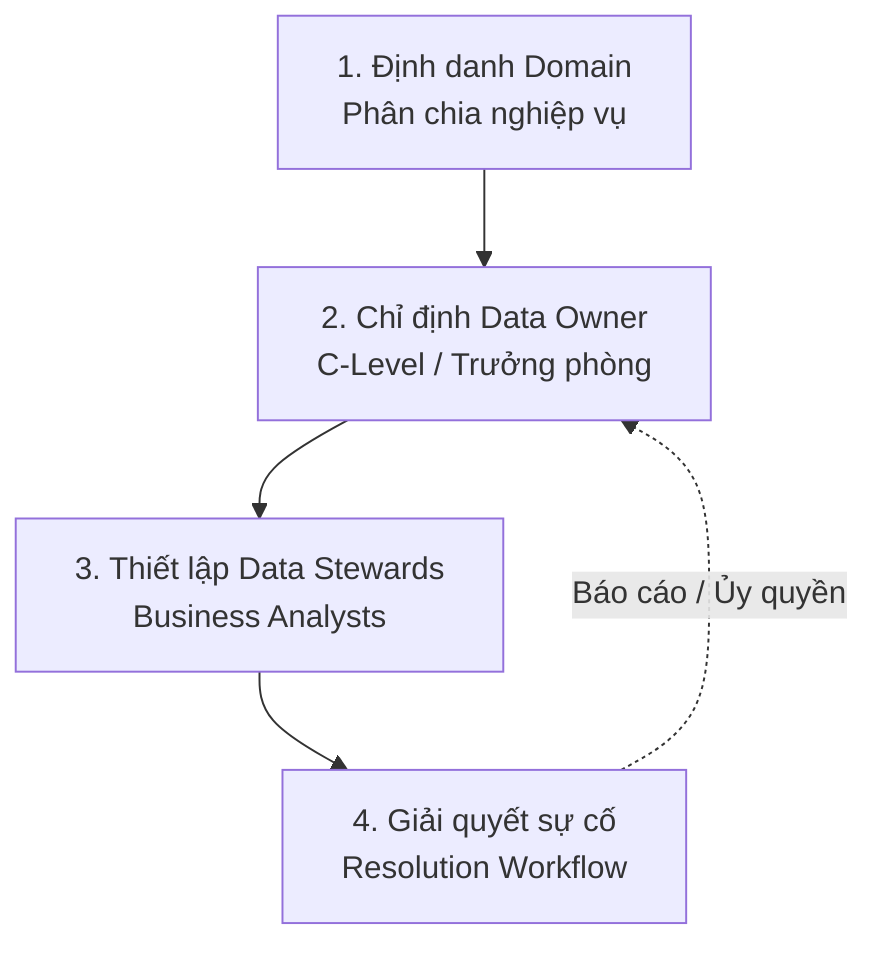

Trong các doanh nghiệp truyền thống, có một tình huống dở khóc dở cười thường xuyên xảy ra. Báo cáo doanh thu gửi lên ban giám đốc bị lệch số liệu. Sếp triệu tập cuộc họp khẩn và yêu cầu Trưởng phòng Công nghệ thông tin (IT) giải trình lý do. 

Trưởng phòng IT thanh minh rằng hệ thống đường ống trích xuất, biến đổi, nạp ([ETL](/concepts/3-integration/etl-elt/etl/)/[ELT](/concepts/3-integration/etl-elt/elt/)) chạy hoàn hảo không lỗi, con số bị sai là do các nhân viên phòng Kinh doanh (Sales) nhập liệu cẩu thả trên phần mềm Quản lý quan hệ khách hàng (CRM) nguồn. Trưởng phòng Sales lập tức phản pháo: *"Chúng tôi bận đi gặp khách hàng đem doanh số về cho công ty, hệ thống CRM thì khó dùng, lỗi đó là của IT chứ sao trách chúng tôi!"*.

Tình huống đùn đẩy trách nhiệm kiểu "cha chung không ai khóc" này xảy ra khi doanh nghiệp thiếu đi một cơ chế **Quyền sở hữu dữ liệu (Data Ownership)** rõ ràng.

---

## Data Ownership thực chất là gì?

**Data Ownership (Quyền sở hữu dữ liệu)** không nhằm mục đích tranh giành quyền sở hữu tài sản vật lý (vì mọi dữ liệu cuối cùng vẫn là tài sản chung của doanh nghiệp). Nó thực chất là việc phân định rõ ràng **Sự chịu trách nhiệm (Accountability)** đối với chất lượng dữ liệu.

Một **Chủ sở hữu dữ liệu (Data Owner)** bắt buộc phải là một lãnh đạo nghiệp vụ (Business Leader) – người trực tiếp sinh ra hoặc tiêu thụ chính luồng dữ liệu đó. Ví dụ:
* Giám đốc Nhân sự (CHRO) là Data Owner của dữ liệu Hồ sơ nhân sự.
* Giám đốc Kinh doanh (CCO) là Data Owner của dữ liệu khách hàng trên CRM.
* Giám đốc Tài chính (CFO) là Data Owner của dữ liệu báo cáo kế toán.

Vai trò cốt lõi của một Data Owner bao gồm:
1. Định nghĩa chuẩn hóa các thuật ngữ nghiệp vụ (Ví dụ: Thống nhất công thức tính "Doanh thu thuần").
2. Phê duyệt quyền hạn tiếp cận dữ liệu (Quyết định xem phòng Marketing có được quyền xem dữ liệu CRM hay không).
3. Đặt ra các tiêu chuẩn chất lượng (SLA) và các quy tắc bảo mật dữ liệu cá nhân nhạy cảm (PII - Personally Identifiable Information).

*(Lưu ý: Data Owner chịu trách nhiệm ở tầm vĩ mô. Các công việc vận hành chi tiết hàng ngày như cập nhật tài liệu hướng dẫn hay xử lý phân quyền thông thường sẽ được họ ủy quyền cho cấp dưới – gọi là các **Quản gia dữ liệu - Data Stewards**).*

---

## Sự dịch chuyển tư duy: Từ IT làm chủ đến Nghiệp vụ làm chủ

Data Ownership đánh dấu một sự thay đổi lớn trong tư duy quản trị doanh nghiệp:

* **Mô hình cũ (IT-centric)**: Phòng IT hay đội Kỹ thuật dữ liệu ([Data Engineering](/concepts/1-foundations/foundation/data-engineering/)) được xem là "chủ nhân" của toàn bộ kho dữ liệu. Họ phải gánh chịu mọi lỗi lầm về chất lượng dữ liệu mặc dù họ không phải là người sinh ra dữ liệu nguồn và không có thẩm quyền bắt các phòng ban khác sửa đổi quy trình làm việc.
* **Mô hình hiện đại ([Data Mesh](/concepts/1-foundations/system-architecture/data-mesh/))**: Dữ liệu được nâng tầm thành **Sản phẩm dữ liệu (Data as a Product)**. Đội IT chỉ là người cung cấp "Nền tảng tự phục vụ" (Self-serve Platform) như duy trì cloud, quản lý [Snowflake](/concepts/2-storage/cloud-data-platform/snowflake/). Còn các phòng ban kinh doanh nghiệp vụ mới chính là những chủ nhân (Data Owners) thực thụ của dữ liệu họ tạo ra. Họ phải tự chạy pipeline, tự dọn dẹp và chịu trách nhiệm khi dữ liệu của mình bị lỗi.

---

## Kiến trúc và Cơ chế vận hành

Để hiện thực hóa Data Ownership, tổ chức thường đi qua 4 bước cơ bản sau:


1. **Phân chia miền dữ liệu (Domains)**: Xác định rõ ràng các khối nghiệp vụ chuyên biệt của doanh nghiệp (như Tài chính, Marketing, Nhân sự).
2. **Chỉ định Chủ sở hữu**: Ban giám đốc bổ nhiệm các trưởng bộ phận nghiệp vụ làm Data Owner cho từng miền. Thông tin liên hệ của họ được đăng ký công khai trên hệ thống Data Catalog chung.
3. **Cử Quản gia dữ liệu (Data Stewards)**: Các Data Owner bổ nhiệm các chuyên viên phân tích nghiệp vụ (BA - Business Analyst) trong đội nhóm của mình làm Steward để xử lý các công việc quản trị dữ liệu chi tiết hàng ngày.
4. **Quy trình xử lý lỗi tự động**: Khi hệ thống giám sát phát hiện dữ liệu của bảng `shipping_time` bị trống (NULL), cảnh báo sẽ được tự động gửi thẳng đến email của Logistics Data Owner thay vì bắn cho đội IT. Đội Logistics sẽ phải tự kiểm tra và sửa lỗi hệ thống của họ.

---

## Ví dụ thực tế: Phân quyền sở hữu nghiêm ngặt trên Snowflake

Trong các kho dữ liệu hiện đại như Snowflake, quyền sở hữu dữ liệu được cụ thể hóa bằng các câu lệnh phân quyền theo vai trò (RBAC - Role-Based [Access Control](/concepts/5-quality-governance/governance-metadata/access-control/)) nghiêm ngặt để đảm bảo phòng IT không thể tự tiện can thiệp vào dữ liệu nhạy cảm của phòng ban khác:
```sql
-- 1. Tạo một Role đại diện cho Data Owner của phòng Marketing
CREATE ROLE marketing_data_owner;
GRANT ROLE marketing_data_owner TO USER ms_lan_marketing_director;

-- 2. Chuyển giao quyền "Sở hữu" (OWNERSHIP) của bảng cho Role này
GRANT OWNERSHIP ON TABLE crm_db.public.dim_customer_behavior 
TO ROLE marketing_data_owner REVOKE CURRENT GRANTS;

-- Kể từ bây giờ, đội IT (sysadmin) cũng không thể tự tiện cấp quyền đọc bảng này cho người khác.
-- Mọi câu lệnh GRANT SELECT trên bảng này BẮT BUỘC phải do tài khoản của Ms. Lan thực thi.
```

---

## Điểm mạnh và điểm yếu

### Điểm mạnh (Pros)
* **Phân định rõ ràng trách nhiệm (Clear Accountability)**: Triệt tiêu tình trạng đùn đẩy trách nhiệm về chất lượng dữ liệu giữa các phòng ban nghiệp vụ và IT.
* **Chất lượng dữ liệu được cải thiện tận gốc**: Người sở hữu dữ liệu là người hiểu rõ nghiệp vụ nhất, giúp các quy tắc làm sạch dữ liệu sát thực tế hơn.
* **Tự chủ hóa nghiệp vụ (Domain Empowerment)**: Các bộ phận nghiệp vụ có thể chủ động ra quyết định và cung cấp dữ liệu phục vụ mục tiêu riêng mà không phải xếp hàng chờ phòng IT.
* **Tăng cường bảo mật và tuân thủ**: Phân quyền truy cập chính xác cho những người thực sự cần, giảm nguy cơ rò rỉ thông tin nhạy cảm.

### Điểm yếu (Cons)
* **Yêu cầu thay đổi văn hóa lớn**: Đòi hỏi các bộ phận nghiệp vụ từ bỏ thói quen phó mặc mọi vấn đề dữ liệu cho IT, đòi hỏi sự đầu tư về nhân sự và thời gian.
* **Áp lực công việc cho lãnh đạo nghiệp vụ**: Các Data Owner vốn bận rộn với các chỉ số kinh doanh nay phải gánh thêm trách nhiệm quản trị dữ liệu.
* **Nguy cơ cục bộ hóa dữ liệu (Data Silos)**: Nếu không có các tiêu chuẩn chung và cơ chế giám sát từ ban quản trị trung tâm, các phòng ban sẽ xây dựng các hệ thống dữ liệu khép kín, không tương thích với nhau.

---

## Sai lầm thường gặp và Best Practices

### Những sai lầm phổ biến (Common Pitfalls)
* **Gán quyền sở hữu "ảo" (Phantom Ownership)**: Chỉ định một bạn nhân viên cấp dưới làm Data Owner cho có tên trên giấy tờ. Thực tế, nhân viên này không có thẩm quyền hay tiếng nói để yêu cầu các phòng ban nghiệp vụ thay đổi quy trình khi dữ liệu nguồn bị nhập sai.
* **Quá tải phê duyệt quyền hạn**: Data Owner là các sếp lớn rất bận rộn. Nếu mỗi ngày họ phải nhận hàng chục email yêu cầu phê duyệt cấp quyền truy cập dữ liệu nhỏ nhặt, họ sẽ bực bội và nhấn duyệt bừa bãi (`Approve All`), làm vô hiệu hóa các hàng rào bảo mật. Hãy giải quyết bằng cách ủy quyền cho các Data Stewards cấp dưới xử lý các yêu cầu này.

### Best Practices khi triển khai
* **Một bảng - Một chủ sở hữu duy nhất**: Đảm bảo nguyên tắc mỗi tập dữ liệu cốt lõi chỉ có duy nhất **Một** Data Owner. Nếu "mọi người cùng sở hữu" thì thực chất sẽ không ai chịu trách nhiệm cả.
* **Gắn liền KPI với chất lượng dữ liệu**: Hãy biến chất lượng dữ liệu của từng miền trở thành một trong những chỉ số đánh giá hiệu năng (KPI) cuối năm của vị Trưởng phòng sở hữu miền đó. Có như vậy họ mới thực sự coi trọng công tác quản trị.
* **Tách biệt vai trò Bảo vệ (Custodian) và Chủ sở hữu (Owner)**: Đội ngũ kỹ sư dữ liệu (Data Engineers) hay quản trị cơ sở dữ liệu (DBA) thực chất chỉ là **Data Custodians (Người trông coi)**. Họ chịu trách nhiệm bảo vệ hệ thống chạy 24/7, tự động sao lưu dữ liệu chứ không thể chịu trách nhiệm cho các số liệu nghiệp vụ bị nhập sai từ nguồn.

---

## Khi nào nên dùng

**Nên áp dụng cơ chế Data Ownership khi:**
* Doanh nghiệp có quy mô từ trung bình trở lên, bắt đầu có sự phân hóa rõ ràng giữa các phòng ban nghiệp vụ (Sales, Marketing, Finance, HR).
* Gặp tình trạng chất lượng dữ liệu kém mà không có ai đứng ra chịu trách nhiệm khắc phục.
* Triển khai mô hình phân tán [Data Mesh](/concepts/1-foundations/system-architecture/data-mesh/) để đẩy nhanh tốc độ khai thác giá trị dữ liệu.

**Không nên áp dụng khi:**
* Doanh nghiệp startup siêu nhỏ, nơi một người kiêm nhiệm từ lập trình đến phân tích dữ liệu, chưa cần phân định quyền sở hữu cứng nhắc để tối ưu tính linh hoạt.

---

## Trọng tâm ôn luyện phỏng vấn

### 1. Hãy phân biệt rõ sự khác nhau giữa 3 vai trò: Data Owner, Data Steward và Data Custodian?
* **Gợi ý trả lời**: 
  * **Data Owner (Chủ sở hữu)**: Thường là lãnh đạo nghiệp vụ kinh doanh. Là người chịu trách nhiệm giải trình cuối cùng về mặt pháp lý và chất lượng của tài sản dữ liệu. Có quyền quyết định tối cao ai được tiếp cận dữ liệu đó.
  * **Data Steward (Quản gia)**: Thường là các Business Analyst/Data Analyst thuộc miền nghiệp vụ đó. Được Owner ủy quyền xử lý các công việc quản trị chi tiết hàng ngày như viết từ điển dữ liệu, kiểm tra chất lượng và xem xét phê duyệt yêu cầu truy cập thông thường.
  * **Data Custodian (Người trông coi)**: Là đội ngũ kỹ thuật (Data Engineers, DBA). Chịu trách nhiệm vận hành phần cứng, phần mềm, cloud bảo mật, đảm bảo hệ thống hoạt động ổn định và thực thi kỹ thuật phân quyền theo lệnh của Owner/Steward.

### 2. Nguyên tắc "Domain-Oriented Data Ownership" trong kiến trúc Data Mesh mang lại giá trị gì?
* **Gợi ý trả lời**: Trong kiến trúc truyền thống, dữ liệu được gom hết về cho đội IT quản lý (IT Ownership). Vấn đề là IT không hiểu sâu nghiệp vụ nên dễ biến kho dữ liệu thành một đầm lầy hỗn độn. Nguyên tắc "Domain-Oriented" trong Data Mesh đảo ngược điều này. Nó yêu cầu các miền nghiệp vụ (Domain như Sales, Marketing) – những người hiểu rõ dữ liệu của họ nhất – tự chịu trách nhiệm quản lý dòng chảy dữ liệu từ đầu đến cuối, biến dữ liệu của mình thành các "Sản phẩm dữ liệu" sạch sẽ, chuẩn hóa để cung cấp cho toàn bộ lưới dữ liệu doanh nghiệp tiêu thụ.

### 3. Làm thế nào để giải quyết xung đột khi hai phòng ban khác nhau đều tuyên bố sở hữu cùng một tập dữ liệu?
* **Gợi ý trả lời**: Khi xảy ra tranh chấp sở hữu, Hội đồng Quản trị Dữ liệu (Data Governance Board) sẽ đóng vai trò trọng tài. Bước đầu tiên là phân tích nguồn gốc dữ liệu (data lineage). Bộ phận nào tạo ra dữ liệu thô ban đầu thường sẽ là Data Owner tại nguồn. Tuy nhiên, nếu dữ liệu đó được biến đổi sâu sắc để phục vụ một nghiệp vụ cụ thể khác, bộ phận đó có thể sở hữu sản phẩm dữ liệu hạ nguồn (downstream data product). Ngoài ra, ta có thể chia nhỏ tập dữ liệu hoặc phân định rõ: một bên sở hữu cấu trúc định nghĩa (schema), bên còn lại sở hữu các quy tắc nghiệp vụ áp dụng trên đó, đảm bảo tính phân cấp rõ ràng và không chồng chéo.

---

## Các khái niệm liên quan

* [Data Governance (Quản trị dữ liệu)](/concepts/5-quality-governance/governance-metadata/data-governance/) - Khung quản trị đảm bảo dữ liệu nhất quán và bảo mật.
* [Data Catalog (Danh mục dữ liệu)](/concepts/5-quality-governance/governance-metadata/data-catalog/) - Hệ thống quản lý siêu dữ liệu và tìm kiếm tài sản dữ liệu.

## Xem thêm các khái niệm liên quan
* [Kiểm soát truy cập - Access Control (RBAC & ABAC)](/concepts/5-quality-governance/governance-metadata/access-control/)
* [Nhật ký kiểm toán - Audit Logging](/concepts/5-quality-governance/governance-metadata/audit-logging/)
* [Danh mục dữ liệu - Data Catalog](/concepts/5-quality-governance/governance-metadata/data-catalog/)

## Tài liệu tham khảo

1. [AWS Data Governance Stewardship](https://docs.aws.amazon.com/whitepapers/latest/data-governance-on-aws/governance-roles-and-responsibilities.html) - AWS Whitepaper định nghĩa vai trò Data Owner, Steward, và Custodian.
2. [Google Cloud Data Governance Roles](https://cloud.google.com/architecture/data-governance-principles-delivery) - Xác định trách nhiệm và quyền sở hữu trong khung quản trị dữ liệu của GCP.
3. [Microsoft Azure Purview Governance Roles](https://azure.microsoft.com/en-us/services/purview/) - Định nghĩa vai trò quản lý quyền sở hữu tài sản dữ liệu trong Azure Purview.
4. [Snowflake Access Control & Ownership](https://docs.snowflake.com/en/user-guide/security-access-control-overview) - Mô hình quản lý quyền sở hữu đối tượng và phân quyền trong Snowflake.
5. [Apache Atlas Glossary & Ownership](https://atlas.apache.org/1.0.0/Atlas-Architecture.html) - Lập bản đồ thuật ngữ nghiệp vụ và gắn nhãn sở hữu tài sản dữ liệu với Apache Atlas.
6. [Confluent Schema Registry Owners](https://docs.confluent.io/platform/current/schema-registry/index.html) - Quản lý quyền sở hữu schema trong hệ thống stream thời gian thực.

## English Summary

**Data Ownership** is a foundational principle of Data Governance that assigns ultimate accountability for the quality, security, and lifecycle of a specific dataset to a business leader (Data Owner) rather than the IT department. By clearly defining roles—such as Data Owners (decision-makers), Data Stewards (operational caretakers), and Data Custodians (technical engineers)—it prevents the classic "blame game" where IT is held responsible for poor data originating from business operational systems. This domain-driven ownership paradigm is critical for modern decentralized architectures like Data Mesh, shifting the responsibility of [data quality](/concepts/5-quality-governance/data-quality/data-quality/) to those who produce and understand the data best.