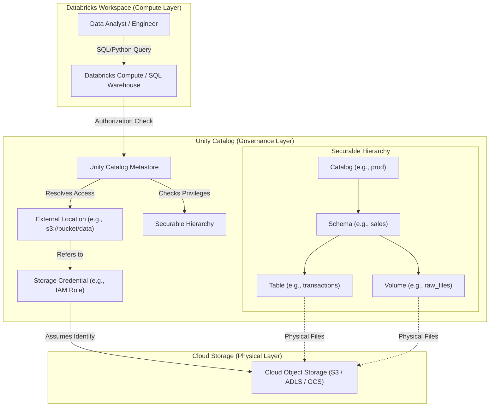

Trong kỷ nguyên của hồ dữ liệu thế hệ mới, sự hội tụ giữa Data Lake và Data Warehouse đã tạo nên kiến trúc **Lakehouse**. Tuy nhiên, thách thức lớn nhất của Lakehouse không nằm ở tốc độ xử lý dữ liệu (Compute engine) hay dung lượng lưu trữ (Storage capacity), mà là ở khả năng kiểm soát dữ liệu: *Làm thế nào để phân quyền truy cập chi tiết, theo dõi vòng đời của dữ liệu và đảm bảo tính tuân thủ pháp lý khi hàng ngàn bảng dữ liệu nằm phân tán trên các Object Storage của các nhà cung cấp đám mây khác nhau?*

Để giải quyết bài toán này, Databricks đã giới thiệu **Unity Catalog** - một giải pháp [Quản trị dữ liệu (Data Governance)](/concepts/5-quality-governance/governance-metadata/data-governance) hợp nhất và tập trung cho toàn bộ hệ sinh thái Databricks Lakehouse. Thay vì duy trì các chính sách phân quyền rời rạc trên từng Workspace, Unity Catalog đóng vai trò như một bộ não quản lý trung tâm, quản lý mọi tài sản từ dữ liệu có cấu trúc (Tables), dữ liệu phi cấu trúc (Volumes/Files), các mô hình học máy (ML Models), cho đến các Dashboard phân tích.

---

## Kiến trúc của Unity Catalog

Kiến trúc của Unity Catalog được thiết kế để giải quyết triệt để hai hạn chế cố hữu của hệ thống metadata truyền thống (Legacy Hive Metastore): sự cô lập ở cấp độ Workspace và sự phụ thuộc quá chặt chẽ vào quyền truy cập trực tiếp của người dùng tới hạ tầng lưu trữ vật lý (Object Storage credentials).



### 1. Metastore và Mô hình chia sẻ đa Workspace (Metastore Federation)
**Metastore** là container cấp cao nhất của metadata trong Unity Catalog. Nó lưu trữ định nghĩa của tất cả các đối tượng dữ liệu và các chính sách bảo mật đi kèm. 

Khác với Hive Metastore truyền thống vốn đi kèm với từng Workspace riêng biệt, Unity Catalog Metastore được khởi tạo ở cấp độ tài khoản đám mây (Account-level) và đại diện cho một khu vực địa lý (Region). Nhiều Workspace Databricks trong cùng một Region có thể cùng kết nối tới một Metastore duy nhất. Điều này cho phép doanh nghiệp thiết lập một hệ thống phân quyền nhất quán trên toàn bộ các môi trường (Dev, Staging, Prod) và dễ dàng truy vấn chéo dữ liệu giữa các Workspace mà không cần sao chép dữ liệu vật lý hay cấu hình lại các chính sách bảo mật.

### 2. Cấu trúc định danh ba tầng (Three-tier Namespace)
Unity Catalog chuẩn hóa đường dẫn truy xuất dữ liệu thông qua cấu trúc định danh ba tầng (`Three-tier Namespace`), thay thế cho mô hình hai tầng truyền thống:

$$\text{Tên đối tượng} = \text{catalog} \cdot \text{schema} \cdot \text{table/view/volume}$$

*   **Catalog**: Tầng nhóm đầu tiên bên dưới Metastore. Doanh nghiệp thường sử dụng Catalog để phân định rõ ràng ranh giới môi trường (như `prod_catalog`, `dev_catalog`), tách biệt các đơn vị kinh doanh (như `finance`, `marketing`), hoặc các miền dữ liệu nghiệp vụ (Data Domains).
*   **Schema (hoặc Database)**: Tầng nhóm thứ hai, nằm trong một Catalog. Schema chứa các bảng dữ liệu, view, hoặc các volume chứa file vật lý.
*   **Table / View / Volume**: Tầng lá cuối cùng đại diện cho dữ liệu thực tế. 
    *   *Table* và *View* chứa dữ liệu dạng bảng.
    *   *Volume* đại diện cho dữ liệu phi cấu trúc hoặc bán cấu trúc (như hình ảnh, file âm thanh, PDF hoặc các tệp log thô) nằm trên cloud storage, được bảo vệ bởi cùng các cơ chế bảo mật của Unity Catalog.

### 3. Tách biệt tính toán (Compute) và lưu trữ vật lý (Storage)
Một trong những cải tiến kiến trúc quan trọng nhất của Unity Catalog là khả năng tách rời hoàn toàn quyền truy cập của người dùng cuối khỏi hạ tầng lưu trữ vật lý của đám mây (như AWS S3, Azure ADLS Gen2, hay Google Cloud Storage). 

Trước đây, để một kỹ sư dữ liệu chạy truy vấn trên Databricks, cụm máy tính (Cluster) hoặc người dùng đó phải được gắn trực tiếp một IAM Role hoặc API Key có quyền đọc/ghi trên bucket lưu trữ. Điều này làm tăng nguy cơ rò rỉ thông tin đăng nhập và vi phạm nguyên tắc đặc quyền tối thiểu (Least Privilege).

Unity Catalog giải quyết bài toán này thông qua hai đối tượng bảo mật chính:
*   **Storage Credentials**: Đóng gói danh tính đám mây (Cloud Identity) như IAM Role ARN (AWS), Managed Identity (Azure), hoặc Service Account Key (GCP). Đây là thực thể duy nhất có quyền truy cập trực tiếp vào các tài nguyên lưu trữ đám mây.
*   **External Locations**: Liên kết một đường dẫn lưu trữ đám mây cụ thể (ví dụ: `s3://company-bucket/raw-data/`) với một **Storage Credential** được chỉ định.

Khi người dùng chạy một truy vấn SQL, Unity Catalog sẽ kiểm tra xem tài khoản của họ có quyền truy cập vào bảng dữ liệu hoặc External Location tương ứng hay không. Nếu có, Unity Catalog sẽ tạo ra một token bảo mật tạm thời (Short-lived credential) để compute engine đọc dữ liệu từ cloud storage thay mặt cho người dùng. Người dùng cuối hoàn toàn không biết thông tin đăng nhập đám mây thực tế và không có quyền truy cập trực tiếp vào các file lưu trữ bên ngoài Databricks.

### 4. Bảng quản lý (Managed Tables) và Bảng liên kết ngoài (External Tables)
*   **Managed Tables**: Khi người dùng tạo bảng trong Unity Catalog mà không chỉ định đường dẫn lưu trữ (`LOCATION`), bảng đó sẽ được xem là Managed Table. Dữ liệu Delta Lake vật lý của bảng này được lưu trữ trong thư mục mặc định của Schema/Catalog do Metastore quản lý. Khi xóa (Drop) một Managed Table, cả metadata trên Unity Catalog và dữ liệu vật lý trên cloud storage đều bị xóa vĩnh viễn.
*   **External Tables**: Khi tạo bảng có chỉ định tham số `LOCATION` trỏ về một **External Location** đã được đăng ký trước đó. Unity Catalog chỉ quản lý metadata và các quyền truy cập trên bảng này. Khi xóa (Drop) một External Table, hệ thống chỉ gỡ bỏ định nghĩa bảng khỏi catalog, còn toàn bộ dữ liệu vật lý nằm trên đám mây vẫn được giữ nguyên vẹn.

---

## Kiểm soát truy cập an toàn (Secure Access Control)

Unity Catalog cung cấp một cơ chế bảo mật toàn diện, hỗ trợ cả hai mô hình kiểm soát truy cập phổ biến là **RBAC** (Role-Based Access Control) và **ABAC** (Attribute-Based Access Control) thông qua một cú pháp SQL thống nhất hoặc giao diện Catalog Explorer trực quan.

### 1. Phân quyền theo vai trò (RBAC) và Kế thừa đặc quyền
Mô hình [Kiểm soát truy cập (Access Control)](/concepts/5-quality-governance/governance-metadata/access-control) trong Unity Catalog được áp dụng một cách phân cấp. Quyền hạn được cấp ở tầng cao hơn (như Catalog) sẽ tự động kế thừa xuống các tầng thấp hơn (Schema, Table, View).

Ví dụ: Nếu một nhóm người dùng được cấp quyền `USE CATALOG` và `USE SCHEMA` trên một catalog và schema cụ thể, admin chỉ cần cấp quyền `SELECT` ở mức Catalog để cho phép nhóm đó đọc tất cả các bảng hiện tại và tương lai trong Catalog đó.

Các đặc quyền cốt lõi bao gồm:
*   `SELECT`: Quyền đọc dữ liệu từ bảng hoặc view.
*   `MODIFY`: Quyền thêm, sửa, xóa dữ liệu (INSERT, UPDATE, DELETE).
*   `CREATE`: Quyền tạo các đối tượng con mới (như tạo Schema trong Catalog, hoặc tạo Table trong Schema).
*   `EXECUTE`: Quyền thực thi các hàm UDF (User Defined Functions).

### 2. Phân quyền theo thuộc tính (ABAC) với Tagging
Đối với các hệ thống dữ liệu lớn, việc quản lý hàng ngàn chính sách phân quyền chi tiết cho từng bảng trở nên bất khả thi. Unity Catalog hỗ trợ **ABAC** bằng cách cho phép quản trị viên gán thẻ (Tags) hoặc thuộc tính bảo mật lên các bảng và cột dữ liệu (ví dụ: gán tag `PII = true` hoặc `Classification = Confidential`).

Sau đó, các chính sách bảo mật sẽ được cấu hình động dựa trên các tag này. Khi người dùng truy vấn dữ liệu, công cụ phân quyền sẽ kiểm tra thuộc tính bảo mật của cột và vai trò của người dùng để quyết định cho phép truy cập hay tự động che giấu dữ liệu.

### 3. Che giấu dữ liệu mức cột (Column-level Masking)
Che giấu dữ liệu động (Dynamic Data Masking) cho phép ẩn đi thông tin nhạy cảm của một cột dựa trên vai trò của người thực hiện truy vấn mà không cần thay đổi dữ liệu gốc trong lưu trữ.

Quá trình này hoạt động dựa trên các hàm bảo mật SQL tự định nghĩa (SQL UDFs). Khi người dùng chạy câu lệnh `SELECT`, Unity Catalog sẽ biên dịch truy vấn và chạy hàm UDF này trước để đánh giá quyền hạn. Nếu người dùng thuộc nhóm được phép (ví dụ: `compliance-group`), họ sẽ nhìn thấy dữ liệu thô (Plaintext). Nếu không, dữ liệu sẽ hiển thị dưới dạng đã được mã hóa hoặc che giấu (ví dụ: `j*****@company.com`).

### 4. Lọc dữ liệu mức dòng (Row-level Filtering)
Tương tự như che giấu cột, lọc dữ liệu mức dòng (Row-level Filtering) giới hạn các dòng dữ liệu mà người dùng có thể xem trong một bảng dựa trên các thuộc tính như quốc gia, phòng ban, hoặc nhóm làm việc của họ.

Cơ chế này sử dụng các hàm kiểm tra danh tính tích hợp sẵn của Databricks như:
*   `CURRENT_USER()`: Trả về địa chỉ email của người dùng đang thực hiện truy vấn.
*   `IS_ACCOUNT_GROUP_MEMBER('group_name')`: Kiểm tra xem người dùng hiện tại có thuộc nhóm chỉ định hay không.

Hàm lọc này sẽ trả về giá trị Boolean (`TRUE`/`FALSE`). Khi người dùng truy vấn, một bộ lọc ẩn tương đương với mệnh đề `WHERE` sẽ tự động được chèn vào câu lệnh SQL ban đầu để lọc dữ liệu ngay từ công cụ Delta Engine, đảm bảo tối ưu hóa hiệu năng truy vấn thông qua cơ chế bỏ qua dữ liệu (Data Skipping).

---

## Tự động theo dõi nguồn gốc dữ liệu (Automated Data Lineage)

Trong một hệ thống Lakehouse phức tạp, việc nắm bắt được luồng đi của dữ liệu từ nguồn (Raw) qua các tầng biến đổi (Bronze, Silver, Gold) cho đến các báo cáo cuối cùng là vô cùng quan trọng đối với công tác kiểm toán chất lượng và tuân thủ các quy định bảo mật dữ liệu.

Unity Catalog cung cấp tính năng **Automated Data Lineage** - tự động ghi nhận và trực quan hóa nguồn gốc dữ liệu ở cả hai cấp độ: **Table-level** và **Column-level**.

### Cơ chế hoạt động của Lineage trong Unity Catalog:
1.  **Thu thập tại thời điểm thực thi (Run-time Capture)**: Khi một truy vấn Spark SQL, code Python (PySpark), hoặc công việc Delta Live Tables được chạy trên Databricks, Spark Logical Plan sẽ được phân tích để xác định chính xác bảng nguồn nào được đọc và bảng đích nào được ghi.
2.  **Không cần cài đặt thủ công (Zero Instrumentation)**: Kỹ sư dữ liệu không cần viết thêm bất kỳ dòng code khai báo lineage nào hay cài đặt các tác nhân bên ngoài (như Apache Atlas). Hệ thống tự động ghi nhận lineage một cách an toàn và ghi vào các bảng hệ thống (System Tables) nằm trong schema `system.access`.
3.  **Hỗ trợ đa ngôn ngữ và công cụ**: Lineage được ghi nhận đồng nhất bất kể truy vấn được thực hiện từ Databricks Notebook, dbt run, các quy trình workflow (Workflows/Jobs), hay từ các công cụ BI kết nối qua SQL Warehouses.
4.  **Theo dõi nguồn gốc mức cột (Column-level Lineage)**: Unity Catalog có khả năng phân tích sâu cách một cột dữ liệu được tính toán từ các cột khác ở bảng nguồn (ví dụ: cột `full_name` được ghép từ `first_name` và `last_name`). Điều này giúp phân tích tác động (Impact Analysis) cực kỳ chính xác khi cấu trúc bảng nguồn thay đổi.

Nhờ có [Data Lineage](/concepts/5-quality-governance/governance-metadata/data-lineage), doanh nghiệp có thể thực hiện kiểm toán bảo mật, phát hiện nhanh chóng nguyên nhân lỗi dữ liệu (Root Cause Analysis), và tự tin dọn dẹp các bảng dữ liệu cũ không còn được sử dụng.

---

## Ví dụ triển khai SQL thực tế

Dưới đây là một kịch bản SQL thực tế triển khai trên Databricks để cấu hình Unity Catalog, áp dụng phân quyền RBAC, thiết lập bộ lọc dòng (Row Filter) và che giấu cột (Column Mask) cho thông tin cá nhân nhạy cảm (PII).

```sql
-- =====================================================================
-- 1. THIẾT LẬP LƯU TRỮ NGOÀI (EXTERNAL STORAGE CREDENTIALS & LOCATIONS)
-- Note: Thao tác này thường do Metastore Admin hoặc Account Admin thực hiện
-- =====================================================================

-- Tạo Storage Credential liên kết với Cloud Identity (AWS IAM Role)
CREATE STORAGE CREDENTIAL IF NOT EXISTS aws_s3_finance_credential
  GENERATED BY 'arn:aws:iam::123456789012:role/databricks-unity-catalog-s3-access'
  COMMENT 'Storage credential dung de truy cap S3 bucket cua phong Tai chinh';

-- Đăng ký External Location trỏ tới đường dẫn lưu trữ Delta vật lý trên S3
CREATE EXTERNAL LOCATION IF NOT EXISTS s3_finance_gold_location
  URL 's3://company-lakehouse-gold-bucket/finance/'
  WITH STORAGE CREDENTIAL aws_s3_finance_credential
  COMMENT 'External location chua du lieu Gold cua phong Tai chinh';

-- Cấp quyền sử dụng External Location cho nhóm Data Engineers để tạo bảng ngoài
GRANT READ FILES, WRITE FILES ON EXTERNAL LOCATION s3_finance_gold_location TO `data-engineers`;

-- =====================================================================
-- 2. TẠO CẤU TRÚC 3 TẦNG NAMESPACE VÀ BẢNG DỮ LIỆU
-- =====================================================================

-- Khởi tạo Catalog đại diện cho môi trường Production của bộ phận Tài chính
CREATE CATALOG IF NOT EXISTS finance_prod
  COMMENT 'Production Catalog cho phong Tai chinh';

-- Chỉ định sử dụng Catalog vừa tạo
USE CATALOG finance_prod;

-- Khởi tạo Schema để gom nhóm dữ liệu bán hàng
CREATE SCHEMA IF NOT EXISTS sales_data
  COMMENT 'Schema chua thong tin ban hang va giao dich';

USE SCHEMA sales_data;

-- Tạo bảng Managed Table lưu trữ thông tin giao dịch của khách hàng
CREATE TABLE IF NOT EXISTS customer_transactions (
  transaction_id STRING,
  customer_id STRING,
  customer_email STRING,
  amount DOUBLE,
  region STRING,
  created_at TIMESTAMP
) USING DELTA;

-- =====================================================================
-- 3. PHÂN QUYỀN TRUY CẬP CƠ BẢN (RBAC)
-- =====================================================================

-- Cấp quyền xem Catalog và Schema cho nhóm phân tích dữ liệu
GRANT USAGE ON CATALOG finance_prod TO `data-analysts`;
GRANT USAGE ON SCHEMA sales_data TO `data-analysts`;

-- Cấp quyền SELECT trên bảng dữ liệu giao dịch cho nhóm phân tích
GRANT SELECT ON TABLE customer_transactions TO `data-analysts`;

-- =====================================================================
-- 4. TRIỂN KHAI BẢO MẬT MỨC DÒNG (ROW-LEVEL FILTERING)
-- Yêu cầu: Data Analysts chỉ được xem dữ liệu của vùng (region) mà họ quản lý.
-- Admin (nhóm 'admin-group') được quyền xem dữ liệu của tất cả các vùng.
-- =====================================================================

-- Tạo hàm kiểm tra điều kiện lọc dòng
CREATE OR REPLACE FUNCTION sales_data.region_filter_policy(region_param STRING)
  RETURN (
    IS_ACCOUNT_GROUP_MEMBER('admin-group') OR 
    IS_ACCOUNT_GROUP_MEMBER(CONCAT('analyst-', LOWER(region_param)))
  );

-- Áp dụng bộ lọc dòng vào cột region của bảng customer_transactions
ALTER TABLE customer_transactions SET ROW FILTER sales_data.region_filter_policy ON (region);

-- =====================================================================
-- 5. TRIỂN KHAI BẢO MẬT MỨC CỘT (COLUMN-LEVEL MASKING)
-- Yêu cầu: Che giấu email khách hàng (PII). Chỉ thành viên nhóm 'compliance-group' 
-- mới được xem email đầy đủ. Các nhóm khác chỉ xem được phần domain bị ẩn.
-- =====================================================================

-- Tạo hàm xử lý che giấu email nhạy cảm
CREATE OR REPLACE FUNCTION sales_data.email_mask_policy(email_param STRING)
  RETURN CASE
    -- Nếu là thành viên nhóm Compliance, hiển thị email thô nguyên bản
    WHEN IS_ACCOUNT_GROUP_MEMBER('compliance-group') THEN email_param
    -- Nếu không, thực hiện thay thế phần trước ký tự '@' bằng chuỗi ẩn
    ELSE REGEXP_REPLACE(email_param, '^.*@', '*******@')
  END;

-- Áp dụng hàm che giấu lên cột customer_email của bảng customer_transactions
ALTER TABLE customer_transactions ALTER COLUMN customer_email SET MASK sales_data.email_mask_policy;
```

---

## Điểm mạnh và điểm yếu

### Điểm mạnh (Pros)
*   **Quản lý tập trung tuyệt đối**: Xóa bỏ hoàn toàn việc cấu hình bảo mật phân mảnh tại từng Workspace. Mọi chính sách bảo mật đều được thiết lập đồng bộ tại cấp độ Metastore.
*   **Bảo mật dữ liệu phi cấu trúc**: Cho phép quản lý phân quyền và kiểm toán các tệp tin phi cấu trúc (như hình ảnh, log file) thông qua đối tượng *Volume* một cách nhất quán như dữ liệu bảng.
*   **Không phụ thuộc đám mây**: Cung cấp một giao diện quản trị quyền truy cập dữ liệu (Grant/Revoke) đồng nhất bằng ngôn ngữ SQL tiêu chuẩn mà không yêu cầu kỹ sư dữ liệu phải học cấu hình IAM của AWS, Azure hay GCP.
*   **Tích hợp sâu Lineage**: Khả năng tự động theo dõi Data Lineage giúp doanh nghiệp tiết kiệm hàng ngàn giờ lao động thủ công khi cần thực hiện các báo cáo tuân thủ tiêu chuẩn bảo mật và phân tích tác động lỗi.
*   **Mở rộng Delta Sharing**: Cho phép chia sẻ dữ liệu an toàn ra ngoài tổ chức mà không cần di chuyển hay sao chép dữ liệu vật lý (Zero-copy data sharing).

### Điểm yếu (Cons)
*   **Độ phức tạp trong cấu hình ban đầu**: Đòi hỏi sự phối hợp chặt chẽ giữa Quản trị viên hệ thống đám mây (Cloud Admin) và Quản trị viên Databricks để thiết lập kết nối IAM Roles, Identity Providers (như Entra ID, Okta) và thiết lập Metastore.
*   **Quá trình dịch chuyển hạ tầng lớn**: Việc chuyển đổi các hệ thống Lakehouse cũ đang chạy trên Hive Metastore sang Unity Catalog đòi hỏi doanh nghiệp phải nâng cấp toàn bộ các bảng từ định dạng cũ sang Delta Lake, đồng thời cấu hình lại mã nguồn của các pipeline ETL.
*   **Ràng buộc về tài nguyên tính toán**: Một số tính năng bảo mật nâng cao của Unity Catalog (như Row/Column security) yêu cầu cụm máy tính chạy ở chế độ Single User hoặc Shared access mode, giới hạn khả năng sử dụng các cấu hình cluster cũ tùy biến sâu.

---

## Khi nào nên dùng

### Nên áp dụng khi:
*   Doanh nghiệp sở hữu kiến trúc dữ liệu Lakehouse lớn với nhiều Workspace Databricks (ví dụ: Workspace riêng cho Data Engineering, Data Science và Business Intelligence) cần chia sẻ dữ liệu chéo.
*   Doanh nghiệp hoạt động trong các lĩnh vực có yêu cầu bảo mật thông tin cực kỳ khắt khe như Ngân hàng, Y tế, Fintech, Thương mại điện tử nơi thông tin cá nhân khách hàng (PII) cần được bảo vệ nghiêm ngặt.
*   Hệ thống cần theo dõi lịch sử và đường đi của dữ liệu một cách liên tục phục vụ cho mục đích kiểm toán tự động (Data Auditing) và truy vết chất lượng dữ liệu.

### Không nên áp dụng khi:
*   Doanh nghiệp là các startup quy mô rất nhỏ, chỉ sử dụng một Workspace Databricks duy nhất và toàn bộ thành viên trong đội ngũ dữ liệu đều có chung quyền hạn quản trị tối cao.
*   Doanh nghiệp đang vận hành hệ thống Data Warehouse đóng gói hoàn chỉnh (như Snowflake, Google BigQuery) và chỉ sử dụng Databricks cho các tác vụ tính toán chuyên biệt mà không lưu trữ dữ liệu chính tại Lakehouse.

---

## Trọng tâm ôn luyện phỏng vấn

### 1. Sự khác biệt cốt lõi giữa cơ chế truy cập dữ liệu truyền thống (qua IAM Role gắn vào Cluster) và cơ chế của Unity Catalog là gì?
*   **Mục đích của người phỏng vấn**: Đánh giá sự hiểu biết sâu sắc của ứng viên về kiến trúc bảo mật đám mây và cách Unity Catalog tối ưu hóa mô hình này.
*   **Gợi ý trả lời**: 
    Trong mô hình truyền thống (Legacy), cụm máy tính (Cluster) được gán trực tiếp một IAM Role/Managed Identity có toàn quyền đọc/ghi trên bucket S3/ADLS. Bất kỳ người dùng nào có quyền chạy mã trên Cluster đó đều nghiễm nhiên có toàn quyền truy cập vật lý vào bucket, dẫn đến nguy cơ mất an toàn thông tin lớn.
    Trong khi đó, Unity Catalog sử dụng mô hình **Credential Passthrough gián tiếp**. Người dùng và cụm máy tính không có quyền trực tiếp trên Cloud Storage. Khi người dùng gửi yêu cầu truy vấn, Unity Catalog đóng vai trò là chốt chặn bảo mật trung tâm để kiểm tra phân quyền RBAC/ABAC trên Metastore. Nếu hợp lệ, Unity Catalog sẽ sinh ra một token bảo mật tạm thời (Short-lived token) có thời hạn ngắn để Compute Engine đọc/ghi dữ liệu từ Cloud Storage thay mặt người dùng, đảm bảo tuân thủ nguyên tắc đặc quyền tối thiểu.

### 2. Làm thế nào Unity Catalog tối ưu hóa hiệu năng khi thực thi Row-level Filtering trên các bảng dữ liệu khổng lồ (hàng tỷ dòng)?
*   **Mục đích của người phỏng vấn**: Đánh giá kiến thức của ứng viên về cách tối ưu hóa query execution engine (Delta Engine) kết hợp với các chính sách bảo mật dữ liệu.
*   **Gợi ý trả lời**:
    Khi một bảng được áp dụng chính sách Row-level Filtering bằng hàm SQL UDF, Unity Catalog không thực hiện lọc dữ liệu bằng cách tải toàn bộ dữ liệu lên bộ nhớ rồi chạy hàm kiểm tra trên từng dòng (cực kỳ chậm). Thay vào đó, hệ thống sẽ thực hiện kỹ thuật **Filter Pushdown** tại thời điểm biên dịch câu lệnh (Query Compilation).
    Hàm kiểm tra danh tính (như `IS_ACCOUNT_GROUP_MEMBER` hay `CURRENT_USER`) được đánh giá trước để trả về các điều kiện lọc tĩnh (ví dụ: `region = 'VN'`). Điều kiện này được đẩy trực tiếp xuống lớp đọc dữ liệu Delta Lake dưới dạng mệnh đề `WHERE`. Delta Engine tận dụng metadata của Delta Lake (như chỉ mục Min/Max của các file Parquet) để thực hiện cơ chế **Data Skipping** - bỏ qua hoàn toàn việc đọc các tệp tin không chứa dữ liệu thuộc vùng 'VN'. Nhờ vậy, hiệu năng truy vấn của bảng có bộ lọc dòng gần như tương đương với truy vấn thông thường có bộ lọc `WHERE` tường minh.

### 3. Tự động hóa Data Lineage trong Unity Catalog hoạt động thế nào? Nó có ghi nhận lineage từ các câu lệnh SQL thô chạy trên SQL Warehouse không?
*   **Mục đích của người phỏng vấn**: Đánh giá hiểu biết thực tế của ứng viên về cơ chế thu thập siêu dữ liệu nguồn gốc trong Databricks.
*   **Gợi ý trả lời**:
    Có, Unity Catalog tự động ghi nhận lineage cho tất cả các hoạt động xử lý dữ liệu được thực thi trên Databricks, bao gồm cả các câu lệnh SQL thô chạy trên SQL Warehouse, các câu lệnh chạy trên cụm máy tính thông qua Notebook (SQL, Python, Scala, R), các dbt runs, hay các pipeline Delta Live Tables.
    Cơ chế thu thập dựa trên việc phân tích **Spark Logical Plan**. Khi một truy vấn thực hiện hành động ghi (như `INSERT INTO`, `MERGE INTO`, `CREATE TABLE AS SELECT`), Catalyst Optimizer của Spark sẽ phân tích cây logic của câu lệnh để xác định các bảng đầu vào (Sources) và bảng đầu ra (Targets). Unity Catalog chặn bắt thông tin phân tích này ở cấp độ nhân Spark Engine và gửi siêu dữ liệu lineage về Metastore một cách không đồng bộ (Asynchronously) để tránh làm chậm thời gian chạy của truy vấn chính.

### 4. Hãy mô tả cách phối hợp giữa External Locations và Storage Credentials để triển khai một kiến trúc Data Lake an toàn đa người dùng (Multi-tenant) trên AWS/Azure.
*   **Mục đích của người phỏng vấn**: Đánh giá khả năng thiết kế hệ thống dữ liệu quy mô doanh nghiệp lớn và phân định ranh giới bảo mật hạ tầng.
*   **Gợi ý trả lời**:
    Để xây dựng hệ thống dữ liệu đa người dùng an toàn:
    1.  Đầu tiên, Cloud Admin tạo các IAM Roles (trên AWS) hoặc Managed Identities (trên Azure) tương ứng với từng phòng ban (ví dụ: `role-finance`, `role-marketing`). Mỗi role chỉ có quyền đọc/ghi trên các tiền tố thư mục tương ứng trong S3/ADLS bucket (`s3://company-lakehouse/finance/` và `s3://company-lakehouse/marketing/`).
    2.  Trên Unity Catalog, Metastore Admin tạo hai **Storage Credentials**: `cred_finance` liên kết với `role-finance`, và `cred_marketing` liên kết với `role-marketing`.
    3.  Tiếp theo, Admin tạo hai **External Locations**: `loc_finance` trỏ tới đường dẫn S3 của phong Tài chính sử dụng credential `cred_finance`, và `loc_marketing` trỏ tới đường dẫn S3 của phòng Marketing sử dụng credential `cred_marketing`.
    4.  Cuối cùng, Admin thực hiện phân quyền: chỉ cấp quyền `CREATE TABLE`, `READ FILES`, `WRITE FILES` trên `loc_finance` cho nhóm người dùng `finance-engineers` và quyền trên `loc_marketing` cho nhóm `marketing-engineers`.
    Kiến trúc này đảm bảo kỹ sư của phòng ban nào chỉ có thể tạo bảng ngoài và tương tác với các tệp tin thuộc vùng lưu trữ của phòng ban đó, cô lập hoàn toàn rủi ro truy cập chéo dữ liệu vật lý giữa các phòng ban.

---

## Xem thêm các khái niệm liên quan
* [Kiểm soát truy cập - Access Control (RBAC & ABAC)](/concepts/5-quality-governance/governance-metadata/access-control/)
* [Nhật ký kiểm toán - Audit Logging](/concepts/5-quality-governance/governance-metadata/audit-logging/)
* [Danh mục dữ liệu - Data Catalog](/concepts/5-quality-governance/governance-metadata/data-catalog/)

## Tài liệu tham khảo

1.  [Databricks Unity Catalog Guide](https://docs.databricks.com/data-governance/unity-catalog/index.html) - Hướng dẫn chính thức về cài đặt, quản trị và các tính năng cốt lõi của Unity Catalog từ Databricks.
2.  [Azure Databricks Unity Catalog Integration](https://learn.microsoft.com/en-us/azure/databricks/data-governance/unity-catalog/) - Tài liệu kỹ thuật tích hợp Unity Catalog với Microsoft Azure Entra ID và ADLS Gen2.
3.  [AWS Databricks Unity Catalog Best Practices](https://docs.aws.amazon.com/whitepapers/latest/building-data-lakes-aws/databricks-unity-catalog.html) - Hướng dẫn kiến trúc bảo mật của AWS về tích hợp Databricks Unity Catalog với S3 và IAM.
4.  [Google Cloud Databricks Governance](https://cloud.google.com/solutions/partners/databricks/unity-catalog) - Hướng dẫn triển khai mô hình quản trị dữ liệu sử dụng Unity Catalog trên Google Cloud Platform.
5.  [dbt and Unity Catalog Setup](https://docs.getdbt.com/docs/core/connect-data-platform/databricks-setup) - Hướng dẫn tích hợp dbt Core/Cloud với Databricks Unity Catalog để đồng bộ hóa metadata và lineage.
6.  [Delta Sharing Open Standard](https://delta.io/sharing/) - Tài liệu đặc tả kỹ thuật của Delta Sharing - giao thức mã nguồn mở tích hợp trong Unity Catalog phục vụ chia sẻ dữ liệu an toàn.

---

## English Summary

**Unity Catalog** is the unified governance engine for the Databricks Lakehouse Platform, providing centralized metadata management, access control, auditing, and data lineage across multiple workspaces. By replacing legacy workspace-local Hive metastores with a regional, account-level metastore, Unity Catalog establishes a standardized `three-tier namespace` (`catalog.schema.table/view/volume`).

Architecturally, it separates compute from physical storage using **Storage Credentials** and **External Locations**, enabling brokered, secure access to cloud object storage (S3/ADLS/GCS) without exposing direct IAM keys to users. Security administrators can implement granular [Access Control](/concepts/5-quality-governance/governance-metadata/access-control) using standard SQL, encompassing both Role-Based Access Control (RBAC) and Attribute-Based Access Control (ABAC) through dynamic row-level filtering and column-level masking. Furthermore, Unity Catalog automatically captures end-to-end table and column-level **data lineage** at run-time by parsing Spark logical execution plans, offering enterprises seamless compliance auditing, impact analysis, and root cause analysis across SQL, Python, dbt, and BI tools.
