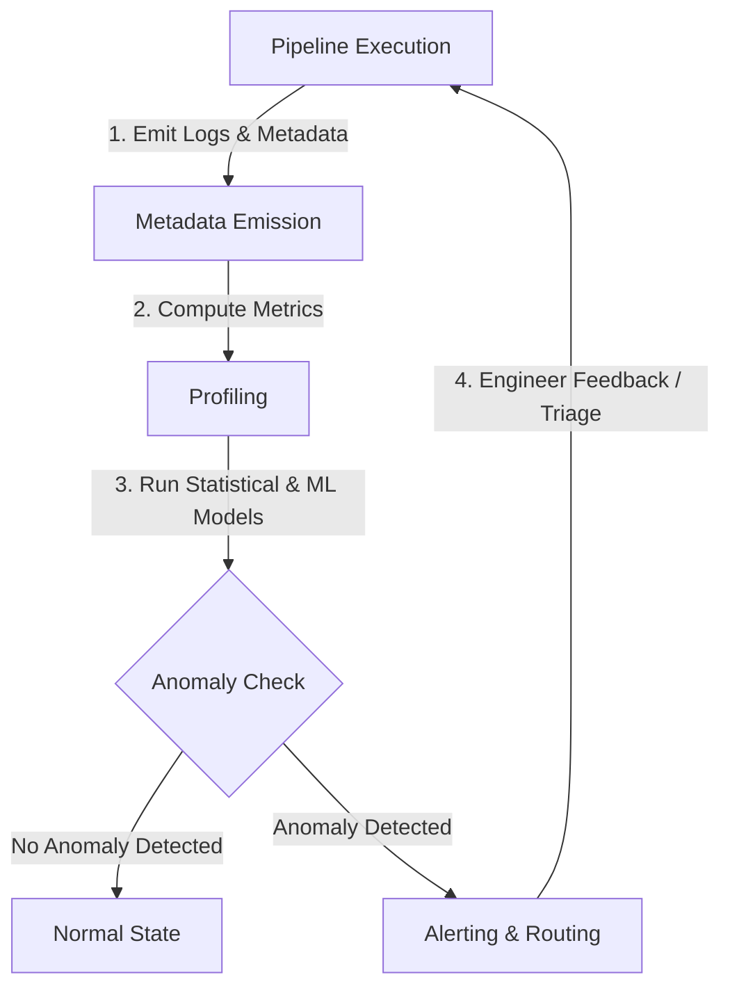

Hãy tưởng tượng bạn đang quản lý một nhà máy nước sạch cung cấp cho toàn thành phố. Sẽ ra sao nếu hệ thống không hề có cảm biến đo áp suất, không có thiết bị đo nồng độ Clo, và cách duy nhất để bạn biết nước bị bẩn là đợi người dân gọi điện lên đường dây nóng để phàn nàn?

Trong thế giới dữ liệu doanh nghiệp cũng vậy. Việc để người dùng cuối (như CEO, phòng Marketing hay Sales) phát hiện ra báo cáo bị sai lệch trước khi bạn biết là một thất bại lớn của đội ngũ kỹ sư. **Khả năng quan sát dữ liệu (Data Observability)** sinh ra để làm nhiệm vụ của những chiếc cảm biến thông minh, liên tục giám sát trạng thái sức khỏe của toàn bộ hệ sinh thái dữ liệu trước khi "thảm họa" xảy ra.

---

## 1. Từ Data Quality Testing đến Data Observability

Trước đây, chúng ta thường sử dụng phương pháp **[Data Testing](/concepts/5-quality-governance/data-quality/data-testing)** thông qua các công cụ như dbt tests hoặc Great Expectations để thiết lập các quy tắc cứng (rules) cho dữ liệu (ví dụ: kiểm tra cột `customer_id` có bị `NULL` hay không, hoặc giá trị của cột `age` có lớn hơn 0 không).

Tuy nhiên, phương pháp kiểm thử truyền thống chỉ giúp giải quyết các lỗi thuộc nhóm **"Known Unknowns"** (những vấn đề ta đã biết và lường trước được). Trong thực tế, các sự cố dữ liệu (data downtime) nghiêm trọng nhất lại đến từ **"Unknown Unknowns"** (những vấn đề ta không thể dự đoán trước). Ví dụ: một API của bên thứ ba bỗng nhiên thay đổi định dạng phản hồi khiến số lượng bản ghi cập nhật hàng ngày giảm đi 30%, nhưng pipeline vẫn chạy thành công (trạng thái `Success`) và không hề kích hoạt bất kỳ lỗi logic nào.

Đây chính là lúc **Data Observability** phát huy vai trò. Thay vì chỉ kiểm tra dữ liệu tại các điểm chốt tĩnh, Data Observability liên tục theo dõi hệ thống dữ liệu thông qua 5 trụ cột chính (5 Pillars of Data Observability) được khởi xướng bởi Monte Carlo:
1.  **Freshness (Độ tươi mới)**: Dữ liệu có được cập nhật đúng hạn không? Lần cuối cùng bảng nhận dữ liệu mới là khi nào?
2.  **Volume (Thể tích/Số lượng)**: Lượng dữ liệu nạp vào có bình thường không (có bị tăng/giảm đột biến)?
3.  **Schema (Cấu trúc)**: Cấu trúc bảng có bị thay đổi ngoài ý muốn không? Ai thực hiện sự thay đổi đó?
4.  **Distribution (Phân phối)**: Giá trị của dữ liệu có bị trôi lệch (drift) khỏi phân phối thông thường không? (ví dụ: cột tuổi `age` tự dưng xuất hiện giá trị âm).
5.  **Lineage (Phả hệ/Dòng chảy dữ liệu)**: Dòng chảy dữ liệu từ nguồn đến đích đi qua những đâu và ảnh hưởng đến những hạ nguồn (downstream) nào?

Để tìm hiểu thêm về các khía cạnh cơ bản của chất lượng dữ liệu, bạn có thể tham khảo bài viết về **[Data Quality Dimensions](/concepts/5-quality-governance/data-quality/data-quality-dimensions)**.

---

## 2. Thiết lập SLA và SLO cho Data Pipelines

Để đo lường và cam kết chất lượng dữ liệu giữa đội ngũ kỹ sư dữ liệu (Data Engineers) và người tiêu thụ dữ liệu (Data Consumers/Business Users), chúng ta cần áp dụng các khái niệm SRE (Site Reliability Engineering) vào kỹ nghệ dữ liệu: **SLI, SLO, và SLA**.

*   **SLI (Service Level Indicator - Chỉ số đo lường dịch vụ)**: Chỉ số kỹ thuật cụ thể phản ánh trạng thái của pipeline hoặc dữ liệu.
    *   *Ví dụ*: Thời gian trễ dữ liệu (Data Latency) của bảng `fact_orders` được tính bằng `current_timestamp() - MAX(order_timestamp)`.
*   **SLO (Service Level Objective - Mục tiêu mức dịch vụ)**: Cái đích định lượng cụ thể mà đội ngũ kỹ thuật hướng tới cho SLI trong một khoảng thời gian xác định.
    *   *Ví dụ*: "Thời gian trễ dữ liệu của bảng `fact_orders` phải dưới 2 giờ (Freshness < 2 hours) trong 99.5% số ngày của một tháng."
*   **SLA (Service Level Agreement - Thỏa thuận mức dịch vụ)**: Cam kết mang tính ràng buộc kinh doanh hoặc pháp lý về hậu quả (phạt tiền, giải trình KPI) xảy ra nếu hệ thống không đạt được SLO.
    *   *Ví dụ*: "Nếu độ trễ của bảng báo cáo doanh thu vượt quá 4 giờ sau 8:00 AM nhiều hơn 3 lần một tháng, đội ngũ Data Platform phải chịu đánh giá hạ bậc KPI quý."

### Thiết lập biên độ an toàn (Error Budget)
SLO không bao giờ nên là 100%. Nếu SLO của bạn là 99% cho Freshness < 1 giờ, bạn có 1% "ngân sách lỗi" (Error Budget) cho phép pipeline gặp sự cố, bảo trì, hoặc cập nhật hệ thống trong tháng.

---

## 3. Kiến trúc và Vòng lặp đo lường từ xa (Telemetry Loop)

Hệ thống Data Observability hiện đại hoạt động dựa trên một vòng lặp kín từ việc thực thi đến cảnh báo:



1.  **Pipeline Execution**: Các công cụ điều phối ([Orchestration](/concepts/3-integration/orchestration/orchestration/) như Airflow) hoặc công cụ biến đổi dữ liệu (dbt, Spark) chạy các job xử lý dữ liệu.
2.  **Metadata Emission**: Trong quá trình chạy, hệ thống phát ra các siêu dữ liệu vận hành (operational metadata) như thời gian bắt đầu/kết thúc, số dòng ghi vào, dung lượng bộ nhớ, và schema của bảng.
3.  **Profiling**: Các công cụ quan sát đọc metadata này và thực hiện phân tích đặc trưng dữ liệu cơ bản (ví dụ: tính giá trị trung bình, độ lệch chuẩn, đếm số giá trị null). Để hiểu rõ hơn về kỹ thuật này, hãy xem bài viết về **[Data Profiling](/concepts/5-quality-governance/data-quality/data-profiling)**.
4.  **Anomaly Check**: Các thuật toán hoặc mô hình học máy (Machine Learning) so sánh các chỉ số vừa đo được với dữ liệu lịch sử (baseline) để tìm ra điểm bất thường (Anomaly Detection).
5.  **Alerting & Routing**: Nếu phát hiện bất thường, hệ thống sẽ kích hoạt cảnh báo, định tuyến thông tin đến đúng kênh (Slack, PagerDuty) của kỹ sư phụ trách kèm theo sơ đồ phả hệ ([Data Lineage](/concepts/5-quality-governance/governance-metadata/data-lineage/)).

---

## 4. Giám sát siêu dữ liệu (Metadata Monitoring Indicators)

Thay vì chạy các câu lệnh `SELECT COUNT(*)` đắt đỏ trên toàn bộ bảng dữ liệu hàng tỷ dòng, hệ thống giám sát hiện đại tận dụng siêu dữ liệu (metadata) của hệ thống lưu trữ để theo dõi các chỉ số quan trọng một cách tối ưu chi phí:

### Freshness (Độ tươi mới của dữ liệu)
Đo lường khoảng thời gian kể từ lần cập nhật dữ liệu cuối cùng cho đến hiện tại.
*   *Cách giám sát tối ưu*: Truy vấn trực tiếp các bảng metadata của kho dữ liệu. Ví dụ trong Snowflake, kiểm tra `LAST_ALTERED` trong `INFORMATION_SCHEMA.TABLES`.
*   *Phát hiện bất thường*: Sử dụng mô hình chuỗi thời gian (Time-series models) để học tính chu kỳ (seasonality) của dữ liệu nguồn và tự động điều chỉnh ngưỡng động, tránh cảnh báo giả vào ngày cuối tuần khi lượng giao dịch tự nhiên giảm.

### Volume (Thể tích dữ liệu)
Đo lường tổng số dòng (row count) hoặc kích thước tệp tin (file size) được thêm vào hoặc thay đổi sau mỗi lần thực thi pipeline.
*   *Sự sụt giảm đột biến (Volume Drop)*: Số dòng nạp vào đột ngột giảm xuống gần bằng 0 hoặc giảm mạnh. Nguyên nhân có thể do lỗi kết nối API nguồn, phân quyền tài khoản bị thu hồi, hoặc lỗi lọc dữ liệu quá tay.
*   *Sự tăng đột biến (Volume Spike)*: Số dòng tăng vọt bất thường. Nguyên nhân thường gặp là do lỗi logic JOIN tạo ra tích Descartes, hoặc job chạy lại nhiều lần nhưng không xóa dữ liệu cũ dẫn đến trùng lặp dữ liệu.

---

## 5. Phát hiện trôi lệch phân phối dữ liệu (Distribution Drift Detection)

Dữ liệu có thể không đổi về cấu trúc (schema) và số lượng bản ghi (volume), nhưng giá trị thực tế bên trong các cột lại thay đổi theo thời gian. Hiện tượng này gọi là **Distribution Drift (Trôi lệch phân phối)**. Để hiểu sâu hơn về các cơ chế phát hiện tự động, bạn có thể tham khảo bài viết chi tiết tại **[Anomaly Detection](/concepts/5-quality-governance/data-quality/anomaly-detection)**.

Để đo lường độ trôi lệch của tập dữ liệu hiện tại (Actual) so với tập dữ liệu nền tảng làm chuẩn (Expected/Baseline), chúng ta sử dụng ba công cụ toán học:

### 1. Population Stability Index (PSI)
PSI là chỉ số đo lường mức độ thay đổi phân phối của một biến số giữa hai khoảng thời gian. Công thức tính PSI:

$$\text{PSI} = \sum_{i=1}^{k} \left( (\text{Actual}_i - \text{Expected}_i) \times \ln\left(\frac{\text{Actual}_i}{\text{Expected}_i}\right) \right)$$

*   $\text{PSI} < 0.1$: Không có sự trôi lệch đáng kể (ổn định).
*   \\$0.1 \le \text{PSI} < 0.25$: Trôi lệch ở mức trung bình (cần theo dõi).
*   $\text{PSI} \ge 0.25$: Trôi lệch nghiêm trọng (cần huấn luyện lại mô hình ML hoặc kiểm tra lại nguồn dữ liệu).

### 2. Kolmogorov-Smirnov (KS) Test
Phép thử KS là một kiểm định phi tham số so sánh hàm phân phối tích lũy (CDF) của hai mẫu dữ liệu để xác định xem chúng có thuộc cùng một phân phối xác suất hay không. Nếu giá trị $p\text{-value}$ thu được từ phép thử KS nhỏ hơn ngưỡng ý nghĩa (thường là \\$0.05$), chúng ta kết luận rằng dữ liệu đã bị trôi lệch phân phối rõ rệt.

### 3. Wasserstein Distance (Earth Mover's Distance)
Khoảng cách Wasserstein đo lường "chi phí" tối thiểu để biến đổi phân phối xác suất này thành phân phối xác suất khác. Nó hoạt động hiệu quả trên cả các biến liên tục có không gian phân phối phức tạp.

---

## 6. Ví dụ thực tế: Cấu hình giám sát dữ liệu bằng Soda

Dưới đây là một tệp YAML cấu hình cho công cụ giám sát mã nguồn mở **Soda** để tự động kiểm tra độ tươi mới, độ phân phối và khối lượng dữ liệu cho bảng giao dịch:

```yaml
# checks_dim_exchange.yml
checks for dim_exchange:
  # 1. Freshness: Cảnh báo nếu dữ liệu không được cập nhật mới trong 24 giờ qua
  - freshness(updated_at) < 24h

  # 2. Distribution: Sử dụng Machine Learning để cảnh báo nếu tỷ giá trung bình lệch bất thường
  - anomaly score for avg_currency_rate < 0.5:
      avg_currency_rate: avg(currency_rate)

  # 3. Volume: Cảnh báo nếu số dòng dữ liệu giảm hơn 10% so với tuần trước
  - change same day last week for row_count < -10%
```

---

## 7. Xây dựng hệ thống cảnh báo và Quản lý quá tải cảnh báo (Alert Fatigue)

Một hệ thống Data Observability dù tốt đến đâu cũng sẽ thất bại nếu kỹ sư dữ liệu liên tục nhận được hàng trăm thông báo lỗi mỗi ngày và chọn cách tắt thông báo. Hiện tượng này gọi là **Alert Fatigue (Quá tải cảnh báo)**.

| Yếu tố | Giải pháp triển khai thực tế |
| :--- | :--- |
| **Phân luồng cảnh báo (Routing & Severity)** | Phân chia cảnh báo thành 3 mức độ:<br>- **Critical**: Lỗi làm gãy các pipeline báo cáo cốt lõi (SLA bị vi phạm). Định tuyến trực tiếp đến công cụ On-call như PagerDuty.<br>- **Warning**: Lỗi chất lượng dữ liệu nhỏ, không ảnh hưởng trực tiếp đến SLA. Gửi vào kênh Slack chung để xử lý trong giờ làm việc.<br>- **Info**: Ghi nhận vào log để phục vụ mục đích audit định kỳ. |
| **Ngưỡng động (Dynamic Thresholds)** | Sử dụng thuật toán học máy phát hiện bất thường thay vì các ngưỡng tĩnh (hard-coded thresholds). Ngưỡng động tự động mở rộng vào ngày nghỉ/ngày lễ khi lưu lượng giao dịch giảm tự nhiên, giúp giảm thiểu cảnh báo giả. |
| **Gom cụm và Khử trùng lặp (Deduplication)** | Nếu bảng thượng nguồn (upstream table) bị lỗi dẫn đến nhiều bảng hạ nguồn (downstream tables) bị sai số theo, hệ thống phải tự động gộp các cảnh báo này lại thành 1 cảnh báo gốc duy nhất, chỉ ra nguyên nhân cốt lõi (Root Cause) nhờ đồ thị phả hệ dữ liệu. |
| **Cảnh báo có tính hành động (Actionable Alerts)** | Mỗi cảnh báo gửi đi bắt buộc phải đi kèm với ngữ cảnh rõ ràng: Tên bảng và cột bị lỗi, mức độ ảnh hưởng (BI dashboards bị sai số), liên kết đến **Runbook/Playbook** hướng dẫn khắc phục và nút tương tác trực tiếp (Acknowledge) trên Slack. |

---

## Khi nào nên dùng

*   **Nên dùng:**
    *   Hệ thống dữ liệu của doanh nghiệp đã đạt đến quy mô trung bình đến lớn (hàng trăm bảng dữ liệu trở lên) với các đường ống dẫn dữ liệu đan xen phức tạp (DAG lớn).
    *   Doanh nghiệp vận hành các mô hình Machine Learning realtime phục vụ trực tiếp cho sản phẩm (hệ thống gợi ý sản phẩm, phát hiện gian lận).
    *   Đội ngũ dữ liệu mất quá nhiều thời gian (trên 30% thời lượng làm việc) chỉ để đi tìm nguyên nhân và khắc phục các lỗi dữ liệu thủ công.
*   **Không nên dùng:**
    *   Hệ thống dữ liệu còn quá đơn giản (chỉ có vài pipeline đơn giản). Trong trường hợp này, việc thiết lập dbt tests cơ bản hoặc SQL assertions là đã đủ để kiểm soát chất lượng dữ liệu với chi phí tối ưu nhất.
    *   Đội ngũ nhân sự chưa định hình rõ quy trình **Data Governance** và không có kỹ sư chuyên trách để tiếp nhận cũng như xử lý các cảnh báo được phát ra.

---

## Điểm mạnh và điểm yếu (Trade-offs)

### Điểm mạnh và điểm yếu

#### Điểm mạnh (Pros)
*   **Giảm thiểu tối đa Data Downtime**: Phát hiện sự cố dữ liệu chỉ trong vài phút thay vì vài tuần sau khi người dùng cuối phàn nàn.
*   **Tự động hóa ở quy mô lớn**: Giải phóng kỹ sư khỏi việc viết và duy trì hàng nghìn dòng code kiểm thử thủ công nhờ vào cơ chế tự động học ngưỡng của Machine Learning.
*   **Phân tích nguyên nhân gốc rễ nhanh chóng**: Tích hợp phả hệ dữ liệu (Data Lineage) giúp kỹ sư khoanh vùng ngay lập tức bảng nguồn nào gây ra lỗi và những dashboard nào sẽ bị ảnh hưởng.
*   **Tối ưu hóa chi phí hạ tầng**: Dễ dàng phát hiện các bảng dữ liệu rác không có ai truy cập hoặc các pipeline chạy lãng phí tài nguyên để dọn dẹp kịp thời.

#### Điểm yếu (Cons)
*   **Chi phí tài nguyên và bản quyền**: Các công cụ Data Observability thương mại thường rất đắt đỏ. Việc quét metadata và chạy các truy vấn giám sát liên tục cũng làm tăng hóa đơn sử dụng Data Warehouse.
*   **Hội chứng Alert Fatigue**: Nếu cấu hình không chuẩn hoặc ngưỡng cảnh báo quá nhạy, kỹ sư sẽ bị ngập trong hàng trăm tin nhắn cảnh báo mỗi ngày, dẫn đến việc bỏ qua các lỗi thực sự nghiêm trọng.
*   **Độ phức tạp khi tích hợp**: Đòi hỏi thời gian cấu hình và kết nối đồng bộ giữa các tầng trong toàn bộ Data Stack.

---

## Trọng tâm ôn luyện phỏng vấn

### 1. Phân biệt sự khác nhau cốt lõi giữa Data Quality Testing và Data Observability?
*   **Gợi ý trả lời**: 
    *   **Data Quality Testing** là phương pháp tiếp cận mang tính **phòng thủ thụ động (reactive)** và tĩnh. Chúng ta viết các đoạn code kiểm thử (như dbt tests, Great Expectations) để xác thực dữ liệu dựa trên những giả định hoặc luật nghiệp vụ đã biết trước (Known Unknowns). Lỗi chỉ được phát hiện khi dữ liệu đi qua điểm kiểm thử đó.
    *   **Data Observability** là phương pháp tiếp cận mang tính **chủ động (proactive)** và động. Nó liên tục giám sát toàn bộ vòng đời dữ liệu thông qua siêu dữ liệu (metadata), dòng chảy dữ liệu (lineage) và sử dụng học máy (Machine Learning) để tự động phát hiện các điểm bất thường mà chúng ta chưa từng lường trước (Unknown Unknowns), ví dụ như sự sụt giảm số dòng đột ngột do API nguồn bị nghẽn.

### 2. Khi phát hiện sự trôi lệch phân phối dữ liệu (Distribution Drift) với chỉ số PSI >= 0.25 trên một cột quan trọng, bạn sẽ xử lý như thế nào?
*   **Gợi ý trả lời**: 
    1. **Kiểm tra nguồn dữ liệu (Data Source Audit)**: Xác định xem có sự thay đổi nào từ phía thượng nguồn không (thay đổi giao diện ứng dụng dẫn đến cách người dùng nhập liệu thay đổi, hoặc lỗi định dạng dữ liệu).
    2. **Cách ly và Cảnh báo**: Bắn cảnh báo mức độ Warning/Critical đến đội ngũ Data Science đang sử dụng cột dữ liệu này làm đầu vào cho mô hình ML.
    3. **Đánh giá ảnh hưởng (Impact Analysis)**: Sử dụng Data Lineage để xác định những mô hình ML hoặc báo cáo hạ nguồn nào đang tiêu thụ dữ liệu trôi lệch này.
    4. **Tái huấn luyện mô hình (Model Retraining)**: Nếu trôi lệch phản ánh sự thay đổi thực tế của thị trường (ví dụ: hành vi mua sắm thay đổi), tiến hành cập nhật tập dữ liệu huấn luyện mới và huấn luyện lại mô hình ML để đảm bảo độ chính xác.

### 3. Làm thế nào để bạn giải quyết bài toán Alert Fatigue trong hệ thống giám sát dữ liệu của doanh nghiệp?
*   **Gợi ý trả lời**: Tôi sẽ áp dụng chiến lược 4 bước:
    1. **Chuyển từ ngưỡng tĩnh sang ngưỡng động**: Sử dụng các thuật toán phát hiện bất thường dựa trên chuỗi thời gian để tự động điều chỉnh ngưỡng cảnh báo theo chu kỳ ngày/tuần, tránh cảnh báo giả vào cuối tuần.
    2. **Phân cấp cảnh báo rõ ràng (Severity Class)**: Chỉ cảnh báo On-call (PagerDuty) với các lỗi vi phạm trực tiếp đến SLA của các pipeline cốt lõi. Các lỗi nhỏ hơn sẽ được đẩy về Slack channel để xử lý sau.
    3. **Áp dụng cơ chế khử trùng lặp (Deduplication) và tìm nguyên nhân gốc**: Nhóm các cảnh báo liên quan lại với nhau dựa trên đồ thị phả hệ dữ liệu (data lineage).
    4. **Yêu cầu Playbook đi kèm**: Đảm bảo mọi cảnh báo đều có hướng dẫn khắc phục cụ thể và nút tương tác trực tiếp để kỹ sư dễ dàng phản hồi.

---

## Xem thêm các khái niệm liên quan
* [Cảnh báo và phản ứng sự cố - Alerting & Incident Response](/concepts/5-quality-governance/observability-reliability/alerting-incident-response/)
* [Trôi dạt phân phối - Distribution Drift (Data Drift)](/concepts/5-quality-governance/observability-reliability/distribution-drift/)
* [Giám sát độ trễ dữ liệu - Freshness Monitoring](/concepts/5-quality-governance/observability-reliability/freshness-monitoring/)

## Tài liệu tham khảo

* [AWS - Defining and Monitoring Data Quality](https://docs.aws.amazon.com/glue/latest/dg/data-quality.html)
* [Google Cloud - Data Quality Monitoring and Architecture](https://cloud.google.com/architecture/datashare-data-quality-monitoring)
* [Snowflake - Introduction to Data Quality and Metric Tables](https://docs.snowflake.com/en/user-guide/data-quality-intro)
* [Databricks - Lakehouse Monitoring and Data Quality](https://docs.databricks.com/en/lakehouse-monitoring/index.html)
* [Monte Carlo Data - The 5 Pillars of Data Observability](https://www.montecarlodata.com/blog-the-5-pillars-of-data-observability/)
* [dbt Labs - Defining Data Quality and Testing in dbt](https://docs.getdbt.com/docs/build/data-tests)
* [Great Expectations - Official Documentation](https://greatexpectations.io/blog/what-is-great-expectations)

---

## English Summary

**Data Observability** is the practice of monitoring and understanding the health of data systems across five core pillars: Freshness, Distribution, Volume, Schema, and Lineage. Unlike static **Data Quality Testing** (e.g., dbt tests or Great Expectations) which validate "known unknowns," Data Observability utilizes Machine Learning to profile historical metadata and dynamically identify "unknown unknowns" (anomalies). Setting operational **SLAs** (Service Level Agreements) and **SLOs** (Service Level Objectives) on data pipelines ensures reliability and aligns expectations between engineering teams and business users. When anomalies occur, statistical tests like **Population Stability Index (PSI)**, **Kolmogorov-Smirnov (KS) Test**, and **Wasserstein Distance** help detect distribution drifts, while Schema Registry and Data Contracts safeguard against breaking schema changes. To prevent **Alert Fatigue**, engineering teams must implement dynamic thresholding, alert deduplication, clear severity routing, and actionable playbooks.