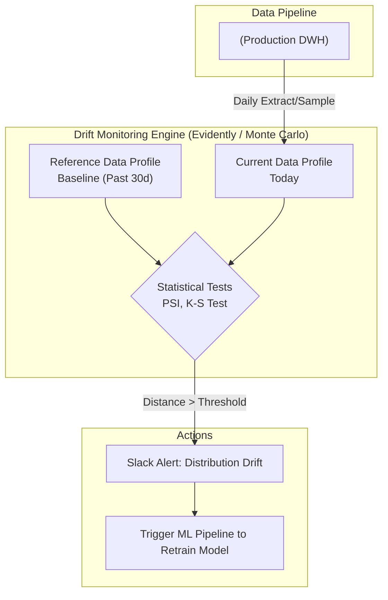

Hãy tưởng tượng bạn đang vận hành một đường ống dữ liệu ([data pipeline](/concepts/1-foundations/foundation/data-pipeline/)) rất mượt mà. Schema của các bảng không hề thay đổi, số lượng bản ghi đổ về mỗi ngày vẫn đều đặn, không có lỗi hệ thống nào xảy ra. Bạn thở phào nhẹ nhõm vì nghĩ mọi thứ đang hoàn hảo. 

Nhưng ở đầu ra, mô hình Machine Learning dự báo tỷ lệ khách hàng rời bỏ dịch vụ (Churn Prediction) vốn rất chính xác nay đột ngột đưa ra những dự báo sai lệch hoàn toàn. Các báo cáo phân tích kinh doanh hiển thị các con số doanh thu trung bình giảm mạnh một cách bất thường mà không rõ nguyên nhân. 

Chào mừng bạn đến với thế giới của **Distribution Drift (Trôi dạt phân phối)** hay thường được gọi là **Data Drift** – một trong những hiện tượng "silent failure" (lỗi ngầm) nguy hiểm và khó phát hiện nhất trong kỹ thuật dữ liệu và MLOps.


## Khi dữ liệu thay đổi "tính cách" một cách âm thầm

Để dễ hình dung, **Distribution Drift** là hiện tượng các đặc trưng thống kê của dữ liệu (như giá trị trung bình, độ lệch chuẩn, phân phối chuẩn) bị thay đổi hình dáng phân phối theo thời gian, khác biệt rõ rệt so với dữ liệu lịch sử hoặc dữ liệu dùng để huấn luyện mô hình.

Hãy phân biệt kỹ hai khái niệm này:
* **Schema Drift (Trôi dạt cấu trúc)**: Là sự thay đổi về mặt vật lý của bảng dữ liệu (ví dụ: thêm cột mới, xóa cột cũ, đổi kiểu dữ liệu từ `INT` sang `VARCHAR`). Lỗi này sẽ làm sập pipeline ngay lập tức (Hard failure).
* **Data Drift (Trôi dạt phân phối)**: Cấu trúc cột vẫn giữ nguyên (vẫn là kiểu `INT`), dữ liệu vẫn đổ về bình thường. Nhưng **chất lượng thống kê và ý nghĩa** của dữ liệu bên trong đã thay đổi.

**Ví dụ:**
* Cột `user_age` (tuổi người dùng) trước đây phân bổ dạng hình chuông (phân phối chuẩn) tập trung chủ yếu ở độ tuổi `25-35`. Qua một thời gian, biểu đồ đột nhiên lệch hẳn sang bên phải, tập trung nhiều ở độ tuổi `45-55`.
* Tỷ lệ dữ liệu bị trống (NULL rate) ở cột số điện thoại `phone_number` bất ngờ vọt từ 5% lên tận 60%.

## Tại sao Data Drift lại là "kẻ sát nhân thầm lặng" của mô hình AI?

Hiện tượng trôi dạt phân phối thường xuất phát từ hai nhóm nguyên nhân chính:

1. **Biến động từ thế giới thực (Concept/Environment Drift)**: Hành vi của con người và thị trường luôn thay đổi. Một đợt dịch bệnh như Covid-19 bùng phát có thể thay đổi hoàn toàn hành vi mua sắm trực tuyến của khách hàng so với lịch sử trước đó. Hoặc sở thích của người tiêu dùng dịch chuyển theo các xu hướng mới trên mạng xã hội.
2. **Lỗi quy trình hoặc Lỗi hệ thống (Systematic Errors)**: Đội ngũ phát triển Backend âm thầm thay đổi logic lưu trữ dữ liệu. Ví dụ trước đây lưu giá tiền bằng USD, nay đổi sang VND mà không thông báo, làm giá trị cột tăng vọt 25.000 lần. Hoặc đơn giản là một thiết bị cảm biến IoT bị lỗi phần cứng, liên tục gửi về giá trị `0` thay vì nhiệt độ thực tế.

Hậu quả là các mô hình Machine Learning (như phát hiện gian lận thẻ tín dụng, gợi ý sản phẩm) sẽ hoạt động cực kỳ kém hiệu quả (*Model Decay*) vì chúng đang cố áp dụng những bài học cũ lên một thực tế hoàn toàn mới.

## Phương pháp phát hiện: Khi luật tĩnh (Rule-based) chào thua toán thống kê

Chúng ta không thể dùng các quy tắc tĩnh thông thường (ví dụ: kiểm tra xem `age > 0` và `age < 100`) để phát hiện Data Drift. Bởi vì dù người dùng 25 tuổi hay 55 tuổi thì dữ liệu vẫn hoàn toàn hợp lệ về mặt kỹ thuật. Cái chúng ta cần phát hiện là **sự dịch chuyển của cả một đám đông**.

Để làm được điều này, hệ thống Data Observability phải áp dụng toán thống kê:

1. **Profiling (Tính toán đặc trưng)**: Định kỳ (ví dụ hàng ngày), hệ thống sẽ quét dữ liệu và tính toán các chỉ số thống kê cơ bản như Mean, Median, Standard Deviation, Min, Max, và tỷ lệ Null.
2. **Statistical Distance (Đo khoảng cách thống kê)**: Sử dụng các thuật toán như **K-S test** (Kolmogorov-Smirnov) cho dữ liệu liên tục (như thu nhập, tuổi tác) hoặc **PSI** (Population Stability Index) cho dữ liệu phân loại (như giới tính, khu vực). Thuật toán sẽ so sánh phân phối hiện tại (Current) với một phân phối chuẩn trong quá khứ (Reference/Baseline). Nếu khoảng cách giữa hai phân phối vượt quá một ngưỡng an toàn, hệ thống sẽ phát cảnh báo.

Thông thường, chỉ số PSI được đánh giá như sau:
* **PSI < 0.1**: Dữ liệu ổn định, không có thay đổi đáng kể.
* **0.1 <= PSI < 0.2**: Có sự dịch chuyển nhẹ, cần lưu ý.
* **PSI >= 0.2**: Dữ liệu đã bị trôi dạt lớn (Significant drift). Hệ thống cần phát cảnh báo đỏ (Red Alert) để đội ngũ kỹ sư can thiệp.

## Kiến trúc hệ thống giám sát Drift tự động

Dưới đây là luồng hoạt động điển hình của một công cụ giám sát trôi dạt phân phối trong thực tế:


## Ví dụ thực tế: Cảnh báo Drift trên hệ thống tín dụng bằng Evidently AI

**Bối cảnh:** Bạn có một bảng `customer_loans` lưu thông tin duyệt vay tài chính. Cột `credit_score` (điểm tín dụng) dao động từ 300 đến 850. Mô hình AI dựa vào điểm này để tự động duyệt hồ sơ.
* *Tháng 1 (Reference)*: Điểm trung bình của khách hàng đăng ký là `650`. Mô hình hoạt động ổn định.
* *Tháng 4 (Current)*: Do ngân hàng chạy chiến dịch tiếp cận sinh viên, điểm tín dụng trung bình của tệp khách hàng đăng ký đột ngột giảm xuống còn `550`.

Nếu không phát hiện kịp thời, mô hình AI (vẫn nghĩ tệp khách hàng phải đạt chuẩn >650) sẽ tự động từ chối hầu hết các hồ sơ của sinh viên, khiến chiến dịch Marketing thất bại.

Dưới đây là cách dùng thư viện `Evidently AI` trong Python để tự động hóa việc phát hiện hiện tượng này:
```python
import pandas as pd
from evidently.report import Report
from evidently.metric_preset import DataDriftPreset

# 1. Tải dữ liệu tham chiếu (Tháng 1) và dữ liệu hiện tại (Tháng 4)
reference_data = pd.read_parquet("data/january_baseline.parquet")
current_data = pd.read_parquet("data/april_current.parquet")

# 2. Khởi tạo báo cáo Drift bằng thư viện Evidently
drift_report = Report(metrics=[DataDriftPreset()])
drift_report.run(reference_data=reference_data, current_data=current_data)

# 3. Trích xuất kết quả dưới dạng JSON (để bắn Alert về Slack/Email)
results = drift_report.as_dict()

# Nếu phát hiện trượt dữ liệu lớn trên các cột quan trọng
if results["metrics"][0]["result"]["dataset_drift"]:
    print("CẢNH BÁO: Phát hiện Distribution Drift! Cần kiểm tra lại dữ liệu và mô hình.")
```

**Cách xử lý:** Khi nhận cảnh báo Drift, các Data Scientist sẽ vào cuộc. Nếu xác định đây là sự dịch chuyển thực tế của thị trường, họ sẽ kích hoạt pipeline để huấn luyện lại mô hình (Retraining) với dữ liệu mới của tháng 4 nhằm giúp mô hình thích nghi.

## Những lưu ý quan trọng để tránh "báo động giả"

* **Đừng giám sát vô tội vạ**: Việc tính toán các chỉ số phân phối thống kê trên lượng dữ liệu khổng lồ vô cùng tốn tài nguyên. Hãy chọn lọc và chỉ tập trung giám sát các cột tính năng (features) quan trọng nhất của mô hình Machine Learning hoặc các chỉ số KPI kinh doanh cốt lõi.
* **Lựa chọn khung thời gian (Time-window) hợp lý**: So sánh dữ liệu ngày hôm nay với ngày hôm qua rất dễ bị nhiễu bởi các yếu tố mùa vụ (ví dụ: ngày cuối tuần hành vi người dùng luôn khác ngày thường). Một khung thời gian lớn hơn như "Tuần này so với Tuần trước" hoặc "30 ngày qua so với 30 ngày trước đó" sẽ cho kết quả ổn định và chính xác hơn.
* **Tránh bẫy thống kê Min/Max**: Tuyệt đối không dùng giá trị lớn nhất (Max) hoặc nhỏ nhất (Min) làm đại diện để phát hiện Drift. Chỉ cần xuất hiện một giá trị ngoại lai (outlier) do lỗi nhập liệu, giá trị Max sẽ thay đổi chóng mặt trong khi phân phối của 99% dữ liệu còn lại vẫn hoàn toàn bình thường. Hãy dùng các phân vị (Percentiles như P25, P50, P75).

## Điểm mạnh và điểm yếu

### Ưu điểm
* Là tấm lá chắn bảo vệ, duy trì hiệu năng ổn định cho các mô hình Machine Learning trên môi trường Production.
* Giúp phát hiện sớm các lỗi logic nghiệp vụ ngầm từ phía Backend trước khi chúng kịp làm sai lệch toàn bộ hệ thống báo cáo.

### Nhược điểm
* Đòi hỏi năng lực tính toán lớn từ hệ thống [Data Warehouse](/concepts/2-storage/data-warehouse/data-warehouse/) khi phải liên tục quét và phân tích lượng dữ liệu lớn.
* Khá trừu tượng để giải thích cho các phòng ban kinh doanh hiểu tại sao các chỉ số thống kê như PSI hay K-S test lại quan trọng và cần được xử lý ngay lập tức.

## Khi nào nên dùng

### Khi nào nên dùng:
* Bắt buộc phải có trong các hệ thống MLOps vận hành các mô hình dự báo trực tuyến tự động (như gợi ý sản phẩm thương mại điện tử, đánh giá rủi ro tín dụng, phát hiện gian lận).
* Áp dụng cho các bảng Fact tài chính, giao dịch lớn cần đảm bảo tính nhất quán cao về hành vi dữ liệu.

### Khi nào không nên dùng:
* Không cần thiết áp dụng cho các bảng dữ liệu tĩnh, bảng chiều (Dimension) ít biến động, hoặc các cột chỉ chứa ID định danh.

## Các khái niệm liên quan

* [Trôi dạt cấu trúc - Schema Drift](/concepts/5-quality-governance/observability-reliability/schema-drift/)
* [Khả năng quan sát dữ liệu - Data Observability](/concepts/5-quality-governance/observability-reliability/data-observability/)
* [Data Quality](/concepts/5-quality-governance/data-quality/data-quality/)

## Trọng tâm ôn luyện phỏng vấn

### 1. Phân biệt sự khác nhau giữa Schema Drift và Data Drift?
* **Gợi ý trả lời**: Schema Drift là sự thay đổi về mặt cấu trúc vật lý của dữ liệu (ví dụ: thêm/xóa cột, đổi kiểu dữ liệu). Lỗi này thường làm hỏng và dừng hoạt động của pipeline ngay lập tức. Trong khi đó, Data Drift (hay Distribution Drift) là sự thay đổi về mặt ý nghĩa thống kê và phân phối của các giá trị bên trong (ví dụ: giá trị trung bình tăng đột ngột). Ở trường hợp Data Drift, pipeline vẫn chạy hoàn toàn bình thường (không báo lỗi kỹ thuật), nhưng các kết quả đầu ra của Dashboard hoặc mô hình Machine Learning sẽ bị sai lệch nghiêm trọng. Do đó, Data Drift khó phát hiện hơn nhiều.

### 2. Nếu một cột dữ liệu `order_amount` bị cảnh báo là có Distribution Drift lớn, bạn sẽ làm gì để tìm nguyên nhân gốc rễ (Root Cause)?
* **Gợi ý trả lời**: Để tìm nguyên nhân, tôi sẽ thực hiện theo các bước sau:
  1. Kiểm tra [Data Lineage](/concepts/5-quality-governance/governance-metadata/data-lineage/) để xác định nguồn gốc của dữ liệu đầu vào.
  2. Vẽ biểu đồ phân phối (Histogram) của tệp dữ liệu hiện tại và đối chiếu với baseline để xem hình dáng phân phối bị trượt theo hướng nào (ví dụ: xuất hiện nhiều giá trị 0 hay toàn bộ phân phối bị dịch chuyển sang phải).
  3. Kiểm tra khía cạnh nghiệp vụ: Doanh nghiệp có đang chạy chương trình khuyến mãi khủng nào không? Có sự thay đổi đột biến nào từ thị trường thực tế không?
  4. Kiểm tra khía cạnh kỹ thuật: Backend có thay đổi logic ghi nhận dữ liệu không? Có lỗi chuyển đổi tiền tệ hay lỗi hệ thống làm nhân bản bản ghi không?
  5. Dựa trên kết quả tìm được: Nếu do thay đổi thực tế của thị trường, tôi sẽ cập nhật baseline mới và yêu cầu retrain model Machine Learning. Nếu do lỗi kỹ thuật, tôi sẽ phối hợp với đội backend để sửa lỗi và tiến hành chạy lại ([backfill](/concepts/3-integration/etl-elt/backfill/)) dữ liệu sạch.

## Xem thêm các khái niệm liên quan
* [Cảnh báo và phản ứng sự cố - Alerting & Incident Response](/concepts/5-quality-governance/observability-reliability/alerting-incident-response/)
* [Giám sát khả năng quan sát dữ liệu - Data Observability](/concepts/5-quality-governance/observability-reliability/data-observability/)
* [Giám sát độ trễ dữ liệu - Freshness Monitoring](/concepts/5-quality-governance/observability-reliability/freshness-monitoring/)

## Tài liệu tham khảo

* [AWS SageMaker Model Monitor](https://docs.aws.amazon.com/sagemaker/latest/dg/model-monitor.html)
* [Google Cloud Vertex AI Model Monitoring](https://cloud.google.com/vertex-ai/docs/model-monitoring/overview)
* [Azure Machine Learning Data Drift Monitoring](https://learn.microsoft.com/en-us/azure/machine-learning/how-to-monitor-datasets)
* [Databricks Lakehouse Monitoring Overview](https://docs.databricks.com/en/lakehouse-monitoring/index.html)
* [Apache Spark MLLib Guide](https://spark.apache.org/docs/latest/ml-guide.html)
* [Evidently AI Core Concepts Docs](https://docs.evidentlyai.com/monitoring/data-drift)

## English Summary

Distribution Drift (or Data Drift) is a Data Observability pillar referring to significant changes in the statistical properties (e.g., mean, variance, data shape) of a dataset over time, while the structural schema remains intact. It is a critical concern in MLOps, as models trained on historical data rapidly degrade (Model Decay) when the live data distribution drifts due to real-world behavioral changes or systematic backend bugs. Unlike static quality rules, drift detection requires profiling and statistical distance metrics (like Population Stability Index or Kolmogorov-Smirnov tests) to compare current data against a historical baseline, triggering alerts or automated model retraining when thresholds are exceeded.