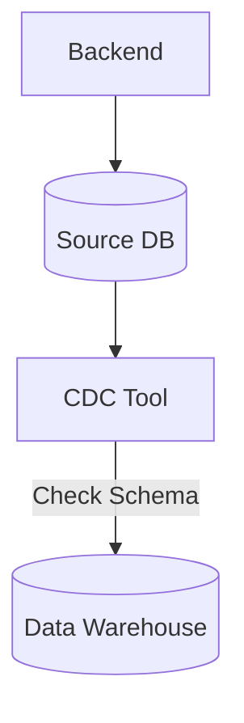

Hãy tưởng tượng bạn vừa xây dựng xong một hệ thống [Data Pipeline](/concepts/1-foundations/foundation/data-pipeline/) hoàn hảo. Dữ liệu đổ về [Data Warehouse](/concepts/2-storage/data-warehouse/data-warehouse/) mượt mà, các báo cáo chạy trơn tru. Bỗng một ngày, pipeline lăn ra lỗi (crash) lúc nửa đêm, hoặc tệ hơn là không báo lỗi gì nhưng dữ liệu trên dashboard đột nhiên bị trống (NULL). Bạn tá hỏa đi tìm nguyên nhân và phát hiện ra team Backend vừa âm thầm thay đổi cấu trúc bảng ở cơ sở dữ liệu nguồn.

Chào mừng bạn đến với thế giới của **Schema Drift** (Trôi dạt cấu trúc) – một trong những "cơn ác mộng" kinh điển nhất của mọi Data Engineer.

## Schema Drift là gì và tại sao nó lại nguy hiểm?

Nói một cách đơn giản, **Schema Drift** xảy ra khi có sự không đồng bộ (mismatch) giữa cấu trúc dữ liệu thực tế được gửi đến và cấu trúc dữ liệu mà hệ thống Data Pipeline hoặc Data Warehouse của bạn đang kỳ vọng nhận được.

Sự thay đổi cấu trúc (schema) này có thể biểu hiện dưới nhiều hình thức:
* **Thay đổi về cột**: Thêm cột mới, xóa cột cũ, hoặc đổi tên cột.
* **Thay đổi kiểu dữ liệu**: Ví dụ một trường trước đây là số nguyên `INT` bỗng dưng chuyển sang chuỗi `VARCHAR`.
* **Thay đổi thứ tự**: Thay đổi thứ tự các cột (đặc biệt nguy hiểm với dữ liệu dạng CSV không có header).
* **Thay đổi ràng buộc**: Một cột vốn là bắt buộc (`NOT NULL`) đột nhiên cho phép nhận giá trị trống (`NULLable`).

Khi sự "trôi dạt" này xảy ra, các hệ thống [ETL](/concepts/3-integration/etl-elt/etl/) truyền thống thường phản ứng theo hai cách rất cực đoan:
1. **Lỗi trực tiếp (Hard failure)**: Pipeline bị crash ngay lập tức, làm gián đoạn luồng dữ liệu.
2. **Lỗi thầm lặng (Silent failure)**: Pipeline vẫn chạy nhưng dữ liệu bị cắt xén, ghi sai kiểu, hoặc điền đầy giá trị `NULL`, dẫn đến dữ liệu rác tràn ngập kho lưu trữ mà không ai hay biết.

## Tại sao Schema Drift là điều không thể tránh khỏi?

Nguyên nhân cốt lõi của Schema Drift thường không nằm ở mặt kỹ thuật mà bắt nguồn từ khoảng cách giao tiếp giữa team phát triển phần mềm (Software Engineering) và team dữ liệu ([Data Engineering](/concepts/1-foundations/foundation/data-engineering/)):

1. **Phát triển linh hoạt (Agile)**: Các team ứng dụng cần cập nhật tính năng mới liên tục. Họ có thể thêm trường `loyalty_points` vào CSDL MongoDB hoặc thay đổi trường `username` thành `email` để tối ưu UI mà không cần quan tâm hạ nguồn dữ liệu xử lý thế nào.
2. **Khoảng cách giao tiếp (Silo)**: Khi các thay đổi DDL (Data Definition Language) xảy ra ở database nguồn, team dữ liệu thường là những người cuối cùng được biết – thường là sau khi pipeline đã sập.
3. **Sự bùng nổ của dữ liệu bán cấu trúc**: Dữ liệu từ API, Webhooks hay log hệ thống thường được định dạng dưới dạng JSON không có schema vật lý cố định. Việc cấu trúc thay đổi tùy biến là chuyện xảy ra như cơm bữa.

## Kiến trúc và Cơ chế xử lý Schema Drift

Để giải quyết triệt để Schema Drift, các Data Engineer hiện đại đã dịch chuyển tư duy từ cố gắng "ngăn chặn bằng mọi giá" sang "chấp nhận, phát hiện và tự động thích ứng":

* **Hợp đồng dữ liệu ([Data Contract](/concepts/3-integration/transformation-analytics/data-contract/))**: Thiết lập một thỏa thuận kỹ thuật bằng code (JSON Schema, Protobuf, Avro) giữa nguồn và đích. Mọi thay đổi cấu trúc của nguồn phải được đăng ký và kiểm tra thông qua CI/CD trước khi deploy lên Production.
* **Giám sát cấu trúc (Schema Discovery & Monitoring)**: Một trụ cột quan trọng của Data Observability. Hệ thống liên tục quét siêu dữ liệu (metadata) của nguồn để phát hiện và cảnh báo ngay lập tức khi xuất hiện các lệnh `DROP COLUMN` hoặc `ALTER TYPE`.
* **Tiến hóa cấu trúc ([Schema Evolution](/concepts/2-storage/data-lake-lakehouse/schema-evolution/))**: Khả năng của các kho dữ liệu hiện đại và công cụ [ELT](/concepts/3-integration/etl-elt/elt/) tự động cập nhật bảng đích (ví dụ: chạy lệnh `ALTER TABLE ADD COLUMN`) để hấp thụ dữ liệu mới mà không cần can thiệp thủ công.

### Luồng xử lý Schema Drift tự động
Dưới đây là mô hình đơn giản mô tả cách một CDC Tool ([Change Data Capture](/concepts/3-integration/etl-elt/change-data-capture/)) phát hiện và cập nhật schema tự động lên Data Warehouse:


Trong thực tế, quy trình diễn ra như sau:
1. **Trích xuất**: CDC Tool đọc log từ nguồn (ví dụ: binlog của MySQL).
2. **So sánh**: Tool so sánh cấu trúc bản ghi mới nhận được với schema hiện tại của bảng đích trong Data Warehouse (DWH).
3. **Tiến hóa**:
   * Nếu có cột mới: Tool tự động chạy lệnh `ALTER TABLE ADD COLUMN` trên DWH để đón nhận trường mới này.
   * Nếu thiếu cột ở nguồn: Hệ thống vẫn chạy bình thường và điền giá trị `NULL` vào cột thiếu đó.
   * Nếu đổi kiểu dữ liệu (từ `INT` lên `FLOAT` hoặc `STRING`): Hệ thống tự động nâng kiểu dữ liệu lên mức an toàn nhất.
4. **Cảnh báo**: Nếu gặp phải các thay đổi mang tính phá hủy (Destructive changes như xóa cột chính `user_id`), tool sẽ dừng lại và gửi tin nhắn khẩn cấp qua Slack để DE xử lý.

## Ví dụ thực tế: Schema Evolution với Delta Lake (Databricks)

Giả sử bạn đang dùng [Apache Spark](/concepts/3-integration/batch-processing/apache-spark/) để đọc các file JSON log sự kiện và ghi vào [Data Lake](/concepts/2-storage/data-lake-lakehouse/data-lake/) định dạng Parquet.

Hôm qua, trường `user_id` trong JSON được gửi dưới dạng số (`12345`). Hôm nay, ứng dụng đổi sang kiểu chuỗi UUID (`"a1b2-c3d4"`). Nếu đọc theo schema cũ, toàn bộ dòng dữ liệu mới sẽ bị parse lỗi thành `NULL`.

Để giải quyết vấn đề này, bạn có thể kích hoạt tính năng **Schema Evolution** của [Delta Lake](/concepts/2-storage/data-lake-lakehouse/delta-lake/) chỉ với tùy chọn `mergeSchema`:
```python
# Kích hoạt merge schema để tự động cập nhật cấu trúc bảng
df.write \
  .format("delta") \
  .mode("append") \
  .option("mergeSchema", "true") \
  .save("/data/events")
```

Với tùy chọn này, Delta Lake sẽ phát hiện sự thay đổi, tự động nâng kiểu dữ liệu của cột `user_id` từ Integer lên String (Upcasting), giúp ghi nhận cả dữ liệu cũ và dữ liệu mới an toàn mà không làm sập ứng dụng.

## Sai lầm thường gặp và Best Practices

* **Tách biệt Ingestion và Transformation (Mô hình ELT)**: Hãy để tầng Ingestion (EL) làm nhiệm vụ nạp thô dữ liệu 1-1 và bật tính năng Auto Schema Evolution. Mọi logic biến đổi dữ liệu phức tạp nên được giữ tại tầng Transformation (T - dùng [dbt](/concepts/3-integration/transformation-analytics/dbt/)). Nếu nguồn đổi cấu trúc, raw data vẫn được lưu trữ an toàn, việc sửa chữa mô hình dbt sau đó sẽ dễ dàng hơn nhiều so với việc để mất dữ liệu từ bước Ingestion.
* **Cảnh báo thông minh**: Dù bạn cấu hình tự động cập nhật schema (Schema Evolution), việc thiết lập cảnh báo (Alert) vẫn vô cùng cần thiết. Pipeline không lỗi không có nghĩa là Analyst không cần biết. Họ cần được thông báo khi có cột mới để đưa vào báo cáo kịp thời.
* **Đừng lạm dụng Auto Evolution**: Cho phép tự động cập nhật là tốt, nhưng nếu bạn cho phép tự động đổi kiểu dữ liệu một cách bừa bãi, các Dashboard hạ nguồn (Downstream Dashboards) có thể bị vỡ hàng loạt. Hãy chặn các thay đổi mang tính hủy hoại (Destructive changes) ngay tại cửa ngõ Ingestion.

## Điểm mạnh và điểm yếu

### Ưu điểm:
* **Tính linh hoạt cao**: Schema Evolution cho phép tự động cập nhật cấu trúc bảng đích giúp pipeline chạy liên tục không bị gián đoạn (zero-downtime).
* **Bảo toàn dữ liệu thô**: Dữ liệu thô luôn được nạp đầy đủ vào Data Lake hoặc Warehouse mà không lo bị cắt xén (truncate) hay drop do lỗi định dạng.

### Nhược điểm:
* **Rủi ro phá vỡ logic hạ nguồn**: Việc thay đổi kiểu dữ liệu tự động (như từ INT lên STRING) có thể làm sập các dashboard BI hoặc các câu lệnh SQL biến đổi dữ liệu (Transformations) ở tầng dữ liệu Gold/Data Mart.
* **Tăng nợ kỹ thuật (Technical Debt)**: Nếu quá lạm dụng Schema Evolution mà không rà soát, bảng dữ liệu đích sẽ nhanh chóng phình to và chứa hàng trăm cột rác do backend thay đổi tùy ý.

## Khi nào nên dùng

### Khi nào nên dùng:
* Triển khai tại tầng nạp dữ liệu thô (Raw/Bronze Layer) của mô hình ELT để lưu trữ dữ liệu nguồn kịp thời.
* Khi xử lý các luồng dữ liệu bán cấu trúc (Semi-structured data như JSON) từ các dịch vụ bên thứ ba hoặc API không cố định cấu trúc.
* Phù hợp trong các môi trường Agile nơi backend cập nhật cấu trúc bảng liên tục.

### Khi nào không nên dùng:
* Không áp dụng tự động tiến hóa schema ở tầng dữ liệu Gold hoặc các Data Mart phục vụ trực tiếp cho báo cáo tài chính, BI. Tầng này bắt buộc phải áp dụng luật nghiêm ngặt (Strict Schema).
* Tránh dùng tự động tiến hóa schema khi chưa thiết lập hệ thống cảnh báo (Slack Alerts) để thông báo cho đội ngũ phân tích về sự thay đổi cấu trúc.

## Các khái niệm liên quan

* [Data Observability](/concepts/5-quality-governance/observability-reliability/data-observability/): Khả năng giám sát sức khỏe dữ liệu toàn diện.
* **Data [Lakehouse](/concepts/2-storage/data-lake-lakehouse/lakehouse/)** (Delta Lake, Iceberg): Định dạng bảng hỗ trợ ACID và Schema Evolution.
* [Data Quality](/concepts/5-quality-governance/data-quality/data-quality/): Chất lượng dữ liệu.

## Trọng tâm ôn luyện phỏng vấn

### 1. Schema Drift là gì và tại sao nó lại là thách thức lớn đối với Data Warehouse?
* **Gợi ý trả lời**: Schema Drift là hiện tượng cấu trúc dữ liệu nguồn thay đổi mà không báo trước cho team dữ liệu. Nó thách thức hệ thống vì hai lý do chính:
  * **Lỗi hệ thống (Hard failure)**: Làm sập pipeline thu thập dữ liệu đột ngột, gây gián đoạn luồng thông tin.
  * **Lỗi âm thầm (Silent failure)**: Pipeline vẫn chạy nhưng dữ liệu bị mất mát hoặc sai lệch (ví dụ: tự động điền `NULL` do sai kiểu dữ liệu), gây ảnh hưởng nghiêm trọng đến tính chính xác của các báo cáo tài chính hoặc vận hành.

### 2. Phân biệt Backward Compatibility và Forward Compatibility trong thiết kế Schema (như Avro/Protobuf)?
* **Gợi ý trả lời**:
  * **Backward Compatibility (Tương thích ngược)**: Code đọc dữ liệu mới (Consumer) vẫn đọc được dữ liệu cũ. Điều này xảy ra khi bạn chỉ thêm các trường tùy chọn (Optional fields) mới.
  * **Forward Compatibility (Tương thích xuôi)**: Code đọc dữ liệu cũ vẫn đọc được dữ liệu mới được tạo ra. Ví dụ tiêu biểu là khi bạn xóa một trường tùy chọn ở schema mới, code cũ chỉ đơn giản bỏ qua trường đó mà không bị crash.
  Việc quản lý tốt hai tính chất tương thích này (qua Schema Registry) là chìa khóa để kiểm soát Schema Drift chủ động trong các hệ thống Event Streaming như Kafka.

### 3. Làm thế nào để triển khai Data Contract nhằm phòng ngừa Schema Drift trong một hệ thống dữ liệu hiện đại?
* **Gợi ý trả lời**: Bạn có thể định nghĩa schema của dữ liệu bằng YAML hoặc JSON Schema và lưu trong một kho Git chung. Khi Backend thay đổi schema, CI/CD của Backend sẽ chạy kiểm thử tương thích (compatibility test) với Schema Registry. Nếu thay đổi không tương thích (destructive change), CI/CD sẽ chặn build. Đồng thời, Data Pipeline sử dụng dbt hoặc Spark để validate schema tại cổng Bronze layer, ghi nhận dữ liệu không hợp lệ vào Dead Letter Queue (DLQ) để xử lý thay vì làm crash pipeline.

## Xem thêm các khái niệm liên quan
* [Cảnh báo và phản ứng sự cố - Alerting & Incident Response](/concepts/5-quality-governance/observability-reliability/alerting-incident-response/)
* [Giám sát khả năng quan sát dữ liệu - Data Observability](/concepts/5-quality-governance/observability-reliability/data-observability/)
* [Trôi dạt phân phối - Distribution Drift (Data Drift)](/concepts/5-quality-governance/observability-reliability/distribution-drift/)

## Tài liệu tham khảo

* [AWS Glue Schema Registry Developer Guide](https://docs.aws.amazon.com/glue/latest/dg/schema-registry.html)
* [Google Cloud Dataflow Schema Management](https://cloud.google.com/dataflow/docs/guides/schemas)
* [Confluent Schema Registry Concepts](https://docs.confluent.io/platform/current/schema-registry/index.html)
* [Databricks Delta Lake Schema Evolution and Enforcement](https://docs.databricks.com/en/delta/schema-enforcement.html)
* [Apache Iceberg Schema Evolution Documentation](https://iceberg.apache.org/docs/latest/evolution/)
* [Snowflake Automatic Schema Evolution Reference](https://docs.snowflake.com/en/user-guide/data-load-schema-evolution)

## English Summary

Schema Drift occurs when the source data's structure (e.g., column names, data types, missing fields) changes unexpectedly, often breaking fragile ETL pipelines or causing silent data loss. It is a major problem driven by agile software development bypassing data teams. To manage schema drift, modern data engineering relies on two approaches: Data Observability for real-time monitoring and alerting of DDL changes, and Schema Evolution capabilities (native to tools like Fivetran or formats like Delta Lake) which automatically adapt the target data warehouse schema (e.g., adding new columns dynamically) to safely ingest the modified data without manual intervention or pipeline downtime.