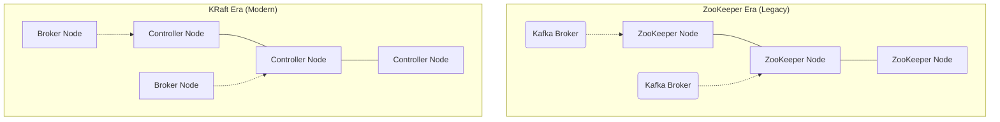

Khác với các hệ thống Message Queue truyền thống [như RabbitMQ hay ActiveMQ] hoạt động theo mô hình *Smart Broker - Dumb Consumer* (Broker chịu trách nhiệm quản lý trạng thái của từng message), Apache Kafka được thiết kế dưới dạng **Distributed Commit Log** dựa trên cơ chế **Dumb Broker - Smart Consumer**. 

Việc chuyển dịch trách nhiệm quản lý state (offset đọc) từ Broker sang Consumer giúp Kafka đạt được Throughput (lưu lượng) khổng lồ. Tuy nhiên, nó cũng đẩy những rủi ro vận hành (như *Consumer Lag*, *Rebalance Storms*) về phía ứng dụng của bạn. Dưới góc nhìn kiến trúc hệ thống, Kafka không đơn thuần là một hệ thống truyền tin, nó là một nền tảng **Log-centric Storage**.

---

## 1. Kiến trúc Vật lý: Bí Ẩn Hiệu Năng (Zero-Copy & Page Cache)

Linh hồn của Kafka (điều giúp LinkedIn có thể xử lý hàng nghìn tỷ sự kiện mỗi ngày) nằm ở cách nó tương tác với đĩa cứng và bộ nhớ vật lý của hệ điều hành. 

### 1.1. Append-Only Log và Sequential I/O
Mỗi Topic trong Kafka được chia thành nhiều Partition. Dưới mức vật lý (Filesystem), mỗi Partition là một thư mục, chứa chuỗi các tệp **Log Segments** (thường là `1GB` mỗi file).


*Hình 1: Cấu trúc Append-Only Log của Kafka. Dữ liệu mới luôn được ghi vào cuối Log.*

- Dữ liệu luôn được **append (nối thêm)** vào cuối segment file đang mở (Active Segment).
- Thiết kế Append-only loại bỏ hoàn toàn Random I/O (I/O ngẫu nhiên) - nguyên nhân chính gây thắt cổ chai ở các database truyền thống (như B-Tree). Trong khoa học máy tính, **Sequential Write (Ghi tuần tự) trên đĩa cơ HDD đôi khi có thể nhanh hơn Random Write trên ổ SSD cứng**.

### 1.2. Kiến Trúc Zero-Copy (Chống Phân Mảnh CPU)
Trong mô hình Web Server thông thường, khi đọc file từ ổ cứng rồi gửi qua mạng, dữ liệu sẽ phải trải qua 4 lần copy:
`Disk -> Kernel Buffer -> User-space Application (JVM) -> Socket Buffer -> Network Card (NIC)`.
Quá trình này tốn cực kỳ nhiều CPU cycles để Context Switch (chuyển đổi ngữ cảnh) giữa Kernel mode và User mode.

**Kafka tối ưu hóa bằng `sendfile()` system call (Cơ chế Zero-Copy):**
1. Dữ liệu từ đĩa được OS nạp thẳng vào **Page Cache** (RAM của Kernel).
2. Khi Consumer yêu cầu dữ liệu, OS DMA engine đẩy thẳng dữ liệu từ Page Cache sang Network Interface Card (NIC) buffer.
3. Không có bất kỳ byte nào bị copy lên User Space (JVM). 
**Kết quả:** Kafka gần như không dùng đến JVM Heap Memory. Điều này ngăn chặn triệt để tình trạng **JVM OOMKilled** hay Garbage Collection (GC) Pauses dài, giúp hệ thống truyền tải hàng Gbps mà CPU chỉ chạy ở mức 5%.

---

## 2. Kiến trúc Đồng thuận: Từ ZooKeeper đến KRaft

Trước phiên bản 2.8.0, Kafka phụ thuộc vào một cluster **Apache ZooKeeper** riêng biệt để lưu trữ Metadata (danh sách topic, broker nào còn sống, ai là Leader). Sự phân tách này là nỗi ác mộng vận hành (phải maintain 2 hệ thống phân tán khác nhau) và thường tạo ra lỗi "Split-brain" khi Controller của Kafka và ZooKeeper bị lệch pha.

**Giao thức KRaft (Kafka Raft)** ra đời để đưa quá trình đồng thuận (Consensus) vào chính nội tại của Kafka.



- Trong chế độ KRaft, một metadata topic đặc biệt tên là `@metadata` đóng vai trò như một luồng sự kiện duy nhất lưu trữ toàn bộ cấu hình hệ thống.
- Các node chạy ở chế độ `controller` sẽ bầu ra Leader thông qua thuật toán **Raft**.
- **Trade-off:** Sự chuyển đổi này giúp Kafka mở rộng lên hàng triệu partition mà không bị nghẽn cổ chai ở ZooKeeper, đồng thời giảm đáng kể độ trễ khởi động khi Failover (từ vài phút xuống còn vài mili-giây). Đổi lại, kỹ sư phải học lại toàn bộ bộ công cụ CLI quản trị mới.

---

## 3. Độ bền bỉ (Durability) và Cấu hình Thực chiến

Mặc định, Kafka cấu hình theo thiên hướng High Availability (chấp nhận mất mát dữ liệu nhỏ để giữ latency cực thấp). Tuy nhiên, trong ngành tài chính (Core Banking, Payment), dữ liệu không được phép mất. Để đạt được "Zero Data Loss", bạn phải đánh đổi Throughput.

Dưới đây là tổ hợp cấu hình bắt buộc cho hệ thống **Mission-Critical**:

```properties
# 1. Cấu hình phía Broker [server.properties]
default.replication.factor=3
min.insync.replicas=2
unclean.leader.election.enable=false

# 2. Cấu hình phía Producer
acks=all
enable.idempotence=true
max.in.flight.requests.per.connection=5
```

**Phân tích đánh đổi (Trade-off):**
- `acks=all` (hoặc `-1`): Producer gửi lệnh Write và bị block (chờ đợi) cho đến khi toàn bộ số node nằm trong danh sách **ISR (In-Sync Replicas)** báo cáo đã ghi xong xuống đĩa. *Đánh đổi: Latency tăng gấp 2-3 lần so với `acks=1`.*
- `min.insync.replicas=2`: Yêu cầu ít nhất 2 broker (Leader và 1 Follower) phải còn sống và đồng bộ. Nếu 2/3 node chết, Producer sẽ nhận lỗi `NotEnoughReplicasException`. Hệ thống chủ động **hy sinh Availability để bảo vệ Consistency**.

---

## 4. Rủi ro Vận hành: Những sự cố kinh điển

### 4.1. The Rebalance Storm (Bão Cân bằng tải)
Trong một Consumer Group, nếu một instance chết, Coordinator của Kafka sẽ kích hoạt tiến trình **Rebalance**: Tạm dừng (Stop-the-world) toàn bộ consumer khác, thu hồi tất cả partition và chia lại từ đầu.

**Sự cố:** Nếu một consumer bị kẹt CPU (chạy vòng lặp tính toán quá lâu) và bỏ lỡ nhịp `heartbeat` gửi về broker, nó bị coi là đã chết. Rebalance xảy ra. Sau khi rebalance xong, consumer kia lại hoàn thành việc tính toán, join lại group -> Lại Rebalance. Tiến trình này lặp lại liên tục gây tê liệt toàn bộ luồng xử lý (Rebalance Storm).
**Cách khắc phục:** 
- Nâng cấp lên Kafka 2.4+ để sử dụng **Incremental Cooperative Rebalancing** (Chỉ thu hồi các partition bị ảnh hưởng).
- Tách biệt Thread fetch dữ liệu (luôn chạy để giữ heartbeat) và Thread xử lý logic.
- Tăng `max.poll.interval.ms` lớn hơn tổng thời gian xử lý tối đa của một batch.

### 4.2. Bài toán Scale-out Cứng nhắc
Khi một Topic nhận được một cú Spike (tăng vọt) traffic, Consumer không kịp xử lý dẫn đến **Consumer Lag**. 
Nhiều Data Engineer cố gắng khắc phục bằng cách tăng (scale-out) thêm Consumer Instances. Tuy nhiên, theo thiết kế của Kafka, **số lượng Consumer đang chạy tối đa KHÔNG ĐƯỢC vượt quá số lượng Partition**. Các Consumer dư thừa sẽ ở trạng thái **IDLE** (vô dụng). 
Bạn bắt buộc phải tăng số lượng Partition trước. Nhưng việc chia quá nhiều Partition lại làm bành trướng kích thước Metadata của Controller, dẫn đến tốn file descriptors và chậm quá trình Leader Election. Đây là giới hạn vật lý kinh điển của Kafka.

---

## 5. Hệ Sinh Thái (The Confluent Ecosystem)


1. **Kafka Connect:** Framework chuyên biệt Ingestion/Egestion (Kéo/Đẩy). Không cần tự viết code Python/Java, ta dùng JSON configs để đẩy dữ liệu CDC từ Postgres vào Kafka (Debezium) hoặc đẩy ra S3.
2. **Kafka Streams:** Thư viện tính toán Stateful. Để chống mất State khi Node bị Crash (RAM bị xóa sạch), nó sử dụng **RocksDB** ghi trạng thái trung gian (Local State) xuống đĩa cục bộ, đồng thời backup state này lên một Changelog Topic trên cụm Kafka.
3. **Schema Registry:** Chốt chặn an toàn (Gatekeeper) định dạng Avro/Protobuf. Ép Producer và Consumer phải tuân thủ schema nghiêm ngặt, chặn đứng rủi ro "Poison Pill" [message rác làm sập downstream pipelines].

## Nguồn Tham Khảo (References)
* [Apache Kafka Official Documentation - Design](https://kafka.apache.org/documentation/#design)
* [Confluent: Why ZooKeeper Was Replaced with KRaft](https://www.confluent.io/blog/why-kafka-is-moving-to-kraft/)
* [LinkedIn Engineering: Optimizing Kafka for the Cloud (Zero Copy)](https://engineering.linkedin.com/blog/topic/kafka)
* *Designing Data-Intensive Applications* - Martin Kleppmann (Chương 11: Stream Processing).
