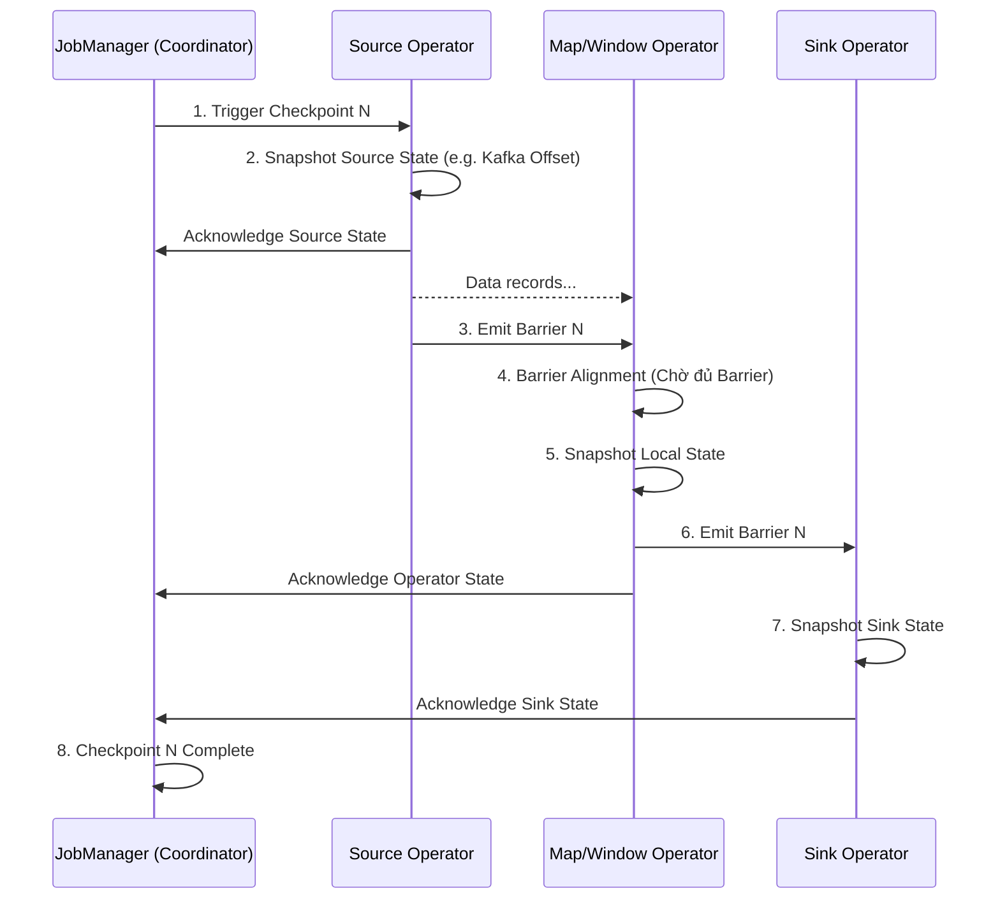
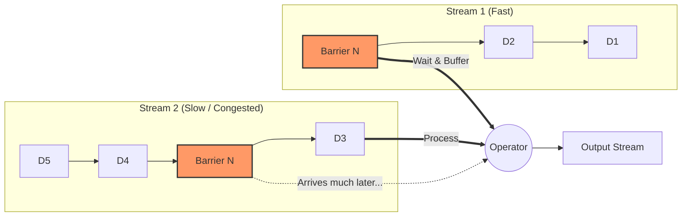

Thuật toán **Chandy-Lamport** là một nền tảng kinh điển trong khoa học máy tính phân tán, được phát minh bởi K. Mani Chandy và Leslie Lamport vào năm 1985. Mục đích chính của thuật toán này là ghi lại **trạng thái toàn cục nhất quán (Consistent Global State)** của một hệ thống phân tán mà không cần phải "dừng thế giới" (stop-the-world) hoặc gián đoạn hoạt động của hệ thống.

Trong bối cảnh Data Engineering hiện đại, đặc biệt ở các nền tảng xử lý luồng thời gian thực (Real-time Stream Processing) như Apache Flink, ý tưởng từ thuật toán này đã được tùy biến để tạo nên cơ chế **Checkpointing** vô cùng mạnh mẽ. Nó là hạt nhân giúp hệ thống có khả năng tự phục hồi sau lỗi (Fault Tolerance) và đảm bảo tính toán chính xác đúng một lần (**Exactly-Once Semantics**).

---

## 1. Bài Toán: Vì Sao Cần Distributed Snapshot?

Trong một ứng dụng xử lý luồng (Stream Processing) có trạng thái (stateful), luồng dữ liệu (data stream) chảy không ngừng qua các node xử lý (operators). Mỗi operator có thể duy trì các trạng thái (state) cục bộ, ví dụ như:
- Tổng số tiền giao dịch của mỗi user trong ngày.
- Số lượng event đã đếm được trong một khoảng thời gian (Window).
- Các mô hình Machine Learning đang được cập nhật online.

Nếu một node bị sập (crash) hoặc mạng gặp sự cố, ta cần khôi phục lại toàn bộ hệ thống về một thời điểm trong quá khứ một cách đồng bộ để hệ thống có thể chạy tiếp mà không làm mất dữ liệu (data loss) hay tính toán dư thừa (duplicate computation).

Việc chụp ảnh trạng thái (snapshot) của một máy tính đơn lẻ khá đơn giản. Tuy nhiên, trong một hệ thống phân tán:
- Hệ thống gồm hàng chục, hàng trăm node xử lý song song.
- Mỗi node có clock (đồng hồ) riêng, không đồng bộ tuyệt đối.
- Luôn có những dữ liệu (messages/records) đang bay lơ lửng trên mạng giữa các node (in-flight data).

Làm thế nào để chụp lại được trạng thái của toàn bộ các node cộng với các dữ liệu đang truyền tải để tạo thành một "bức ảnh" nhất quán? Đó là lý do Chandy-Lamport ra đời.

---

## 2. Thuật Toán Chandy-Lamport Nguyên Thủy

Thuật toán Chandy-Lamport định nghĩa trạng thái của toàn bộ hệ thống bao gồm hai thành phần:
1. **Local State (Trạng thái cục bộ):** Bộ nhớ và trạng thái của từng process (node).
2. **Channel State (Trạng thái kênh truyền):** Các thông điệp đã được node này gửi đi nhưng node kia chưa nhận được.

### Giả định của hệ thống
- Kênh truyền tin cậy (reliable) và giữ nguyên thứ tự tin nhắn (FIFO - First In First Out).
- Đồ thị kết nối các process là liên thông mạnh (strongly connected).
- Quá trình chạy snapshot không làm dừng hệ thống (Non-blocking).

### Cơ chế hoạt động: Marker Message
Thuật toán sử dụng một loại thông điệp đặc biệt gọi là **Marker** (Điểm đánh dấu). Marker không chứa dữ liệu xử lý, nó chỉ đóng vai trò phân chia ranh giới dòng dữ liệu: phần dữ liệu thuộc về bản snapshot hiện tại, và phần dữ liệu thuộc về bản snapshot tiếp theo.

Quá trình chạy của thuật toán tuân theo 2 quy tắc chính:

**1. Quy tắc Gửi Marker (Marker Sending Rule):**
Một process $P$ tự ý (hoặc được yêu cầu) bắt đầu snapshot:
- Process $P$ ghi lại (snapshot) Local State của chính nó.
- Ngay sau đó, trước khi gửi thêm bất kỳ thông điệp dữ liệu nào khác, $P$ gửi một **Marker** ra tất cả các kênh (channels) đầu ra của nó.

**2. Quy tắc Nhận Marker (Marker Receiving Rule):**
Khi process $Q$ nhận được một **Marker** từ một kênh $C$ đi vào nó:
- **Nếu $Q$ CHƯA từng ghi lại Local State của mình:**
  - $Q$ lập tức ghi lại Local State của mình.
  - $Q$ ghi nhận Channel State của kênh $C$ là rỗng (empty).
  - $Q$ lập tức gửi Marker ra các kênh đầu ra của nó (thực hiện Sending Rule).
- **Nếu $Q$ ĐÃ ghi lại Local State của mình từ trước (nghĩa là nó đã nhận Marker từ một kênh khác trước đó):**
  - $Q$ ghi lại Channel State của kênh $C$ bao gồm tất cả các thông điệp $Q$ nhận được từ $C$ tính từ lúc $Q$ đã snapshot cho đến khi nó nhận được Marker trên kênh $C$.

Kết quả cuối cùng thu được là Local State của tất cả processes và Channel State của tất cả các kênh. Một Global Snapshot hoàn chỉnh!

---

## 3. Ứng Dụng Trong Apache Flink: Asynchronous Barrier Snapshotting (ABS)

Apache Flink dựa trên nguyên lý của Chandy-Lamport nhưng tối ưu lại cho mô hình Đồ thị Luồng Dữ liệu (Directed Acyclic Graph - DAG). Biến thể này được gọi là **Asynchronous Barrier Snapshotting (ABS)**.

Trong Flink, các "Marker" được gọi là **Barriers** (Rào chắn). Barriers được tiêm (inject) vào nguồn dữ liệu (Source) và chảy xuyên suốt qua hệ thống cùng với các records.

### Quá trình Checkpoint của Flink diễn ra như thế nào?

1. **Trigger:** `JobManager` (đóng vai trò Coordinator) phát lệnh yêu cầu một checkpoint mới với ID N.
2. **Source Checkpoint:** Các node `Source` ghi lại vị trí đọc dữ liệu hiện tại (ví dụ: partition offsets của Kafka), lưu trữ lại. Sau đó, Source sẽ chèn `Barrier N` vào dòng chảy đầu ra.
3. **Barrier Propagation & Alignment (Căn chỉnh Barrier):**
   - Khi một Operator có nhiều luồng đầu vào (ví dụ: node thực hiện `Join` hoặc xử lý dữ liệu sau `keyBy`), nó sẽ nhận được Barrier từ nhiều nơi với tốc độ khác nhau.
   - Operator này bắt buộc phải làm thao tác **Alignment (Căn chỉnh)**: Nó chờ để nhận đủ `Barrier N` từ **TẤT CẢ** các luồng đầu vào.
   - Khi luồng 1 gửi Barrier tới trước, Operator chặn luồng 1 lại (không xử lý tiếp records sau Barrier N) và lưu chúng vào bộ đệm (buffer). Trong lúc đó, Operator vẫn tiếp tục xử lý các records từ luồng 2 chưa có Barrier.
4. **Snapshotting:** Ngay khi nhận đủ `Barrier N` từ mọi input, Operator tiến hành snapshot lại Local State của chính nó (ví dụ: sum, window state) và lưu xuống Durable Storage (như HDFS, S3).
5. **Forwarding:** Operator giải phóng các dữ liệu đang bị buffer và phát `Barrier N` xuống các node bên dưới (downstream).
6. **Acknowledge:** Operator báo cáo với `JobManager` rằng nó đã xong nhiệm vụ đối với Checkpoint N. Khi tất cả các operators báo cáo hoàn tất, Checkpoint N được xem là thành công (Completed).

### Sự khác biệt cốt lõi: Không cần lưu Channel State!

Thuật toán gốc phải lưu In-flight data (Channel State). Tuy nhiên, nhờ cơ chế **Barrier Alignment**, Flink đảm bảo rằng: Ngay tại thời điểm Operator chụp ảnh, nó đã xử lý xong toàn bộ các sự kiện xảy ra **trước** Checkpoint N trên mọi kênh, và chưa đụng chạm đến bất kỳ sự kiện nào xảy ra **sau** Checkpoint N. 
Do vậy, Flink **KHÔNG CẦN** lưu trạng thái luồng tin nhắn đang bay trên mạng, giúp thu nhỏ đáng kể dung lượng Checkpoint và giảm thiểu overhead I/O.

---

## 4. Barrier Alignment và Vấn Đề Backpressure

Tuy cơ chế Căn chỉnh Barrier đem lại lợi thế về kích thước snapshot, nó gặp phải một vấn đề lớn ở quy mô lớn: **Backpressure (Nghẽn cổ chai)** và **Data Skew (Lệch dữ liệu)**.

Khi có một luồng chạy rất chậm (Stream 2), luồng nhanh (Stream 1) truyền Barrier tới sớm sẽ bị chặn lại để chờ. Toàn bộ record sau Barrier của Stream 1 phải dồn vào Buffer. Nếu mạng lưới đang bị Backpressure nặng:
- Khối lượng dữ liệu bị buffer sẽ gây tràn RAM (OOM).
- Thời gian chờ Alignment quá dài khiến Checkpoint bị Timeout và đánh dấu là Thất bại (Failed).
- Vì quá trình Checkpoint không thành công, nếu có sự cố xảy ra ngay lúc đó, hệ thống sẽ phải phục hồi từ một Checkpoint rất cũ, dẫn đến việc tính toán lại một lượng khổng lồ dữ liệu.

---

## 5. Unaligned Checkpoints: Trở Về Nguyên Bản

Để giải quyết tình trạng trên, từ phiên bản 1.11, Apache Flink đã giới thiệu tính năng **Unaligned Checkpoints (Checkpoint không căn chỉnh)**. Giải pháp này đưa Flink quay trở lại gần sát hơn với nguyên bản của Chandy-Lamport:

1. Operator **không cần chờ** đủ các Barrier từ mọi kênh. Ngay khi nhận được Barrier đầu tiên từ bất kỳ kênh nào, nó lập tức kích hoạt Snapshot.
2. Nó cũng **không chặn (block)** luồng đã nhận Barrier. Nó forward Barrier xuống downstream ngay lập tức.
3. Bù lại, Operator phải ghi lại (snapshot) **TOÀN BỘ In-flight Data (Channel State)** bao gồm:
   - Các bản ghi đang tắc nghẽn trong các luồng chưa nhận được Barrier (những dữ liệu thuộc về quá khứ nhưng đến chậm).
   - Các bản ghi đã xử lý xong nhưng đang bị nghẽn trong Output Buffers gửi xuống hạ nguồn.

**Đánh đổi (Trade-off):**
- **Ưu điểm:** Khắc phục hoàn toàn việc Checkpoint bị block do Backpressure. Thời gian tạo Checkpoint diễn ra rất nhanh và ổn định, bất chấp network nghẽn.
- **Nhược điểm:** Kích thước bản Checkpoint tăng vọt do chứa một lượng lớn dữ liệu In-flight data. Khi hệ thống cần khôi phục (Recovery), nó sẽ phải nạp lại toàn bộ State này, tốn nhiều thời gian hơn so với Aligned Checkpoint.

---

## Tổng Kết

Thuật toán Chandy-Lamport là một ví dụ tuyệt vời về việc áp dụng lý thuyết máy tính kinh điển vào các công nghệ dữ liệu mũi nhọn. Bằng cách hiểu cơ chế nguyên thủy và cách Flink ứng dụng Asynchronous Barrier Snapshotting, Data Engineer có thể nắm rõ được cách các cỗ máy Stream Processing đạt được tính năng **Fault Tolerance** và **Exactly-Once**. Đồng thời, chúng ta cũng có cơ sở để cấu hình, tối ưu hóa quá trình Checkpointing thông qua việc bật/tắt `Unaligned Checkpoints` một cách phù hợp với bài toán thực tế của hệ thống.

---

## Tài Liệu Tham Khảo
* [Apache Flink Architecture - Flink Documentation](https://nightlies.apache.org/flink/flink-docs-stable/)
* [Stateful Stream Processing with RocksDB - Flink Forward](https://flink-forward.org/)
* Distributed Snapshots: Determining Global States of Distributed Systems - K. Mani Chandy, Leslie Lamport (1985)
* **Streaming Systems: The What, Where, When, and How of Large-Scale Data Processing - Tyler Akidau**
* [Exactly-Once Semantics in Apache Kafka - Confluent Blog](https://www.confluent.io/blog/exactly-once-semantics-are-possible-heres-how-apache-kafka-does-it/)
