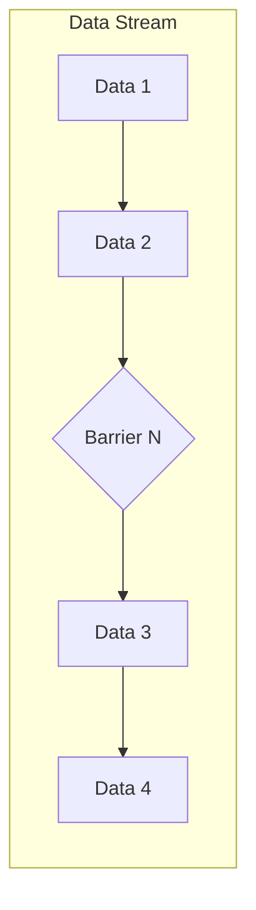
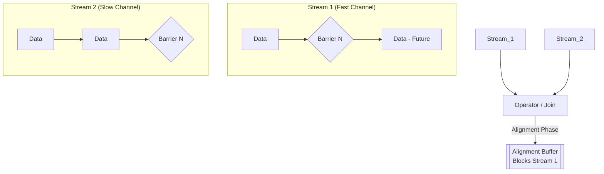

Thuật toán **Chandy-Lamport** (phát minh năm 1985) là nền tảng toán học kinh điển cho phép ghi lại **trạng thái toàn cục nhất quán (Consistent Global State)** của một hệ thống phân tán mà không cần phải đóng băng toàn bộ hệ thống (Stop-the-world). 

Trong bối cảnh Data Engineering, đặc biệt là Stateful Stream Processing (Apache Flink), ý tưởng này được tái thiết kế thành kiến trúc **Asynchronous Barrier Snapshotting (ABS)**. Đây là hạt nhân kỹ thuật (Core Engine) giúp Flink có khả năng tự phục hồi (Fault Tolerance) và đạt được mức độ nhất quán **Exactly-Once Semantics** ngay cả khi các Node vật lý (TaskManagers) bị Crash, rớt mạng, hoặc Data Center cúp điện.

Bài viết này mổ xẻ sâu vào cơ chế vật lý của Checkpointing trong Flink, các sự cố vận hành điển hình (như OOMKilled do Data Skew), và sự đánh đổi (Trade-offs) khốc liệt giữa Aligned và Unaligned Checkpoints.

---

## 1. Kiến trúc Thực thi Vật lý (Physical Execution)

Trong một hệ thống phân tán khổng lồ, luồng dữ liệu (Data Stream) chảy liên tục qua hàng trăm Node. Bài toán hóc búa đặt ra là: Làm sao để "chụp ảnh" [Snapshot] toàn bộ các trạng thái tính toán ở một thời điểm $T$, khi mà mỗi Node có một xung nhịp (Clock) riêng và luôn có dữ liệu đang lơ lửng, bay trên đường truyền mạng (In-flight data)?

Thuật toán Chandy-Lamport gốc định nghĩa trạng thái hệ thống gồm 2 phần: **Local State** (Trạng thái nằm trên RAM/Disk của Node) và **Channel State** (Dữ liệu đang kẹt trong Network Buffers giữa các Node). Tuy nhiên, nếu phải lưu toàn bộ Channel State, hệ thống sẽ sụp đổ dưới gánh nặng Disk I/O khổng lồ. 

Apache Flink đã giải quyết bài toán này cực kỳ thông minh bằng **Checkpoint Barriers** và **Alignment**.

### 1.1. Cơ chế Barrier Injection (Bơm Rào Chắn)

Thay vì gửi đi một thông điệp Marker ngẫu nhiên gây nhiễu loạn, Flink's JobManager (Coordinator Node) sẽ định kỳ tiêm (Inject) các **Barriers** (Rào chắn) vào trực tiếp từ các Data Sources (ví dụ: Kafka Consumers). Các Barriers này chảy xuôi dòng (Downstream) cùng với luồng dữ liệu bình thường.



Barrier đóng vai trò chia tách nghiêm ngặt không gian thời gian của dữ liệu: 
- Tất cả records nằm **trước** Barrier $N$ thuộc về bản Snapshot $N$.
- Tất cả records nằm **sau** Barrier $N$ thuộc về bản Snapshot $N+1$.

### 1.2. Barrier Alignment (Căn chỉnh Rào Chắn]

Sự phức tạp bùng nổ khi một Operator (như `Window` hoặc `Join`) nhận dữ liệu từ nhiều luồng khác nhau (ví dụ: sau một thao tác `keyBy` dẫn đến Network Shuffle). Flink bắt buộc phải thực hiện **Barrier Alignment** để đảm bảo tính nhất quán.



1. Khi Operator nhận được Barrier $N$ từ một luồng (ví dụ Stream 1 - Fast Channel), nó **Bắt buộc phải dừng xử lý** mọi records tiếp theo từ luồng này.
2. Các records đến sớm của luồng 1 (thuộc về tương lai của Snapshot $N+1$) sẽ bị đẩy vào một bộ đệm (Alignment Buffer) trên RAM.
3. Operator tiếp tục xử lý dữ liệu từ Stream 2 (Slow Channel) cho đến khi nhận ĐỦ Barrier $N$ từ **TẤT CẢ** các luồng đầu vào.
4. Ngay khi nhận đủ Barriers, nó tiến hành Dump toàn bộ **Local State** (Ví dụ: Biến đếm, Kafka Offsets) xuống một Distributed File System (như Amazon S3, GCS, HDFS) thông qua RocksDB State Backend.
5. Cuối cùng, nó phát (Emit) Barrier $N$ xuống các Node hạ nguồn (Downstream) và giải phóng Alignment Buffer để xử lý tiếp dữ liệu tương lai.

**Hệ quả thiết kế (Design Consequence):** Bằng cách chặn (Block) luồng đến sớm, Flink đảm bảo tuyệt đối không có record nào của tương lai bị xen lẫn vào Snapshot hiện tại. Nhờ vậy, Flink **Hoàn toàn KHÔNG cần lưu Channel State**. Kích thước Checkpoint được tối giản tối đa.

---

## 2. Rủi ro Vận hành: The Alignment Bottleneck

Mặc dù Barrier Alignment tối ưu hóa triệt để I/O Storage, nó lại bộc lộ tử huyệt (Achilles' heel) khi triển khai ở quy mô siêu lớn (High-throughput) kết hợp với **Data Skew** (Lệch dữ liệu) hoặc **Backpressure** (Nghẽn cổ chai mạng).

### Sự cố Thực tế (Real-world Incident): OOMKilled & Checkpoint Timeout

**Kịch bản:** Bạn có một cluster Flink đọc từ Kafka. Một Partition Kafka (giả sử chứa dữ liệu của một Tenant lớn nhất hệ thống) gặp lượng dữ liệu tăng đột biến (Traffic Spike). Task Manager phụ trách Partition đó bị quá tải (Slow Channel). Trong khi đó, các Partition khác vẫn chạy cực kỳ nhanh (Fast Channels).

**Phân tích lỗi (Troubleshooting):**
1. Barrier từ Fast Channels đến Operator trước. Operator buộc phải "phanh" các kênh này lại và lưu records tương lai vào RAM (Alignment Buffer).
2. Vì Slow Channel kẹt do Backpressure, Barrier của nó đến rất trễ (có thể trễ hàng phút).
3. Trong lúc chờ đợi sự đến chậm của Barrier kia, Fast Channels tiếp tục bơm hàng triệu records vào Alignment Buffer. 
4. **Hậu quả 1:** Vượt quá giới hạn Heap Memory. Bộ dọn rác (Garbage Collector) chạy liên tục. JVM ném lỗi `java.lang.OutOfMemoryError` (OOMKilled), sập Container/Pod.
5. **Hậu quả 2:** Thời gian chờ quá ngưỡng cấu hình `checkpointTimeout` -> Checkpoint liên tục bị Failed. Khi hệ thống sập và cần phục hồi, nó phải lùi về một Checkpoint cực kỳ cũ, dẫn đến việc tính toán lại (Replay) lượng dữ liệu khổng lồ, khiến Backpressure càng tồi tệ hơn. Đây gọi là **Death Spiral** (Vòng xoáy tử thần).

---

## 3. Unaligned Checkpoints: Đánh đổi I/O để lấy Stability

Để phá vỡ "Vòng xoáy tử thần" do Backpressure gây ra, từ phiên bản 1.11, Flink giới thiệu tính năng **Unaligned Checkpoints (UC)**. Thiết kế này quay trở lại bản gốc của thuật toán Chandy-Lamport: **Chấp nhận lưu trữ Channel State.**

**Cơ chế hoạt động của Unaligned Checkpoint:**
1. Khi Operator nhận Barrier đầu tiên từ BẤT KỲ Channel nào, nó **KHÔNG CHỜ** các Channels khác.
2. Barrier này sẽ "Nhảy cóc" [Overtake] qua tất cả các records đang kẹt trong Output/Input Buffers để đi tiếp xuống hạ nguồn ngay lập tức.
3. Operator sẽ Snapshot **Local State** CỘNG VỚI toàn bộ dữ liệu đang mắc kẹt trong mạng (**In-flight Data / Channel State**).

### Đánh giá Trade-offs Hệ thống

| Tiêu chí | Aligned Checkpoints | Unaligned Checkpoints |
| :--- | :--- | :--- |
| **Tác động của Backpressure** | Tắc nghẽn Checkpoint nghiêm trọng. Dễ gây OOM. | Không bị ảnh hưởng. Checkpoint hoàn thành rất nhanh. |
| **Kích thước State Size** | Rất Nhỏ (Chỉ chứa State nghiệp vụ). |" Lớn đến Cực lớn (Phải lưu thêm Gigabytes In-flight data). "|
|" **Recovery Time (Phục hồi)** "| Nhanh. |" Rất Chậm (Phải nạp lại State và toàn bộ dữ liệu kẹt mạng). "|
| **Khuyến nghị sử dụng** | Jobs có lưu lượng ổn định, ít Data Skew. | Jobs nhạy cảm với SLA, hay bị Traffic Spikes, Cluster có tiền sử dính Backpressure. |

---

## 4. Cấu hình Thực chiến (Enterprise Production Configuration)

Để cấu hình một hệ thống Flink Checkpointing chịu tải cao, bền bỉ và không bị sập do Backpressure trong môi trường Production, đây là các cấu hình chuẩn mực bằng Java và `flink-conf.yaml`.

### 4.1. Flink Application (Java API)

Đoạn code sau kích hoạt Checkpoint định kỳ, cấu hình khả năng chịu lỗi (Tolerable Failures), và thiết lập Unaligned Checkpoints.

```java
import org.apache.flink.streaming.api.environment.StreamExecutionEnvironment;
import org.apache.flink.streaming.api.CheckpointingMode;
import org.apache.flink.streaming.api.environment.CheckpointConfig;
import org.apache.flink.streaming.api.environment.CheckpointConfig.ExternalizedCheckpointCleanup;

StreamExecutionEnvironment env = StreamExecutionEnvironment.getExecutionEnvironment();

// Kích hoạt Checkpoint mỗi 10 giây (10,000 ms) với Exactly-Once semantics
env.enableCheckpointing(10000, CheckpointingMode.EXACTLY_ONCE);

CheckpointConfig config = env.getCheckpointConfig();

// Thời gian tối đa để hoàn thành Checkpoint trước khi bị Timeout đánh fail (Vd: 3 phút)
config.setCheckpointTimeout(3 * 60 * 1000);

// Nếu một Checkpoint thất bại, Job KHÔNG BỊ FAIL (Chỉ áp dụng với các lỗi non-fatal)
config.setTolerableCheckpointFailureNumber(3);

// TỐI QUAN TRỌNG: Cho phép Job bị hủy bỏ (Canceled) vẫn giữ lại Checkpoint cuối cùng. 
// Dùng để Resume lại Job sau khi deploy version mới.
config.setExternalizedCheckpointCleanup(
    ExternalizedCheckpointCleanup.RETAIN_ON_CANCELLATION
);

// Bật Unaligned Checkpoints để đối phó triệt để với Backpressure
config.enableUnalignedCheckpoints();
```

### 4.2. Cấu hình Hạ tầng `flink-conf.yaml`

Cấu hình State Backend (sử dụng RocksDB để tránh OOM) và đường dẫn lưu trữ trên S3:

```yaml
# Thiết lập State Backend là RocksDB thay vì In-Memory (Chống OOM tuyệt đối)
state.backend: rocksdb

# Đường dẫn Object Storage (S3/GCS) để lưu Snapshot files vật lý
state.checkpoints.dir: s3://my-flink-bucket/checkpoints/
state.savepoints.dir: s3://my-flink-bucket/savepoints/

# Tối ưu hóa Disk I/O bằng Incremental Checkpoints (Chỉ lưu phần thay đổi - Deltas)
state.backend.incremental: true

# Ma thuật (Từ Flink 1.13): Alignment Timeout
# Job sẽ bắt đầu bằng Aligned Checkpoint để tiết kiệm Storage, 
# nhưng nếu phát hiện có Backpressure (quá 5 giây chưa align xong), 
# nó sẽ tự động Fallback sang Unaligned Checkpoint.
execution.checkpointing.aligned-checkpoint-timeout: 5000 ms
```

> [!TIP]
> Việc sử dụng tính năng **Alignment Timeout** [`execution.checkpointing.aligned-checkpoint-timeout`] là một Best Practice ở tầm cỡ Staff Engineer. Nó kết hợp được ưu điểm của cả hai thế giới: Giữ dung lượng Checkpoint nhỏ trong điều kiện bình thường (Aligned), nhưng lập tức bẻ lái sang Unaligned để cứu Job không bị sập khi có sự cố mạng.

---

## Nguồn Tham Khảo (References)

1. [Apache Flink Architecture: Checkpointing - Official Docs][https://nightlies.apache.org/flink/flink-docs-stable/docs/concepts/stateful-stream-processing/]
2. [Distributed Snapshots: Determining Global States of Distributed Systems - K. Mani Chandy, Leslie Lamport (1985]][https://lamport.azurewebsites.net/pubs/chandy.pdf]
3. [Unaligned Checkpoints in Apache Flink - FLIP-76][https://cwiki.apache.org/confluence/display/FLINK/FLIP-76%3A+Unaligned+Checkpoints]
4. [Streaming Systems: The What, Where, When, and How of Large-Scale Data Processing - Tyler Akidau](https://www.oreilly.com/]
