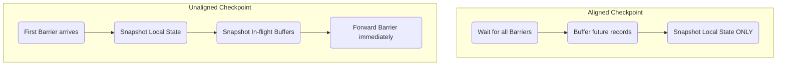

Thuật toán **Chandy-Lamport** (phát minh năm 1985) là nền tảng toán học kinh điển cho phép ghi lại **trạng thái toàn cục nhất quán (Consistent Global State)** của một hệ thống phân tán mà không cần phải thực hiện "Stop-the-world". 

Trong bối cảnh Data Engineering, đặc biệt là Stream Processing (Apache Flink), ý tưởng này được tái thiết kế thành kiến trúc **Asynchronous Barrier Snapshotting (ABS)**. Đây là hạt nhân kỹ thuật (core engine) giúp hệ thống có khả năng tự phục hồi (Fault Tolerance) và đạt được mức độ nhất quán **Exactly-Once Semantics** ngay cả khi các node vật lý bị crash hoặc mạng (network) đứt gãy.

Bài viết này mổ xẻ sâu vào cơ chế vật lý của Checkpointing trong Flink, các sự cố vận hành điển hình (như OOMKilled do Data Skew), và sự đánh đổi (Trade-offs) giữa Aligned và Unaligned Checkpoints.

---

## 1. Kiến trúc Thực thi Vật lý (Physical Execution)

Trong một hệ thống phân tán, luồng dữ liệu (Data Stream) chảy liên tục qua hàng trăm node. Bài toán đặt ra là: Làm sao để chụp ảnh (Snapshot) toàn bộ các trạng thái tính toán ở một thời điểm $T$, khi mà mỗi node có một xung nhịp (clock) riêng và luôn có dữ liệu đang lơ lửng trên mạng (In-flight data)?

Thuật toán Chandy-Lamport gốc định nghĩa trạng thái hệ thống gồm 2 phần: **Local State** (trạng thái trên RAM/Disk của node) và **Channel State** (dữ liệu đang kẹt trong Network Buffers). Tuy nhiên, lưu toàn bộ Channel State sẽ tạo ra gánh nặng I/O khổng lồ. 

Apache Flink đã giải quyết bài toán này bằng **Checkpoint Barriers**.

### Cơ chế Barrier Injection (Bơm Rào Chắn)

Thay vì gửi đi một thông điệp Marker ngẫu nhiên, Flink's JobManager (Coordinator) sẽ định kỳ tiêm các **Barriers** (Rào chắn) vào trực tiếp từ các Data Sources (ví dụ: Kafka Consumers). Các Barriers này chảy xuôi dòng (downstream) cùng với luồng dữ liệu.


*Nguồn: Apache Flink Documentation*

Barrier đóng vai trò chia tách nghiêm ngặt không gian thời gian của dữ liệu: 
- Tất cả records nằm **trước** Barrier $N$ thuộc về bản snapshot $N$.
- Tất cả records nằm **sau** Barrier $N$ thuộc về bản snapshot $N+1$.

### Barrier Alignment (Căn chỉnh Rào Chắn)

Điều gì xảy ra khi một Operator (như `Window` hoặc `Join`) nhận dữ liệu từ nhiều luồng (ví dụ sau một thao tác `keyBy` dẫn đến Network Shuffle)? Flink bắt buộc phải thực hiện **Barrier Alignment**.


*Nguồn: Apache Flink Documentation*

1. Khi Operator nhận được Barrier $N$ từ một input channel (luồng 1), nó **phải dừng xử lý** mọi records tiếp theo từ luồng này.
2. Các records đến sớm của luồng 1 sẽ bị đẩy vào một bộ đệm (Input Buffer) trên RAM.
3. Operator tiếp tục xử lý dữ liệu từ các luồng khác cho đến khi nhận ĐỦ Barrier $N$ từ **TẤT CẢ** các luồng đầu vào.
4. Ngay khi nhận đủ, nó tiến hành dump toàn bộ **Local State** xuống một Distributed File System (như Amazon S3, HDFS) bằng RocksDB.
5. Cuối cùng, nó phát (emit) Barrier $N$ xuống các node hạ nguồn và giải phóng Input Buffer của luồng 1 để xử lý tiếp.

**Hệ quả thiết kế (Design Consequence):** Bằng cách chặn (block) luồng đến sớm, Flink đảm bảo không có record nào của tương lai xen lẫn vào snapshot hiện tại. Nhờ vậy, Flink **HOÀN TOÀN KHÔNG CẦN LƯU CHANNEL STATE**. Kích thước Checkpoint được tối giản tối đa, chỉ chứa trạng thái nghiệp vụ (ví dụ: tổng tiền, Kafka Offsets).

---

## 2. Rủi ro Vận hành: The Alignment Bottleneck

Mặc dù Barrier Alignment tối ưu hóa được I/O Storage, nó lại bộc lộ tử huyệt khi triển khai ở quy mô lớn (High-throughput) kết hợp với **Data Skew** (lệch dữ liệu) hoặc **Backpressure** (Nghẽn cổ chai mạng).

### Sự cố Thực tế (Real-world Incident): OOMKilled & Checkpoint Timeout

**Kịch bản:** Bạn có một cluster Flink đọc từ Kafka. Một partition Kafka gặp lượng dữ liệu tăng đột biến (Spike) khiến Task Manager phụ trách partition đó bị chậm (Slow Channel). Trong khi đó, các partition khác vẫn chạy nhanh (Fast Channels).

**Phân tích lỗi (Troubleshooting):**
1. Barrier từ Fast Channels đến Operator trước. Operator buộc phải "phanh" các kênh này lại và lưu records vào RAM (Alignment Buffer).
2. Vì Slow Channel kẹt do Backpressure, Barrier của nó đến rất trễ (có thể trễ hàng phút).
3. Trong lúc chờ đợi, Fast Channels tiếp tục bơm dữ liệu vào Alignment Buffer. 
4. **Hậu quả 1:** Vượt quá giới hạn Heap Memory -> JVM ném lỗi `java.lang.OutOfMemoryError` (OOMKilled), sập Container/Pod.
5. **Hậu quả 2:** Thời gian chờ quá ngưỡng cấu hình `checkpointTimeout` -> Checkpoint liên tục bị Fail. Khi hệ thống sập và cần phục hồi, nó phải lùi về một Checkpoint cực kỳ cũ, dẫn đến việc tính toán lại (Replay) hàng triệu records, khiến Backpressure càng tồi tệ hơn (Death Spiral).

---

## 3. Unaligned Checkpoints: Đánh đổi I/O để lấy Stability

Để phá vỡ vòng lặp nghiệt ngã của Backpressure, từ phiên bản 1.11, Flink giới thiệu tính năng **Unaligned Checkpoints (UC)**. Thiết kế này quay trở lại gần với bản gốc của thuật toán Chandy-Lamport: **Chấp nhận lưu Channel State.**



**Cơ chế hoạt động của Unaligned Checkpoint:**
1. Khi Operator nhận Barrier đầu tiên từ BẤT KỲ channel nào, nó **không chờ** các channels khác.
2. Barrier sẽ "nhảy cóc" qua tất cả các records đang kẹt trong Output/Input Buffer để đi tiếp xuống hạ nguồn.
3. Operator sẽ snapshot **Local State** CỘNG VỚI toàn bộ dữ liệu đang mắc kẹt trong mạng (**In-flight Data / Channel State**).

### Đánh giá Trade-offs Hệ thống

| Tiêu chí | Aligned Checkpoints | Unaligned Checkpoints |
| :--- | :--- | :--- |
| **Tác động của Backpressure** | Tắc nghẽn Checkpoint nghiêm trọng. | Không bị ảnh hưởng. Checkpoint hoàn thành rất nhanh. |
| **Kích thước State Size** | Nhỏ (Chỉ chứa Business State). | Lớn đến Cực lớn (Phải lưu thêm Gigabytes data đang kẹt trong Network). |
| **Thời gian Phục hồi (Recovery Time)** | Nhanh. | Chậm hơn (Phải nạp lại State và toàn bộ dữ liệu trong Buffers). |
| **Khuyến nghị sử dụng** | Jobs có lưu lượng ổn định, ít Data Skew. | Jobs nhạy cảm với SLA, hay bị Spikes dữ liệu, Cluster dễ bị Backpressure. |

---

## 4. Cấu hình Thực chiến (Production Configuration)

Để cấu hình một hệ thống Flink Checkpointing chịu tải cao và bền bỉ trong môi trường Production, đây là các cấu hình chuẩn bằng Java và `flink-conf.yaml`.

### 4.1. Flink Application (Java / Scala)

Đoạn code sau kích hoạt Checkpoint định kỳ, cấu hình Tolerable Failures, và bật Unaligned Checkpoints.

```java
StreamExecutionEnvironment env = StreamExecutionEnvironment.getExecutionEnvironment();

// Kích hoạt Checkpoint mỗi 10 giây (10,000 ms) với Exactly-Once semantics
env.enableCheckpointing(10000, CheckpointingMode.EXACTLY_ONCE);

CheckpointConfig config = env.getCheckpointConfig();

// Thời gian tối đa để hoàn thành Checkpoint trước khi bị Timeout (Vd: 3 phút)
config.setCheckpointTimeout(3 * 60 * 1000);

// Nếu một Checkpoint thất bại, Job không bị fail (Chỉ áp dụng với các lỗi non-fatal)
config.setTolerableCheckpointFailureNumber(3);

// Cho phép Job bị hủy bỏ (Canceled) vẫn giữ lại Checkpoint cuối cùng (Để phục hồi sau này)
config.setExternalizedCheckpointCleanup(
    ExternalizedCheckpointCleanup.RETAIN_ON_CANCELLATION
);

// Bật Unaligned Checkpoints để đối phó với Backpressure
config.enableUnalignedCheckpoints();
```

### 4.2. Cấu hình Hạ tầng `flink-conf.yaml`

Cấu hình State Backend (sử dụng RocksDB) và đường dẫn lưu trữ trên S3:

```yaml
# Thiết lập State Backend là RocksDB thay vì Heap (Chống OOM)
state.backend: rocksdb

# Đường dẫn S3 để lưu Snapshot files
state.checkpoints.dir: s3://my-flink-bucket/checkpoints/
state.savepoints.dir: s3://my-flink-bucket/savepoints/

# Tối ưu hóa I/O bằng Incremental Checkpoints (Chỉ lưu phần thay đổi)
state.backend.incremental: true

# Alignment Timeout (Từ Flink 1.13): Bắt đầu bằng Aligned, 
# nhưng nếu quá 5 giây chưa xong sẽ tự động chuyển sang Unaligned Checkpoint.
execution.checkpointing.aligned-checkpoint-timeout: 5000 ms
```

> [!TIP]
> Việc sử dụng tính năng **Alignment Timeout** (`execution.checkpointing.aligned-checkpoint-timeout`) là một Best Practice hiện nay. Hệ thống sẽ cố gắng thực hiện Aligned Checkpoint để tiết kiệm dung lượng lưu trữ, nhưng nếu phát hiện có Backpressure cản trở (thời gian chờ > 5s), nó sẽ thông minh tự động fallback sang Unaligned Checkpoint để đảm bảo Checkpoint không bị fail.

---

## Nguồn Tham Khảo

1. [Apache Flink Architecture: Checkpointing - Official Docs](https://nightlies.apache.org/flink/flink-docs-stable/docs/concepts/stateful-stream-processing/)
2. [Distributed Snapshots: Determining Global States of Distributed Systems - K. Mani Chandy, Leslie Lamport (1985)](https://lamport.azurewebsites.net/pubs/chandy.pdf)
3. [Unaligned Checkpoints in Apache Flink - Flink Improvement Proposal (FLIP-76)](https://cwiki.apache.org/confluence/display/FLINK/FLIP-76%3A+Unaligned+Checkpoints)
4. [Streaming Systems: The What, Where, When, and How of Large-Scale Data Processing - Tyler Akidau](https://www.oreilly.com/library/view/streaming-systems/9781491983867/)
