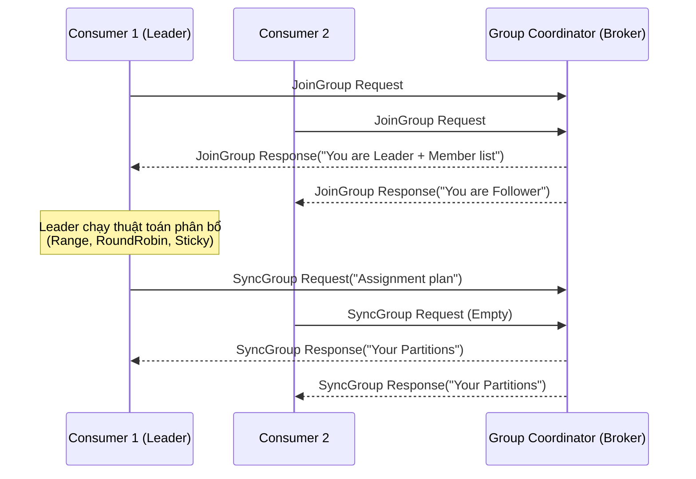

Bỏ qua các định nghĩa sách giáo khoa "Consumer Group là gì?", chúng ta sẽ mổ xẻ cơ chế hoạt động thực tế của Consumer Group trong Apache Kafka dưới góc độ thiết kế hệ thống (System Design). Làm sao Kafka đảm bảo hàng triệu message mỗi giây được xử lý song song mà không bị trùng lặp? Tại sao Consumer của bạn lại liên tục rớt mạng và gây ra *Rebalance Storm*? 

Bài viết này sẽ đi sâu vào kiến trúc thực thi vật lý, chiến lược tái cân bằng (Rebalance), và cách xử lý các sự cố production kinh điển như *Poison Pills* hay *OOMKilled*.

---

## 1. Kiến trúc Thực thi Vật lý (Physical Execution Architecture)

Sự phân chia tải trong Kafka dựa trên nguyên tắc độc quyền: **Một Partition chỉ được gắn cho tối đa MỘT Consumer trong cùng một Group tại một thời điểm.** 

Cơ chế này được quản lý bởi hai thành phần cốt lõi: **Group Coordinator** (trên Broker) và **Group Leader** (trên Client).



1. **Group Coordinator**: Một Broker được Kafka bầu ra để quản lý state của một Group cụ thể. Broker này thường là leader của partition thuộc topic `__consumer_offsets` tương ứng với hash của `group.id`.
2. **Group Leader**: Consumer đầu tiên gửi request join group sẽ được Coordinator phong làm Leader. Nó nhận danh sách toàn bộ thành viên và chịu trách nhiệm chạy thuật toán phân bổ (Partition Assignment Strategy). Việc đẩy logic phân bổ xuống client (Leader) giúp Kafka Broker không phải "hard-code" logic nghiệp vụ, dễ dàng cho phép các team tự viết Custom Assigner.

---

## 2. Các Chiến lược Rebalance (Rebalance Protocols)

Rebalance là quá trình chia lại Partitions khi có sự thay đổi về thành viên trong Group (scale up/down, crash). Đây là lúc hệ thống dễ bị tổn thương nhất.

### 2.1. Eager Rebalance (Stop-the-World)

Giao thức cổ điển (trước KIP-429). Khi có sự kiện Rebalance, **toàn bộ Consumers phải dừng xử lý (Revoke all)**, trả lại tất cả Partitions cho Coordinator, sau đó Leader chia lại từ đầu.
- **Trade-off**: Chấp nhận **Downtime 100%** trong suốt quá trình chia bài. Với các ứng dụng Stateful (ví dụ: Kafka Streams đang duy trì local RocksDB state), việc tước quyền và cấp lại gây ra độ trễ cực lớn vì phải rebuild state.

### 2.2. Incremental Cooperative Rebalancing

Ra mắt để giải quyết điểm yếu của Eager (từ KIP-429). Thay vì "cướp sạch", giao thức này chỉ **thu hồi những partitions thực sự cần thiết** để chuyển cho Consumer mới.
- Các partitions không bị ảnh hưởng vẫn được xử lý bình thường.
- Không còn hiện tượng "Stop-the-World".

### 2.3. The Next-Gen Protocol (KIP-848 / Kafka 4.0)

Một bước tiến lớn đẩy hoàn toàn logic Rebalance từ Client (Group Leader) lên **Server (Broker)** thông qua Background Threads, loại bỏ triệt để các rào cản đồng bộ hóa (synchronization barriers) ở phía client. 

---

## 3. Rủi ro Vận hành (Operational Risks) & Real-world Incidents

Dưới đây là chuỗi phản ứng dây chuyền (Cascading Failure) kinh điển khi vận hành Kafka Consumer trên môi trường Kubernetes.

### 3.1. Synchronous Processing & Session Timeout

**Triệu chứng:** Consumer xử lý message bằng cách gọi đồng bộ API ngoại bộ (ví dụ: gọi HTTP sang Microservice khác). Khi API này chậm (latency tăng vọt), thread `poll()` của Consumer bị treo (blocked).
**Hệ quả:** Nếu quá thời gian `max.poll.interval.ms` (mặc định 5 phút) mà Consumer chưa gọi `poll()` lần tiếp theo, Coordinator sẽ coi Consumer này là *Dead* (Livelock) và đuổi khỏi Group, kích hoạt Rebalance.

### 3.2. Poison Pill & Retry Storm

**Triệu chứng:** Một message bị lỗi format (schema mismatch) khiến code bắn Exception. Nếu bạn bọc trong khối `while(true) { retry() }`, Consumer sẽ kẹt vĩnh viễn ở message đó.
**Hệ quả:** Sinh ra **Consumer Lag** khổng lồ. 

**Khắc phục bằng Dead Letter Queue (DLQ):**
Tuyệt đối không retry vô hạn. Hãy giới hạn số lần retry, nếu thất bại, đẩy message lỗi sang một Topic khác (DLQ) và commit offset để đi tiếp.

```java
// Pseudo-code xử lý Poison Pill với DLQ
try {
    process(record.value());
} catch (NonTransientException e) {
    if (retryCount > MAX_RETRIES) {
        kafkaProducer.send(new ProducerRecord<>("dlq-topic", record.key(), record.value()));
        commitOffset(record); // Move on
    }
}
```

### 3.3. JVM OOMKilled & Rebalance Storm

**Triệu chứng:** Pod Kubernetes chạy Consumer bị crash với lỗi `OOMKilled`. Vừa khởi động lại xong lại chết tiếp.
**Nguyên nhân:** 
1. Consumer lấy quá nhiều dữ liệu một lúc (`max.poll.records` quá lớn).
2. Từng message có dung lượng lớn (`fetch.max.bytes`).
3. Memory leak trong quá trình Retry.
Khi Pod bị OOMKilled, Kafka kích hoạt Rebalance. Vài giây sau, Pod mới lên lại, lại trigger Rebalance. Quá trình xử lý bị đứt đoạn liên tục -> **Rebalance Storm**.

**Khắc phục (Tuning Properties):**
Ép Consumer uống từng ngụm nhỏ để không tràn RAM.

```properties
# Giảm số lượng message mỗi lần poll (Mặc định 500)
max.poll.records=100

# Giới hạn dung lượng bytes trả về trong 1 lần fetch (Mặc định 50MB, giảm xuống 10MB)
fetch.max.bytes=10485760

# Giới hạn bytes trả về CHO MỖI PARTITION (Mặc định 1MB)
max.partition.fetch.bytes=1048576

# Tránh kích hoạt Rebalance quá nhạy cảm nếu network chập chờn
session.timeout.ms=45000
heartbeat.interval.ms=15000
```

---

## 4. Đảm bảo tính toán toàn vẹn (Exactly-Once Semantics - EOS)

Khi Consumer lấy dữ liệu, xử lý xong và gọi `commitSync()`, có một "cửa sổ rủi ro" (Window of Vulnerability): Dữ liệu đã lưu vào Database, nhưng lúc gọi `commit` thì Network đứt. Lần tới poll, nó đọc lại dữ liệu cũ -> Ghi đè hoặc trùng lặp (At-least-once).

Để đạt được **Exactly-Once**, hệ thống thường phải dùng một trong hai cách:
1. **Idempotent Consumer:** Đảm bảo logic xử lý có tính lũy đẳng (Ví dụ: Dùng `UPSERT` / `SQL MERGE` thay vì `INSERT`, kết hợp với Primary Key là ID của message).
2. **Kafka Transactions:** Gói việc ghi kết quả vào Topic khác và commit offset vào chung một transaction atomic (Thường dùng trong mô hình *Consume-Transform-Produce* của Kafka Streams).

---

## Nguồn Tham Khảo (References)

1. [KIP-429: Kafka Consumer Incremental Cooperative Rebalancing](https://cwiki.apache.org/confluence/display/KAFKA/KIP-429%3A+Kafka+Consumer+Incremental+Cooperative+Rebalancing)
2. [KIP-848: The Next Generation of the Consumer Rebalance Protocol](https://cwiki.apache.org/confluence/display/KAFKA/KIP-848%3A+The+Next+Generation+of+the+Consumer+Rebalance+Protocol)
3. [Kafka Consumer OOMKilled Post-Mortems - Redpanda Engineering Blog](https://redpanda.com/blog/kafka-consumer-rebalance)
4. *Designing Data-Intensive Applications* - Martin Kleppmann (Chapter 11: Stream Processing)
5. [Confluent: Exactly-Once Semantics in Apache Kafka](https://www.confluent.io/blog/exactly-once-semantics-are-possible-heres-how-apache-kafka-does-it/)
