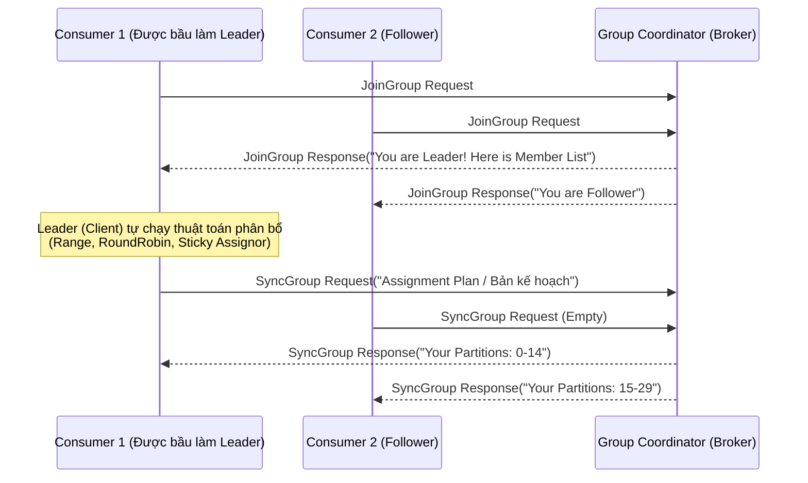

Bỏ qua các định nghĩa sách giáo khoa nhàm chán về "Consumer Group là gì?", chúng ta sẽ mổ xẻ cơ chế hoạt động thực tế của Consumer Group trong Apache Kafka dưới góc độ thiết kế hệ thống (System Design) và Vận hành (Operations). 

Làm sao Kafka đảm bảo hàng triệu message mỗi giây được xử lý song song trên hàng chục server mà không bị trùng lặp? Tại sao Consumer Pod trên Kubernetes của bạn lại liên tục rớt mạng và gây ra hiện tượng *Rebalance Storm* (Bão tái cân bằng) kinh hoàng? 

Bài viết này sẽ đi sâu vào kiến trúc thực thi vật lý, chiến lược tái cân bằng (Rebalance Protocols), và cách xử lý các sự cố production kinh điển như *Poison Pills* (Tin nhắn độc) hay *JVM OOMKilled*.

---

## 1. Kiến trúc Thực thi Vật lý (Physical Execution Architecture)

Sự phân chia tải (Load Balancing) trong Kafka dựa trên nguyên tắc **Độc quyền (Exclusivity)**: **Một Partition chỉ được gắn cho tối đa MỘT Consumer trong cùng một Group tại một thời điểm.** 

Nếu bạn có một Topic với 30 Partitions, bạn có thể spin up tối đa 30 Consumers để xử lý song song. Nếu bạn có 31 Consumers, Consumer thứ 31 sẽ ngồi chơi (Idle) không làm gì cả. Cơ chế điều phối sự độc quyền này được quản lý bởi hai thành phần cốt lõi: **Group Coordinator** (trên Server Broker) và **Group Leader** (trên Client).



1. **Group Coordinator (Server-side)**: Một Broker được Kafka bầu ra để quản lý State (Trạng thái) của một Group cụ thể. Broker này thường là Leader của partition thuộc topic ẩn `__consumer_offsets` (chứa dữ liệu commit offset của group đó).
2. **Group Leader (Client-side)**: Consumer đầu tiên gửi request `JoinGroup` sẽ được Coordinator phong làm Leader. Nó nhận danh sách toàn bộ thành viên đang sống và chịu trách nhiệm chạy thuật toán phân bổ (Partition Assignment Strategy). Việc đẩy logic phân bổ xuống client giúp Kafka Broker cực kỳ nhẹ, không tốn CPU tính toán, và cho phép các team Data Engineering tự viết Custom Assigner (Ví dụ: Ưu tiên chia partition cho các Consumer nằm cùng Rack/Availability Zone).

---

## 2. Các Chiến lược Rebalance (Rebalance Protocols)

Rebalance là quá trình "chia lại bài" (Re-assign Partitions) khi có sự thay đổi về số lượng thành viên trong Group (Scale up/down, Consumer bị crash, hoặc add thêm partition mới vào Topic). Đây là lúc hệ thống dễ bị tổn thương nhất.

### 2.1. Eager Rebalance (Kỷ nguyên "Stop-the-World")
Giao thức cổ điển (trước KIP-429). Khi có sự kiện Rebalance, **toàn bộ Consumers phải dừng xử lý (Revoke All Partitions)**, trả lại tất cả Partitions cho Coordinator, sau đó Leader chia lại từ đầu.
- **Trade-off (Sự đánh đổi):** Chấp nhận **Downtime 100%** trong suốt quá trình chia bài. Với các ứng dụng Stateful (ví dụ: Kafka Streams đang duy trì local RocksDB state có dung lượng 50GB), việc tước quyền partition và cấp lại cho node khác gây ra độ trễ cực lớn vì node mới phải rebuild toàn bộ 50GB state qua mạng.

### 2.2. Incremental Cooperative Rebalancing (Kỷ nguyên Hợp tác)
Ra mắt để giải quyết điểm yếu của Eager (từ KIP-429). Thay vì "cướp sạch", giao thức này chỉ **thu hồi những partitions thực sự cần thiết** để nhường cho Consumer mới vào.
- Các partitions không bị ảnh hưởng (thuộc về Consumer cũ) vẫn tiếp tục được Consumer đó xử lý bình thường.
- Loại bỏ hoàn toàn hiện tượng "Stop-the-World".

### 2.3. The Next-Gen Protocol (KIP-848 / Kafka 4.0)
Giao thức tương lai: Đẩy hoàn toàn logic Rebalance từ Client lên **Server (Broker) thông qua Background Threads**. Nó loại bỏ triệt để các rào cản đồng bộ hóa (synchronization barriers) ở phía client, cho phép Rebalance diễn ra ở background mà không làm gián đoạn thread `poll()` của ứng dụng.

---

## 3. Rủi ro Vận hành & Trade-offs (Real-world Incidents)

Dưới đây là chuỗi phản ứng dây chuyền (Cascading Failure) kinh điển khi vận hành Kafka Consumer trên môi trường Kubernetes, cùng cách khắc phục.

### 🚨 Sự cố 1: Livelock & Session Timeout
- **Triệu chứng:** Consumer xử lý message bằng cách gọi đồng bộ API (Synchronous HTTP Call) ngoại bộ (ví dụ: Gọi REST API sang Bank Gateway). Khi Bank API bị chậm (Latency tăng vọt từ 50ms lên 10s), thread `poll()` của Consumer bị treo cứng (blocked).
- **Cơ chế Lỗi:** Nếu quá thời gian `max.poll.interval.ms` (mặc định 5 phút) mà Consumer chưa kịp xử lý xong batch cũ để gọi `poll()` lần tiếp theo, Group Coordinator sẽ coi Consumer này đã bị "Livelock" (Sống thực vật) và thẳng tay đuổi nó khỏi Group, kích hoạt quá trình Rebalance.
- **Khắc phục:** Không bao giờ gọi API I/O blocking bên trong vòng lặp Kafka poll. Hãy sử dụng Async API hoặc đưa message vào một in-memory queue (như Disruptor) để thread pool khác xử lý, giải phóng Kafka Thread.

### 🚨 Sự cố 2: Poison Pill & Retry Storm (Cơn bão thử lại)
- **Triệu chứng:** Một message bị lỗi format (Ví dụ: Thiếu field `amount`) khiến code parsing bắn `NullPointerException`. Kỹ sư bọc code trong khối `while(true) { retry() }`. Consumer bị kẹt vĩnh viễn ở message đó.
- **Hệ quả:** Consumer Lag tăng lên hàng triệu. Hệ thống Real-time bị delay hàng ngày trời.
- **Khắc phục (Dead Letter Queue - DLQ Pattern):** Tuyệt đối không retry vô hạn. Hãy giới hạn số lần retry (Ví dụ: 3 lần), nếu thất bại, đẩy message lỗi sang một Topic khác (DLQ) và chủ động `commitOffset()` để đi tiếp.

```java
// Java snippet: Xử lý Poison Pill với DLQ
try {
    processBusinessLogic(record.value());
    kafkaConsumer.commitSync();
} catch (NonTransientException e) {
    if (retryCount > MAX_RETRIES) {
        // Ghi vào DLQ
        kafkaProducer.send(new ProducerRecord<>("tx-dlq-topic", record.key(), record.value()));
        // Commit offset để bỏ qua Poison Pill
        kafkaConsumer.commitSync(); 
    }
}
```

### 🚨 Sự cố 3: JVM OOMKilled & Rebalance Storm (Thảm họa bão Rebalance)
- **Triệu chứng:** Pod Kubernetes chạy Consumer bị crash liên tục với Exit Code 137 (`OOMKilled`). Vừa khởi động lại xong lại chết tiếp.
- **Nguyên nhân cốt lõi:** 
  1. Consumer tham lam lấy quá nhiều dữ liệu một lúc (`max.poll.records` mặc định 500, nhưng mỗi record nặng 5MB -> Tổng 2.5GB chui vào RAM -> Tràn bộ nhớ JVM).
  2. Khi Pod bị OOMKilled, Kafka kích hoạt Rebalance. Vài giây sau, K8s tạo lại Pod mới, Pod mới Join Group -> Lại kích hoạt Rebalance. Quá trình xử lý bị đứt đoạn liên tục tạo ra **Rebalance Storm**.

- **Khắc phục (Tuning Properties):** Ép Consumer "uống từng ngụm nhỏ" để bảo vệ RAM.

```java
Properties props = new Properties();
// Giảm số lượng message lấy về mỗi lần poll (Mặc định 500)
props.put(ConsumerConfig.MAX_POLL_RECORDS_CONFIG, 100);

// Giới hạn dung lượng bytes trả về trong 1 lần fetch (Mặc định 50MB, giảm xuống 10MB)
props.put(ConsumerConfig.FETCH_MAX_BYTES_CONFIG, 10485760);

// Bật Cooperative Rebalancing (Kafka 2.4+) để tránh Stop-the-world
props.put(ConsumerConfig.PARTITION_ASSIGNMENT_STRATEGY_CONFIG, 
          "org.apache.kafka.clients.consumer.CooperativeStickyAssignor");

// Tăng Heartbeat interval để tránh bị kick nhầm khi mạng chập chờn
props.put(ConsumerConfig.SESSION_TIMEOUT_MS_CONFIG, 45000);
props.put(ConsumerConfig.HEARTBEAT_INTERVAL_MS_CONFIG, 15000);
```

---

## 4. Quản lý Cơ sở Hạ tầng (Infrastructure as Code)

Để đảm bảo hiệu năng, bạn cần cấu hình Consumer Group Offsets retention hợp lý trên Server (Broker). Dưới đây là đoạn mã Terraform để cấu hình Amazon MSK (Managed Streaming for Kafka):

```hcl
resource "aws_msk_cluster" "prod_kafka" {
  cluster_name           = "prod-data-pipeline"
  kafka_version          = "3.5.1"
  number_of_broker_nodes = 6

  configuration_info {
    arn      = aws_msk_configuration.kafka_config.arn
    revision = aws_msk_configuration.kafka_config.latest_revision
  }
}

resource "aws_msk_configuration" "kafka_config" {
  name          = "prod-kafka-tuning"
  kafka_versions = ["3.5.1"]
  
  # Tuning Broker cho Consumer Group
  server_properties = <<PROPERTIES
# Lưu offset của Consumer Group trong 14 ngày (tránh mất offset nếu Consumer tắt lâu)
offsets.retention.minutes=20160
# Tránh delay khi có Consumer mới join group (mặc định 3000ms)
group.initial.rebalance.delay.ms=3000
PROPERTIES
}
```

---

## 5. Đảm bảo tính toán toàn vẹn (Exactly-Once Semantics - EOS)

Khi Consumer lấy dữ liệu, xử lý xong và gọi `commitSync()`, luôn tồn tại một "Cửa sổ rủi ro" [Window of Vulnerability]: Dữ liệu đã lưu thành công vào Database, nhưng lúc gọi `commitSync()` thì Network bị đứt. Lần tới poll, Consumer lấy lại dữ liệu cũ -> Ghi đè hoặc tính trùng lặp (At-least-once).

Để đạt được **Exactly-Once**, hệ thống Enterprise thường phải dùng một trong hai cách:
1. **Idempotent Consumer:** Đảm bảo logic xử lý có tính lũy đẳng (Ví dụ: Dùng lệnh `MERGE` / `UPSERT` thay vì `INSERT` trong cơ sở dữ liệu, kết hợp với khóa chính là Message ID).
2. **Kafka Transactions:** Gói việc ghi kết quả vào Topic thứ 2 và commit offset vào Topic `__consumer_offsets` chung một Transaction Atomic. Cả hai sẽ thành công hoặc cùng rollback (Được hỗ trợ tận răng bởi **Kafka Streams API**).

---

## Nguồn Tham Khảo (References)

1. [KIP-429: Kafka Consumer Incremental Cooperative Rebalancing](https://cwiki.apache.org/confluence/display/KAFKA/KIP-429%3A+Kafka+Consumer+Incremental+Cooperative+Rebalancing)
2. [KIP-848: The Next Generation of the Consumer Rebalance Protocol](https://cwiki.apache.org/confluence/display/KAFKA/KIP-848%3A+The+Next+Generation+of+the+Consumer+Rebalance+Protocol)
3. [Confluent Blog: Cooperative Rebalancing in Kafka Streams & ksqlDB](https://www.confluent.io/blog/cooperative-rebalancing-in-kafka-streams-consumer-ksqldb/)
4. [Redpanda Engineering Blog: Kafka Consumer OOMKilled Post-Mortems](https://redpanda.com/)
5. *Designing Data-Intensive Applications* - Martin Kleppmann (Chương 11: Stream Processing - Handling Message Loss).
