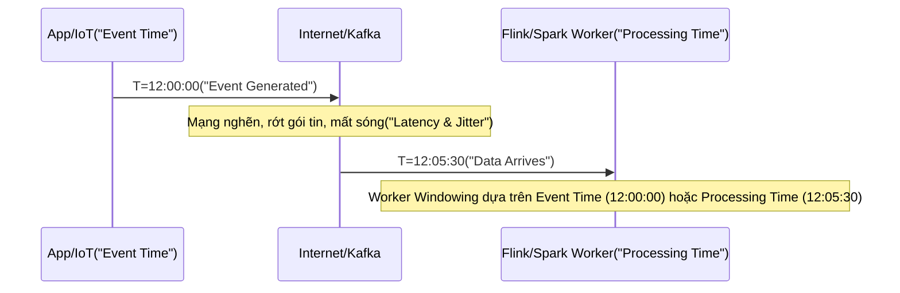

## Bản chất Vật lý của Thời gian trong Distributed Systems (The Physics of Time)

Khái niệm thời gian trong luồng dữ liệu (Stream Processing) không phải là một cột mốc tuyến tính mà bị chia cắt thành hai chiều (dimensions) do tính bất đồng bộ của mạng phân tán. Việc hiểu sai hai khái niệm này là nguyên nhân chính dẫn đến sai lệch dữ liệu khi triển khai các hệ thống Billing hoặc Real-time Analytics ở quy mô lớn.

*   **Event Time (Thời gian Sự kiện):** Thời điểm bản ghi thực sự được sinh ra tại nguồn (IoT Device, Mobile App, Database CDC). Nó là một cột Timestamp gắn cứng vào nội dung bản ghi (Payload Property). 
*   **Processing Time (Thời gian Xử lý):** Thời điểm bản ghi được CPU của Worker Node (như Flink TaskManager, Spark Executor hoặc Dataflow Worker) đọc vào bộ nhớ (Wall-clock time của Server).
*   **Ingestion Time (Thời gian Nhập):** Thời điểm bản ghi vừa đi vào hệ thống trung gian (Kafka Broker). Khái niệm này hiện rất ít được sử dụng trong các hệ thống hiện đại.



---

## Kiến trúc Thực thi Vật lý (Physical Execution)

### 1. Processing Time: Cỗ máy mù thời gian
Với Processing Time, hệ thống nhóm dữ liệu vào các cửa sổ tính toán (windows) một cách cơ học dựa vào đồng hồ cục bộ của hệ điều hành máy chủ. 

*   **Bản chất:** Node tính toán chỉ quan tâm đến `System.currentTimeMillis()`. Dữ liệu đến lúc nào thì thuộc Window của lúc đó.
*   **Chi phí:** Cực thấp (Zero State Overhead). Hệ thống không cần duy trì bộ đệm phức tạp hay chờ đợi dữ liệu đến trễ. Dữ liệu chạy qua RAM và xuất ra kết quả ngay lập tức.
*   **Hậu quả:** **Non-deterministic (Không nhất quán).** Nếu bạn re-process (chạy lại) một Kafka topic vào ngày mai, hoặc nếu Consumer bị nghẽn (`Consumer Lag`), kết quả tính toán sẽ hoàn toàn sai lệch so với lần chạy đầu tiên.

**Ứng dụng thực tiễn:** Chỉ dùng cho hệ thống Monitoring, Alerting nội bộ (CPU load, Error Rate) nơi độ trễ (latency) tính bằng mili-giây là yếu tố sống còn và việc sai lệch vài bản ghi không ảnh hưởng đến nghiệp vụ lõi.

### 2. Event Time & Watermarks: Khôi phục sự hỗn loạn
Trong các bài toán tài chính, giao dịch, kết quả phải là *Deterministic* (có thể tái lập). Bạn không thể tính thiếu tiền của User chỉ vì mạng 3G của họ chập chờn và gửi log muộn.

Event Time bù đắp độ trễ mạng bằng cách tạo ra **Watermarks** – một "chốt chặn" ảo báo hiệu mức độ tiến triển của thời gian. Khi Watermark tiến đến mức `T`, hệ thống tự tin khẳng định: *"Tôi tin rằng sẽ không còn bất kỳ sự kiện nào có Event Time < T đến hệ thống nữa. Tôi sẽ đóng Window và xuất kết quả."*

Những dữ liệu có Event Time < `T` nhưng đến hệ thống *sau* khi Watermark đã vượt qua ngưỡng `T` được gọi chung là **Late Data**.

---

## Cấu hình Watermarks Thực Chiến trên Flink & Spark

Việc thiết lập Watermark là nghệ thuật cân bằng giữa **Độ trễ đầu ra (Latency)** và **Tính chính xác (Correctness)**. 

### Ví dụ Apache Flink (Java API)
Đoạn code Java sau mô phỏng chiến lược Watermark trong Flink để xử lý Out-of-order data:

```java
// Java - Flink DataStream API
WatermarkStrategy<TransactionEvent> strategy = WatermarkStrategy
    // Chấp nhận trễ mạng (Network Lag) tối đa 20 giây trước khi tăng Watermark
    .<TransactionEvent>forBoundedOutOfOrderness(Duration.ofSeconds(20)) 
    // Lấy Event Time từ Payload của bản ghi
    .withTimestampAssigner((event, timestamp) -> event.getEventTimestamp()) 
    // Cơ chế chống Idle Partition Skew
    .withIdleness(Duration.ofMinutes(1)); 

DataStream<TransactionEvent> withWatermarks = stream.assignTimestampsAndWatermarks(strategy);
```

### Ví dụ Apache Spark Structured Streaming (PySpark)
Trên nền tảng Databricks hoặc tự build Spark, chúng ta cũng định nghĩa Watermark tương tự để giới hạn dung lượng State phải lưu trữ:

```python
# PySpark Structured Streaming
from pyspark.sql.functions import window, col

# Đọc từ Kafka
streaming_df = spark.readStream.format("kafka")...

# Khai báo Event Time cột "transaction_timestamp" và độ trễ 20 giây
watermarked_df = streaming_df \
    .withWatermark("transaction_timestamp", "20 seconds") \
    .groupBy(
        window(col("transaction_timestamp"), "5 minutes"), 
        col("user_id")
    ) \
    .sum("amount")
```

---

## Đánh đổi Hệ thống & Rủi ro Vận hành (Systemic Trade-offs)

Sự chính xác tuyệt đối của Event Time yêu cầu một cái giá đắt về mặt vật lý (Memory / Storage) và vận hành. Dưới đây là các sự cố (Real-world Incidents) phổ biến nhất ở quy mô Enterprise:

### 1. Sự phình to của State (State Bloat) và JVM OOMKilled
**Vấn đề:** Khi sử dụng Event Time kết hợp với cơ chế `Allowed Lateness` (Chấp nhận dữ liệu cực muộn sau Watermark), hệ thống buộc phải lưu giữ *toàn bộ* trạng thái của Window chưa đóng kín trong State Backend (thường là RocksDB lưu trên Disk hoặc Heap Memory của Flink/Spark).
**Hậu quả:** Nếu có hiện tượng *Cartesian Explosion* (khi JOIN nhiều luồng dữ liệu) kết hợp với Allowed Lateness lớn (ví dụ: chờ late data vài ngày), State của Job sẽ phình to đột biến. Điều này làm cạn kiệt RAM, gây ra lỗi `OOMKilled` (Out of Memory) trên các Worker Nodes, hoặc làm giảm Throughput thảm hại do hệ thống phải `Spill-to-disk` liên tục.

### 2. Sự cố "Watermark Skew" do Idle Partitions
**Vấn đề:** Trong kiến trúc phân tán như Flink, Watermark của một Operator downstream được tính bằng **giá trị nhỏ nhất (Minimum)** của tất cả các Watermarks từ các Kafka Partitions đầu vào.
**Thực tế (Real-world Incident):** Giả sử bạn có 100 Kafka partitions, nhưng có 1 partition bị "đói" (Idle) – tức là không có dữ liệu nào đổ về (do khóa Routing Key phân bổ không đều). Watermark của partition đó sẽ đứng im mãi mãi, kéo theo Watermark tổng của toàn bộ Data Job bị kẹt lại. Các Window không bao giờ được trigger, dữ liệu dồn ứ vô tận trong State cho đến khi Job crash hoàn toàn.
**Khắc phục:** Phải cấu hình `.withIdleness(Duration)` như trong code mẫu Flink ở trên. Nếu một partition không có dữ liệu sau khoảng thời gian này, hệ thống sẽ tự động gạch tên nó khỏi phép tính Watermark chung.

### 3. Xử lý Dữ liệu đến cực muộn (Side Output Routing)
Dù Watermark được tính toán tinh vi đến đâu, luôn có những log đến cực kỳ muộn (ví dụ: thiết bị IoT mất mạng 1 tháng, sau đó kết nối lại và gửi batch data khổng lồ của cả tháng lên).
Đối với kiến trúc Lambda hoặc Kappa hiện đại, luồng dữ liệu "hết hạn" này không bao giờ bị Drop [xóa bỏ]. Thay vào đó, chúng được route ra một luồng riêng gọi là `Side Output` (hoặc Dead Letter Queue) và dump thẳng xuống Data Lake (S3/GCS). Các pipeline Batch (Spark/BigQuery) sẽ lấy dữ liệu này phục vụ cho quá trình Reconciliation (Đối soát) định kỳ vào cuối tháng.

---

## So sánh Đánh đổi (Trade-off Matrix)

| Đặc tính Kiến trúc | Processing Time | Event Time |
| :--- | :--- | :--- |
| **Nguồn Timestamp** | CPU Clock của Worker (JVM/OS). |" Thuộc tính Payload (từ thiết bị nguồn). "|
|" **Chi phí State (Overhead)**"| Cực thấp (Gần như Stateless). |" Rất cao (Cần RocksDB hoặc Heap lớn lưu Window State). "|
|" **Tính Nhất quán (Determinism)**"| Non-deterministic (Phụ thuộc vào tốc độ xử lý mạng). |" Deterministic (Kết quả độc lập với tốc độ chạy pipeline). "|
|" **Khả năng Replay (Reprocessing)**"| Không thể (Replay sinh ra Window sai lệch hoàn toàn). |" Hoàn hảo (Replay sinh ra kết quả chính xác 100%). "|
|" **Độ trễ Đầu ra (Latency)**"| Zero-delay. Kết quả xuất ngay lập tức. | Luôn phải đợi một khoảng trễ do chờ Watermark đi qua. |
| **Bài toán Áp dụng** | Real-time Alerting, Anomaly Detection, DevOps Dashboards. | Billing, FinTech Analytics, User Session Tracking, Ads Attribution. |

---

## Nguồn Tham Khảo (References)
*   [Streaming 101: The world beyond batch - Tyler Akidau (O'Reilly Radar]][https://www.oreilly.com/radar/the-world-beyond-batch-streaming-101/]
*   **Streaming Systems: The What, Where, When, and How of Large-Scale Data Processing** - Tyler Akidau. *Một cuốn sách gối đầu giường về thiết kế hệ thống Streaming.*
*   [Apache Flink Official Docs - Timely Stream Processing & Watermarks][https://nightlies.apache.org/flink/flink-docs-stable/docs/concepts/time/]
*   [Spark Structured Streaming Programming Guide - Watermarking](https://spark.apache.org/docs/latest/structured-streaming-programming-guide.html#handling-late-data-and-watermarking]
