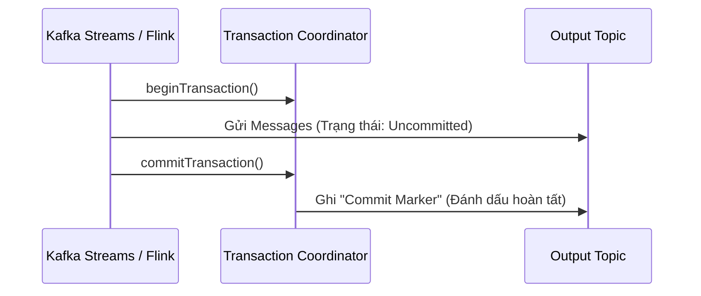
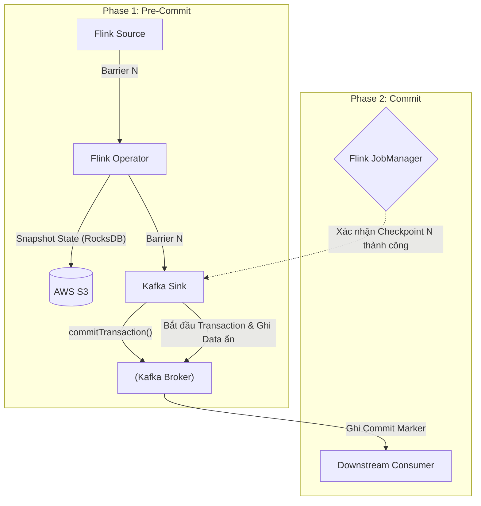

Trong các hệ thống phân tán xử lý luồng dữ liệu (Stream Processing), **Exactly-Once Semantics (EOS)** được coi là "Chén Thánh" (Holy Grail). Trong môi trường Cloud-native, việc đối mặt với sự cố là điều hiển nhiên: mất kết nối mạng, rớt packet, Container bị *OOMKilled* (Hết RAM) hay Node Crash. 

Dù hệ thống sụp đổ ở bất kỳ điểm nào, EOS đảm bảo rằng kết quả cuối cùng (State/Output) phản ánh việc mỗi thông điệp (message) được tính toán đúng **một lần duy nhất** – không thừa, không thiếu.

Đối với một Staff Data Engineer, hiểu về EOS không chỉ là thuộc lòng định nghĩa. Bạn phải nắm rõ kiến trúc thực thi vật lý (Physical Execution) đằng sau Apache Kafka, Apache Flink, cùng những cái giá cực đắt phải trả về độ trễ (Latency) và chi phí hạ tầng (FinOps) khi bật tính năng này lên.

---

## 1. Các cấp độ bảo đảm phân phối (Delivery Guarantees)

Trong kiến trúc Messaging và Stream Processing, có 3 cấp độ cam kết:

1. **At-most-once (Nhiều nhất một lần):**
   - **Bản chất:** "Gửi và Quên" (Fire and Forget). Hệ thống bắn dữ liệu đi và không chờ phản hồi (ACK).
   - **Trade-off:** Thông lượng (Throughput) cực cao, độ trễ cực thấp, nhưng có thể bị mất dữ liệu.
   - **Use-case:** Log tracking trên Web, Telemetry data (sensor nhiệt độ IoT).

2. **At-least-once (Ít nhất một lần):**
   - **Bản chất:** Gửi và chờ `ACK`. Nếu quá *Timeout* chưa thấy `ACK`, hệ thống sẽ *Retry* (gửi lại).
   - **Trade-off:** Không mất dữ liệu, nhưng có thể bị nhân đôi (Duplicate) do lỗi mạng ảo (Network Partition - tin nhắn đã tới server nhưng tín hiệu ACK bị rớt trên đường về).
   - **Rủi ro:** Gây ra hiện tượng **Retry Storms** (bão gửi lại) làm sập hệ thống hạ nguồn.

3. **Exactly-once (Chính xác một lần) / Effectively-once:**
   - **Bản chất:** Bản thân mạng lưới vật lý (TCP/IP) không thể đảm bảo một gói tin chỉ đi qua dây cáp đúng một lần. EOS ở đây là **Effectively-once** ở mức ứng dụng (Application level). Dù hệ thống có re-process (xử lý lại do Retry), kết quả cuối cùng vẫn y hệt như việc nó được xử lý một lần.
   - **Trade-off:** Đảm bảo độ chính xác 100% nhưng phải trả giá bằng hiệu năng (tăng I/O disk để ghi Log, tăng Network overhead do điều phối 2PC).
   - **Use-case:** Giao dịch tài chính (Core Banking), Thanh toán (Billing), Ad-tech (Đếm click quảng cáo).

---

## 2. Kiến trúc Thực thi Vật lý: Cỗ Máy Exactly-Once

Để đạt được EOS toàn trình (End-to-End), cả 3 thành phần của Data Pipeline (`Source -> Processor -> Sink`) phải phối hợp nhịp nhàng. Hệ thống giải bài toán này bằng 2 triết lý chính: **Tính luỹ đẳng (Idempotency)** và **Giao dịch phân tán (Distributed Transactions)**.

### 2.1. Tính Luỹ đẳng (Idempotency) ở mức Sink
Một thao tác luỹ đẳng là thao tác mà dù bạn chạy 1 lần hay 1 triệu lần, trạng thái cuối cùng của hệ thống vẫn không đổi. Trong Streaming, nếu Data Sink hỗ trợ luỹ đẳng, ta chỉ cần kết hợp luồng At-least-once là đạt được EOS.

**Ví dụ:** Xử lý luồng CDC (Change Data Capture) ghi vào Databricks Delta Lake bằng lệnh `MERGE` (Upsert).

```sql
-- Thay vì INSERT mù quáng dẫn đến duplicate rows
-- Ta sử dụng MERGE (Upsert) - một thao tác luỹ đẳng an toàn
MERGE INTO target_billing_table AS t
USING streaming_updates AS s
ON t.transaction_id = s.transaction_id
WHEN MATCHED THEN
  UPDATE SET t.amount = s.amount, t.status = s.status
WHEN NOT MATCHED THEN
  INSERT (transaction_id, amount, status) VALUES (s.transaction_id, s.amount, s.status);
```

### 2.2. Apache Kafka: Idempotent Producers & Transactions
Từ phiên bản Kafka 3.0+, tính năng này được bật mặc định.

**A. Idempotent Producer (`enable.idempotence=true`)**
Mỗi Producer khi kết nối vào Kafka Cluster được Broker cấp một **Producer ID (PID)** và một **Epoch**. Mỗi Message gửi đi mang theo một **Sequence Number** (số thứ tự) tăng dần.
- Broker duy trì trong RAM Sequence lớn nhất của từng PID.
- Nếu Producer bị rớt mạng và Retry tin nhắn cũ (Sequence $\le$ Sequence đã lưu), Broker nhận diện ngay đây là "bóng ma" (Duplicate) và vứt bỏ (Discard) một cách âm thầm, đồng thời vẫn gửi trả ACK báo thành công để xoa dịu Producer.

**B. Kafka Transactions (Giao dịch)**
Khi một luồng Flink đọc từ Topic A, tính toán, và ghi ra Topic B, quy trình này phải là nguyên tử (Atomic - Thành công tất cả hoặc thất bại tất cả).



Phía **Consumer**, khi cấu hình `isolation.level=read_committed`, nó sẽ bỏ qua mọi message chưa có Commit Marker.

### 2.3. Apache Flink: Two-Phase Commit (2PC)
Việc tính toán nội bộ của Flink an toàn (nhờ Checkpoint State) là chưa đủ, dữ liệu đẩy ra ngoài (Sink) cũng phải an toàn. Flink tích hợp Kafka Transaction API qua giao thức **Two-Phase Commit (2PC)**:



1. **Phase 1 (Pre-Commit):** Khi Kafka Sink nhận Checkpoint Barrier `N` từ JobManager, nó chuẩn bị (prepare) lưu dữ liệu vào hệ thống đích (mở Kafka Transaction) nhưng CHƯA COMMIT.
2. **Phase 2 (Commit):** Sau khi JobManager nhận được báo cáo toàn bộ cụm đã lưu State thành công lên S3, nó phát lệnh Commit. Sink sẽ gọi `commitTransaction()`. Lúc này dữ liệu mới thực sự hiển thị (Materialized) cho Consumer. Nếu Flink Crash giữa chừng, transaction đang treo sẽ bị `Abort`.

---

## 3. Rủi ro Vận hành (Operational Risks & Incidents)

Bật EOS tương đương với việc bạn ôm một quả bom nổ chậm về mặt vận hành:

### 3.1. Hiện tượng "Fenced Producer" (Zombie Writers)
Khi hệ thống mạng bị phân mảnh (Network Partition) hoặc Garbage Collection (GC) của JVM bị dừng quá lâu (Stop-the-World > 10s), Transaction Coordinator của Kafka tưởng rằng Flink TaskManager của bạn đã chết. Nó chuyển `Epoch` sang số mới cho một node thay thế. 
Khi ứng dụng cũ (Zombie) tỉnh lại sau đợt GC và cố gắng Commit dữ liệu, Broker sẽ từ chối thẳng thừng với lỗi `ProducerFencedException`.
*Cách khắc phục:* Giới hạn thời gian GC pause (dùng ZGC), tinh chỉnh `transaction.timeout.ms`, và bọc Exception để tự động Restart Pod/Container.

### 3.2. Đổ vỡ do "Poison Pill" [Crash Loop BackOff]
**Poison Pill** là các Message dị dạng (Sai schema, JSON parse error). Khi chạy EOS, luồng bị crash $\rightarrow$ Flink Restart $\rightarrow$ Flink Replay lại từ Checkpoint $\rightarrow$ Đọc lại trúng Poison Pill đó $\rightarrow$ Lại Crash. Tạo thành vòng lặp vô hạn, block toàn bộ hệ thống.
*Cách khắc phục:* Bắt buộc áp dụng **Dead Letter Queue (DLQ)**. Bọc logic Deserialize trong `try/catch`, nếu lỗi thì bắt Exception, đẩy record đó sang một Topic riêng (Kafka DLQ) và `return` bình thường để Checkpoint được tiếp tục.

---

## 4. Đánh đổi Hệ thống (Systemic Trade-offs & FinOps)

Kiến trúc sư Dữ liệu (Data Architect) cần nhớ một định luật: **Đừng bật Exactly-Once nếu không thực sự cần thiết.**

- **Độ trễ tăng vọt (Increased Latency):** Với cơ chế 2PC, Data Consumer phía sau chỉ đọc được dữ liệu khi Checkpoint hoàn tất (Do vướng Commit Marker). Nếu Checkpoint Interval của Flink là 1 phút, độ trễ hệ thống (End-to-end Latency) tối thiểu là 1 phút. Bạn chính thức mất đi tính Real-time thuần tuý.
- **Overhead Chi phí (FinOps):** Quá trình ghi WAL (Write-Ahead Logs), quản lý Transaction Coordinator, và đẩy State Snapshot lên S3 liên tục sẽ tốn hàng ngàn USD tiền I/O disk và băng thông (Data Transfer).
- **Quyết định kiến trúc:**
  - Lĩnh vực **Core Banking, Billing, Cổng thanh toán:** BẮT BUỘC dùng Exactly-Once.
  - Lĩnh vực **Trending Topics, Log Analytics, Dashboard:** Hãy dùng At-least-once. Việc sai số 0.01% do duplicate hoàn toàn vô hình với người dùng, nhưng giúp tiết kiệm 50% chi phí Compute/Storage và đạt độ trễ vài mili-giây.

## Nguồn Tham Khảo (References)
* [Confluent: Exactly-Once Semantics are Possible](https://www.confluent.io/blog/exactly-once-semantics-are-possible-heres-how-apache-kafka-does-it/)
* [Apache Flink: Fault Tolerance & Checkpointing](https://nightlies.apache.org/flink/flink-docs-stable/docs/learn-flink/fault_tolerance/)
* *Designing Data-Intensive Applications* - Martin Kleppmann (O'Reilly Media) - Chương 11.
* [Databricks Structured Streaming Exactly-Once](https://docs.databricks.com/en/structured-streaming/delta-lake)