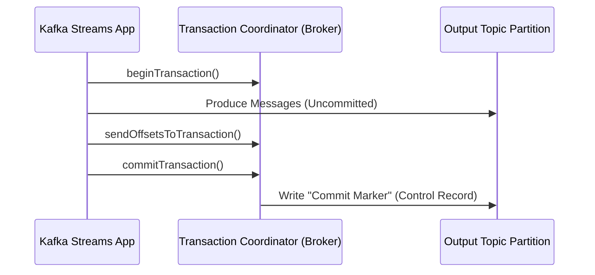

Trong các hệ thống phân tán xử lý luồng dữ liệu (Stream Processing), **Exactly-Once Semantics (EOS)** được coi là "chén thánh" (Holy Grail). Trong môi trường Cloud-native, việc đối mặt với sự cố là điều hiển nhiên: mất kết nối mạng, rớt packet, Container bị *OOMKilled* (Hết RAM) hay Node Crash. Dù hệ thống sụp đổ ở bất kỳ điểm nào, EOS đảm bảo rằng kết quả cuối cùng (State/Output) phản ánh việc mỗi thông điệp (message) được tính toán đúng **một lần duy nhất** – không thừa, không thiếu.

Đối với một Data Engineer, hiểu về EOS không chỉ là thuộc lòng định nghĩa, mà là nắm rõ kiến trúc thực thi vật lý (Physical Execution) đằng sau Apache Kafka, Apache Flink, cùng những cái giá cực đắt phải trả về độ trễ (Latency) và chi phí hạ tầng (FinOps).

---

## 1. Các cấp độ bảo đảm phân phối tin nhắn (Delivery Guarantees)

Trong kiến trúc hệ thống nhắn tin (Messaging) và xử lý luồng (Stream Processing Engine - SPE), có 3 cấp độ cam kết:

1. **At-most-once (Nhiều nhất một lần):**
   - **Bản chất:** "Gửi và Quên" (Fire and Forget). Hệ thống bắn dữ liệu đi và không chờ phản hồi (ACK).
   - **Trade-off:** Thông lượng (Throughput) cực cao, độ trễ cực thấp, nhưng chấp nhận mất dữ liệu.
   - **Use-case:** Log tracking người dùng trên web, Telemetry data (sensor nhiệt độ).

2. **At-least-once (Ít nhất một lần):**
   - **Bản chất:** Gửi và chờ `ACK`. Nếu quá *Timeout* chưa thấy `ACK`, hệ thống sẽ *Retry* (gửi lại).
   - **Trade-off:** Không mất dữ liệu, nhưng có thể bị nhân đôi (Duplicate) do lỗi mạng ảo (Network Partition - tin nhắn đã tới nhưng ACK bị rớt).
   - **Rủi ro:** Gây ra hiện tượng **Retry Storms** (bão gửi lại) làm sập hệ thống hạ nguồn.

3. **Exactly-once (Chính xác một lần) / Effectively-once:**
   - **Bản chất:** Bản thân mạng vật lý không thể đảm bảo một gói tin (TCP Packet) chỉ đi qua dây cáp đúng một lần. EOS ở đây là **Effectively-once** ở mức ứng dụng (Application level). Dù hệ thống có re-process (xử lý lại), kết quả cuối cùng (State) vẫn y hệt như việc nó được xử lý một lần.
   - **Trade-off:** Đảm bảo độ chính xác 100% nhưng phải trả giá đắt bằng hiệu năng (tăng I/O disk, tăng Network overhead do điều phối Transaction).
   - **Use-case:** Giao dịch tài chính, Billing, Ad-tech (như hệ thống đếm click quảng cáo của Uber/Netflix).

---

## 2. Kiến trúc Thực thi Vật lý: Làm sao đạt được Exactly-Once?

Để đạt được EOS toàn trình (End-to-End), cả 3 thành phần của Data Pipeline (Source $\rightarrow$ Processor $\rightarrow$ Sink) phải đồng điệu. Hệ thống hiện đại giải bài toán này bằng 2 triết lý chính: **Tính luỹ đẳng (Idempotency)** và **Giao dịch phân tán (Distributed Transactions)**.

### 2.1. Tính Luỹ đẳng (Idempotency) ở mức Sink

Một thao tác luỹ đẳng là thao tác mà dù bạn chạy 1 lần hay 1000 lần, kết quả cuối cùng vẫn không đổi. Trong Streaming, nếu Data Sink (nơi hứng dữ liệu) hỗ trợ luỹ đẳng, ta chỉ cần kết hợp với luồng **At-least-once** là đạt được EOS.

**Ví dụ:** Xử lý luồng CDC (Change Data Capture) ghi vào Delta Lake hoặc Apache Iceberg bằng lệnh `MERGE` (Upsert) qua khoá chính (Primary Key).

```sql
-- Thay vì INSERT mù quáng dẫn đến duplicate
-- Ta sử dụng MERGE (Upsert) - một thao tác luỹ đẳng
MERGE INTO target_billing_table AS t
USING streaming_updates AS s
ON t.transaction_id = s.transaction_id
WHEN MATCHED THEN
  UPDATE SET t.amount = s.amount, t.status = s.status
WHEN NOT MATCHED THEN
  INSERT (transaction_id, amount, status) VALUES (s.transaction_id, s.amount, s.status);
```

### 2.2. Apache Kafka: Idempotent Producers & Transactions

Từ phiên bản 0.11 (và mặc định từ 3.0+), Kafka hỗ trợ Native EOS thông qua hai cơ chế mấu chốt.

**A. Idempotent Producer (`enable.idempotence=true`)**
Mỗi Producer khi kết nối vào Kafka Cluster được Broker cấp một **Producer ID (PID)** và một **Epoch**. Mỗi Message gửi đi mang theo một **Sequence Number** (số thứ tự) tăng dần.
- Broker duy trì trong RAM (và Log) Sequence lớn nhất của từng PID.
- Nếu Producer bị rớt mạng và gửi lại (Retry) tin nhắn cũ (Sequence $\le$ Sequence đã lưu), Broker nhận diện ngay đây là "bóng ma" (Duplicate) và vứt bỏ (Discard) âm thầm.

**B. Kafka Transactions (Giao dịch)**
Khi một ứng dụng Stream Processing (như Kafka Streams) đọc từ Topic A, xử lý, và ghi ra Topic B, quy trình này phải là nguyên tử (Atomic).



Ở phía **Consumer**, khi cấu hình `isolation.level=read_committed`, nó chỉ đọc các bản ghi nằm trước **Commit Marker**. Các dữ liệu đang pending hoặc bị Abort sẽ bị ẩn đi (invisible).

**Cấu hình Code thực chiến (Kafka Properties):**
```properties
-- Phía Producer / Kafka Streams
enable.idempotence=true
transactional.id=billing-processor-app-1
acks=all
max.in.flight.requests.per.connection=5

-- Phía Consumer
isolation.level=read_committed
```

### 2.3. Apache Flink: State Snapshots & Two-Phase Commit (2PC)

Apache Flink thống trị Streaming nhờ kiến trúc Checkpointing phân tán dựa trên thuật toán **Chandy-Lamport**.

**A. Checkpoint Barriers & State**
JobManager định kỳ chèn các **Barriers** (Rào chắn) vào luồng dữ liệu tại Source.
- Khi một Operator (VD: Window Aggregation) nhận Barrier, nó dừng xử lý tạm thời, chụp ảnh trạng thái bộ nhớ hiện tại (State Snapshot) và đẩy xuống **State Backend** (thường là RocksDB + S3/HDFS).
- Khi tất cả Operators báo cáo đã Snapshot thành công, Checkpoint $N$ hoàn tất.

**B. Two-Phase Commit (2PC) với Sink Bên Ngoài**
Việc Flink an toàn chưa đủ, dữ liệu đẩy ra Kafka/PostgreSQL cũng phải an toàn. Flink dùng 2PC:

```mermaid
flowchart TD
    subgraph Phase 1: Pre-Commit
        S["Flink Source"] -->|Barrier N| O["Flink Operator"]
        O -->|Snapshot State to S3| O
        O -->|Barrier N| K["Kafka Sink"]
        K -->|Write data & Open Transaction| TX["(Kafka Broker)"]
    end
    
    subgraph Phase 2: Commit
        JM{"JobManager"} -.->|Notify Checkpoint N Complete| K
        K -->|commitTransaction()| TX
    end
```

1. **Pre-Commit:** Khi Sink nhận Barrier $N$, nó chuẩn bị (prepare) lưu dữ liệu vào hệ thống đích (mở Kafka Transaction) nhưng chưa Commit.
2. **Commit:** Sau khi toàn cụm xác nhận hoàn tất Checkpoint $N$, JobManager ra lệnh Commit. Lúc này dữ liệu mới thực sự "hiện hình" ở hệ thống đích. Nếu hệ thống Crash giữa chừng, Flink Restart từ Checkpoint $N-1$, nó sẽ báo hệ thống đích `Abort` transaction đang treo của vòng $N$.

---

## 3. Rủi ro Vận hành (Operational Risks) & Troubleshooting

Sở hữu "Chén thánh" cũng đồng nghĩa với việc bạn phải ôm những rủi ro cực lớn về mặt vận hành:

### 3.1. Hiện tượng "Fenced Producer" (Zombie Writers)
Khi hệ thống mạng bị phân mảnh (Network Partition) hoặc Garbage Collection (GC) của JVM bị dừng quá lâu (Stop-the-World), Transaction Coordinator tưởng rằng ứng dụng của bạn đã chết. Nó chuyển `Epoch` sang số mới cho một Instance thay thế. 
Khi ứng dụng cũ (Zombie) tỉnh lại và cố gắng Commit, Broker sẽ trả về lỗi `ProducerFencedException`.
*Cách khắc phục:* Giới hạn thời gian GC pause, tinh chỉnh `transaction.timeout.ms`, và luôn bắt Exception để chủ động kill Pod/Container cho hệ thống tự phục hồi.

### 3.2. State Bloat & Spill-to-Disk (Phình to trạng thái)
Trong Flink, nếu bạn dùng hàm `Window` quá dài hoặc xử lý `JOIN` không có TTL (Time-To-Live), RocksDB sẽ bị phình to (State Bloat). Hết RAM, dữ liệu tràn xuống Disk (Spill-to-disk) làm I/O tăng vọt.
*Cách khắc phục:* 
- Luôn cấu hình `StateTtlConfig` để dọn rác các key cũ.
- Tránh xa hệ quả **Cartesian Explosion** (Bùng nổ tổ hợp) khi JOIN hai stream dữ liệu quá dày đặc.

### 3.3. Đỗ vỡ do "Poison Pill"
Poison Pill là các Message dị dạng (Schema sai, JSON lỗi). Khi chạy Exactly-Once, luồng bị crash $\rightarrow$ Restart $\rightarrow$ Đọc lại trúng Poison Pill $\rightarrow$ Lại Crash. Tạo thành vòng lặp vô hạn (**Crash Loop BackOff**).
*Cách khắc phục:* Sử dụng Dead Letter Queue (DLQ) ở cấp độ Processor (bọc khối `try/catch`, đẩy record lỗi sang Topic khác) thay vì để job Crash hoàn toàn.

---

## 4. Đánh đổi Hệ thống (Systemic Trade-offs & FinOps)

Kiến trúc sư Dữ liệu (Data Architect) cần nhớ: **Đừng bật Exactly-Once nếu không thực sự cần thiết.**

- **Độ trễ tăng vọt (Increased Latency):** Với 2PC, Data Consumer phía sau chỉ đọc được dữ liệu khi Checkpoint hoàn tất. Nếu Checkpoint Interval là 1 phút, độ trễ hệ thống tối thiểu là 1 phút (mất đi tính Real-time thuần tuý).
- **Network & Storage Overhead:** Ghi WAL (Write-Ahead Logs), State Snapshot lên S3 liên tục tốn rất nhiều tiền I/O và băng thông mạng.
- **Quyết định kiến trúc:**
  - Nếu làm **Fraud Detection, Billing, Cổng thanh toán (Payment Gateway):** BẮT BUỘC dùng Exactly-Once.
  - Nếu làm **Trending Topics, Log Analytics, AI Feature Extraction:** Hãy dùng At-least-once. Việc sai số 0.01% do duplicate hoàn toàn không đáng kể so với việc tiết kiệm hàng nghìn đô la chi phí Compute/Storage và lấy được độ trễ vài mili-giây.

---

## 5. Tổng Kết

Exactly-Once Semantics giải quyết triệt để rủi ro mất mát hay nhân đôi dữ liệu trong các hệ thống phân tán. Thông qua Idempotency, Checkpointing (Chandy-Lamport) và Two-Phase Commit, các công cụ như Kafka và Flink đã "đóng gói" sự phức tạp này. Tuy nhiên, nhiệm vụ của Staff Data Engineer là hiểu sâu rủi ro, làm chủ các tham số Timeout/State Backend, và biết cách đánh đổi chi phí để xây dựng các Streaming Pipeline vững chãi nhất.

---

## Nguồn Tham Khảo (References)

1. [Exactly-Once Semantics in Apache Kafka - Confluent Engineering Blog](https://www.confluent.io/blog/exactly-once-semantics-are-possible-heres-how-apache-kafka-does-it/)
2. [Apache Flink: Fault Tolerance & Checkpointing](https://nightlies.apache.org/flink/flink-docs-stable/docs/learn-flink/fault_tolerance/)
3. [Two-Phase Commit Protocol in Distributed Systems (Wikipedia)](https://en.wikipedia.org/wiki/Two-phase_commit_protocol)
4. *Designing Data-Intensive Applications* - Martin Kleppmann (O'Reilly Media)
5. [Uber Engineering: Real-Time Exactly-Once Ad Event Processing](https://www.uber.com/en-VN/blog/real-time-exactly-once-ad-event-processing/)
6. [Spark Structured Streaming Exactly-Once Integration - Databricks](https://docs.databricks.com/structured-streaming/delta-lake.html)
