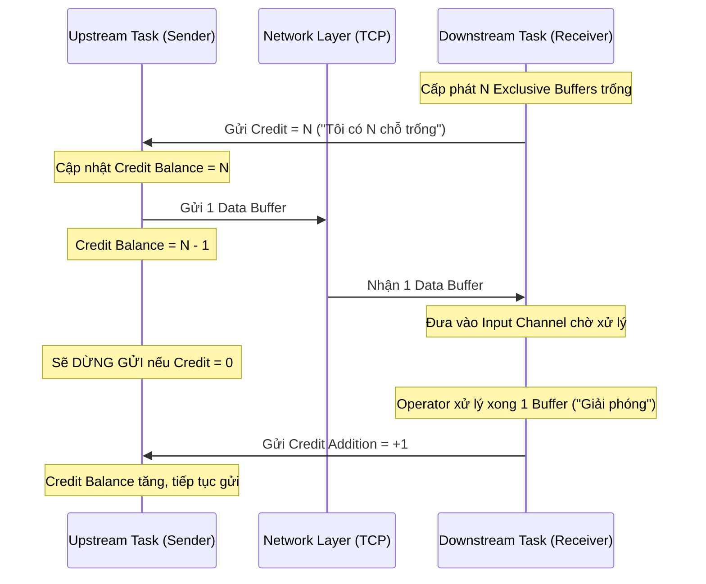
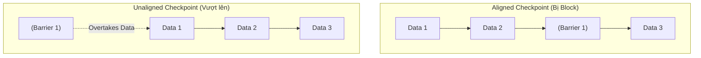

## 1. Bản chất Kiến trúc của Backpressure (Áp lực ngược)

Trong các hệ thống phân tán xử lý luồng (Stream Processing) liên tục như Apache Flink, dữ liệu chảy qua một đồ thị thực thi (Execution Graph) bao gồm nhiều Operator liên tiếp nhau. Sự chênh lệch về tốc độ xử lý giữa các Operator (do độ phức tạp tính toán, Disk I/O chậm chạp, hoặc Data Skew) là điều tất yếu. 

Khi Operator ở hạ nguồn (Downstream) xử lý chậm hơn lượng dữ liệu được đẩy xuống từ thượng nguồn (Upstream), hệ thống sẽ đối mặt với trạng thái **Backpressure**.

Dưới góc nhìn của một Staff Data Engineer, hãy nhớ rằng Backpressure **KHÔNG PHẢI là một lỗi (bug)**. Thực chất, **Backpressure là một cơ chế tự bảo vệ (Self-preservation)** của hệ thống. Nếu không có luồng phản hồi (feedback loop) này để ép Upstream giảm tốc độ gửi, Downstream sẽ liên tục nhận dữ liệu, lưu vào các Network Buffer cho đến khi cạn kiệt RAM, dẫn đến **JVM OOMKilled (Out Of Memory)** và Crash toàn hệ thống.

Tuy nhiên, việc duy trì trạng thái Backpressure quá lâu sẽ sinh ra các Systemic Trade-offs khốc liệt:
- **Độ trễ (Latency) tăng vọt:** Dữ liệu kẹt cứng trong các hàng đợi (queues).
- **Vi phạm SLA:** Mất khả năng xử lý Real-time.
- **Checkpoint Timeout (Nguy hiểm nhất):** Rào chắn (Checkpoint Barrier) bị kẹt lại cùng dữ liệu, khiến quá trình snapshot trạng thái thất bại liên tục, phá vỡ cam kết Exactly-once.

---

## 2. Tiến hóa của Cơ chế Flow Control trong Flink

Việc xử lý Backpressure trong Flink đã trải qua nhiều giai đoạn tái kiến trúc mạnh mẽ ở tầng Network Stack để tối ưu hóa bài toán thông lượng (Throughput) và độ trễ.

### 2.1. Trước Flink 1.5: TCP-Based Flow Control (Phụ thuộc tầng Network)

Ở các phiên bản đầu, Flink dựa hoàn toàn vào cơ chế Flow Control của giao thức TCP.
- Khi Buffer của Receiver (Downstream) đầy, hệ điều hành sẽ báo `TCP Zero Window` về cho Sender (Upstream).
- Sender ngừng gửi các gói tin trên socket đó.

**Nút thắt hệ thống (Bottleneck):** 
Flink sử dụng kết nối TCP ghép kênh (**TCP Multiplexing**). Nhiều Subtask chạy trên cùng một TaskManager chia sẻ chung một kết nối TCP vật lý. Do đó, nếu chỉ MỘT Subtask bị chậm làm đầy TCP buffer, toàn bộ kết nối TCP sẽ bị block. Các Subtask khác dù đang rảnh rỗi cũng bị "vạ lây", không thể truyền dữ liệu. Hiện tượng này gọi là **Head-of-Line Blocking**.

### 2.2. Từ Flink 1.5: Credit-Based Flow Control (Application-Level)

Để giải quyết triệt để Head-of-Line Blocking, Flink đã chuyển cơ chế kiểm soát luồng lên tầng ứng dụng (Application Level) thông qua **Credit-Based Flow Control**, hoạt động tương tự như kiểm soát lưu lượng thẻ tín dụng.



**Cơ chế hoạt động:**
1. Downstream TaskManager công bố số lượng "Credit" (tương ứng với số lượng Network Buffer đang trống) cho Upstream.
2. Upstream chỉ được phép đẩy Data Buffers vào kết nối TCP nếu `Credit > 0`. Mỗi buffer gửi đi, Credit giảm 1.
3. Nếu `Credit == 0`, Upstream dừng gửi dữ liệu của Subtask đó, nhưng **không block kết nối TCP**. Dữ liệu của các Subtask khác (nếu còn Credit) vẫn đi qua bình thường.
4. Khi Downstream xử lý xong và giải phóng Buffer, nó gửi tín hiệu `Credit Addition` ngược lại cho Upstream.

### 2.3. Flink 1.11+: Unaligned Checkpoints (Giải cứu Checkpointing)

Trong cơ chế Checkpoint tiêu chuẩn (Aligned Checkpoint), các Checkpoint Barrier phải xếp hàng di chuyển cùng với dữ liệu. Khi có Backpressure, Data Buffer bị kẹt lại, Barrier cũng tắc nghẽn, dẫn đến Checkpoint hết thời gian (Timeout) và thất bại.

**Unaligned Checkpoints (UC)** cho phép Barrier "vượt mặt" (overtake) các Data Buffer đang kẹt trong hàng đợi để đi thẳng đến đích và kích hoạt việc ghi Snapshot ngay lập tức. Để bảo toàn tính chính xác (Exactly-once), Flink sẽ lưu trữ luôn toàn bộ lượng dữ liệu đang "bay" trên mạng (In-flight Data Buffers) vào Checkpoint State.

**Trade-offs (Sự đánh đổi):** 
- **Được:** Checkpoint luôn hoàn thành cực nhanh, bất chấp Backpressure lớn đến đâu.
- **Mất:** Kích thước của Checkpoint (State Size) phình to vì phải chứa thêm các In-flight Buffers (đôi khi lên tới hàng Gigabyte). Điều này làm tăng chi phí Disk I/O khi ghi xuống S3/HDFS.



### 2.4. Flink 1.14+: Buffer Debloating

Dù UC giải quyết được Timeout, nhưng việc phình to Checkpoint Size vẫn là vấn đề. Nguyên nhân là các Network Buffer của Flink được cấp phát tĩnh khá lớn (mặc định 32KB). Khi bị kẹt, có hàng ngàn Buffer 32KB nằm chờ xử lý.

**Buffer Debloating** tự động điều chỉnh kích thước của các Network Buffer một cách linh hoạt (Dynamic Sizing) dựa trên thông lượng (Throughput) thực tế của Operator. 

Mục tiêu là: Kích thước Buffer chỉ chứa ĐÚNG lượng dữ liệu đủ để Operator đó xử lý trong một khoảng thời gian siêu ngắn (Target Time, mặc định 1 giây). Nếu Operator xử lý chậm, kích thước Buffer sẽ tự động co lại nhỏ hơn (ví dụ chỉ còn vài KB). Điều này giúp dọn dẹp các "cục máu đông" trên đường truyền, giảm lượng In-flight data, giúp Checkpoint Size luôn nhỏ nhẹ.

---

## 3. Rủi ro Vận hành và Troubleshooting (Real-world Incidents)

Trong môi trường Production, để xác định nguồn gốc Backpressure, quy tắc sống còn là: **Operator báo đỏ Backpressure trên UI thường KHÔNG PHẢI là thủ phạm, mà nguyên nhân thực sự nằm ở Operator ngay SAU NÓ (Downstream).**

Hãy theo dõi 2 Metric quan trọng (từ Flink 1.9+):
- `outPoolUsage` ~ 100%: Upstream không thể gửi dữ liệu ra (Bị Downstream ép Backpressure).
- `inPoolUsage` ~ 100%: Downstream nhận được dữ liệu nhưng không kịp xử lý (Chính là Thủ phạm gây nghẽn).

### Kịch bản 1: Nút thắt cổ chai I/O tại Sink (I/O Bottleneck)
**Nguyên nhân:** Sink Operator ghi dữ liệu đồng bộ (Synchronous) từng bản ghi vào Database (MySQL, PostgreSQL, Elasticsearch). Thời gian chờ (RTT - Round Trip Time) của Network hoặc DB lock làm giảm thông lượng cực độ.

**Khắc phục bằng Cấu hình & Kiến trúc:**
Không bao giờ ghi từng Record, phải sử dụng cơ chế Micro-batching và Async I/O. 

```yaml
# Cấu hình Flink SQL JDBC Sink để chống nghẽn bằng Batching
CREATE TABLE mysql_sink (
  id BIGINT,
  user_action STRING,
  amount DECIMAL(10, 2)
) WITH (
  'connector' = 'jdbc',
  'url' = 'jdbc:mysql://production-db:3306/analytics',
  'table-name' = 'user_transactions',
  'sink.buffer-flush.max-rows' = '5000',      # Batching 5000 rows mới ghi
  'sink.buffer-flush.interval' = '2s',        # Hoặc flush định kỳ mỗi 2 giây
  'sink.max-retries' = '3',
  'connection.max-pool-size' = '50'           # Tăng Connection Pool
);
```

### Kịch bản 2: Data Skew và Nút thắt CPU (CPU Bottleneck)
**Nguyên nhân:** Sau phép toán `keyBy`, dữ liệu phân phối không đều. 90% lượng traffic dồn vào 1 TaskManager duy nhất (ví dụ `keyBy` theo biến có Cardinality thấp như "Quốc gia" hay "Giới tính"). Node này kiệt quệ CPU (CPU 100%), trong khi các Node khác rảnh rỗi.

**Khắc phục (Two-Phase Aggregation / Salted Key):**
Thêm một tiền tố ngẫu nhiên (Salt) để phân tán tải ở giai đoạn Local, sau đó gom nhóm lại ở giai đoạn Global. (Kỹ thuật tương tự MapReduce).

```sql
-- Phase 1: Local Aggregation (Phân tán tải ra nhiều node bằng Random Salt)
CREATE VIEW local_agg AS
SELECT 
  CONCAT(country_code, '-', CAST(RAND() * 10 AS INT)) AS salted_country, 
  SUM(revenue) AS partial_revenue
FROM raw_sales
GROUP BY 
  CONCAT(country_code, '-', CAST(RAND() * 10 AS INT)), 
  TUMBLE(proctime, INTERVAL '1' MINUTE);

-- Phase 2: Global Aggregation (Gom kết quả cuối cùng)
SELECT 
  SPLIT_INDEX(salted_country, '-', 0) AS real_country_code,
  SUM(partial_revenue) AS total_revenue
FROM local_agg
GROUP BY 
  SPLIT_INDEX(salted_country, '-', 0), 
  TUMBLE(proctime, INTERVAL '1' MINUTE);
```

### Kịch bản 3: Tối ưu Cấu hình Flink để Kháng Backpressure
Dưới đây là một mẫu `flink-conf.yaml` tiêu chuẩn cấp Enterprise giúp hệ thống chống chịu mượt mà trước các luồng dữ liệu gai (Spiky Traffic), tối ưu Memory và Checkpoint.

```yaml
# flink-conf.yaml

# 1. Cấu hình Network Memory (Dành cho Credit-based Flow Control)
# Đảm bảo Network Buffer đủ lớn cho thông lượng cao, nhưng có giới hạn chống OOM
taskmanager.memory.process.size: 8192m
taskmanager.memory.network.fraction: 0.1
taskmanager.memory.network.min: 64mb
taskmanager.memory.network.max: 1gb

# 2. Bật Unaligned Checkpoints và Buffer Debloating
execution.checkpointing.interval: 30s
execution.checkpointing.timeout: 3min
execution.checkpointing.unaligned: true
# Flink sẽ thử Aligned Checkpoint trong 2 giây, nếu bị Backpressure sẽ ép sang Unaligned
execution.checkpointing.aligned-checkpoint-timeout: 2s 

taskmanager.network.memory.buffer-debloat.enabled: true
# Mục tiêu xử lý hết data trong buffer trong vòng 1 giây
taskmanager.network.memory.buffer-debloat.target: 1s 
taskmanager.network.memory.buffer-debloat.period: 200ms

# 3. Tối ưu JVM Garbage Collector (Giảm Stop-the-world pauses làm chậm Operator)
env.java.opts.taskmanager: "-XX:+UseG1GC -XX:MaxGCPauseMillis=200 -XX:InitiatingHeapOccupancyPercent=45"
```

## 4. Tổng Kết
Backpressure trong Flink thể hiện sự chín muồi của một hệ thống xử lý phân tán: Khả năng tự thích ứng và bảo vệ bộ nhớ khỏi sự cố tràn RAM [OOM]. Bằng việc nắm vững cơ chế tiến hóa từ TCP Flow Control sang Credit-Based, kết hợp với các kỹ thuật vật lý tân tiến như Unaligned Checkpoints và Buffer Debloating, Staff Data Engineer hoàn toàn có thể thiết kế các cụm Flink ổn định với độ trễ xử lý siêu thấp bất chấp quy mô traffic đột biến.

## Nguồn Tham Khảo (References)
*   [A Deep-Dive into Flink's Network Stack (Ververica / Flink Forward]][https://flink-forward.org/]
*   [Handling Backpressure in Apache Flink (Ververica Engineering Blog]][https://www.ververica.com/blog/how-flink-handles-backpressure]
*   **Sách Tham Khảo:** *Streaming Systems* - Tyler Akidau (Chapter: Flow Control and Checkpointing).
*   [Apache Flink Official Docs: Checkpointing under Backpressure][https://nightlies.apache.org/flink/flink-docs-stable/docs/ops/state/checkpointing_under_backpressure/]
*   [Apache Flink Official Docs: Buffer Debloating](https://nightlies.apache.org/flink/flink-docs-stable/docs/deployment/memory/network_memory/]
