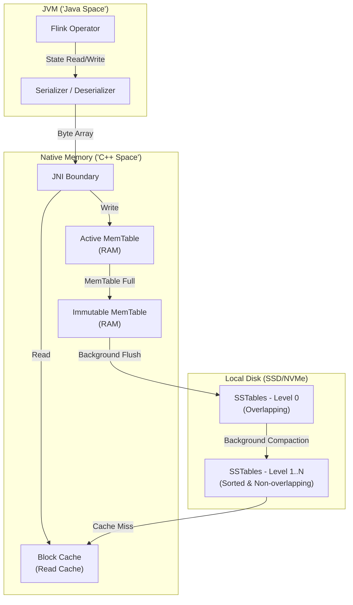

Với các hệ thống xử lý luồng dữ liệu (Stream Processing) quy mô Enterprise sử dụng Apache Flink, bài toán hóc búa nhất đối với một Staff Data Engineer không phải là "tính toán nhanh" mà là "quản lý trạng thái" (State Management). Khi ứng dụng Flink của bạn phải theo dõi hàng chục triệu người dùng đang hoạt động (active sessions), lưu trữ dữ liệu deduplication trong vòng 7 ngày, hay thực hiện Window Join trên các streams khổng lồ với nhau, kích thước State có thể dễ dàng vượt qua ngưỡng vài trăm Gigabyte, thậm chí đạt mức Terabyte.

Lưu trữ lượng dữ liệu này trên JVM Heap (thông qua `HashMapStateBackend`) là công thức hoàn hảo để tạo ra thảm họa: **Full GC (Garbage Collection) Pauses** kéo dài hàng chục phút và những đợt sập hệ thống (OOMKilled) không thể kiểm soát. Đây là lúc **RocksDB State Backend** (`EmbeddedRocksDBStateBackend`) trở thành lựa chọn sống còn.

Tuy nhiên, RocksDB không phải là "viên đạn bạc". Nó mang theo cái giá đắt đỏ về Disk I/O, JNI Overhead và Serialization. Bài viết này sẽ mổ xẻ kiến trúc vật lý của RocksDB, cách Flink tương tác với nó, và những sự cố vận hành kinh điển trên hệ thống thực tế.

## 1. Kiến trúc Thực thi Vật lý (Physical Execution Architecture)

RocksDB là một thư viện C++ (được Facebook fork từ LevelDB của Google) cung cấp hệ cơ sở dữ liệu Key-Value nhúng (embedded database) cục bộ. Trong Flink, mỗi một TaskManager slot sẽ sở hữu một (hoặc nhiều) tiến trình RocksDB độc lập.

Thay vì lưu object trực tiếp trên RAM như Java, RocksDB tổ chức dữ liệu theo cơ chế **Log-Structured Merge-Tree (LSM-Tree)**, được tối ưu cực hạn cho các tác vụ Write-intensive (ghi liên tục). 

Dưới đây là kiến trúc luồng dữ liệu từ lúc Flink nhận event cho đến khi dữ liệu nằm yên trên đĩa:



### Cơ chế hoạt động của LSM-Tree trong Flink

1. **Serializer & JNI Boundary:** Flink và RocksDB nói hai ngôn ngữ khác nhau (Java và C++). Mọi thao tác đọc/ghi (`ValueState.value()`, `MapState.put()`) đều yêu cầu Flink phải Serialize Java Object thành mảng Byte, sau đó đẩy qua cầu nối **JNI (Java Native Interface)**. Đây là nguyên nhân chính khiến RocksDB tốn CPU hơn hàng chục lần so với Heap State.
2. **MemTable (Ghi siêu tốc):** Khi có state mới, dữ liệu được ghi vào một cấu trúc dữ liệu trên RAM gọi là *Active MemTable*.
   > *Lưu ý kiến trúc:* RocksDB chuẩn có cơ chế WAL (Write-Ahead Log) để chống mất dữ liệu khi crash. Tuy nhiên, **Flink đã vô hiệu hóa WAL của RocksDB** vì Flink tự đảm bảo tính Fault Tolerance thông qua cơ chế Checkpointing phân tán của riêng nó (dựa trên thuật toán Chandy-Lamport). Việc tắt WAL giúp tăng thông lượng ghi (Write Throughput) lên đáng kể.
3. **SSTables (Sorted String Table):** Khi MemTable đạt giới hạn kích thước (thường là 64MB - 128MB), nó biến thành *Immutable MemTable* (chỉ đọc) và được một luồng nền (background thread) dội (flush) xuống đĩa cứng thành file `SSTable`.
4. **Compaction:** Theo thời gian, hàng ngàn file SSTable nhỏ sẽ được sinh ra ở Level 0. Quá trình *Compaction* (gộp file) sẽ đọc các SSTable ở các Level thấp, loại bỏ dữ liệu cũ, đã xóa (Tombstone) và ghi ra các SSTable lớn hơn ở Level sâu hơn.

## 2. Vũ khí tối thượng: Incremental Checkpointing

Nếu bạn có 1TB State và mỗi 5 phút phải gửi toàn bộ lên S3/HDFS để làm Checkpoint, hệ thống mạng của bạn sẽ nghẽn cứng và Checkpoint sẽ luôn bị Timeout. RocksDB giải quyết triệt để vấn đề này nhờ bản chất **Immutable** (không bao giờ sửa lại) của SSTable.

Khi Flink kích hoạt một vòng Checkpoint:
1. Nó ép (force) RocksDB dội tất cả Active MemTable xuống đĩa thành SSTable.
2. Thay vì copy toàn bộ đĩa, Flink chỉ tìm các file **SSTable mới được tạo ra** kể từ lần checkpoint trước, và tải (upload) chúng lên S3.
3. Các SSTable cũ đã nằm trên S3 sẽ được tham chiếu (reference sharing) để tái sử dụng thông qua metadata của Checkpoint.

**Cấu hình bật Incremental Checkpoint (Khuyến nghị BẮT BUỘC cho Production):**

```yaml
# flink-conf.yaml
state.backend.type: rocksdb
state.backend.incremental: true

# Tuning tối ưu cho network I/O trong lúc checkpoint
state.backend.rocksdb.checkpoint.transfer.thread.num: 4
```

## 3. Tối ưu Bộ nhớ và Vấn đề Phân mảnh (Memory Fragmentation)

Một trong những tai nạn kinh điển nhất của Data Engineer khi dùng RocksDB là bị hệ điều hành "bóp cổ" bằng **OOMKilled** (Out Of Memory Killed - Exit Code 137). 

Nguyên nhân không phải do JVM Heap, mà là do **Native Memory (Off-heap)**. Khi Flink Container giới hạn RAM là 8GB, JVM có thể chiếm 4GB. Nếu RocksDB tự do dùng RAM cấp phát cho MemTable và Block Cache lên tới 5GB, tổng RAM sẽ vượt 8GB và Container bị Kubernetes "bắn hạ".

### Flink Managed Memory (Từ bản 1.10)
Flink tự động chiếm quyền điều khiển bộ nhớ của RocksDB. Nó cấp phát một vùng nhớ khép kín gọi là `Managed Memory` để chia sẻ cho tất cả các RocksDB instance chạy trên cùng một TaskManager. 

```yaml
# Trích một phần RAM của Container (mặc định 0.4 - 40%) cho RocksDB Managed Memory
taskmanager.memory.managed.fraction: 0.5
```

### JEMalloc: Giải cứu phân mảnh bộ nhớ
Kể cả khi dùng Managed Memory, RocksDB (viết bằng C++) vẫn sử dụng thư viện `glibc` mặc định của Linux để xin cấp phát bộ nhớ (`malloc`). Việc tạo và hủy liên tục các MemTable kích thước nhỏ gây ra hiện tượng **Memory Fragmentation** (Phân mảnh bộ nhớ vật lý). Dần dần, dù lượng RAM thực tế RocksDB cần là ít, nhưng OS không gom lại được, dẫn đến rò rỉ (leak) RAM.

**Best Practice:** Luôn chạy Flink TaskManager với `jemalloc` (bộ cấp phát tối ưu hơn của Facebook).

```dockerfile
# Trong Dockerfile build Flink Image
RUN apt-get update && apt-get install -y libjemalloc-dev
ENV LD_PRELOAD=/usr/lib/x86_64-linux-gnu/libjemalloc.so
```

## 4. State TTL và Xóa Dữ liệu (State Compaction Filter)

Trong các bài toán như Event Deduplication, bạn thường gán thời gian sống (TTL - Time To Live) cho State (ví dụ: hết 24h thì xóa id này đi).

RocksDB có một cơ chế cực kỳ lợi hại: Flink chèn một **Compaction Filter** vào sâu trong thư viện C++ của RocksDB. Khi RocksDB thực hiện tác vụ gộp file (Compaction) dưới nền, filter này sẽ âm thầm kiểm tra timestamp. Nếu dữ liệu đã hết hạn (expired), nó sẽ bị ném đi ngay lập tức thay vì ghi sang SSTable mới, giúp giảm đáng kể chi phí I/O và dung lượng đĩa.

```java
// Cấu hình trong Java/Scala API
StateTtlConfig ttlConfig = StateTtlConfig
    .newBuilder(Time.days(1))
    .setUpdateType(StateTtlConfig.UpdateType.OnCreateAndWrite)
    .setStateVisibility(StateTtlConfig.StateVisibility.NeverReturnExpired)
    // Tích hợp việc dọn rác trực tiếp vào RocksDB Compaction
    .cleanupInRocksdbCompactFilter(1000) 
    .build();
```

## 5. Rủi ro Vận hành và Troubleshooting (Real-world Incidents)

Dưới đây là những "bãi mìn" thực tế bạn sẽ đạp phải khi vận hành hệ thống quy mô lớn.

### Incident 1: Write Stall (Nghẽn cổ chai I/O trên đĩa cứng)
- **Triệu chứng:** Nguồn dữ liệu (Kafka) đang đẩy vào với tốc độ 100k msg/s. Đột nhiên TaskManager CPU usage giảm, Consumer Lag tăng vọt, Checkpoint bị timeout liên tục.
- **Root Cause:** Khi đĩa cứng IOPS quá chậm (thường xảy ra nếu dùng ổ đĩa mạng EBS gp2 trên AWS thay vì Local NVMe), luồng `Background Flush` không kịp ghi MemTable xuống SSTable. Số lượng MemTable chờ (pending) đầy lên. Để bảo vệ bộ nhớ không bị OOM, RocksDB chủ động chặn hoàn toàn luồng ghi (Write Stall) khiến toàn bộ data pipeline đứng im.
- **Khắc phục:** 
  1. Sử dụng đĩa vật lý **Local SSD/NVMe** gắn trực tiếp vào EC2/Kubernetes Node. Tuyệt đối không dùng Network Storage làm thư mục `state.backend.rocksdb.localdir`.
  2. Tăng số lượng luồng và bộ đệm (Buffers) trong `flink-conf.yaml`:

```yaml
# Tăng kích thước MemTable trước khi Flush
state.backend.rocksdb.writebuffer.size: 128m
# Tăng số luồng chạy nền cho Flush và Compaction
state.backend.rocksdb.thread.num: 4
```

### Incident 2: CPU Bound do JNI & Serialization
- **Triệu chứng:** Disk IO rất thấp, Memory ổn định, nhưng CPU của TaskManager luôn ở mức 100%. Job không thể scale up (tăng throughput) dù tăng bao nhiêu parallelism.
- **Root Cause:** Trạng thái của bạn là những object có schema quá phức tạp (ví dụ JSON lồng nhau nhiều lớp, các collection lớn). Chi phí Serialize/Deserialize (từ Java Object sang Byte Array) và chi phí Context Switch của JNI đốt cháy CPU mỗi khi bạn gọi `.value()` hoặc `.update()`.
- **Khắc phục:** 
  - Khuyến cáo tối đa: **Tránh dùng POJO Serialization (Kryo)**. Hãy khai báo schema rõ ràng để Flink dùng PojoSerializer hoặc AvroSerializer chuyên dụng.
  - Phân rã cấu trúc State: Thay vì dùng `ValueState<List<Item>>` (mỗi lần cập nhật 1 item nhỏ, bạn phải Deserialize cả một List khổng lồ, sửa nó, rồi Serialize lại toàn bộ), hãy dùng `MapState<Key, Item>` hoặc `ListState<Item>`. RocksDB tối ưu rất tốt cho việc "Append" vào `MapState/ListState` ở tầng Byte Array [sử dụng Merge Operator của C++] mà không cần kéo toàn bộ danh sách lên JVM.

## 6. Tổng Kết (The Trade-off Checklist)

RocksDB là bài toán đánh đổi giữa **Hiệu năng Điện toán (CPU/Latency)** và **Sức chịu đựng về Quy mô (Scalability)**.

| Tiêu chí | HashMapStateBackend | EmbeddedRocksDBStateBackend |
| :--- | :--- | :--- |
| **Vị trí lưu trữ vật lý** | JVM Heap (RAM) |" Off-heap (RAM) + Disk (SSD) "|
|" **Tốc độ Đọc/Ghi (Latency)** "| Cực nhanh (Direct object reference) |" Chậm hơn (Serialize + JNI + Disk I/O) "|
| **Giới hạn kích thước State** | Bị giới hạn bởi kích thước RAM JVM (Rất dễ OOM) | Cực lớn, mở rộng tới Terabytes bằng tổng dung lượng Disk |
|" **GC Pause (Garbage Collection)**"| Chịu ảnh hưởng nặng nề bởi Full GC |" Gần như không ảnh hưởng (Native C++ memory management) "|
| **Incremental Checkpoint** | Không hỗ trợ (Chỉ có full snapshot) |" **Có** (Vô cùng hiệu quả nhờ LSM-Tree SSTable) "|
| **Khi nào sử dụng?** | State nhỏ (< 10GB), Session/Window ngắn, cần Ultra-low latency | **Phải dùng** khi đưa dự án Data Streaming lớn ra Production có State > 10GB |

## 7. Nguồn Tham Khảo (References)
* [Apache Flink Official Documentation: State Backends][https://nightlies.apache.org/flink/flink-docs-stable/docs/ops/state/state_backends/]
* [Apache Flink Official Documentation: Tuning RocksDB][https://nightlies.apache.org/flink/flink-docs-master/docs/ops/state/large_state_tuning/]
* [Ververica Blog - Tuning RocksDB for Apache Flink][https://www.ververica.com/blog/stateful-stream-processing-apache-flink-state-backends]
* [Facebook RocksDB Wiki: Tuning Guide](https://github.com/facebook/rocksdb/wiki/RocksDB-Tuning-Guide]
* Akidau, T., Chernyak, S., & Lax, R. (2018). *Streaming Systems: The What, Where, When, and How of Large-Scale Data Processing*. O'Reilly Media.
