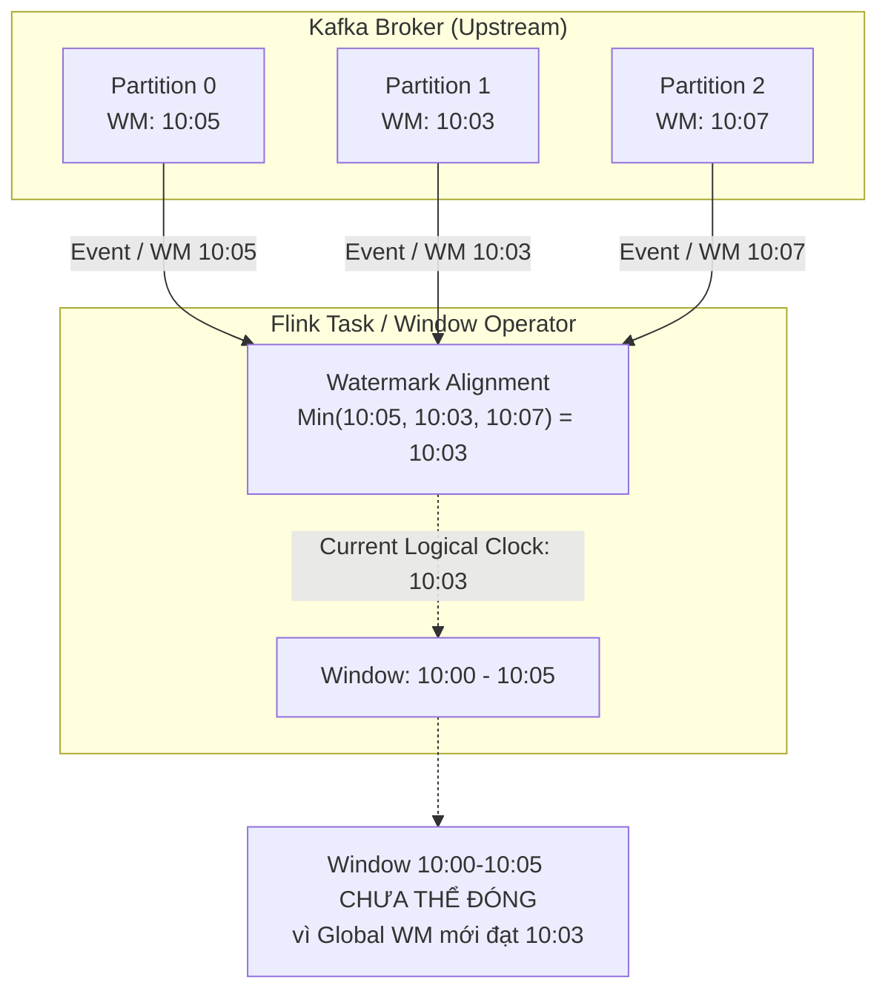
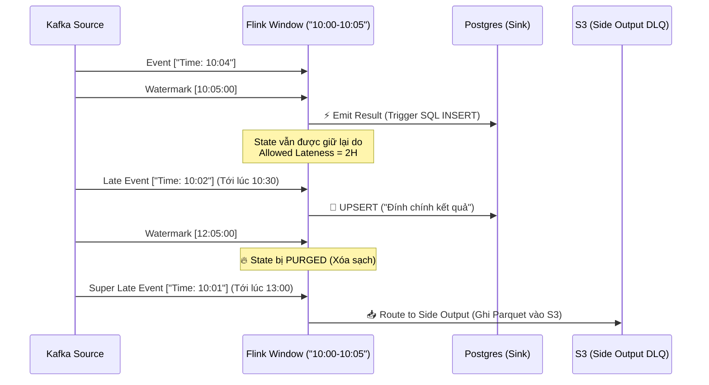

Trong các hệ thống phân tích dữ liệu luồng (Stream Processing), việc tính toán aggregate (ví dụ: tổng doanh thu, đếm số lượt click, đếm số user active) chỉ là phần ngọn bề nổi. Câu hỏi nền tảng và hóc búa nhất mà mọi Data Engineer và Kiến trúc sư phải đối mặt là: **"Khi nào thì hệ thống biết chắc chắn rằng một Window (khung thời gian) ĐÃ ĐÓNG và có thể tự tin xuất kết quả ra ngoài?"**.

Trong một mạng lưới phân tán thực tế, dữ liệu không bao giờ là hoàn hảo. Hiện tượng **Clock Skew** [lệch đồng hồ] trên thiết bị di động, nghẽn mạng 5G, đứt cáp quang, hay lỗi Garbage Collection (GC) ở các hệ thống Upstream (như Kafka) khiến dữ liệu đến muộn hoặc sai thứ tự (Out-of-order) là điều không thể tránh khỏi.

Để giải quyết bài toán định tuyến thời gian (Time Routing) này, Apache Flink đã triển khai khái niệm **Watermarks** - một trong những thiết kế thanh lịch và quan trọng nhất được kế thừa từ mô hình Google Dataflow.

---

## 1. Nghịch lý Thời gian trong Hệ thống Phân tán (Time Semantics)

Trước khi bàn về Watermark, chúng ta phải rạch ròi 3 trục thời gian (Time Domains) trong hệ thống Stream Processing:

- **Event Time (Thời gian Sự kiện):** Thời điểm sự kiện *thực sự xảy ra* tại thiết bị nguồn (Ví dụ: khách hàng bấm nút thanh toán lúc `10:00:05 AM`). Timestamp này được nhúng (embed) thẳng vào payload JSON/Protobuf tại client. Đây là **chân lý khách quan** duy nhất để phân tích dữ liệu chính xác và Reproducible (có thể chạy lại dữ liệu y hệt).
- **Processing Time (Thời gian Xử lý):** Thời điểm Node Worker của Flink nhận được sự kiện, đo bằng đồng hồ hệ thống của máy ảo JVM.
- **Ingestion Time (Thời gian Nạp):** Thời điểm sự kiện đi vào Message Broker (Ví dụ: thuộc tính `LogAppendTime` trong Kafka).

> [!CAUTION] Cạm bẫy chết người của Processing Time
> Nếu bạn sử dụng Processing Time cho các báo cáo tài chính hoặc Billing, một sự cố rớt mạng 5 phút ở upstream sẽ đẩy toàn bộ doanh thu của khung `10:00` sang `10:05`. Ở quy mô hàng triệu TPS, điều này làm hỏng hoàn toàn các mô hình Machine Learning Real-time và gây sai lệch cực kỳ nghiêm trọng cho báo cáo. Đóng dấu **Event Time** là tiêu chuẩn bắt buộc tuyệt đối cho Data Consistency.

---

## 2. Watermarks: Cỗ máy Thời gian của Flink [Logical Clock]

### 2.1. Bản chất Vật lý của Watermarks

Trong hệ thống Flink, luồng dữ liệu (Data Stream) không bao giờ sắp xếp ngoan ngoãn theo thứ tự tăng dần (Ví dụ: `[10:01] -> [10:03] -> [10:02]`]. 

**Watermark(t)** là một Control Event (tín hiệu điều khiển đặc biệt) chạy ngầm xen kẽ với luồng dữ liệu chính. Nó là một "lời thề" của hệ thống Flink: *"Tôi đoan chắc rằng toàn bộ các sự kiện có Event Time <= t đã đến đủ. Sẽ không còn dữ liệu nào cũ hơn t đi qua luồng này nữa!"*.

Khi Watermark tiến qua ngưỡng cuối cùng của một Window [Ví dụ: Watermark đạt `10:05:00`], Window Operator của Flink sẽ tự tin **đóng cửa sổ `[10:00 - 10:05]`**, trigger hàm tính toán, xuất kết quả ra Sink (như PostgreSQL, Kafka, Iceberg) và dọn dẹp state trong bộ nhớ.

### 2.2. Cơ chế Watermark Alignment (Đồng bộ Mực nước)

Trong thực tế, một Flink Task thường nhận dữ liệu song song từ nhiều upstream partitions (Ví dụ: Đọc từ một Kafka Topic có 30 partitions). Làm sao Task biết nên lấy Watermark của partition nào làm chuẩn?

Quy tắc sinh tồn của Flink: **Watermark của một Operator luôn là MIN của tất cả các input channels.**



Cơ chế lấy `MIN` đảm bảo sự an toàn (tính đúng đắn của dữ liệu), nhưng nó lại tạo ra một lỗ hổng nghiêm trọng về vận hành mà ta sẽ bàn ở phần Sự cố (Incidents).

---

## 3. Kiến trúc Xử lý Dữ liệu Trễ (Late Data Architecture)

Khi sử dụng Heuristic Watermarks (Ví dụ: Cấu hình `BoundedOutOfOrderness` cho phép trễ 5 giây bù trừ network), bất kỳ sự kiện nào đến **sau khi** Watermark đã vượt qua Window của nó sẽ bị hệ thống coi là **Late Data**. 

Để xử lý Late Data, Flink cung cấp 3 lớp phòng thủ (Defense in Depth):

### Lớp 1: Bỏ qua (Drop) - Mặc định
Dữ liệu trễ sẽ bị drop thẳng tay và lờ đi hoàn toàn. Phù hợp cho các use-case cần siêu tốc độ và chấp nhận sai số nhỏ (Ví dụ: đếm view video TikTok, metric monitoring hạ tầng, cảnh báo DDoS).

### Lớp 2: Allowed Lateness (Sự khoan hồng)
Cấu hình `.allowedLateness(Time.hours(2))` cho phép Window dù đã emit kết quả ra ngoài, nhưng **State** của nó (lưu trên RAM hoặc RocksDB) vẫn được giữ lại thêm 2 tiếng. 
- Khi Late Data chui vào trong 2 tiếng này, Flink sẽ móc State cũ ra và tính toán lại.
- Flink sau đó phóng ra một bản ghi **UPSERT / Retraction** để cập nhật kết quả. Hệ thống Sink của bạn (như PostgreSQL, Apache Iceberg, Redis) BẮT BUỘC phải hỗ trợ phép MERGE/UPSERT dựa trên Primary Key để nhận bản ghi đính chính này.

### Lớp 3: Side Output (Bắt Late Data vào Dead Letter Queue)
Nếu dữ liệu trễ tận 3 tiếng (vượt qua cả Allowed Lateness 2 tiếng), Window State lúc này đã bị xóa sạch hoàn toàn (Purged) để giải phóng đĩa cứng. Ta dùng kỹ thuật **Side Output** bắt luồng dữ liệu "vô gia cư" này và xả ra S3 / Google Cloud Storage dưới dạng file Parquet. Cuối ngày, ta sẽ chạy một Batch Job (bằng Spark hoặc Snowflake) đọc các file này để backfill sửa dữ liệu (Theo kiến trúc Lambda / Kappa Fallback).



---

## 4. Mã Nguồn Thực Chiến (Executable Configuration)

Dưới đây là đoạn code Flink Java API (sử dụng DataStream API hiện đại) chuẩn mực cho hệ thống Production, kết hợp cấu hình Watermark Strategy, chống Idleness và bắt Side Output cực kỳ chặt chẽ.

```java
import org.apache.flink.api.common.eventtime.WatermarkStrategy;
import org.apache.flink.connector.kafka.source.KafkaSource;
import org.apache.flink.connector.kafka.source.enumerator.initializer.OffsetsInitializer;
import org.apache.flink.streaming.api.datastream.SingleOutputStreamOperator;
import org.apache.flink.streaming.api.windowing.assigners.TumblingEventTimeWindows;
import org.apache.flink.streaming.api.windowing.time.Time;
import org.apache.flink.util.OutputTag;
import java.time.Duration;

// 1. Cấu hình Kafka Source (Modern API)
KafkaSource<String> source = KafkaSource.<String>builder()
    .setBootstrapServers("kafka-broker.prod:9092")
    .setTopics("transaction-events")
    .setGroupId("fraud-detect-group")
    .setStartingOffsets(OffsetsInitializer.latest())
    .setValueOnlyDeserializer(new SimpleStringSchema())
    .build();

// 2. Định nghĩa Watermark Strategy chuẩn mực Production
WatermarkStrategy<String> watermarkStrategy = WatermarkStrategy
    // Cho phép Out-of-order 10s (Bù trừ mạng trễ/GC Pause)
    .<String>forBoundedOutOfOrderness(Duration.ofSeconds(10)) 
    .withTimestampAssigner((event, timestamp) -> extractEventTime(event))
    // 🔥 CRITICAL: Chống Watermark Stall (Vô cùng quan trọng)
    .withIdleness(Duration.ofMinutes(1)); 

// 3. Khai báo Side Output Tag (Đóng vai trò như Dead Letter Queue)
final OutputTag<String> lateDataTag = new OutputTag<String>("late-data-dlq"){};

// 4. Định tuyến Window với Late Data Defense in Depth
SingleOutputStreamOperator<Result> resultStream = env
    .fromSource(source, watermarkStrategy, "Kafka Source")
    .keyBy(event -> extractUserId(event))
    .window(TumblingEventTimeWindows.of(Time.minutes(5)))
    .allowedLateness(Time.hours(2))      // Layer 2: Lưu State thêm 2 tiếng để UPSERT
    .sideOutputLateData(lateDataTag)     // Layer 3: Dữ liệu > 2 tiếng đẩy vào Tag này
    .process(new AggregateTransactionFunction());

// 5. Khai báo Physical Execution Sinks
resultStream.sinkTo(new PostgresUpsertSink()); // Main Sink: Dùng phép MERGE/UPSERT
resultStream.getSideOutput(lateDataTag).sinkTo(new S3DeadLetterSink()); // DLQ Sink: Ghi APPEND file Parquet
```

---

## 5. Rủi ro Vận hành & Trade-offs (Real-world Production Incidents)

Trong thực tế thiết kế hệ thống tại các gã khổng lồ như Uber hay Netflix, các Data Engineer phải liên tục đánh đổi và khắc phục các thảm họa (Incidents) liên quan đến Watermark:

### 🚨 Incident 1: Watermark Stall (Đứng hình toàn bộ hệ thống)
- **Triệu chứng (Symptoms):** Flink Job vẫn chạy (Running), không báo lỗi, nhưng Window không hề xuất data ra ngoài. Dashboard Real-time bị đóng băng hoàn toàn. Mức độ trễ (Lag) tăng chóng mặt.
- **Nguyên nhân gốc rễ (Root Cause):** Do cơ chế *Watermark Alignment (Tính MIN)*. Nếu có 1 Kafka partition đột nhiên không có dữ liệu mới (Ví dụ: Partition chứa dữ liệu của khu vực Châu Á trong khi đang là nửa đêm bên đó), Watermark của partition đó sẽ đứng yên. Vì Flink lấy MIN của TẤT CẢ partition, nó kéo theo Global Watermark của toàn bộ Task bị đứng yên. Không một Window nào được trigger đóng.
- **Khắc phục (Remediation):** BẮT BUỘC phải dùng cấu hình `.withIdleness(Duration.ofMinutes(1))` trong Watermark Strategy. Hàm này thông báo cho Flink một luật sống còn: *"Nếu partition này không có event nào trong 1 phút, hãy đánh dấu nó là IDLE và phớt lờ nó đi, đừng lấy nó làm chuẩn để tính MIN nữa"*.

### 🚨 Incident 2: Memory Explosion & OOMKilled [Tràn RAM sập Cluster]
- **Triệu chứng (Symptoms):** Flink TaskManager crash liên tục kèm mã lỗi `JVM OOMKilled` (Exit Code 137). Checkpoint duration (Thời gian ghi state) tăng từ vài giây lên vài tiếng, size của State Backend phình to lên hàng Terabytes.
- **Nguyên nhân gốc rễ (Root Cause):** Kỹ sư sợ mất Late Data nên set `allowedLateness` quá cao (Ví dụ: 7 ngày). Flink phải gồng mình giữ trạng thái (State) của hàng triệu khóa (Keys) suốt 7 ngày trên RAM và ổ cứng SSD (RocksDB). Mỗi event chui vào đều kích hoạt quá trình disk I/O để deserialize state cũ. Hệ quả là State Bloat bóp nghẹt tài nguyên máy chủ.
- **Đánh đổi Hệ thống (Systemic Trade-off):** Kiến trúc sư phải đàm phán với Business: 
  - *Latency vs State Cost:* Thay vì lưu state 7 ngày trên hệ thống Streaming Real-time (cực kỳ đắt đỏ về RAM/SSD), ta chỉ set Allowed Lateness là 1 tiếng. Những data trễ hơn 1 tiếng sẽ bị rơi vào Side Output, đẩy ra S3. Đội Data Engineer sẽ cấu hình Airflow chạy một lệnh Spark/Snowflake SQL đè lại partition của ngày hôm qua với chi phí tính toán siêu rẻ.

---

## Nguồn Tham Khảo (References)

1. **Apache Flink Official Docs:** [Timely Stream Processing](https://nightlies.apache.org/flink/flink-docs-stable/docs/concepts/time/) & [Generating Watermarks](https://nightlies.apache.org/flink/flink-docs-stable/docs/dev/datastream/event-time/generating_watermarks/).
2. **Tyler Akidau** - *Streaming Systems: The What, Where, When, and How of Large-Scale Data Processing*. (Cuốn kinh thánh về Stream Processing từ kỹ sư Google).
3. **Uber Engineering:** *Real-Time Data Pipeline using Flink* - Bài học về xử lý hàng tỷ sự kiện với Watermark Tuning.
4. **Flink Forward:** *Stateful Stream Processing with RocksDB* - Kỹ thuật tối ưu State Backend để tránh OOMKilled.
